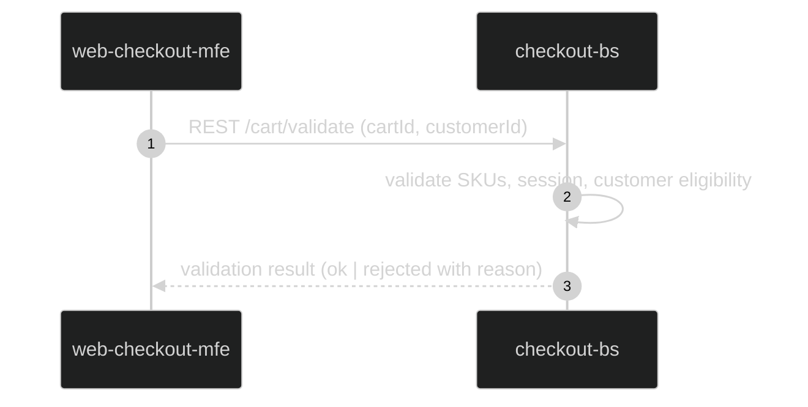
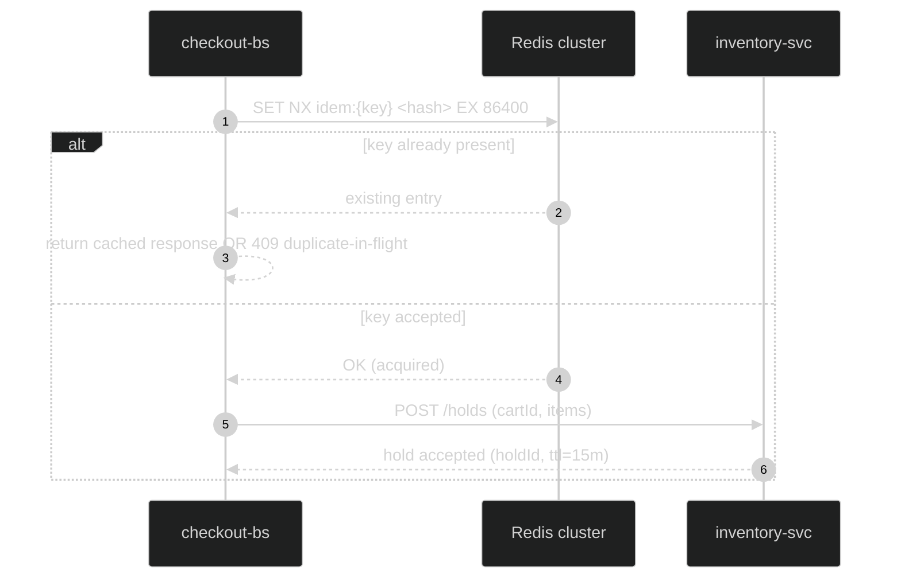
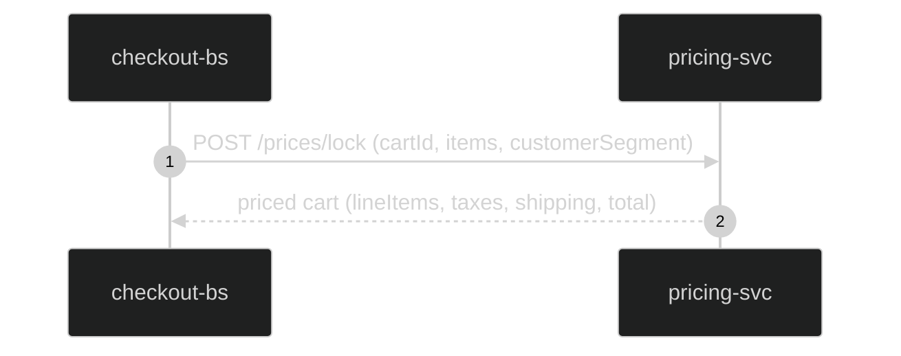
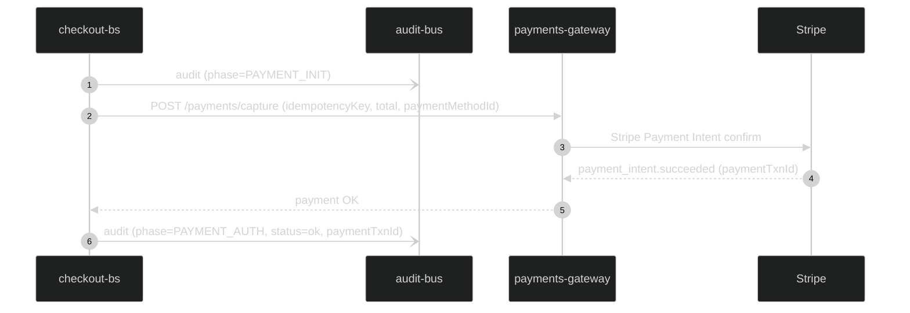
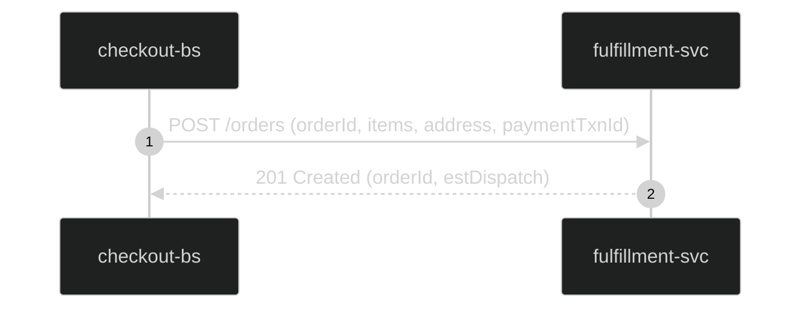
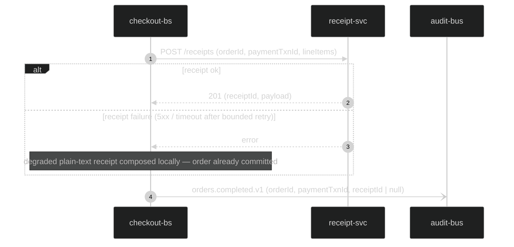
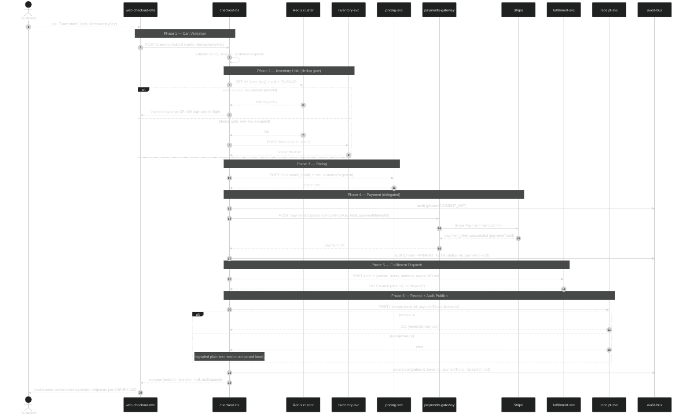
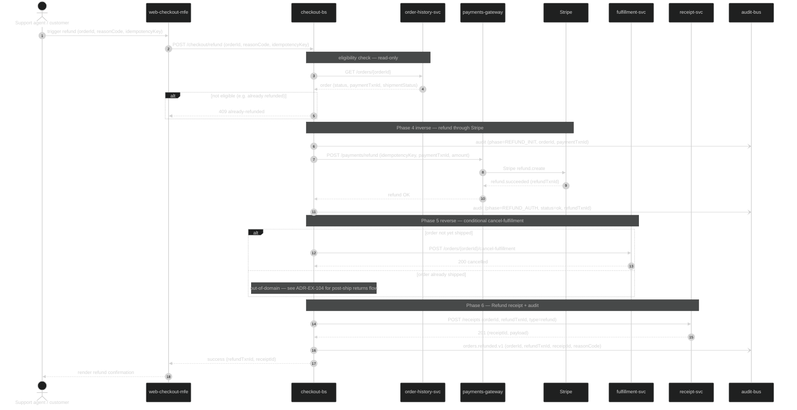

<!-- This file is a reference example, not generated content. It demonstrates Phase Catalog mode for `docs/04-data-flow-patterns.md` using a synthetic 3-UC e-commerce checkout. Component / ADR / metric values are illustrative; do not import them. -->

<!-- EXPLORER_HEADER
key_concepts: phase catalog, 6 phases, Cart Validation, Inventory Hold, Pricing, Payment, Fulfillment Dispatch, Receipt, UC1 New Order, UC2 Reorder, UC3 Refund, idempotency, dedup, parallel reads, optimistic shipment, fire-and-forget audit, latency budget, failure classification
technologies: GraphQL, REST, Redis, Kafka, Stripe, Postgres
components: web-checkout-mfe, checkout-bs, inventory-svc, pricing-svc, payments-gateway, fulfillment-svc, receipt-svc, order-history-svc, audit-bus
scope: Per-phase mini-flows up front; UC1/UC2/UC3 phase composition matrix; full end-to-end wire sequences at the end. UC3 (Refund) compensation is bounded to the receipt + payment reversal pair; cart-side compensation is out of scope.
related_adrs: ADR-EX-101, ADR-EX-102, ADR-EX-103, ADR-EX-104
-->

# Section 6 — Data Flow Patterns (Reference Example)

> The example checkout system follows a **synchronous request/response model** for the user-facing buy flow. The customer waits for confirmation; latency targets per [System Overview Key Metrics](01-system-overview.md#key-metrics) constrain each hop. The 6-phase reference flow covers UC1 (New Order) and UC2 (Reorder) on the buy side, plus UC3 (Refund) which composes a different subset of phases. Stripe is delegated through `payments-gateway` rather than re-modeled.
>
> **How to read this file**: the [Phase Catalog](#phase-catalog) describes each phase as a self-contained mini-flow with its own participants, latency budget, and failure signature. The [Use Case Resolutions](#use-case-resolutions) section then shows which phases each UC executes, with brief narrative deltas per UC. Cross-cutting concerns (idempotency, total latency budget, failure table) follow. The full end-to-end wire sequences are deliberately at the end — see [End-to-End Wire Sequences](#end-to-end-wire-sequences) — so they don't crowd out the per-phase view that most readers need first.

## Flow Inventory

| Flow | Trigger | Use Case | Latency Target |
|---|---|---|---|
| 1. New Order | Customer taps "Place order" | UC1 | ≤ 8 s end-to-end |
| 2. Reorder from history | Customer taps a recent order row | UC2 | ≤ 5 s end-to-end |
| 3. Refund | Support agent or customer-self-service triggers refund | UC3 | ≤ 6 s after refund eligibility check |

---

## Phase Catalog

Each phase below is a self-contained mini-flow. Use cases compose subsets of these phases.

| # | Phase | On critical path? | Owner | Failure mode |
|---|---|---|---|---|
| 1 | Cart Validation | yes | web-checkout-mfe → checkout-bs | invalid SKU → modal; expired session → re-auth |
| 2 | Inventory Hold (dedup gate) | yes | checkout-bs → Redis · checkout-bs → inventory-svc | dup key → cached response or 409; no-stock → modal |
| 3 | Pricing | yes | checkout-bs → pricing-svc | price drift → re-confirm modal |
| 4 | Payment (delegated) | yes | checkout-bs → payments-gateway → Stripe | insufficient funds → error before debit; chain failure → safe to retry within Redis TTL |
| 5 | Fulfillment Dispatch | yes (optimistic render) | checkout-bs → fulfillment-svc | dispatch failure → audit + reconcile; customer-visible only on retry exhaustion |
| 6 | Receipt + Audit Publish | yes (receipt) / no (audit) | checkout-bs → receipt-svc · checkout-bs -) audit-bus | receipt error → degraded plain-text receipt; audit publish error → DLQ |

### Phase 1 — Cart Validation

**Purpose**: Validate cart contents against current catalog state before any side effect downstream.
**Latency budget (p95)**: ≤ 200 ms.
**Side effects**: none (read-only).



### Phase 2 — Inventory Hold (dedup gate)

**Purpose**: Acquire a short-lived inventory hold AND the idempotency token *before* payment. Hold expires automatically if the customer never reaches Phase 4.
**Latency budget (p95)**: ≤ 1 ms Redis + ≤ 300 ms inventory-svc.
**Side effects**: writes `idem:{key}` to Redis (24 h TTL); writes `hold:{cartId}` to inventory-svc (15 min TTL). Caller-side dedup is structurally required because the inventory hold is the only mutation gate before payment per [ADR-EX-101](../adr/ADR-EX-101-inventory-hold.md).



### Phase 3 — Pricing

**Purpose**: Price-lock the cart (taxes, shipping, promotions) at submit time.
**Latency budget (p95)**: ≤ 400 ms.
**Side effects**: none (read-only) — the locked price travels in the payment request payload, it is not stored separately.



### Phase 4 — Payment (delegated)

**Purpose**: Synchronous capture through Stripe. This domain delegates — it does not implement payment logic.
**Latency budget (p95)**: ≤ 3 s (existing chain SLO).
**Side effects**: customer charge; payments-gateway emits its own audit; this domain emits `PAYMENT_INIT` / `PAYMENT_AUTH` audits to audit-bus.



### Phase 5 — Fulfillment Dispatch

**Purpose**: Hand the order to the fulfillment service. Customer sees "Order placed" optimistically the moment Phase 4 returns success per [ADR-EX-102](../adr/ADR-EX-102-optimistic-shipment-render.md); actual shipment confirmation arrives via async event after warehouse dispatch.
**Latency budget (p95)**: ≤ 500 ms.
**Side effects**: order row written; warehouse work order created.



### Phase 6 — Receipt + Audit Publish

**Purpose**: 6a — render the receipt. 6b — publish the success audit event. 6a is on the customer's critical path; 6b is fire-and-forget.
**Latency budget (p95)**: ≤ 300 ms receipt + ≤ 5 ms audit publish (off critical path).
**Side effects**: receipt persisted to `receipt-svc`; audit event published to `orders.completed.v1` topic.



---

## Use Case Resolutions

A UC is resolved by composing phases. The matrix below shows phase participation per UC; the per-UC sub-section then gives a brief narrative delta. Full end-to-end wire sequence diagrams are at the end of this file.

| Phase | UC1 — New Order | UC2 — Reorder | UC3 — Refund |
|---|---|---|---|
| 1 — Cart Validation | ✓ | reused (pre-loaded from order-history-svc — cart hydrated from prior order) | n/a |
| 2 — Inventory Hold | ✓ | ✓ mandatory (catalog and stock may have changed since the original purchase) | n/a |
| 3 — Pricing | ✓ | ✓ mandatory (promotions and tax rates may have changed) | n/a |
| 4 — Payment | ✓ | ✓ | ✓ inverse — `POST /payments/refund` instead of `/capture` |
| 5 — Fulfillment Dispatch | ✓ | ✓ | reverse — `POST /orders/{id}/cancel-fulfillment` (skipped if already shipped; UC3 narrative covers the branch) |
| 6 — Receipt + Audit Publish | ✓ | ✓ | ✓ refund receipt + `orders.refunded.v1` audit |

> Allowed cell values: `✓`, `skipped` (with reason), `reused` (with source), `n/a`, or a UC-specific note. No blank cells.

### Flow 1 — New Order

UC1 / Story 1. Executes phases **1 → 2 → 3 → 4 → 5 → 6** synchronously. Phase 5's "optimistic render" trade-off ([ADR-EX-102](../adr/ADR-EX-102-optimistic-shipment-render.md)) is what keeps total p95 under the 8 s SLO.

→ Full wire-level sequence: see [End-to-End Wire Sequences §Flow 1](#flow-1--new-order-full-wire-sequence) at the end of this document.

### Flow 2 — Reorder

UC2 / Story 3. Phase composition: **(1 reused) → 2 → 3 → 4 → 5 → 6** synchronously, with Phase 1 hydrated from order-history-svc rather than re-validated against the live cart UI. Phases 2 and 3 stay mandatory because stock and prices may have moved since the original purchase.

**Why reorder is faster (≤ 5 s vs ≤ 8 s for new order):**
- No cart-edit time on the customer's side
- Phase 1 round-trip is read-only against order-history-svc and pre-cached on the row tap
- Pre-populated address + payment method skip the customer's form-typing time

→ Full wire-level sequence: see [End-to-End Wire Sequences §Flow 2](#flow-2--reorder-full-wire-sequence).

### Flow 3 — Refund

UC3 / Story 7. Phase composition: **4 (inverse) → 5 (reverse, conditional) → 6 (refund variant)**. Phases 1–3 are skipped because the cart is the original order, not a new submit. Phase 5 is conditional: if the order has not yet shipped, fulfillment is cancelled in place; if it has shipped, the cancel-fulfillment call is skipped and the cancellation flows through the post-ship returns process which is **out of scope for this domain** per [ADR-EX-104](../adr/ADR-EX-104-post-ship-returns-out-of-domain.md).

→ Full wire-level sequence: see [End-to-End Wire Sequences §Flow 3](#flow-3--refund-full-wire-sequence).

---

## Cross-cutting flow concerns

### Idempotency

Every state-changing call (`/checkout/submit`, `/checkout/reorder`, `/checkout/refund`) carries an **idempotency key** (UUID generated by `web-checkout-mfe`). Per [ADR-EX-101](../adr/ADR-EX-101-inventory-hold.md), `checkout-bs` issues a `SET NX idem:{key} <request-hash> EX 86400` against the Redis cluster **before** any external side effect (in Phase 2, pre-hold). On successful flow completion, the success response payload is written back into the same Redis key (still under the 24 h TTL) so retries are response-stable. TTL: 24 hours.

Caller-side dedup is structurally required because the inventory hold is the only checkpoint between cart validation and the Stripe charge; without it, a retried request after a network blip could double-hold inventory and double-charge the customer.

### Latency budget breakdown

Compra Nueva (UC1, p95):

| Hop | Budget |
|---|---|
| CDN edge | ≤ 10 ms |
| MFE → checkout-bs (GraphQL) | ≤ 50 ms |
| Cart validation (Phase 1) | ≤ 200 ms |
| Redis SET NX dedup gate | ≤ 1 ms |
| Inventory hold | ≤ 300 ms |
| Pricing | ≤ 400 ms |
| Payment chain (Stripe via gateway) | ≤ 3 s (Stripe SLO) |
| Fulfillment dispatch | ≤ 500 ms |
| Receipt | ≤ 300 ms |
| Audit publish (Kafka, fire-and-forget) | ≤ 5 ms aggregate (off critical path) |
| **Total p95** | **≤ 4.8 s — fits ≤ 8 s SLO with 3.2 s headroom** |

### Failure classification

| Phase | Failure | Recovery |
|---|---|---|
| 1 — Cart Validation | invalid SKU | Surface `unavailable` modal; redirect to live catalog |
| 1 — Cart Validation | expired session | Re-auth challenge; cart preserved client-side |
| 2 — Inventory Hold (Redis) | dedup gate hit | Return cached success response OR 409; no double-hold |
| 2 — Inventory Hold (inventory-svc) | no stock | Surface `out of stock` modal; offer alternates from pricing-svc |
| 3 — Pricing | price drift | Surface `price changed` modal; require re-confirm |
| 4 — Payment | insufficient funds | Surfaced before debit attempt by Stripe; idempotency key naturally aged out at TTL |
| 4 — Payment | chain failure (5xx / timeout) | Redis dedup key remains (24 h TTL); safe to retry within TTL; no Phase 5 / 6 side effects yet |
| 5 — Fulfillment Dispatch | dispatch error | Audit event records `phase=FULFILLMENT_DISPATCH status=error`; reconciler retries from order-history-svc; customer order remains in `pending-dispatch` until exhausted; if retries exhaust, customer-visible escalation |
| 6 — Receipt | receipt-svc unreachable | Compose plain-text receipt locally from `paymentTxnId + orderId`; order already committed; receipt-svc backfilled async by reconciler |
| 6 — Audit Publish | audit-bus producer failure | Bounded retry → DLQ topic on exhaustion. Non-empty DLQ raises a P2 alert. Customer flow is **not** blocked on audit publish; the regulatory exposure is the audit gap, not the customer outcome |

---

## End-to-End Wire Sequences

The diagrams below are the canonical wire-level references — the per-phase mini-flows from the [Phase Catalog](#phase-catalog) stitched together end-to-end with the customer-facing edge included where relevant. They are at the bottom so the per-phase view stays the entry point.

### Flow 1 — New Order (full wire sequence)

UC1 / Story 1 — synchronous phases 1 → 2 → 3 → 4 → 5 → 6.



### Flow 2 — Reorder (full wire sequence)

UC2 / Story 3 — synchronous phases (1 reused) → 2 → 3 → 4 → 5 → 6.

```mermaid
%%{init: {'theme': 'dark'}}%%
sequenceDiagram
    autonumber
    actor Cust as Customer
    participant MFE as web-checkout-mfe
    participant BS as checkout-bs
    participant Redis as Redis cluster
    participant Inv as inventory-svc
    participant Pr as pricing-svc
    participant Hist as order-history-svc
    participant GW as payments-gateway
    participant St as Stripe
    participant Ful as fulfillment-svc
    participant Rec as receipt-svc
    participant Aud as audit-bus

    Cust->>MFE: tap recent order row (orderId)

    Note over MFE,Hist: Phase 1 reused — hydrate cart from history
    MFE->>BS: POST /checkout/reorder (orderId, idempotencyKey)
    BS->>Hist: GET /orders/{orderId}
    Hist-->>BS: cart (items, address, paymentMethodId)

    Note over BS,Inv: Phase 2 — Inventory Hold (mandatory — stock may have moved)
    BS->>Redis: SET NX idem:{key} <hash> EX 86400
    Redis-->>BS: OK
    BS->>Inv: POST /holds (items)
    Inv-->>BS: holdId

    Note over BS,Pr: Phase 3 — Pricing (mandatory — prices may have moved)
    BS->>Pr: POST /prices/lock (items)
    alt price unchanged
        Pr-->>BS: priced cart at original total
    else price changed
        Pr-->>BS: priced cart at new total
        BS-->>MFE: confirm-new-price modal
        Cust->>MFE: confirm OR cancel
        Note over MFE,BS: cancel — abort flow; hold ages out at 15 min, idempotency key ages out at 24 h
    end

    Note over BS,St: Phase 4 — Payment
    BS-)Aud: audit (phase=PAYMENT_INIT)
    BS->>GW: POST /payments/capture (idempotencyKey, total, paymentMethodId)
    GW->>St: Stripe Payment Intent confirm
    St-->>GW: payment_intent.succeeded
    GW-->>BS: payment OK
    BS-)Aud: audit (phase=PAYMENT_AUTH, status=ok, paymentTxnId)

    Note over BS,Ful: Phase 5 — Fulfillment Dispatch
    BS->>Ful: POST /orders (orderId, items, address, paymentTxnId)
    Ful-->>BS: 201 Created

    Note over BS,Rec: Phase 6 — Receipt + Audit Publish
    BS->>Rec: POST /receipts (orderId, paymentTxnId, lineItems)
    Rec-->>BS: 201 (receiptId, payload)
    BS-)Aud: orders.completed.v1
    BS-->>MFE: success
    MFE-->>Cust: render confirmation
```

### Flow 3 — Refund (full wire sequence)

UC3 / Story 7 — synchronous phases 4 (inverse) → 5 (reverse, conditional) → 6 (refund variant). Phases 1–3 are skipped per the Use Case Resolution narrative.



---

## Validation

- [x] Phase Catalog: each phase has Purpose + Latency budget + Side effects + a self-contained `sequenceDiagram` (Mermaid, dark theme).
- [x] Use Case Resolutions: phase × UC matrix maps every UC from Flow Inventory to every phase from Phase Catalog; no blank cells.
- [x] Cross-cutting concerns: Idempotency, Latency budget breakdown table, Failure classification table all present.
- [x] End-to-End Wire Sequences: one H4 per UC with a full `sequenceDiagram`.
- [x] Latency budget total verified against S1 Key Metrics SLO (≤ 4.8 s vs ≤ 8 s).
- [x] Failure classification has ≥1 row for every phase H4 in the Phase Catalog.
