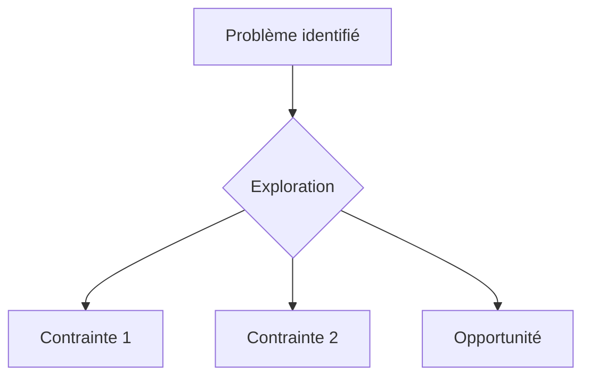

# Brainstorming — Skill Grimoire

## Philosophie

Le brainstorming agentic n'est pas du "suggest 3 ideas". C'est un process structuré qui explore le contexte, clarifie les contraintes, génère des alternatives réelles, et converge vers une solution documentée.

**Inspiration** : superpowers brainstorming methodology + gstack's "Boil the Lake" philosophy.

## Quand utiliser cette skill

- Avant de commencer une feature complexe
- Quand plusieurs approches architecturales sont possibles
- Pour explorer un espace de solution avant de s'engager
- Quand l'utilisateur dit "comment on pourrait..." ou "quelle approche pour..."

## Quand NE PAS utiliser

- Pour transformer une idée choisie en plan d'implémentation step-by-step → `grimoire-writing-plans`.
- Pour le pipeline complet idée → incubateur → R&D → prototype → `grimoire-innovate`.
- Pour une question factuelle ou une décision technique tranchée par les données — le brainstorming dilue le signal.

## Process

### Phase 1 — Explorer le contexte

Avant de générer la moindre idée :

1. **Lire le code existant** pertinent au problème
2. **Charger les contraintes** du projet (conventions, architecture, stack)
3. **Identifier les décisions passées** (ADR, shared-context, session chain)
4. **Cartographier les parties prenantes** (qui est impacté par cette décision ?)

> Principe "Boil the Lake" (gstack) : investiguer en profondeur AVANT de proposer. Ne jamais brainstormer dans le vide.

### Phase 2 — Offrir un compagnon visuel (optionnel)

Si le sujet est complexe, proposer un diagramme Mermaid pour visualiser :

- L'état actuel du système (as-is)
- Les points de friction / limitations
- Les zones d'opportunité



### Phase 3 — Clarifier une question à la fois

Ne pas poser 10 questions d'un coup. Identifier LA question la plus discriminante et la poser :

> "Avant d'explorer les approches, une question critique : [la question]"

Si la réponse ouvre de nouvelles branches, poser une deuxième question max. Au-delà de 2 questions, proposer des approches avec les hypothèses explicites.

### Phase 4 — Proposer 2-3 approches

Format structuré pour chaque approche :

```markdown
### Approche A : [Nom descriptif]

**Principe** : [1 phrase]

**Avantages** :
- [+1]
- [+2]

**Inconvénients** :
- [-1]
- [-2]

**Effort estimé** : [S/M/L]

**Risques** :
- [Risque principal et mitigation]

**Prototype minimal** :
[Description ou code de la plus petite version testable]
```

### Règles de génération

| Règle | Description |
|---|---|
| **Toujours 2-3 approches** | Jamais 1 (pas de choix), jamais 5+ (paradoxe du choix) |
| **Au moins une approche conservatrice** | Qui minimise les changements et le risque |
| **Au moins une approche ambitieuse** | Qui résout le problème en profondeur |
| **Quantifier les tradeoffs** | Effort (S/M/L), risque (low/medium/high), maintenabilité |
| **Prototype minimal** | Chaque approche a une version testable en <30 min |

### Phase 5 — Présenter le design recommandé

Après présentation des approches :

1. **Faire une recommandation claire** — "Le Master recommande l'approche B parce que..."
2. **Exposer les conditions** — "Si [condition], alors l'approche A serait préférable"
3. **Proposer un plan** — "Voulez-vous que je rédige le plan d'implémentation ? (skill writing-plans)"

### Phase 6 — Self-review du brainstorm

Avant de livrer :

- [ ] Contexte exploré (code lu, pas hypothèses)
- [ ] Contraintes du projet respectées
- [ ] 2-3 approches avec tradeoffs explicites
- [ ] Recommandation claire avec justification
- [ ] Pas de biais vers la solution la plus complexe
- [ ] Effort et risque quantifiés pour chaque approche

### Phase 7 — Gate utilisateur

**Présenter le résultat et attendre la validation** avant de passer à l'implémentation.

Si l'utilisateur valide → invoquer `grimoire-writing-plans` pour le plan d'implémentation

Si l'utilisateur demande des modifications → itérer sur les approches

## Chaîne de skills

```
brainstorming → writing-plans → subagent-dev (ou inline)
                              → tdd (si test-first demandé)
```

## Anti-patterns

| Anti-pattern | Correction |
|---|---|
| Proposer des idées sans lire le code | Phase 1 obligatoire |
| 5+ approches qui noient l'utilisateur | Max 3, ciblées |
| Recommandation vague "ça dépend" | Toujours une recommandation claire avec conditions |
| Brainstorm sans convergence | Phases 5-7 sont obligatoires |
| Biais vers la complexité | Inclure toujours une approche conservatrice simple |
