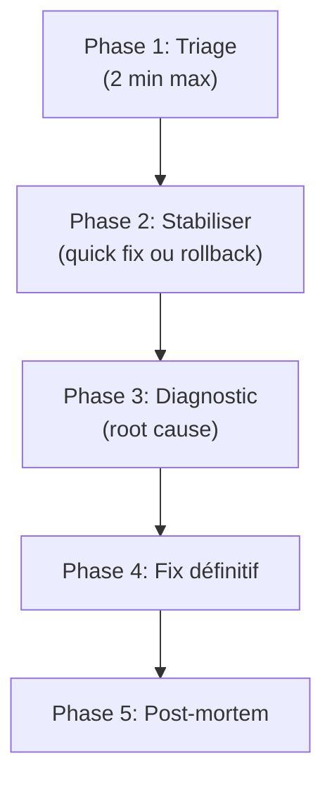

# Incident Response

Workflow structuré pour répondre à un incident (panne, régression, build cassé). Inspiré des pratiques SRE Google et des patterns gstack/superpowers pour la stabilisation rapide.

## Principe fondamental

```
STABILISER D'ABORD — COMPRENDRE ENSUITE — PRÉVENIR ENFIN
```

L'objectif immédiat est de restaurer le fonctionnement. L'analyse root cause vient APRÈS.

## Quand utiliser

- Build/CI cassé en urgence
- Régression détectée après un merge
- Fonctionnalité critique qui ne marche plus
- Tests qui passaient et qui cassent sans changement apparent
- "Ça marchait hier" / "Ça marche plus"
- Erreur en production ou pré-production

## Le processus



### Phase 1 — Triage (2 minutes max)

Évaluer rapidement la sévérité :

| Sévérité | Critère | Action |
|---|---|---|
| **SEV-1** | Core cassé, aucun test ne passe, build impossible | Tout arrêter, focus total |
| **SEV-2** | Feature majeure cassée, >10 tests en échec | Priorité haute, fix dans l'heure |
| **SEV-3** | Feature mineure, 1-3 tests, pas bloquant | Planifier dans le sprint |
| **SEV-4** | Cosmétique, warning, non-régression | Backlog |

**Collecter immédiatement** :

```bash
# Derniers commits
git log --oneline -10

# État des tests
PYTHONPATH=src /usr/bin/python3 -m pytest tests/ -x --tb=short 2>&1 | tail -20

# Fichiers modifiés récemment
git diff --stat HEAD~3

# Lint
ruff check src/ 2>&1 | head -20
```

### Phase 2 — Stabiliser

Objectif : restaurer un état fonctionnel le plus vite possible.

**Option A — Rollback** (si le commit fautif est identifiable) :

```bash
# Identifier le commit cassant
git bisect start
git bisect bad HEAD
git bisect good <last-known-good>
# ... bisect automatique ...

# Revert si nécessaire
git revert <bad-commit> --no-edit
```

**Option B — Quick fix** (si le problème est évident) :

- Fix minimal, pas de refactoring
- Un seul fichier modifié si possible
- Test de non-régression immédiat

**Option C — Feature flag** (si le fix est complexe) :

- Désactiver la feature cassée
- Restaurer le fonctionnement du reste
- Planifier le fix propre

### Phase 3 — Diagnostic root cause

Une fois stabilisé, comprendre pourquoi :

1. **Timeline** — reconstituer la séquence d'événements

```markdown
| Quand | Quoi | Qui |
|---|---|---|
| T-3h | Commit abc1234 "refactor X" | dev |
| T-1h | CI passe vert | CI |
| T-0 | Test Y casse | utilisateur |
```

2. **Les 5 pourquoi** — creuser la cause racine

```
Pourquoi le test casse ? → Le mock retourne None
Pourquoi le mock retourne None ? → L'interface a changé
Pourquoi l'interface a changé ? → Le refactoring a renommé la méthode
Pourquoi le test n'a pas été mis à jour ? → Pas de CI sur les mocks
Pourquoi pas de CI sur les mocks ? → Convention manquante
→ ROOT CAUSE : Pas de convention de naming pour les mocks
```

3. **Blast radius** — évaluer l'étendue

- Combien de fichiers affectés ?
- Combien de tests cassés ?
- D'autres features dépendent-elles du même code ?

### Phase 4 — Fix définitif

Appliquer un fix propre (pas le quick fix de Phase 2) :

1. **Écrire le test de non-régression** — reproduire le bug dans un test
2. **Implémenter le fix** — résoudre la cause racine
3. **Vérifier** — tous les tests passent, y compris le nouveau
4. **Review** — relire le diff complet

```bash
# Le test de non-régression doit échouer AVANT le fix
PYTHONPATH=src /usr/bin/python3 -m pytest tests/test_<module>.py::test_regression_<issue> -v
# → FAIL (attendu)

# Appliquer le fix, puis :
PYTHONPATH=src /usr/bin/python3 -m pytest tests/ -x --tb=short
# → ALL PASS
```

### Phase 5 — Post-mortem

Documenter pour ne pas répéter :

```markdown
## Post-mortem : [Titre de l'incident]

**Date** : YYYY-MM-DD
**Sévérité** : SEV-X
**Durée** : [temps de résolution]
**Impact** : [ce qui était cassé]

### Timeline

[Reconstitution de Phase 3]

### Root cause

[Analyse des 5 pourquoi]

### Fix appliqué

[Description du fix définitif + lien vers le commit]

### Actions préventives

- [ ] [Action 1 — qui, quand]
- [ ] [Action 2 — qui, quand]

### Learnings

- [Ce qu'on a appris]
```

**Enregistrer dans le Failure Museum** :

```python
# Via SDK
from grimoire.tools import Learnings
learnings = Learnings(project_root=Path("."))
learnings.log(key="incident-<slug>", insight="<learning>", tags=["incident", "sev-X"])
```

## Conventions Grimoire

- Tests : pytest avec `conftest.py`, `-x` pour stop au premier échec
- Linter : ruff
- Post-mortem : stocker dans `_grimoire-runtime/_memory/failure-museum.md`
- Learnings : enregistrer via SDK `Learnings`

## Red Flags — STOP

- **Envie de push un fix non testé** → STOP, écrire le test d'abord
- **Modification de >5 fichiers pour un "quick fix"** → ce n'est pas un quick fix, planifier
- **Conflit entre stabilisation et fix propre** → toujours stabiliser d'abord
- **Pas de repro** → ne pas fixer ce qu'on ne peut pas reproduire

## Checklist de vérification

- [ ] Sévérité évaluée (SEV-1 à SEV-4)
- [ ] Stabilisation effective (tests verts ou feature désactivée)
- [ ] Root cause identifiée (les 5 pourquoi)
- [ ] Test de non-régression écrit
- [ ] Fix définitif appliqué et vérifié
- [ ] Post-mortem documenté
- [ ] Learning enregistré
- [ ] Actions préventives planifiées

## Intégration

- **Triage** : utiliser `grimoire-systematic-debugging` Phase 1 pour le diagnostic
- **Fix** : suivre `grimoire-tdd` pour le test de non-régression
- **Post-mortem** : alimenter `_grimoire-runtime/_memory/failure-museum.md`
- **Learnings** : enregistrer via `grimoire-learnings`
- **Telemetry** : l'incident est tracé via `Telemetry.record_tool()`
