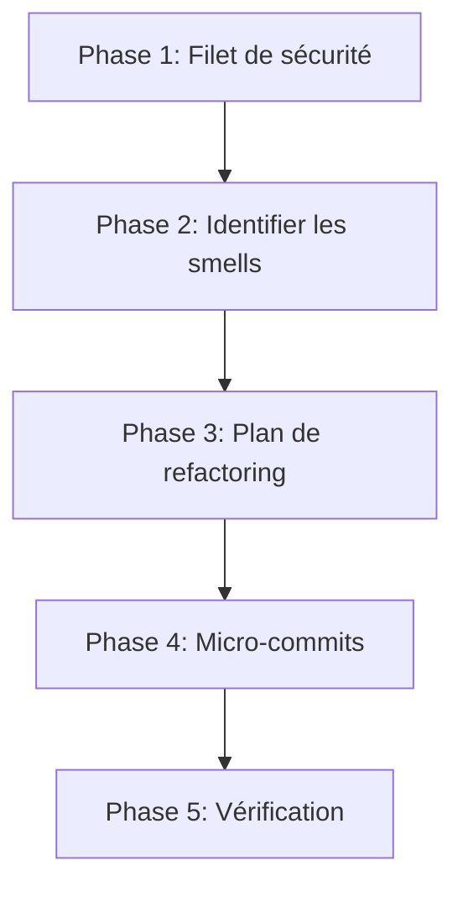

# Refactoring Systématique

Workflow structuré pour refactorer du code en sécurité. Inspiré du catalogue de Martin Fowler et adapté aux conventions Grimoire.

## Principe fondamental

```
JAMAIS DE REFACTORING SANS FILET DE TESTS
```

Si les tests ne couvrent pas le code ciblé, écrire les tests AVANT de refactorer. Le refactoring ne change jamais le comportement observable.

## Quand utiliser

- Code smell détecté (duplication, méthode trop longue, God class)
- Module >300 LOC qu'on a du mal à comprendre
- Fan-in ou fan-out excessif (>5 imports directs)
- Avant d'ajouter une feature dans du code complexe
- Après une review d'architecture identifiant de la dette technique
- Quand un test est difficile à écrire à cause du couplage

## Le processus



### Phase 1 — Filet de sécurité

Avant toute modification :

1. **Vérifier la couverture** — lancer les tests existants

```bash
PYTHONPATH=src /usr/bin/python3 -m pytest tests/test_<module>.py -v --tb=short
```

2. **Si couverture insuffisante** — écrire les tests manquants (mode TDD, skill `grimoire-tdd`)
3. **Baseline** — noter le nombre de tests passants et le temps d'exécution
4. **Git status** — s'assurer qu'on part d'un état propre

```bash
git status --short
git stash  # si nécessaire
```

### Phase 2 — Identifier les smells

Cataloguer les problèmes par catégorie :

| Smell | Signe | Refactoring |
|---|---|---|
| **Long Method** | >30 LOC ou >3 niveaux d'indentation | Extract Method |
| **Large Class** | >300 LOC ou >10 méthodes publiques | Extract Class |
| **Feature Envy** | Méthode utilise plus l'autre classe que la sienne | Move Method |
| **Data Clump** | Mêmes 3+ params passés ensemble | Extract Dataclass |
| **Primitive Obsession** | Strings/ints pour des concepts métier | Introduce Value Object |
| **Duplicated Code** | >3 lignes identiques en 2+ endroits | Extract + Parameterize |
| **Shotgun Surgery** | Un changement touche >3 fichiers | Move + Inline |
| **Message Chain** | `a.b.c.d.method()` | Hide Delegate |

Format d'inventaire :

```markdown
| # | Smell | Fichier:ligne | Sévérité | Refactoring proposé |
|---|---|---|---|---|
| 1 | Long Method | core/foo.py:42 | HIGH | Extract Method × 3 |
```

### Phase 3 — Plan de refactoring

Ordonner les refactorings par dépendance :

1. **Smells internes d'abord** (dans un même fichier)
2. **Puis smells inter-fichiers** (move, extract class)
3. **Chaque étape doit laisser les tests verts**

Règles de séquençage :
- Rename avant Extract (les noms clairs facilitent l'extraction)
- Extract avant Move (extraire localement, puis déplacer)
- Un seul refactoring par commit

### Phase 4 — Micro-commits

Pour chaque refactoring :

1. **Appliquer** le refactoring mécanique (un seul à la fois)
2. **Lancer les tests** — ils doivent TOUS passer

```bash
PYTHONPATH=src /usr/bin/python3 -m pytest tests/ -x --tb=short
```

3. **Lint** — vérifier que ruff est content

```bash
ruff check src/grimoire/ --fix
```

4. Si les tests passent, c'est un refactoring valide

#### Recettes courantes

**Extract Method** :

```python
# Avant
def process(self, data):
    # ... 15 lignes de validation ...
    # ... 20 lignes de transformation ...
    # ... 10 lignes de sauvegarde ...

# Après
def process(self, data):
    validated = self._validate(data)
    transformed = self._transform(validated)
    self._save(transformed)
```

**Extract Dataclass** :

```python
# Avant : 3+ params qui voyagent ensemble
def create_report(name: str, score: float, grade: str, passed: bool): ...

# Après
@dataclass(frozen=True, slots=True)
class ReportData:
    name: str
    score: float
    grade: str
    passed: bool

def create_report(data: ReportData): ...
```

### Phase 5 — Vérification

Après tous les refactorings :

1. **Tests complets** — relancer la suite entière
2. **Comparer** — même nombre de tests, même comportement
3. **Métriques** — LOC avant/après, nombre de méthodes, fan-in/fan-out
4. **Review** — relire le diff complet d'un oeil frais

## Conventions Grimoire

- `@dataclass(frozen=True, slots=True)` pour les structures de données
- Line length max : 120 caractères
- `from __future__ import annotations` toujours
- `pathlib.Path` uniquement (jamais `os.path`)
- Type hints obligatoires sur fonctions publiques

## Red Flags — STOP

- Tests qui cassent après un refactoring → **STOP, revenir en arrière, comprendre pourquoi**
- Refactoring qui change le comportement → ce n'est PAS du refactoring, c'est une feature
- Envie de refactorer "en passant" pendant une feature → **STOP, noter pour plus tard**
- Refactoring sans tests → **STOP, écrire les tests d'abord**

## Checklist de vérification

- [ ] Tests existants passent AVANT le refactoring
- [ ] Smells identifiés et priorisés
- [ ] Plan de refactoring ordonné
- [ ] Chaque étape laisse les tests verts
- [ ] Lint passant après chaque étape
- [ ] Diff final relu
- [ ] Aucun changement de comportement observable

## Intégration

- **Avant le refactoring** : vérifier avec `grimoire-architecture-review` pour prioriser
- **Pendant** : chaque étape suit le cycle `grimoire-tdd` (Red absent → déjà green)
- **Après** : vérifier avec `grimoire-verification` (skill de complétion)
