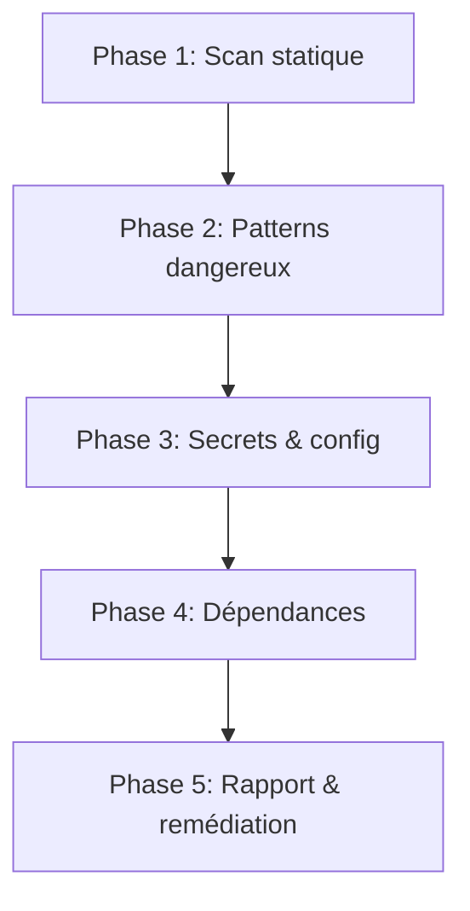

# Security Review

Revue de sécurité systématique inspirée du guide OWASP Top 10 et des patterns Anthropic plugins. Applique un audit multi-couche sur le code, les configurations, et les dépendances.

## Principe fondamental

```
CHAQUE SORTIE DOIT ÊTRE PLUS SÛRE QUE L'ENTRÉE
```

Ne jamais laisser passer un finding de sécurité sans le documenter, même si le fix est différé.

## Quand utiliser

- Code manipulant des entrées utilisateur (forms, API, CLI args)
- Code manipulant des secrets, tokens, credentials
- Nouveaux endpoints ou routes exposées
- Modifications de configuration d'authentification/autorisation
- Avant un déploiement en production
- Quand un pattern `eval()`, `exec()`, `os.system()`, `shell=True` est détecté
- Review de dépendances tierces

## Le processus



### Phase 1 — Scan statique

Identifier la surface d'attaque :

1. **Entrées utilisateur** — lister tous les points d'entrée (CLI args, env vars, fichiers, API, stdin)
2. **Sorties** — identifier où les données sortent (logs, fichiers, réseau, subprocess)
3. **Trust boundaries** — tracer les frontières de confiance (quelles données sont trustées vs non)

```bash
# Trouver les points d'entrée
grep -rn "input\|argv\|environ\|request\.\|read()" src/ --include="*.py"
# Trouver les exécutions de commandes
grep -rn "subprocess\|os\.system\|os\.popen\|eval(\|exec(" src/ --include="*.py"
```

### Phase 2 — Patterns dangereux (OWASP Top 10)

Vérifier chaque catégorie :

| # | OWASP | Pattern à chercher | Sévérité |
|---|---|---|---|
| A01 | Broken Access Control | Chemins sans vérification d'autorisation | CRITICAL |
| A02 | Crypto Failures | Secrets en clair, algo faibles (MD5, SHA1 pour auth) | HIGH |
| A03 | Injection | SQL concat, shell=True, eval(), template injection | CRITICAL |
| A04 | Insecure Design | Logique métier bypassable, race conditions | HIGH |
| A05 | Security Misconfiguration | DEBUG=True, CORS *, default passwords | MEDIUM |
| A06 | Vulnerable Components | Dépendances outdated, CVE connues | HIGH |
| A07 | Auth Failures | Sessions faibles, brute-force possible | HIGH |
| A08 | Integrity Failures | Pas de vérification de signature, désérialisation unsafe | HIGH |
| A09 | Logging Failures | Secrets dans les logs, pas d'audit trail | MEDIUM |
| A10 | SSRF | URL utilisateur sans validation, redirections ouvertes | HIGH |

Format de finding :

```markdown
### [SEVERITY] Description courte

- **Catégorie** : OWASP A0X
- **Fichier** : `path/to/file.py:42`
- **Pattern** : description du pattern dangereux
- **Impact** : ce qui peut arriver si exploité
- **Remédiation** : fix recommandé avec exemple de code
```

### Phase 3 — Secrets et configuration

1. Scanner les fichiers pour des secrets hardcodés :
   - Patterns : `password=`, `secret=`, `api_key=`, `token=`, tokens base64, clés SSH
   - Vérifier `.env`, `.env.local`, fichiers de config
2. Vérifier que `.gitignore` exclut les fichiers sensibles
3. Vérifier que les logs ne contiennent pas de données sensibles

```bash
# Scan secrets basique
grep -rn "password\|secret\|api_key\|token\|private_key" src/ --include="*.py" | grep -v "test_\|#\|TODO"
```

### Phase 4 — Dépendances

1. Vérifier les versions dans `pyproject.toml` ou `requirements.txt`
2. Identifier les packages avec des CVE connues
3. Vérifier les permissions des dépendances (accès réseau, filesystem)

### Phase 5 — Rapport et remédiation

Produire un rapport structuré :

```markdown
## Security Review Report

**Date** : YYYY-MM-DD
**Scope** : [fichiers/modules audités]
**Reviewer** : SOG (automated)

### Résumé

| Sévérité | Count |
|---|---|
| CRITICAL | X |
| HIGH | X |
| MEDIUM | X |
| LOW | X |

### Findings

[Liste des findings par sévérité décroissante]

### Recommandations prioritaires

1. [Fix immédiat requis]
2. [Fix recommandé]
3. [Amélioration future]
```

## Conventions Grimoire

- Framework tests : pytest avec `conftest.py`
- Linter : ruff (inclut bandit rules `S*`)
- Types : type hints sur toutes les fonctions publiques
- Paths : `pathlib.Path` uniquement
- SDK : utiliser `Evaluator._check_safety()` pour les patterns connus

## Red Flags — STOP

- `eval()` ou `exec()` avec input utilisateur → **STOP, remédier immédiatement**
- `subprocess.call(shell=True)` avec variables non sanitizées → **STOP**
- Secret hardcodé dans le code source → **STOP**
- `pickle.loads()` sur données non trustées → **STOP**
- `yaml.load()` sans `Loader=SafeLoader` → **STOP**

## Checklist de vérification

- [ ] Tous les points d'entrée identifiés
- [ ] Chaque catégorie OWASP vérifiée
- [ ] Aucun secret hardcodé
- [ ] Dépendances vérifiées
- [ ] Findings documentés avec sévérité
- [ ] Remédiations proposées pour chaque finding
- [ ] ruff bandit rules activées et passantes

## Intégration

- **Pré-push** : ajouter un check sécurité au workflow `grimoire-pre-push`
- **Telemetry** : enregistrer les findings via `Evaluator.evaluate()`
- **Learnings** : logger les patterns récurrents via `Learnings.log()`
