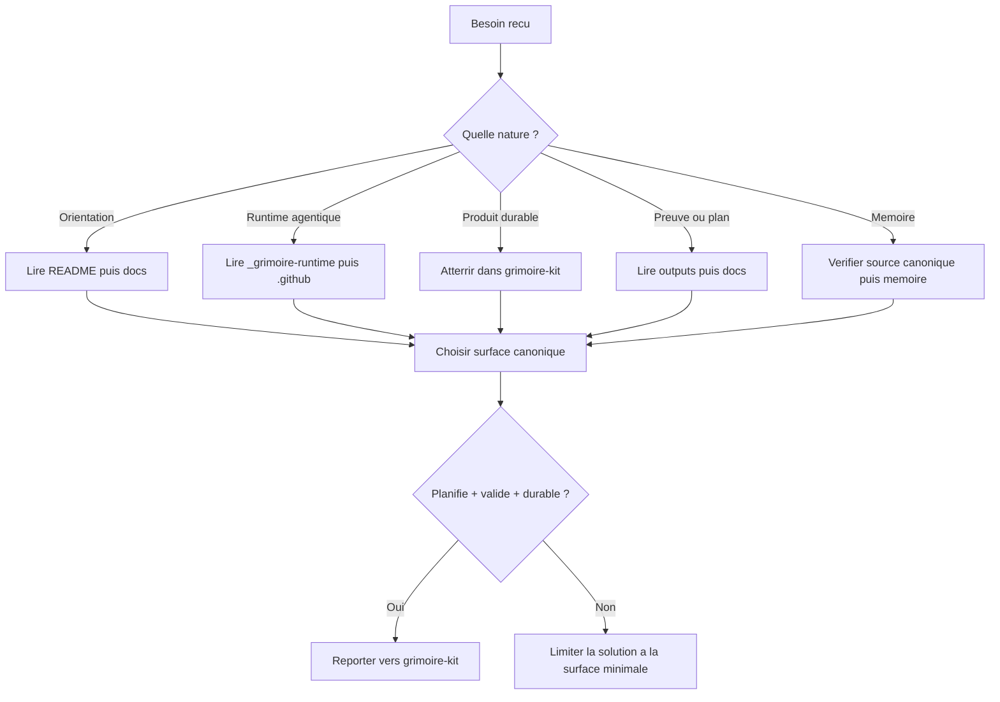

# Structure Governance

Choisir la bonne surface du depot, la bonne source de verite et la bonne landing zone avant d'agir.

## Principe fondamental

```text
Le plus petit artefact suffisant gagne, et toute logique durable quitte la racine pour rejoindre Grimoire Kit.
```

## Quand utiliser

- Le user demande ou chercher une information dans le repo.
- Le user demande ou creer ou deplacer un artefact.
- Le repo parait chaotique ou ambigu entre racine, runtime, outputs et kit.
- Il faut decider si un fait doit vivre dans la doc, la memoire, le runtime ou le kit.
- Il faut savoir si une solution doit etre reportee dans `grimoire-kit/`.

## Processus



### Etape 1 - Classer la demande

Classer d'abord le besoin dans une de ces categories :

- orientation du depot ;
- comportement agentique ;
- runtime Grimoire ;
- logique produit ou outillage durable ;
- preuve, planification ou diagnostic ;
- memoire et apprentissages ;
- archeologie ou compatibilite.

### Etape 2 - Appliquer la hierarchie de recherche

Utiliser cet ordre nominal :

1. `README.md` et `docs/` pour le cadre et les decisions.
2. `_grimoire-runtime/` puis `_grimoire-runtime/_config/agent-surface-index.csv` quand il existe, avant `.github/` pour le runtime agentique actif.
3. `grimoire-kit/` pour toute logique produit ou tout outillage durable.
4. `_grimoire-runtime-output/` et `_grimoire-output/` pour les preuves, plans et sorties.
5. `_grimoire/` et les archives uniquement si un besoin historique l'exige.

### Etape 3 - Choisir la landing zone

Appliquer les regles suivantes :

- logique durable, validateurs, indexeurs, scans et policies : `grimoire-kit/framework/tools/` ;
- logique produit Python : `grimoire-kit/src/` ;
- surface web ou runtime UI : `grimoire-kit/apps/` ;
- cadrage, decisions et gouvernance : `docs/` ou `_grimoire-runtime-output/planning-artifacts/` ;
- hooks ou wrappers de workspace : racine du depot, uniquement si la logique est deja dans le kit.

### Etape 4 - Gouverner la memoire

Avant d'ecrire en memoire :

1. verifier s'il existe deja une source canonique dans `docs/`, `_grimoire-runtime/` ou `grimoire-kit/` ;
2. mettre a jour cette source en premier si elle doit changer ;
3. n'ecrire qu'un pointeur court dans `/memories/repo/` si le rappel est utile a plusieurs sessions ;
4. ne jamais utiliser `_grimoire/_memory/` comme source de verite nominale.

### Etape 5 - Appliquer le trigger de report vers le kit

Reporter dans `grimoire-kit/` si la solution est :

- planifiee ;
- validee ;
- durable.

Si une de ces conditions manque, garder la solution sur la surface minimale necessaire et documenter la dette restante.

## Red Flags - STOP

- Commencer la recherche par `_grimoire/` ou `.github/agents/_archived/` sans justification explicite.
- Ajouter une logique durable a la racine alors qu'elle doit vivre dans `grimoire-kit/`.
- Dupliquer un fait stable dans plusieurs couches memoire.
- Prendre un output de run comme source de verite fonctionnelle.
- Creer un nouvel agent alors qu'un skill, une instruction ou un validateur suffit.

## Checklist de verification

- [ ] La surface choisie respecte le canon du depot.
- [ ] La source de verite est explicite et unique.
- [ ] Les archives ou l'historique n'ont ete consultes que par necessite reelle.
- [ ] Si la solution est durable, sa landing zone dans `grimoire-kit/` est definie.
- [ ] Si une note memoire a ete ecrite, elle pointe vers un fichier canonique.

## Integration

- Lire d'abord [docs/governance/canon-structurel-et-navigation-agentique.md](../../docs/governance/canon-structurel-et-navigation-agentique.md).
- Lire ensuite [docs/governance/gouvernance-memoire-agentique.md](../../docs/governance/gouvernance-memoire-agentique.md).
- Utiliser `_grimoire-runtime/_config/agent-surface-index.csv` comme index nominal actif versus archive avant de consulter `.github/agents/_archived/`.
- Utiliser avec `grimoire-intent-routing` pour trancher les demandes ambigues.
- Capitaliser les conventions verifiees via la memoire repo plutot que dans une memoire historique.