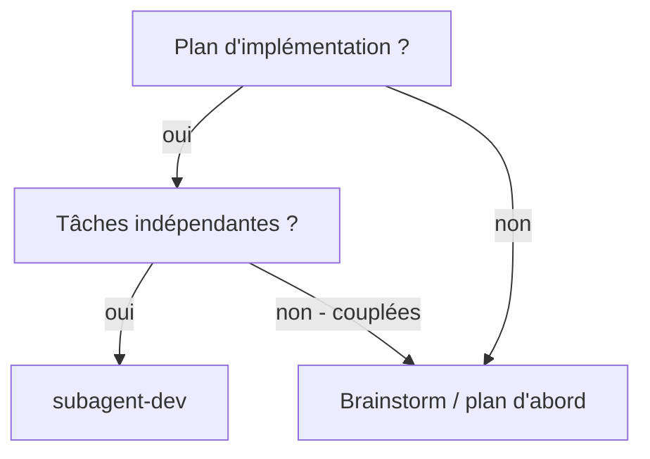
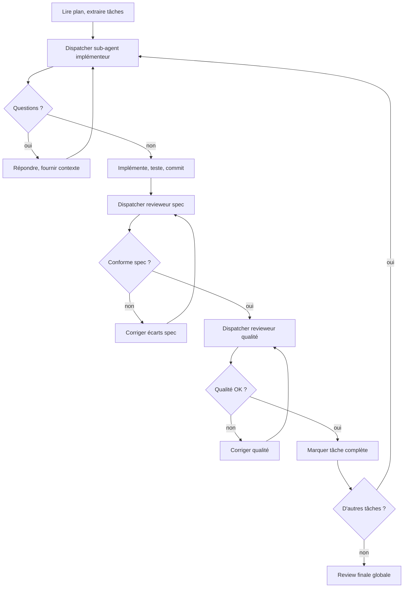

# Développement Piloté par Sub-agents

Exécuter un plan d'implémentation en dispatchant un sub-agent frais par tâche, avec review en 2 étapes après chacune : conformité spec d'abord, puis qualité code. Adapté de superpowers.

## Principe fondamental

Sub-agent frais par tâche + review en 2 étapes (spec puis qualité) = haute qualité, itération rapide.

Quand la demande porte sur l'exécution complète d'un plan, l'orchestrateur garde le bâton et n'interrompt pas entre les tâches. Il ne remonte que le contexte manquant, les blocages réels, ou les décisions explicitement requises.

## Quand utiliser



## Le processus



## Sélection de modèle

Utiliser le modèle le moins puissant capable de gérer chaque rôle.

- **Tâches mécaniques** (fonctions isolées, specs claires, 1-2 fichiers) → modèle rapide/économe
- **Tâches d'intégration** (multi-fichiers, coordination) → modèle standard
- **Architecture, design, review** → modèle le plus capable

## Statuts du sub-agent implémenteur

| Statut | Action |
|---|---|
| **DONE** | Procéder à la review spec |
| **DONE_WITH_CONCERNS** | Lire les préoccupations, évaluer avant review |
| **NEEDS_CONTEXT** | Fournir le contexte manquant, re-dispatcher |
| **BLOCKED** | Évaluer le blocage : contexte → re-dispatcher, capacité → modèle plus puissant, taille → découper |

**Jamais** ignorer une escalade ou forcer le même modèle à réessayer sans changement.

## Prompts de dispatch

### Sub-agent implémenteur

```
Tu es un développeur expert. Implémente cette tâche en suivant le TDD strict.

TÂCHE : {texte complet de la tâche du plan}
CONTEXTE : {architecture, fichiers liés, conventions}

RÈGLES :
- Test d'abord (red-green-refactor)
- Code minimal pour passer les tests
- Commit atomique à la fin
- Self-review avant de reporter

REPORTER : DONE | DONE_WITH_CONCERNS | NEEDS_CONTEXT | BLOCKED
```

### Sub-agent revieweur spec

```
Tu es un revieweur de conformité spec. Compare le code implémenté avec la spec.

SPEC : {texte de la tâche}
CHANGEMENTS : {diff git}

VÉRIFIER :
- Chaque exigence de la spec est implémentée
- Rien d'extra n'a été ajouté (YAGNI)
- Les noms, types, signatures correspondent à la spec

REPORTER : APPROVED | ISSUES: [liste]
```

### Sub-agent revieweur qualité

```
Tu es un revieweur de qualité code. Évalue l'implémentation.

CHANGEMENTS : {diff git depuis le dernier commit approuvé}

ÉVALUER :
- Clarté et lisibilité
- Gestion d'erreurs
- Couverture de tests
- Conventions du projet (ruff, dataclasses, pathlib)

REPORTER : APPROVED | ISSUES: [liste priorisée]
```

## Red Flags — Ne jamais

- Commencer sur main/master sans accord explicite
- Sauter les reviews (spec OU qualité)
- Procéder avec des issues non corrigées
- Dispatcher plusieurs implémenteurs en parallèle (conflits)
- Faire lire le plan au sub-agent (fournir le texte complet)
- Sauter le contexte (le sub-agent doit comprendre où la tâche s'inscrit)
- Accepter "à peu près" sur la conformité spec
- Commencer la review qualité AVANT la conformité spec
- Passer à la tâche suivante avec des issues ouvertes
- Rendre la main entre chaque tâche alors que l'objectif est l'exécution complète du plan

## Intégration Grimoire

**Skills requises :**

- `grimoire-tdd` — les sub-agents suivent le TDD
- `grimoire-verification` — vérification avant complétion
- `grimoire-systematic-debugging` — si un sub-agent rencontre un bug

**Conventions :**

- Utiliser `runSubagent` avec l'agent `dev` pour l'implémentation
- Utiliser `runSubagent` avec l'agent `qa` pour les reviews
- Commits atomiques par tâche
- Tous les tests doivent passer avant de marquer une tâche complète
- Après la review finale globale, exécuter le sweep de fin de tâche : validations pertinentes, docs/contrats touchés, et petits fix adjacents même objectif/L1/L2 avant de rendre la main
- Ne formuler des prochaines étapes que pour ce qui reste bloqué, optionnel, exploratoire, ou hors périmètre de la tâche en cours
