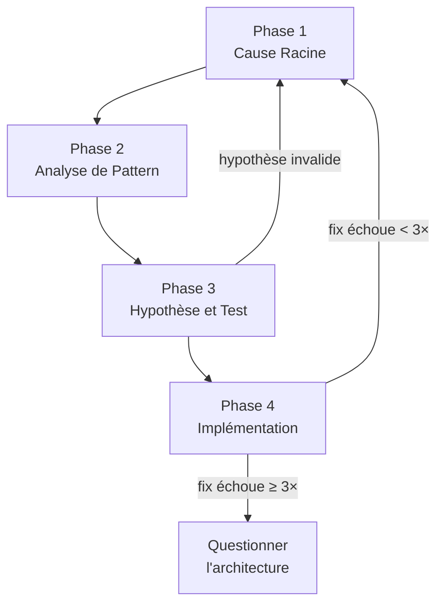

# Debugging Systématique

Processus en 4 phases pour trouver la cause racine avant de corriger. Adapté de superpowers.

## Principe fondamental

```
AUCUN FIX SANS INVESTIGATION DE LA CAUSE RACINE D'ABORD
```

Si la Phase 1 n'est pas terminée, aucun fix ne peut être proposé.

## Quand NE PAS utiliser

- Pour réparer un échec de workflow agentique Grimoire interne (agent, framework tool, pipeline interne) → `grimoire-self-heal`.
- Pour répondre à une régression sur le code de production / build / CI → `grimoire-incident-response`.
- Pour traquer des edge cases non gardés sans cause connue → `grimoire-edge-case-hunter`.

## Quand utiliser

- **Toujours** : échecs de tests, bugs, comportements inattendus, problèmes de performance
- **Surtout quand** : sous pression, "juste un quick fix" semble évident, déjà tenté plusieurs fixes

## Les 4 phases



### Phase 1 : Investigation de la cause racine

**AVANT tout fix :**

1. **Lire les messages d'erreur attentivement**
   - Ne pas les ignorer — ils contiennent souvent la solution exacte
   - Lire les stack traces complètement
   - Noter les numéros de ligne, fichiers, codes d'erreur

2. **Reproduire systématiquement**
   - Peut-on le déclencher de façon fiable ?
   - Quelles sont les étapes exactes ?
   - Si non reproductible → plus de données, pas de devinette

3. **Vérifier les changements récents**
   - `git diff`, commits récents
   - Nouvelles dépendances, changements de config
   - Différences d'environnement

4. **Tracer le flux de données**
   - D'où vient la mauvaise valeur ?
   - Qui a appelé cette fonction avec cette valeur ?
   - Remonter jusqu'à la source — corriger à la source, pas au symptôme

5. **Systèmes multi-composants** : instrumenter chaque frontière de composant AVANT de proposer des fixes

### Phase 2 : Analyse de pattern

1. **Trouver des exemples fonctionnels** — code similaire qui marche dans le même codebase
2. **Comparer avec les références** — lire l'implémentation de référence ENTIÈREMENT
3. **Identifier les différences** — lister chaque différence, même minime
4. **Comprendre les dépendances** — config, environnement, hypothèses

### Phase 3 : Hypothèse et test

1. **Former UNE hypothèse** : "Je pense que X est la cause parce que Y"
2. **Tester minimalement** : le PLUS PETIT changement possible, une variable à la fois
3. **Vérifier** : ça marche → Phase 4 | ça ne marche pas → nouvelle hypothèse
4. **Si inconnu** : dire "je ne comprends pas X", pas prétendre savoir

### Phase 4 : Implémentation

1. **Créer un test case failing** (utiliser la skill `grimoire-tdd`)
2. **Implémenter UN SEUL fix** — la cause racine identifiée
3. **Vérifier le fix** — test passe, pas de régression
4. **Si le fix échoue** :
   - Moins de 3 tentatives → retour Phase 1
   - **3+ tentatives → STOP et questionner l'architecture**

### Questionner l'architecture (après 3+ échecs)

Signaux d'un problème architectural :

- Chaque fix révèle un nouveau problème ailleurs
- Les fixes nécessitent un "refactoring massif"
- Chaque fix crée de nouveaux symptômes

**STOP et discuter avec l'utilisateur avant d'autres tentatives.**

## Red Flags — STOP et suivre le processus

Si vous pensez :

- "Quick fix pour l'instant"
- "Essayons de changer X"
- "Plusieurs changements d'un coup"
- "Je ne comprends pas tout mais ça devrait marcher"
- "Encore un essai" (après 2+ échecs)

**TOUT cela signifie : STOP. Retour Phase 1.**

## Référence rapide

| Phase | Activités clés | Critère de succès |
|---|---|---|
| 1. Cause Racine | Lire erreurs, reproduire, vérifier changements | Comprendre QUOI et POURQUOI |
| 2. Pattern | Trouver exemples fonctionnels, comparer | Identifier les différences |
| 3. Hypothèse | Former théorie, tester minimalement | Confirmé ou nouvelle hypothèse |
| 4. Implémentation | Créer test, fixer, vérifier | Bug résolu, tests passent |
