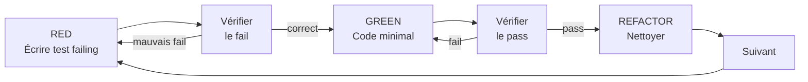

# Test-Driven Development (TDD)

Workflow structuré pour écrire du code guidé par les tests. Adapté de superpowers avec les conventions Grimoire.

## Principe fondamental

```
AUCUN CODE DE PRODUCTION SANS UN TEST FAILING D'ABORD
```

Si le test passe immédiatement, il ne teste rien. Si du code existe avant le test — le supprimer et recommencer.

## Quand NE PAS utiliser

- Pour concevoir une stratégie de test multi-niveaux, fixtures partagées, gates CI ou pyramide → `grimoire-test-architecture` (TEA).
- Pour générer un squelette de tests sur du code existant non testé → `grimoire-test-scaffold`.
- Pour des spikes exploratoires où le design n'est pas encore stable → revenir au TDD une fois le contrat clarifié.

## Quand utiliser

- **Toujours** : nouvelles features, bug fixes, refactoring, changements de comportement
- **Exceptions** (avec accord utilisateur) : prototypes jetables, code généré, fichiers de configuration

## Cycle Red-Green-Refactor



### RED — Écrire le test failing

Un seul test minimal montrant le comportement attendu.

**Bon** :

```python
def test_rejects_empty_email():
    result = validate_email("")
    assert result.error == "Email requis"
```

Nom clair, teste un vrai comportement, une seule chose.

**Mauvais** :

```python
def test_email(mock_validator):
    mock_validator.return_value = False
    assert not mock_validator("")
```

Nom vague, teste le mock pas le code.

**Règles** :

- Un comportement par test
- Nom descriptif du comportement
- Code réel (mocks uniquement si inévitable)

### Vérifier RED — Observer le fail

**OBLIGATOIRE. Ne jamais sauter.**

```bash
pytest tests/path/test_module.py::test_name -v
```

Confirmer :

- Le test échoue (pas une erreur)
- Le message de fail est celui attendu
- Il échoue parce que la feature manque (pas une typo)

### GREEN — Code minimal

Écrire le code le plus simple pour faire passer le test.

```python
def validate_email(email: str) -> ValidationResult:
    if not email.strip():
        return ValidationResult(error="Email requis")
    return ValidationResult()
```

Ne pas ajouter de features, refactorer d'autre code, ou "améliorer" au-delà du test.

### Vérifier GREEN — Observer le pass

**OBLIGATOIRE.**

```bash
pytest tests/path/test_module.py -v
```

Confirmer :

- Le test passe
- Les autres tests passent toujours
- Sortie propre (pas d'erreurs, warnings)

### REFACTOR — Nettoyer

Après le green uniquement :

- Supprimer la duplication
- Améliorer les noms
- Extraire des helpers

Garder les tests au vert. Ne pas ajouter de comportement.

## Conventions Grimoire

- Framework : pytest avec `conftest.py` pour les fixtures partagées
- Pattern fichiers : `test_<module>.py`
- Pas de xdist (tests séquentiels avec `-x`)
- Linter : ruff (vérifier après chaque cycle)

```bash
# Cycle complet
pytest tests/path/test_module.py::test_name -v  # RED
# ... implémenter ...
pytest tests/path/test_module.py -v              # GREEN
ruff check src/                                  # REFACTOR
```

## Rationalisations courantes

| Excuse | Réalité |
|---|---|
| "Trop simple pour tester" | Le code simple casse aussi. Le test prend 30 secondes. |
| "Je testerai après" | Un test qui passe immédiatement ne prouve rien. |
| "Urgence, pas le temps" | Le TDD est PLUS RAPIDE que le debug aléatoire. |
| "Plusieurs fixes d'un coup" | Impossible d'isoler ce qui a marché. |
| "Garder comme référence" | Supprimer signifie supprimer. Réécrire depuis les tests. |

## Red Flags — STOP et recommencer

- Code avant test
- Test après implémentation
- Test passe immédiatement
- Impossible d'expliquer pourquoi le test a échoué
- "Juste cette fois"

**Tout cela signifie : supprimer le code, recommencer avec TDD.**

## Checklist de vérification

- [ ] Chaque nouvelle fonction a un test
- [ ] Observé chaque test échouer avant d'implémenter
- [ ] Écrit le code minimal pour chaque test
- [ ] Tous les tests passent
- [ ] Sortie propre (pas d'erreurs/warnings)
- [ ] Tests utilisent du vrai code (mocks uniquement si inévitable)
- [ ] Edge cases et erreurs couverts
