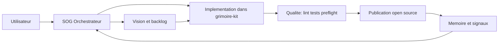

# Grimoire Forge

Moteur de creation de projets agentiques, construit en dogfooding continu avec BMAD.

## Sommaire

- [Positionnement](#positionnement)
- [Direction Artistique](#direction-artistique)
- [Architecture](#architecture)
- [Structure du depot](#structure-du-depot)
- [Actifs deja capitalises](#actifs-deja-capitalises)
- [Workflow recommande](#workflow-recommande)
- [Commandes utiles](#commandes-utiles)
- [Documentation](#documentation)
- [Statut](#statut)

## Positionnement

Ce depot est le cockpit de conception du moteur.
Le code produit reste dans [grimoire-kit](grimoire-kit/).

Objectif produit: permettre de lancer, structurer et faire evoluer des projets pilotes par agents IA avec un niveau entreprise.

Nom retenu: Grimoire Forge.
Ce nom conserve l'ADN Grimoire et clarifie la promesse: forger un projet agentique de bout en bout.

## Direction Artistique

La DA du projet suit 4 principes:

- Systeme vivant: chaque artefact est executable, pas seulement descriptif.
- Sobriete operationnelle: documentation courte, actionnable, verifiable.
- Transparence de gouvernance: decisions, regles et checks restent tracables.
- Boucle d'apprentissage: memoire, signaux d'usage et retours terrain alimentent chaque iteration.

## Architecture

Le schema ci-dessous est volontairement simplifie pour rester 100% compatible avec le rendu Mermaid de GitHub.



## Structure du depot

```text
bmad-custom/
├── _bmad/                    Runtime BMAD installe dans ce workspace
├── _bmad-output/             Artefacts produits (plans, implementation, traces)
├── docs/                     Cible produit, architecture, roadmap, publication
├── grimoire-kit/             Produit implemente (framework, CLI, tests)
└── .github/                  Instructions, skills, workflows, agents
```

## Actifs deja capitalises

- Orchestrateur SOG BM-53 comme point d'entree unique.
- Protocoles d'autonomie ALS, AORA, PIP, DCF.
- Unified Dynamic Factory pour creer agents, workflows, skills et instructions.
- Tooling de robustesse: health check, antifragile, self-heal, memory audit, pre-push.
- Boucle d'apprentissage via memoire projet et artefacts d'execution.

## Workflow recommande

1. Formaliser la cible et les contraintes dans la documentation.
2. Transformer la cible en stories exploitables via BMAD.
3. Implementer dans [grimoire-kit](grimoire-kit/).
4. Reinstaller dans ce workspace et valider en conditions reelles.
5. Rejouer la boucle d'amelioration continue.

## Commandes utiles

```bash
# Validation rapide
python3 -m ruff check grimoire-kit/framework/tools/ grimoire-kit/tests/ --statistics
python3 -m pytest grimoire-kit/tests/ -q --tb=short -x --ignore=grimoire-kit/tests/test_background_tasks.py

# Sante BMAD
python3 grimoire-kit/framework/tools/preflight-check.py --project-root .
python3 grimoire-kit/framework/tools/memory-lint.py --project-root .
```

## Documentation

- Vision et perimetre: [docs/vision/objectif-moteur-agentique.md](docs/vision/objectif-moteur-agentique.md)
- Plan d'execution: [docs/roadmap/plan-vers-objectif.md](docs/roadmap/plan-vers-objectif.md)
- Passage open source: [docs/governance/publication-open-source.md](docs/governance/publication-open-source.md)
- Changelog: [CHANGELOG.md](CHANGELOG.md)
- Hub de navigation: [docs/index.md](docs/index.md)

## Statut

Le depot doit etre public pour soutenir l'objectif produit.
Voir [docs/governance/publication-open-source.md](docs/governance/publication-open-source.md) pour la procedure et le checklist de diffusion.
