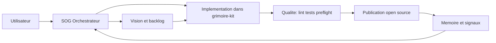

# Grimoire Forge

Moteur de creation de projets agentiques, construit en dogfooding continu avec BMAD.

## Sommaire

- [Positionnement](#positionnement)
- [Direction Artistique](#direction-artistique)
- [Architecture](#architecture)
- [Structure du depot](#structure-du-depot)
- [Actifs deja capitalises](#actifs-deja-capitalises)
- [Workflow recommande](#workflow-recommande)
- [Commandes utiles](#commandes-utiles)
- [Documentation](#documentation)
- [Statut](#statut)

## Positionnement

Ce depot est le cockpit de conception du moteur.
Le code produit reste dans [grimoire-kit](grimoire-kit/).

Objectif produit: permettre de lancer, structurer et faire evoluer des projets pilotes par agents IA avec un niveau entreprise.

Nom retenu: Grimoire Forge.
Ce nom conserve l'ADN Grimoire et clarifie la promesse: forger un projet agentique de bout en bout.

## Direction Artistique

La DA du projet suit 4 principes:

- Systeme vivant: chaque artefact est executable, pas seulement descriptif.
- Sobriete operationnelle: documentation courte, actionnable, verifiable.
- Transparence de gouvernance: decisions, regles et checks restent tracables.
- Boucle d'apprentissage: memoire, signaux d'usage et retours terrain alimentent chaque iteration.

## Architecture

Le schema ci-dessous est volontairement simplifie pour rester 100% compatible avec le rendu Mermaid de GitHub.


```mermaid
flowchart LR
    User[Utilisateur] --> SOG[SOG Orchestrateur]
    SOG --> Docs[Vision et backlog]
    SOG --> Kit[Implementation dans grimoire-kit]
    Docs --> Kit
    Kit --> QA[Qualite: lint tests preflight]
    QA --> Release[Publication open source]
    Release --> Memory[Memoire et signaux]
    Memory --> SOG
```

## Structure du depot

```text
grimoire-forge/
├── _grimoire/                Runtime historique installe pour le dogfooding local
├── _grimoire-runtime/        Runtime Grimoire source de verite (agents, workflows, config)
├── _grimoire-runtime-output/ Artefacts de planification, implementation et diagnostics
├── _grimoire-output/         Sorties runtime live (observatory, pheromones, contrats)
├── web/                      Site public (Astro + socle HTML/CSS/JS premium)
├── grimoire-game-assets/     Pipeline gouverne des assets du board et de l'observatory
├── grimoire-kit/             Produit implemente (framework, CLI, tests)
└── .github/                  Instructions, skills, workflows et agents VS Code
```

## Rangement de la racine

- La racine reste reservee aux points d'entree du cockpit et aux repertoires canoniques. Les captures visuelles et snapshots n'y restent pas.
- Les captures, screenshots et snapshots Markdown vont dans `_grimoire-runtime-output/implementation-artifacts/visual-evidence/` avec `retention-manifest.json` et `proof-pack.md`.
- Aucune surface `_bmad-output/` ne doit subsister a la racine. Tout artefact utile issu d'une ancienne sortie BMAD doit etre migre vers `_grimoire-runtime-output/` avant suppression.
- Si une ancienne surface BMAD reapparait dans une branche, un script ou une archive, elle doit etre inventoried puis migree avant suppression ; `_grimoire-runtime/` et `_grimoire-runtime-output/` restent les seules surfaces canoniques.

## Actifs deja capitalises

- Orchestrateur SOG BM-53 comme point d'entree unique.
- Protocoles d'autonomie ALS, AORA, PIP, DCF.
- Unified Dynamic Factory pour creer agents, workflows, skills et instructions.
- Tooling de robustesse: health check, antifragile, self-heal, memory audit, pre-push.
- Boucle d'apprentissage via memoire projet et artefacts d'execution.

## Workflow recommande

1. Formaliser la cible et les contraintes dans la documentation.
2. Transformer la cible en stories exploitables via BMAD.
3. Implementer dans [grimoire-kit](grimoire-kit/).
4. Reinstaller dans ce workspace et valider en conditions reelles.
5. Rejouer la boucle d'amelioration continue.

## Workflow GitHub

- Travailler sur une branche courte et ouvrir une PR ; ne pas pousser directement sur `main`.
- Utiliser des commits et des titres de PR en Conventional Commits : `feat(...)`, `fix(...)`, `docs(...)`, etc.
- Installer les garde-fous locaux avec `bash grimoire-init.sh hooks --install`.
- Rejouer `grimoire: flow-quick` ou `grimoire: quickcheck` avant un push.
- Activer cote GitHub : branch protection, review CODEOWNERS, required checks et merge queue.

La gouvernance detaillee vit desormais dans le site public (voir section **Site public** ci-dessous) et dans les artefacts runtime sous `_grimoire-runtime-output/`.

## Commandes utiles

```bash
# Installer les hooks git et le commit template
bash grimoire-init.sh hooks --install

# Validation rapide
python3 -m ruff check grimoire-kit/framework/tools/ grimoire-kit/tests/ --statistics
python3 -m pytest grimoire-kit/tests/ -q --tb=short -x --ignore=grimoire-kit/tests/test_background_tasks.py

# Sante BMAD
python3 grimoire-kit/framework/tools/preflight-check.py --project-root .
python3 grimoire-kit/framework/tools/memory-lint.py --project-root .
```

## Demo locale du cockpit V5

Le shell local du cockpit vit dans `grimoire-kit/apps/grimoire-game/` et permet de rejouer visuellement les read models runtime deja prouves a travers `Cockpit`, `Spectator`, `Observer`, `Workflow`, `Expert`, `Observatory`, `War Room`, `Host Bridge` et `VS Code Panel`.

```bash
cd grimoire-kit/apps/grimoire-game
npm run check
npm run demo:views
npm run demo:report
npm run release:verify
```

Le rapport HTML genere atterrit dans `grimoire-kit/apps/grimoire-game/.release/runtime-views-report.html`.

Voir aussi : [grimoire-kit/apps/grimoire-game/README.md](grimoire-kit/apps/grimoire-game/README.md) et le site public `/observability/` / `/demo/` (voir section **Site public** ci-dessous).

## Site public

Le site public Grimoire Forge est desormais un projet [Astro](https://astro.build) autonome dans [`web/`](web/), construit sur un socle HTML/CSS/JS premium (dark control plane + FX layer futuriste). Il remplace l'ancien site MkDocs.

```bash
cd web
npm install     # une seule fois
npm run dev     # http://localhost:4321
npm run build   # dist/ statique
```

| Route | Contenu |
|---|---|
| `/` | Landing principale (ChatOrchestrator demo, surfaces, anatomie) |
| `/forge/` | Landing alternative long-scroll |
| `/anatomy/` | Anatomie du runtime |
| `/demo/` | Demonstration |
| `/observability/` | Observatory |
| `/game-ui/` | Game UI |
| `/agents/` | Catalogue genere depuis `_grimoire-runtime/_config/agent-manifest.csv` |
| `/changelog/` | Genere depuis [`CHANGELOG.md`](CHANGELOG.md) |
| `/cockpit/` | SPA cockpit live (copiee depuis `grimoire-kit/apps/grimoire-game/.release/`) |
| `/runtime-views-report.html` | Rapport de surfaces runtime |

Details dans [web/README.md](web/README.md).

## Documentation

- Changelog: [CHANGELOG.md](CHANGELOG.md)
- Site public: [web/README.md](web/README.md)
- Runtime Grimoire (agents, workflows, config): [_grimoire-runtime/](_grimoire-runtime/)
- Kit implementation: [grimoire-kit/](grimoire-kit/)

## Statut

Le depot `Guilhem-Bonnet/grimoire-forge` est public et la release `v0.1.0` est accessible sur GitHub.
La gouvernance de publication est tracee dans [CHANGELOG.md](CHANGELOG.md) et dans les artefacts runtime sous `_grimoire-runtime-output/`.
