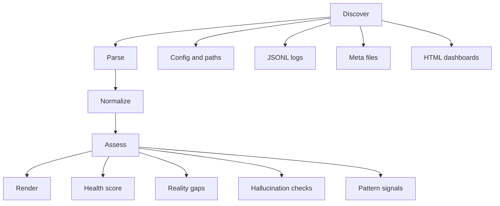

# ADR-003 : Agent Debugger Reality-First pour Grimoire Kit

## Contexte

Le projet dispose déjà de plusieurs artefacts utiles pour diagnostiquer le comportement réel d'un agent dans un runtime VS Code Copilot :

- `_bmad/_memory/mcp-audit.jsonl`
- `bmad-custom-kit/_grimoire/_memory/token-usage.jsonl`
- `_bmad-output/.router-stats.jsonl`
- `_bmad-output/.event-log.jsonl`
- `_bmad-output/.qdrant_data/meta.json`
- `bmad-custom-kit/_grimoire-output/.qdrant_data/meta.json`
- `project-context.yaml` et `bmad-custom-kit/project-context.yaml`
- `observatory.html` et `hpe-dashboard.html`

En revanche, certains signaux demandés existent surtout comme promesses de design ou d'artefacts de planification et non comme vérité runtime démontrée dans ce workspace :

- `session-chain.jsonl` non présent aux emplacements attendus
- `pheromone-board.json` non présent aux emplacements attendus
- Synapse cité dans des PRD, mais pas comme couche runtime pleinement branchée
- stigmergy documentée dans l'architecture cible, mais non prouvée ici par un tableau de phéromones actif

Le débogueur doit donc être construit selon un principe simple : **ne jamais inférer une capacité active sans preuve locale explicite**.

## Options

| Option | Description | Avantages | Inconvénients |
|---|---|---|---|
| A | CLI monolithique, read-only, stdlib-only, piloté par fichiers et journaux | Réaliste dans VS Code Copilot, testable, faible couplage, MVP en 1 fichier | Vision limitée aux artefacts présents, YAML en parsing minimaliste |
| B | CLI riche branché aux outils Synapse, dashboard, loaders internes et backends optionnels | Vue plus profonde, réutilise davantage d'outils existants | Risque élevé de couplage, dépendances non stdlib, confusion entre promesse et réalité |

## Décision

Choisir l'option A pour le MVP, avec une architecture préparée pour des adaptateurs optionnels futurs.

Le choix ennuyeux est le bon choix ici. Un débogueur qui prétend voir plus que ce que le runtime expose devient lui-même une source de mensonge.

## Architecture recommandée

### Objectif

Construire un outil Python autonome, centré sur les preuves, qui répond à quatre questions :

1. Qu'est-ce qui est réellement actif ?
2. Qu'est-ce qui est seulement configuré, simulé, vide, ou promis ?
3. Quelles affirmations d'un agent sont supportées, contredites, ou invérifiables ?
4. Quels patterns de workflow semblent suivis ou violés ?

### Positionnement

Le débogueur ne remplace ni `doctor`, ni `status`, ni `memory-lint`. Il les complète avec une vue orientée vérité runtime agentique.

### Principe directeur

Chaque verdict doit être produit sous la forme :

`verdict = statut + score + preuves + écarts + limites`

### Pipeline logique



### Modules logiques dans un seul fichier

Le fichier MVP peut rester monolithique tout en étant structuré en sections stables :

1. `enums + dataclasses`
2. `path discovery`
3. `file parsers`
4. `analyzers`
5. `renderers text/json`
6. `argparse CLI`

### Commandes proposées

Commande complète visée :

| Commande | Rôle |
|---|---|
| `agent-debugger status` | Vue synthétique du runtime agentique |
| `agent-debugger report` | Rapport global text ou json |
| `agent-debugger evidence` | Inventaire filtrable des preuves |
| `agent-debugger gap` | Écarts entre promesse, config et réalité |
| `agent-debugger hallucination` | Vérification d'affirmations agentiques |
| `agent-debugger ants` | État du système stigmergique / ant-system |
| `agent-debugger vector` | État de la base vectorielle et de la mémoire |
| `agent-debugger patterns` | Détection des patterns et workflows suivis |
| `agent-debugger explain CLAIM` | Pourquoi une affirmation est supportée ou non |

### Dataclasses recommandées

```python
from __future__ import annotations

from dataclasses import dataclass, field
from pathlib import Path
from typing import Literal


Status = Literal[
    "active",
    "configured",
    "initialized_empty",
    "inactive",
    "missing",
    "simulated",
    "planned_only",
    "contradicted",
    "unknown",
]


@dataclass(frozen=True, slots=True)
class RuntimePaths:
    project_root: Path
    project_context: Path | None
    kit_project_context: Path | None
    mcp_audit: Path | None
    token_usage: Path | None
    router_stats: list[Path]
    event_logs: list[Path]
    qdrant_meta_files: list[Path]
    observatory_files: list[Path]
    session_chain: Path | None
    pheromone_board: Path | None


@dataclass(frozen=True, slots=True)
class EvidenceItem:
    source: Path | None
    kind: Literal["file", "config", "jsonl", "meta", "html", "derived"]
    topic: str
    status: Status
    summary: str
    ts: str | None = None
    score: int = 0
    details: dict[str, object] = field(default_factory=dict)


@dataclass(frozen=True, slots=True)
class CapabilityProbe:
    capability: str
    status: Status
    confidence: int
    evidence: tuple[EvidenceItem, ...]
    gaps: tuple[str, ...] = ()


@dataclass(frozen=True, slots=True)
class ClaimCheck:
    claim: str
    category: Literal[
        "tool_success",
        "feature_active",
        "parallelism",
        "vector_db",
        "stigmergy",
        "workflow",
        "token_usage",
    ]
    verdict: Literal["supported", "contradicted", "unverifiable"]
    confidence: int
    rationale: str
    evidence: tuple[EvidenceItem, ...]


@dataclass(frozen=True, slots=True)
class PatternSignal:
    name: str
    followed: Literal["yes", "no", "unknown"]
    confidence: int
    rationale: str
    evidence: tuple[EvidenceItem, ...]


@dataclass(frozen=True, slots=True)
class HealthScore:
    overall: int
    evidence_coverage: int
    freshness: int
    runtime_coherence: int
    capability_truthfulness: int
    workflow_adherence: int
    notes: tuple[str, ...] = ()


@dataclass(frozen=True, slots=True)
class DiagnosticSnapshot:
    generated_at: str
    paths: RuntimePaths
    capabilities: tuple[CapabilityProbe, ...]
    claims: tuple[ClaimCheck, ...]
    patterns: tuple[PatternSignal, ...]
    evidence: tuple[EvidenceItem, ...]
    health: HealthScore
```

### Modèle de vérité

Chaque capacité doit être rangée dans une seule des catégories suivantes :

| Statut | Sens |
|---|---|
| `active` | activité récente ou état opérationnel prouvé |
| `configured` | activé par config mais sans preuve d'exécution récente |
| `initialized_empty` | backend prêt, mais sans données ou sans trafic utile |
| `simulated` | comportement explicitement simulé par design |
| `planned_only` | mentionné dans docs/PRD, absent du runtime observable |
| `contradicted` | affirmation démentie par les preuves |
| `unknown` | données insuffisantes |

### Score de santé

Le score doit rester explicable. Proposition :

```text
overall =
  0.30 * evidence_coverage +
  0.20 * freshness +
  0.20 * runtime_coherence +
  0.20 * capability_truthfulness +
  0.10 * workflow_adherence
```

Sous-scores proposés :

- `evidence_coverage` : proportion d'artefacts attendus présents, lisibles, parseables
- `freshness` : récence des dernières entrées utiles
- `runtime_coherence` : absence de contradictions entre config, état disque et logs
- `capability_truthfulness` : peu d'écarts entre affirmations et preuves
- `workflow_adherence` : patterns observables suivis

### Ledger de preuves

Le débogueur doit produire un registre des preuves, pas seulement une note finale.

Format recommandé :

```text
[SUPPORTED] vector_db
  evidence: bmad-custom-kit/project-context.yaml -> backend=qdrant-local
  evidence: _bmad-output/.qdrant_data/meta.json -> collections={}
  verdict: initialized_empty

[CONTRADICTED] true_parallel_llm
  evidence: docs/adr-001-no-multi-llm.md
  evidence: _bmad-output/.event-log.jsonl -> mode=parallel but runtime described as simulated/concurrent-cpu
  verdict: simulated
```

### Écarts entre promesse et réalité

Le cœur du produit est ici. Le débogueur doit comparer trois couches :

1. **Promesse** : PRD, ADR, architecture, noms de commandes, champs de logs
2. **Configuration** : `project-context.yaml`, présence de fichiers, flags implicites
3. **Réalité** : événements, audits, meta files, tableaux réellement alimentés

Exemples d'écarts déjà probables dans ce workspace :

| Sujet | Promesse | Réalité observable | Verdict |
|---|---|---|---|
| Multi-agent parallèle | événements et docs parlent de `parallel` | ADR indique explicitement absence de vrai multi-LLM en IDE | `simulated` |
| Base vectorielle | backend `qdrant-local` configuré | `meta.json` présent mais collections vides | `initialized_empty` |
| Stigmergy | présente dans architecture cible et PRD | pas de `pheromone-board.json` trouvé | `planned_only` |
| Session chain | documentée dans brainstorms | pas de `session-chain.jsonl` trouvé | `planned_only` |
| Token telemetry | `token-usage.jsonl` existe | entrées observées à `used=0` quasi partout | `configured_but_uninformative` au rendu, mappé en `initialized_empty` dans l'API |

### Vérification d'absence d'hallucination ou de mensonge

Il faut être précis : **on ne peut pas prouver l'absence absolue d'hallucination**. On peut en revanche vérifier qu'une affirmation observable est :

- supportée
- contredite
- invérifiable

Le débogueur doit fonctionner en deux modes :

1. `hallucination --claims-file PATH`
   Le fichier contient des affirmations explicites à contrôler.
2. `hallucination --infer-default-claims`
   Le débogueur génère une liste standard d'affirmations à vérifier pour le projet.

Pipeline de vérification recommandé :

1. extraire ou normaliser chaque affirmation en catégorie
2. chercher les preuves minimales exigées par catégorie
3. appliquer des règles de contradiction explicites
4. rendre un verdict avec confiance et limites

Règles minimales de contradiction :

- Si une affirmation implique du vrai multi-LLM parallèle en IDE, et qu'une ADR du projet dit explicitement le contraire, verdict `contradicted`.
- Si une affirmation dit que Qdrant est actif, mais que le backend est seulement configuré et que `meta.json` n'indique aucune collection, verdict `contradicted` ou `unverifiable` selon le texte précis.
- Si une affirmation dit que la stigmergie est active, mais qu'aucun tableau, aucun signal, aucun log récent n'existe, verdict `unverifiable` ou `contradicted` si le claim est affirmatif fort.
- Si une affirmation dit qu'un outil a réussi, mais que `mcp-audit.jsonl` porte `unknown_tool` ou `rejected`, verdict `contradicted`.

### Vérification du système ant / stigmergy

Le débogueur doit distinguer quatre états :

| État | Critère |
|---|---|
| `active` | tableau de phéromones présent et signaux récents non expirés |
| `configured` | feature documentée ou activée par config mais pas de board actif |
| `planned_only` | seulement présente dans PRD/brainstorms |
| `inactive` | explicitement absente ou aucune preuve malgré attente runtime |

Règles de détection MVP :

1. chercher `pheromone-board.json`
2. si absent, chercher des événements ou audits contenant `stigmergy`
3. si absent aussi, regarder la documentation d'architecture comme promesse seulement
4. sortir un état conservateur

### Vérification de la base vectorielle

États à rendre :

| État | Critère |
|---|---|
| `active` | backend Qdrant configuré + meta non vide ou traces d'usage récentes |
| `initialized_empty` | backend configuré + `meta.json` présent mais aucune collection utile |
| `configured` | backend configuré sans méta ni usage observable |
| `inactive` | backend local non configuré |
| `contradicted` | claim d'activité en désaccord avec l'état réel |

Dans ce workspace, le débogueur devrait probablement conclure : `initialized_empty`.

### Détection de patterns et workflows suivis ou non

Le MVP ne doit détecter que les patterns observables avec robustesse. Il vaut mieux rendre `unknown` que mentir.

Patterns détectables sans instrumentation supplémentaire :

| Pattern | Signal minimal | Verdict possible |
|---|---|---|
| Evidence-First | tâches de validation avec résultat concret dans les logs | `yes/no/unknown` |
| Dependency discipline | `depends_on` satisfaits avant démarrage | `yes/no/unknown` |
| Validation after implementation | tests ou review après `implement` | `yes/no/unknown` |
| Cross-validation | événement `cross_validation` présent | `yes/no/unknown` |
| Session isolation | `trace_id` cohérent et `seq` monotone | `yes/no/unknown` |

Patterns à repousser en extension :

- DoD avant fix si la DoD n'est pas loguée explicitement
- challenger adversarial si aucun événement dédié n'existe
- circuit breaker sans compteur d'itérations formel

## MVP minimal mais utile

### Forme

- un seul fichier : `bmad-custom-kit/framework/tools/agent-debugger.py`
- un seul fichier de tests : `bmad-custom-kit/tests/test_agent_debugger.py`
- stdlib-only : `argparse`, `dataclasses`, `json`, `pathlib`, `datetime`, `re`, `statistics`, `collections`

### Sous-commandes MVP

| Commande | Valeur immédiate |
|---|---|
| `status` | synthèse courte pour humain |
| `report --format text|json` | export global pour humain ou CI |
| `hallucination --claims-file PATH` | vérification concrète d'affirmations |
| `vector` | statut de la mémoire vectorielle |
| `ants` | statut stigmergy / ant-system |
| `patterns` | patterns suivis ou non |

### Sortie textuelle MVP recommandée

```text
Agent Debugger
runtime_health: 62/100

capabilities:
- mcp_audit: active
- router_stats: active
- token_usage: initialized_empty
- vector_db: initialized_empty
- stigmergy: planned_only
- session_chain: planned_only

reality_gaps:
- true_parallel_llm -> contradicted
- active_stigmergy -> unsupported
- vector_db_active -> configured_not_active

patterns:
- dependency_discipline: yes
- validation_after_implementation: yes
- cross_validation: yes
- session_isolation: yes
- evidence_first: unknown
```

### Algorithmes MVP

#### `status`

- charge les chemins attendus
- parse les JSONL connus en mode permissif
- classe chaque capacité
- calcule le score global
- rend un résumé compact

#### `hallucination`

- lit un fichier texte ou json de claims
- applique des règles de normalisation par regex simples
- produit `supported`, `contradicted`, `unverifiable`

#### `vector`

- lit `project-context.yaml` par parsing minimaliste des quelques clés utiles
- lit `meta.json`
- sonde les journaux mémoire disponibles
- rend `configured`, `initialized_empty` ou `active`

#### `ants`

- cherche `pheromone-board.json`
- sinon cherche des événements stigmergiques
- sinon marque `planned_only`

#### `patterns`

- reconstruit une timeline simple depuis `.event-log.jsonl`
- vérifie ordre, dépendances et événements de validation

### Parsing YAML en stdlib-only

Deux voies réalistes :

| Approche | Avantages | Inconvénients |
|---|---|---|
| Mini parseur ciblé des chemins `memory.backend`, `memory.qdrant_url`, `project.name` | stdlib-only réel, stable pour le MVP | limité, non généraliste |
| Import optionnel du loader projet existant | plus robuste | casse la promesse stdlib-only, ajoute du couplage |

Recommandation : mini parseur ciblé pour le MVP, adaptateur optionnel plus tard.

### Tests MVP à écrire

| Test | But |
|---|---|
| parse JSONL avec ligne invalide | robustesse | 
| Qdrant configuré mais meta vide | `initialized_empty` |
| pheromone board absente | `planned_only` ou `inactive` selon contexte |
| claim outil faux | `contradicted` |
| ordre `depends_on` respecté | pattern `dependency_discipline=yes` |
| séquence non monotone | pattern `session_isolation=no` |

## Extensions futures

### Extension 1

Adaptateurs optionnels vers les outils réels quand ils existent :

- lecture native des sorties dashboard
- lecture des statuts mémoire backend
- invocation en subprocess de commandes internes sûres et read-only

### Extension 2

Comparaison inter-sessions :

- tendance du score de santé
- apparition ou disparition de preuves
- dérive entre docs et runtime

### Extension 3

Analyse de transcripts d'agents :

- extraction de claims depuis Markdown ou chat exporté
- lien claim → preuve → contradiction

### Extension 4

Mode `doctor --strict` pour CI :

- échec si un claim marketing n'est pas supporté
- échec si une capacité annoncée comme active est seulement simulée

## Risques à éviter

### Risque 1 : le débogueur devient plus ambitieux que la réalité runtime

Ne jamais affirmer de bus distribué, de sessions parallèles LLM, ni de stigmergie active sans artefact runtime local explicite.

### Risque 2 : confondre documentation cible et état réel

Les PRD, brainstorms et epics décrivent souvent un futur souhaité. Ils doivent alimenter la colonne `promesse`, jamais la colonne `réalité`.

### Risque 3 : surinterpréter l'absence de preuve

Absence de preuve ne vaut pas preuve d'absence. Le statut `unknown` doit rester disponible.

### Risque 4 : score opaque

Un score sans ledger de preuves ne vaut rien. Chaque sous-score doit être justifiable.

### Risque 5 : dépendance forte au layout courant

Tous les chemins attendus doivent être centralisés dans `RuntimePaths` avec découverte tolérante et messages clairs.

### Risque 6 : parsing YAML trop intelligent en stdlib

Ne pas écrire un faux parseur YAML général. Le parser MVP doit être volontairement petit et limité aux clés nécessaires.

### Risque 7 : verdicts binaires sur les patterns

Pour les workflows, le verdict `unknown` est sain. Beaucoup de patterns ne sont pas directement observables aujourd'hui.

## Conséquences

Ce design donne un outil immédiatement utile pour distinguer :

- actif vs simulé
- configuré vs réellement utilisé
- promesse documentaire vs preuve runtime
- affirmation agentique vs vérité observable

Il prépare aussi un chemin propre pour enrichir le débogueur sans compromettre son principe cardinal : **reality-first, evidence-first**.