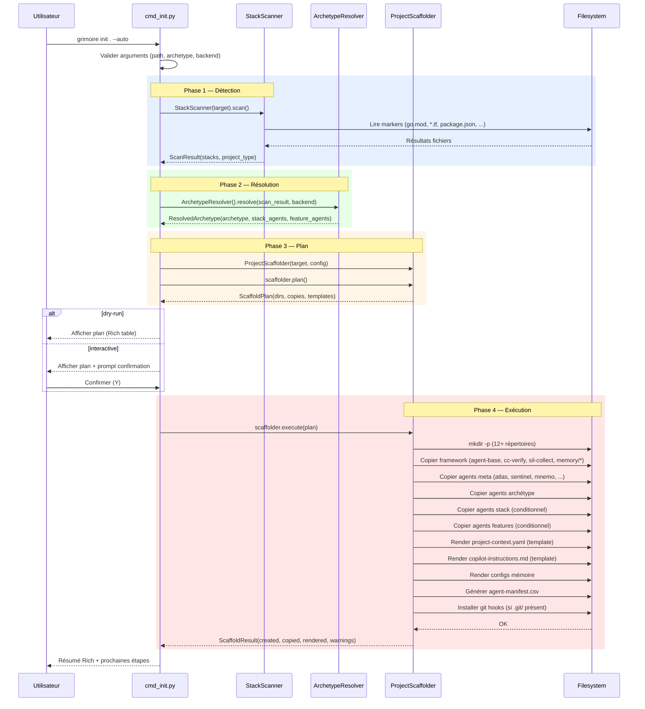

# ADR-004 — Portage de grimoire-init.sh vers la CLI Python

| Champ | Valeur |
|---|---|
| **Statut** | Proposé |
| **Date** | 2026-03-24 |
| **Auteur** | Winston (Architect) |
| **Contexte** | Portage complet de la logique d'installation bash → CLI typer+rich |
| **Réversibilité** | Haute — le bash reste fonctionnel pendant la transition |

---

## 1. Contexte

`grimoire-init.sh` est un script monolithique de ~3200 lignes qui :

- Détecte le stack technique du projet cible
- Sélectionne automatiquement l'archétype optimal
- Scaffolde la structure complète `_grimoire/` (agents, mémoire, configs, workflows, hooks)
- Génère `project-context.yaml`, `.github/copilot-instructions.md`, manifests
- Installe des agents stack et features conditionnellement

La CLI Python actuelle (`grimoire init`) ne fait que créer un `project-context.yaml` vide avec 3 répertoires. L'objectif : que `grimoire init .` produise un projet **vivant** — identique en sortie au bash.

### Atouts existants côté Python

| Composant | État | Réutilisable |
|---|---|---|
| `core/scanner.py` — `StackScanner` | Complet, plus riche que le bash (scoring, evidence) | Oui, tel quel |
| `archetypes/__init__.py` — `bundled_path()` | `importlib.resources` vers archetypes bundlés | Oui |
| `pyproject.toml` — `force-include` archetypes | Archetypes dans le wheel via hatch | Oui, à étendre pour framework |
| `core/config.py` — `GrimoireConfig` | Dataclass complète, parse + validate | Oui |
| `cli/cmd_setup.py` — sync configs | Check/apply des UserValues dans les modules | Oui |

---

## 2. Découpage en modules Python

### 2.1 Architecture cible

```
src/grimoire/
├── archetypes/
│   └── __init__.py          # bundled_path() — EXISTANT, inchangé
├── cli/
│   ├── app.py               # EXISTANT — commande `init` allégée (délègue à cmd_init)
│   ├── cmd_init.py           # NOUVEAU — orchestration du flow init enrichi
│   └── ...
├── core/
│   ├── config.py             # EXISTANT — GrimoireConfig
│   ├── scanner.py            # EXISTANT — StackScanner
│   ├── scaffold.py           # NOUVEAU — moteur de scaffolding (copie, template, manifest)
│   ├── archetype_resolver.py # NOUVEAU — mapping stack → archétype, feature agents
│   └── ...
├── data/
│   ├── __init__.py           # bundled_data_path() — accès framework bundlé
│   ├── framework/            # NOUVEAU — copie du framework installable
│   │   ├── agent-base.md
│   │   ├── cc-verify.sh
│   │   ├── sil-collect.sh
│   │   ├── memory/
│   │   ├── prompt-templates/
│   │   ├── workflows/
│   │   └── hooks/
│   └── templates/            # NOUVEAU — templates Jinja-free (str.format / ruamel)
│       ├── project-context.tpl.yaml
│       ├── copilot-instructions.tpl.md
│       ├── shared-context.tpl.md
│       ├── session-state.tpl.md
│       └── memory-config.tpl.yaml
└── ...
```

### 2.2 Responsabilités par module

#### `core/archetype_resolver.py` — Résolution déclarative stack → archétype

```python
"""Mapping déclaratif : scan result → archétype + agents stack + agents features."""

@dataclass(frozen=True, slots=True)
class ResolvedArchetype:
    """Résultat de la résolution d'archétype."""
    archetype: str                          # "infra-ops", "web-app", "minimal"
    stack_agents: tuple[str, ...]           # ("terraform-expert.md", "k8s-expert.md")
    feature_agents: tuple[str, ...]         # ("vectus.md",) si backend sémantique
    reason: str                             # explication lisible

class ArchetypeResolver:
    """Résout l'archétype optimal depuis un ScanResult."""

    # Mapping déclaratif — chargé depuis archetype-rules.yaml (extensible)
    # ou hardcodé avec override YAML possible.

    ARCHETYPE_RULES: list[tuple[frozenset[str], str]] = [
        (frozenset({"terraform"}), "infra-ops"),
        (frozenset({"kubernetes"}), "infra-ops"),
        (frozenset({"ansible"}), "infra-ops"),
        (frozenset({"react", "python"}), "web-app"),
        (frozenset({"vue", "python"}), "web-app"),
        (frozenset({"react", "go"}), "web-app"),
        # ... fallback: "minimal"
    ]

    STACK_AGENT_MAP: dict[str, str] = {
        "go": "go-expert.md",
        "react": "typescript-expert.md",
        "vue": "typescript-expert.md",
        "javascript": "typescript-expert.md",
        "typescript": "typescript-expert.md",
        "python": "python-expert.md",
        "docker": "docker-expert.md",
        "terraform": "terraform-expert.md",
        "kubernetes": "k8s-expert.md",
        "ansible": "ansible-expert.md",
    }

    FEATURE_AGENT_MAP: dict[frozenset[str], list[str]] = {
        frozenset({"qdrant-local", "qdrant-server", "ollama"}): ["vectus.md"],
    }

    def resolve(self, scan: ScanResult, backend: str = "local") -> ResolvedArchetype:
        ...
```

**Pourquoi un module séparé plutôt qu'intégré dans scanner.py ?** Scanner = détection pure (aucune opinion). Resolver = décision d'architecture (opinion forte, extensible). Séparation des concerns.

#### `core/scaffold.py` — Moteur de scaffolding

```python
"""Scaffold un projet Grimoire complet depuis une configuration résolue."""

@dataclass
class ScaffoldPlan:
    """Plan d'exécution — liste des actions à réaliser."""
    directories: list[Path]
    file_copies: list[tuple[Path, Path]]    # (source, destination)
    templates: list[tuple[Path, Path, dict[str, str]]]  # (tpl, dest, vars)
    post_actions: list[str]                 # descriptions des actions post-scaffold

@dataclass
class ScaffoldResult:
    """Résultat de l'exécution du scaffold."""
    created_dirs: list[str]
    copied_files: list[str]
    rendered_templates: list[str]
    warnings: list[str]

class ProjectScaffolder:
    """Orchestre le scaffolding complet d'un projet Grimoire."""

    def __init__(self, target: Path, config: InitConfig) -> None: ...

    def plan(self) -> ScaffoldPlan:
        """Génère le plan sans écrire — pour dry-run et tests."""

    def execute(self, plan: ScaffoldPlan | None = None) -> ScaffoldResult:
        """Exécute le plan (ou le génère puis l'exécute)."""

    # ── Étapes internes ──
    def _scaffold_directories(self) -> list[Path]: ...
    def _copy_framework(self) -> list[Path]: ...
    def _copy_meta_agents(self) -> list[Path]: ...
    def _copy_archetype_agents(self) -> list[Path]: ...
    def _copy_stack_agents(self, agents: tuple[str, ...]) -> list[Path]: ...
    def _copy_feature_agents(self, agents: tuple[str, ...]) -> list[Path]: ...
    def _render_project_context(self) -> Path: ...
    def _render_copilot_instructions(self) -> Path: ...
    def _render_memory_configs(self) -> Path: ...
    def _generate_manifest(self) -> Path: ...
    def _install_git_hooks(self) -> list[Path]: ...
```

**Design critique** : le `ScaffoldPlan` est un objet de données intermédiaire. Cela permet :

- `--dry-run` : afficher le plan sans exécuter
- Tests : inspecter le plan sans toucher le filesystem
- JSON output : sérialiser le plan pour CI/CD

#### `cli/cmd_init.py` — Commande CLI `init` enrichie

```python
"""Commande grimoire init — point d'entrée CLI pour le scaffolding."""

@dataclass
class InitConfig:
    """Configuration complète pour l'init, agrégée depuis CLI + auto-détection."""
    target: Path
    project_name: str
    user_name: str
    language: str
    archetype: str
    backend: str
    auto_detect: bool
    force: bool
    dry_run: bool
    # Résultats de l'auto-détection (remplis si auto_detect=True)
    scan_result: ScanResult | None = None
    resolved: ResolvedArchetype | None = None

def run_init(ctx: typer.Context, cfg: InitConfig) -> None:
    """Flow principal — appelé depuis app.py."""
    # 1. Auto-détection (si --auto)
    # 2. Résolution d'archétype
    # 3. Confirmation interactive (si mode interactif)
    # 4. Plan de scaffold
    # 5. Exécution (ou dry-run)
    # 6. Résumé Rich
```

### 2.3 Modules existants — modifications

| Module | Modification |
|---|---|
| `cli/app.py` | La fonction `init()` délègue à `cmd_init.run_init()`. Le template YAML inline est supprimé. |
| `core/scanner.py` | Aucune modification. Parfait tel quel. |
| `archetypes/__init__.py` | Aucune modification. |
| `cli/cmd_setup.py` | Appelé en post-scaffold pour sync des config.yaml. |

---

## 3. Stratégie de distribution — Package Data

### 3.1 Le problème

Le package pip doit inclure :

1. **Archetypes** (~50 fichiers .md, .yaml, .dna.yaml) — déjà inclus via `force-include`
2. **Framework** (~80 fichiers .md, .sh, .py, .yaml, templates) — **PAS encore inclus**
3. **Templates** (project-context.tpl.yaml, copilot-instructions.tpl.md, etc.) — **PAS encore inclus**

### 3.2 Options considérées

| Option | Mécanisme | Avantages | Inconvénients |
|---|---|---|---|
| **A. force-include étendu** | `[tool.hatch.build.targets.wheel.force-include]` ajoute `framework → grimoire/data/framework` | Simple, fonctionne, pas de dépendance | Framework dupliqué dans le tree (source + wheel) |
| **B. Package `grimoire.data` natif** | Copier framework/ dans `src/grimoire/data/framework/` et le commit | Un seul source of truth | Duplication git du framework, merge conflicts |
| **C. Symlink + build hook** | Symlink `src/grimoire/data/framework → ../../framework`, build hook pour résoudre | Pas de duplication | Fragile, Windows-hostile, hatch hooks complexes |

### 3.3 Décision : Option A — force-include étendu

**Rationale** : C'est l'approche "boring technology" qui fonctionne déjà pour les archetypes. Le framework source reste dans `framework/`, et hatch le copie automatiquement dans le wheel sous `grimoire/data/framework/`. Zéro duplication dans git, zéro configuration complexe.

```toml
# pyproject.toml — ajout
[tool.hatch.build.targets.wheel.force-include]
"archetypes" = "grimoire/archetypes"        # existant
"framework"  = "grimoire/data/framework"     # NOUVEAU

[tool.hatch.build.targets.sdist]
include = [
    "src/grimoire/",
    "archetypes/",
    "framework/",     # NOUVEAU
    "LICENSE",
    "README.md",
    "CHANGELOG.md",
    "pyproject.toml",
]
```

### 3.4 Accès runtime aux données bundlées

```python
# src/grimoire/data/__init__.py
"""Accès aux données bundlées (framework, templates)."""

from importlib.resources import files
from pathlib import Path


def framework_path() -> Path:
    """Chemin vers le framework bundlé dans le package."""
    return Path(str(files("grimoire.data") / "framework"))


def templates_path() -> Path:
    """Chemin vers les templates bundlés."""
    return Path(str(files("grimoire.data") / "templates"))
```

### 3.5 Gestion des paths — le pont bash↔Python

| Contexte | Mécanisme bash | Mécanisme Python |
|---|---|---|
| Localiser le kit | `SCRIPT_DIR="$(cd "$(dirname "$0")" && pwd)"` | `importlib.resources.files("grimoire.data")` |
| Localiser les archetypes | `$SCRIPT_DIR/archetypes/` | `grimoire.archetypes.bundled_path()` |
| Localiser le framework | `$SCRIPT_DIR/framework/` | `grimoire.data.framework_path()` |
| Chemin projet cible | `$TARGET_DIR` | argument `path: Path` de la commande |

**Invariant** : tout fichier copié vers le projet cible utilise des chemins relatifs. Le scaffolder ne produit jamais de chemins absolus dans les fichiers générés.

---

## 4. Architecture de la commande `init` enrichie

### 4.1 Modes d'exécution

| Mode | Activation | Comportement |
|---|---|---|
| **Express** | `grimoire init . --auto` | Détecte tout, scaffolde sans question |
| **Paramétré** | `grimoire init . -a web-app -b qdrant-local --name "Mon App"` | Prend ce qu'on lui donne |
| **Interactif** | `grimoire init .` (sans flags) | Prompts Rich pour chaque choix |
| **Scriptable** | `grimoire init . -o json -y --auto` | JSON output, pas de prompt, exit code |
| **Dry-run** | `--dry-run` (combinable avec tout) | Affiche le plan, n'écrit rien |

### 4.2 Détection du mode

```python
def _detect_mode(ctx: typer.Context, cfg: InitConfig) -> str:
    """Détermine le mode d'exécution."""
    if cfg.dry_run:
        return "dry-run"
    if ctx.obj.get("output") == "json":
        return "scriptable"
    if cfg.auto_detect:
        return "express"
    if cfg.archetype != "minimal" or cfg.project_name:
        return "parametric"
    return "interactive"
```

### 4.3 Flow interactif (Rich prompts)

```
grimoire init .

🔍 Analyse du répertoire...
  Stack détecté : python (95%), docker (70%), terraform (80%)
  Type de projet : infrastructure

📦 Archétype recommandé : infra-ops
  Alternatives : minimal, platform-engineering
  → Votre choix [infra-ops] :

👤 Configuration utilisateur :
  → Nom du projet [mon-projet] :
  → Votre nom [] :
  → Langue [Français] :

🧠 Backend mémoire :
  Détection... qdrant détecté sur localhost:6333
  → Backend [qdrant-local] :

📋 Plan d'installation :
  ├── 12 répertoires à créer
  ├── 6 agents meta (Atlas, Sentinel, Mnemo, ...)
  ├── 8 agents infra-ops
  ├── 3 agents stack (python, docker, terraform)
  ├── 1 agent feature (vectus — vector-memory)
  ├── Framework complet (scripts, templates, workflows)
  └── Configs + manifests

  → Confirmer ? [Y/n] :

✅ Projet initialisé : mon-projet
  Config  : /path/to/project-context.yaml
  Agents  : 18 installés
  Mémoire : qdrant-local
```

### 4.4 Séquence de fallbacks

```
CLI flags → auto-détection → prompt interactif → valeurs par défaut
```

Si `--auto` est passé, chaque valeur non fournie en flag est résolue par auto-détection. Si pas `--auto` et pas interactif (mode scriptable), les défauts s'appliquent.

---

## 5. Extensibilité — Nouveaux archétypes et stacks

### 5.1 Convention over configuration

Un archétype est un répertoire dans `archetypes/` avec cette structure :

```
archetypes/
└── mon-archetype/
    ├── archetype.dna.yaml     # Métadonnées (obligatoire)
    ├── agents/                # Agents .md à copier
    │   └── *.md
    ├── workflows/             # Workflows optionnels
    ├── shared-context.tpl.md  # Template de contexte partagé (optionnel)
    └── hooks/                 # Post-install hooks (optionnel, futur)
```

**Pour ajouter un archétype** : créer le répertoire + `archetype.dna.yaml`. Le resolver et le scaffolder le découvriront automatiquement via scan filesystem.

### 5.2 Découverte dynamique des archétypes

```python
# Dans archetype_resolver.py
def discover_archetypes(archetypes_root: Path) -> dict[str, ArchetypeMeta]:
    """Scanne archetypes/ et retourne les métadonnées de chaque archétype."""
    result = {}
    for d in archetypes_root.iterdir():
        if not d.is_dir() or d.name.startswith((".", "_")):
            continue
        dna = d / "archetype.dna.yaml"
        if dna.is_file():
            result[d.name] = ArchetypeMeta.from_dna(dna)
        else:
            # Archétype sans DNA — toléré avec warning
            result[d.name] = ArchetypeMeta(id=d.name, name=d.name, agents=_list_agents(d))
    return result
```

### 5.3 Pour ajouter un nouveau stack

Ajouter un fichier `archetypes/stack/agents/{lang}-expert.md` + le `.dna.yaml` correspondant. Puis ajouter l'entrée dans `_FILE_MARKERS` de `scanner.py` et dans `STACK_AGENT_MAP` du resolver.

**Futur** : les mappings pourraient être externalisés dans un `stack-mappings.yaml` pour ne plus toucher au code, mais c'est du over-engineering pour l'instant. Les stacks changent rarement.

---

## 6. Testabilité

### 6.1 Stratégie de test — 3 niveaux

| Niveau | Quoi | Comment | Fixture |
|---|---|---|---|
| **Unit** | `ArchetypeResolver.resolve()` | In-memory, pas de filesystem | `ScanResult` fabriqué |
| **Unit** | `ProjectScaffolder.plan()` | Filesystem en lecture seule | `tmp_path` + structure minimale |
| **Integration** | `ProjectScaffolder.execute()` | Écriture dans `tmp_path` | Archetypes/framework réels |
| **CLI** | `grimoire init .` | `typer.testing.CliRunner` + `tmp_path` | Projet vide dans tmpdir |

### 6.2 Fixtures pytest

```python
# conftest.py

@pytest.fixture
def minimal_kit(tmp_path: Path) -> Path:
    """Crée une structure de kit minimale pour les tests scaffold."""
    # Crée archetypes/minimal/agents/ avec un agent stub
    # Crée archetypes/meta/agents/ avec 3 agents meta stub
    # Crée framework/ avec les fichiers essentiels (stubs)
    ...
    return tmp_path

@pytest.fixture
def scan_result_infra() -> ScanResult:
    """ScanResult pré-fabriqué pour un projet infra."""
    return ScanResult(
        stacks=(
            StackDetection("terraform", 0.9, ("*.tf",)),
            StackDetection("docker", 0.7, ("Dockerfile",)),
        ),
        project_type="infrastructure",
        root=Path("/fake"),
    )
```

### 6.3 Test du scaffold sans filesystem réel

Le `ScaffoldPlan` est une pure data structure. On peut le tester entièrement sans écrire sur disque :

```python
def test_scaffold_plan_infra(minimal_kit, scan_result_infra):
    cfg = InitConfig(target=minimal_kit, archetype="infra-ops", ...)
    scaffolder = ProjectScaffolder(minimal_kit, cfg)
    plan = scaffolder.plan()

    assert len(plan.directories) >= 10
    assert any("agents" in str(d) for d in plan.directories)
    assert any("infra" in str(src) for src, _ in plan.file_copies)
```

### 6.4 Test CLI end-to-end

```python
def test_init_express(tmp_path, monkeypatch):
    monkeypatch.chdir(tmp_path)
    runner = CliRunner()
    result = runner.invoke(app, ["init", ".", "--auto", "--name", "test", "-y"])
    assert result.exit_code == 0
    assert (tmp_path / "project-context.yaml").exists()
    assert (tmp_path / "_grimoire" / "_config" / "custom" / "agents").is_dir()
```

---

## 7. Résolution du problème "package data"

### 7.1 Fichiers non-Python dans le wheel

| Type | Exemples | Inclus par |
|---|---|---|
| `.md` | agent-base.md, agents, templates | `force-include` via hatch |
| `.sh` | cc-verify.sh, sil-collect.sh, hooks | `force-include` via hatch |
| `.yaml` | archetype.dna.yaml, config templates | `force-include` via hatch |
| `.py` | maintenance.py, session-save.py dans framework | `force-include` via hatch |
| `.tpl.md/.tpl.yaml` | Templates de rendu | Dossier `data/templates/` |

### 7.2 `importlib.resources` — la bonne approche

Depuis Python 3.9+, `importlib.resources.files()` est le mécanisme standard. Il fonctionne :

- En editable install (`pip install -e .`) → pointe vers les sources
- En wheel install → pointe vers site-packages
- En zipapp → extrait au besoin

Chaque sous-package de données a un `__init__.py` pour être un package Python valide :

```
src/grimoire/data/__init__.py
src/grimoire/data/framework/     ← vide à la source (hatch inject depuis framework/)
src/grimoire/data/templates/     ← templates de rendu
```

### 7.3 Développement local (editable install)

En mode `pip install -e .`, `force-include` ne s'applique pas. Deux contraintes :

1. `grimoire.archetypes.bundled_path()` → fonctionne car `archetypes/` est copié dans `src/grimoire/archetypes/` au build. Mais en editable, il pointe vers le package source qui est vide.

**Solution** : fallback development-mode dans les fonctions d'accès aux données :

```python
def framework_path() -> Path:
    """Chemin vers le framework bundlé — avec fallback dev-mode."""
    pkg_path = Path(str(files("grimoire.data") / "framework"))
    if pkg_path.is_dir() and any(pkg_path.iterdir()):
        return pkg_path
    # Fallback : chercher à la racine du repo (editable install)
    repo_root = Path(__file__).resolve().parents[3]  # src/grimoire/data → repo root
    candidate = repo_root / "framework"
    if candidate.is_dir():
        return candidate
    raise FileNotFoundError("Framework data not found — broken install?")
```

> **Note** : `grimoire.archetypes.bundled_path()` a déjà ce pattern implicitement car hatch copie les archetypes dans le wheel. En editable, il faudra le même fallback.

---

## 8. Diagramme de séquence



---

## 9. Décisions architecturales critiques

### ADR-004a : Template engine

| Option | Avantage | Inconvénient |
|---|---|---|
| **Jinja2** | Puissant, standard | Dépendance supplémentaire (refusée) |
| **str.format()** | Zero-dep, Python natif | Pas d'itération, pas de conditionnels |
| **string.Template** | Zero-dep, safe ($var) | Limité mais suffisant |
| **ruamel.yaml pour YAML + str.format() pour .md** | Mixte, chaque outil sur son terrain | Deux mécanismes |

**Décision** : `string.Template` (safe_substitute) pour les `.md` et `.tpl.md`, `ruamel.yaml` (déjà en dépendance) pour les `.yaml`. Pas de nouvelle dépendance.

**Réversibilité** : Élevée — on peut migrer vers Jinja2 en ajoutant la dep plus tard.

---

### ADR-004b : Copie fichiers vs génération dynamique

| Option | Description |
|---|---|
| **Copie brute** (`shutil.copy2`) | Comme le bash — copie les fichiers sources tels quels |
| **Render-always** | Tout passe par un template engine, même les fichiers bruts |

**Décision** : copie brute par défaut, template rendering uniquement pour les fichiers avec `.tpl.` dans le nom ou les fichiers YAML de config. C'est ce que fait le bash et ça minimise les bugs de rendering.

---

### ADR-004c : Détection du backend mémoire

Le bash fait des `curl` vers localhost:6333 (qdrant) et localhost:11434 (ollama). En Python, on pourrait :

| Option | Mécanisme | Avantage | Inconvénient |
|---|---|---|---|
| **A. urllib.request** | stdlib, timeout court | Zero dep | Code plus verbeux |
| **B. subprocess curl** | Identique au bash | Parité parfaite | Dépend de curl |
| **C. Socket probe** | `socket.connect_ex()` | Plus rapide, zero dep | Teste le port, pas le service |

**Décision** : Option A — `urllib.request.urlopen` avec timeout de 2 secondes, dans un `try/except`. Zero dépendance, fiable, testable (mockable).

```python
def detect_memory_backend() -> str:
    """Détecte le backend mémoire disponible localement."""
    import urllib.request
    import urllib.error

    probes = [
        ("http://localhost:6333/healthz", "qdrant-local"),
        ("http://localhost:11434/api/tags", "ollama"),
    ]
    for url, backend in probes:
        try:
            urllib.request.urlopen(url, timeout=2)  # noqa: S310 — localhost only
            return backend
        except (urllib.error.URLError, OSError):
            continue
    return "local"
```

> **Sécurité** : les URLs sont hardcodées et locales (localhost). Pas de SSRF possible — aucune URL user-controlled.

---

### ADR-004d : Parité bash ↔ Python pendant la transition

**Décision** : les deux outils coexistent. `grimoire-init.sh` reste fonctionnel. La CLI Python est le nouveau chemin par défaut. On ne supprime le bash que quand la parité est prouvée par les tests.

**Marqueur de transition dans les fichiers générés** :

```yaml
# Installé par Grimoire Kit (Python CLI)
grimoire_kit_version: "X.Y.Z"
installer: "python-cli"  # vs "bash-script" pour l'ancien
```

---

## 10. Plan d'implémentation (séquence de PRs)

| PR | Contenu | Risque | Pré-requis |
|---|---|---|---|
| **PR-1** | `core/archetype_resolver.py` + tests unitaires | Bas | — |
| **PR-2** | `data/__init__.py` + templates + `pyproject.toml` force-include framework | Moyen | PR-1 |
| **PR-3** | `core/scaffold.py` + tests d'intégration avec `tmp_path` | Moyen | PR-2 |
| **PR-4** | `cli/cmd_init.py` — remplacement du init actuel | Moyen | PR-3 |
| **PR-5** | Mode interactif (Rich prompts) | Bas | PR-4 |
| **PR-6** | Tests CLI end-to-end + parité vérifiée vs bash | Bas | PR-5 |
| **PR-7** | Documentation + deprecation warning dans grimoire-init.sh | Bas | PR-6 |

---

## 11. Invariants non négociables

1. **Zero nouvelle dépendance** — tout avec typer, rich, ruamel.yaml
2. **`--dry-run` sur tout** — chaque commande destructive a un preview
3. **JSON output** — `-o json` fonctionne pour chaque mode (CI/CD first)
4. **Idempotence** — `grimoire init . --force` peut être relancé sans casser
5. **Pas de réseau obligatoire** — la détection mémoire est opportuniste, jamais bloquante
6. **Tests sans réseau** — mock urllib pour les probes mémoire
7. **Framework source inchangé** — on ne modifie pas `framework/` pour plaire au packaging

---

## 12. Risques identifiés

| Risque | Probabilité | Impact | Mitigation |
|---|---|---|---|
| `force-include` framework trop gros dans le wheel | Moyenne | Faible | Mesurer la taille, exclure `__pycache__`, `.pyc` |
| Editable install cassé (framework path) | Haute | Moyen | Fallback dev-mode dans `data/__init__.py` |
| Templates `.tpl.md` avec caractères spéciaux | Basse | Faible | `safe_substitute` ignore les placeholders inconnus |
| Parité imparfaite bash↔Python | Moyenne | Moyen | Tests de comparaison diff sur la sortie des deux |
| Scanner trop agressif (faux positifs) | Basse | Faible | Le scanner existant a un seuil de confiance à 0.3 |
