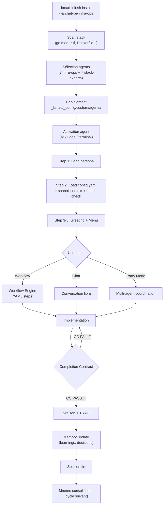
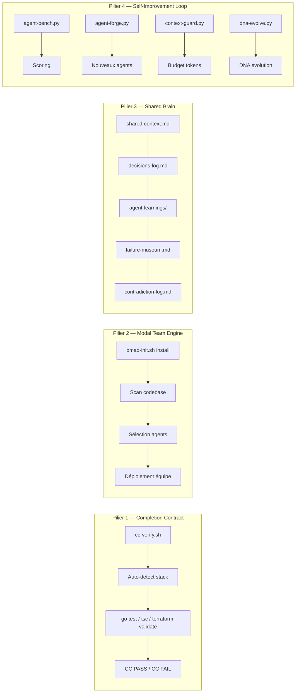
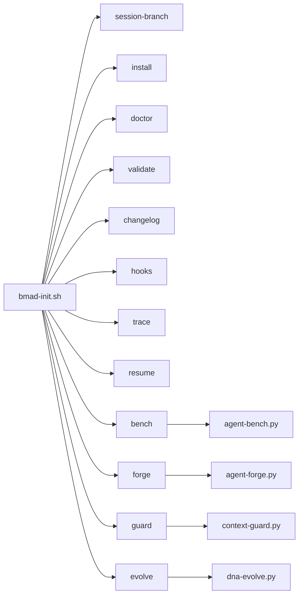
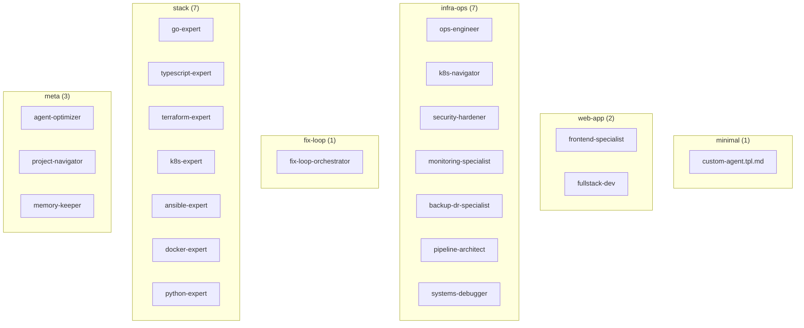
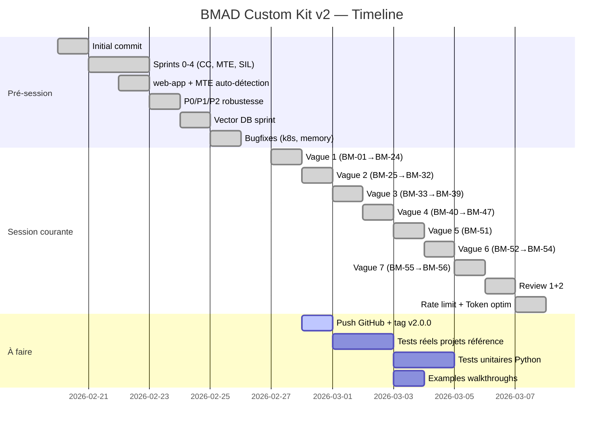

# BMAD Custom Kit v2 — Rapport de Statut Complet

> **Date** : 28 février 2026  
> **Auteur** : Amelia (Dev Agent) pour Guilhem  
> **Branche** : `main` — 18 commits (11 non-pushés)  
> **Référence** : PRD-bmad-custom-kit-v2.md

---

## 1. Vue d'ensemble du projet

### Chiffres clés

| Métrique | Valeur |
|---|---|
| **Fichiers** | 131 (hors .git et __pycache__) |
| **Lignes de code** | ~24 984 |
| **Commits** | 18 (7 anciens + 11 session courante) |
| **Tickets couverts** | BM-01 → BM-56 |
| **Archétypes** | 6 (minimal, web-app, infra-ops, fix-loop, stack, meta) |
| **Agents spécialisés** | 21 |
| **Outils Python** | 5 (bench, forge, guard, evolve, gen-tests) |
| **DNA files** | 11 |
| **Git hooks** | 6 |
| **Workflows framework** | 8 |

### Répartition du code

```
  framework/    12 605 lignes  (50%)  ← cœur du kit
  archetypes/    6 816 lignes  (27%)  ← agents & DNA
  bmad-init.sh   1 778 lignes  ( 7%)  ← CLI principal
  docs/          1 762 lignes  ( 7%)  ← documentation
  .vscode/         722 lignes  ( 3%)  ← intégration IDE
  .github/         749 lignes  ( 3%)  ← CI/CD + templates
  autres           552 lignes  ( 3%)  ← README, LICENSE, etc.
```

---

## 2. Architecture du système

### Diagramme de structure

```
bmad-custom-kit/
├── bmad-init.sh                    ← CLI principal (12 subcommands)
├── project-context.tpl.yaml        ← Template de configuration projet
├── README.md                       ← Documentation publique
├── CONTRIBUTING.md                 ← Guide contribution
│
├── archetypes/                     ← Équipes d'agents pré-configurées
│   ├── minimal/                    │  1 agent template
│   ├── web-app/                    │  2 agents (frontend, fullstack)
│   ├── infra-ops/                  │  7 agents (ops, k8s, security, monitoring...)
│   ├── fix-loop/                   │  1 agent + workflow boucle fermée
│   ├── stack/                      │  7 experts (go, ts, tf, k8s, ansible, docker, python)
│   ├── meta/                       │  3 agents (optimizer, navigator, memory-keeper)
│   └── features/                   │  1 feature (vector-memory / Vectus)
│
├── framework/                      ← Cœur technique
│   ├── agent-base.md               │  Protocole commun (CC, modes, mémoire)
│   ├── agent-rules.md              │  Règles strictes de comportement
│   ├── cc-reference.md             │  Référence CC détaillée (on-demand)
│   ├── cc-verify.sh                │  Script de vérification auto-détection stack
│   ├── context-router.md           │  Routage de contexte inter-agents
│   ├── agent2agent.md              │  Protocole Agent-to-Agent
│   ├── bmad-trace.md               │  Convention BMAD_TRACE
│   ├── delivery-contract.tpl.md    │  Template contrat de livraison
│   ├── archetype-dna.schema.yaml   │  Schéma JSON pour DNA
│   ├── team-manifest.schema.yaml   │  Schéma pour manifestes d'équipe
│   │
│   ├── tools/                      │  Outils CLI Python
│   │   ├── agent-bench.py          │  Benchmarking d'agents
│   │   ├── agent-forge.py          │  Forge de nouveaux agents
│   │   ├── context-guard.py        │  Budget de contexte LLM
│   │   ├── dna-evolve.py           │  Évolution DNA depuis l'usage
│   │   ├── gen-tests.py            │  Génération de tests
│   │   ├── bmad-completion.zsh     │  Auto-completion Zsh
│   │   └── README.md               │  Documentation des outils
│   │
│   ├── hooks/                      │  6 Git hooks
│   ├── memory/                     │  Système mémoire (backends, bridge, maintenance)
│   ├── workflows/                  │  8 workflows framework
│   ├── teams/                      │  3 équipes pré-définies
│   ├── prompt-templates/           │  10 templates de prompts
│   ├── sessions/                   │  Gestion de sessions
│   ├── registry/                   │  Registre d'agents
│   ├── mcp/                        │  Serveur MCP
│   └── copilot-extension/          │  Extension Copilot
│
├── docs/                           ← Documentation humaine
│   ├── getting-started.md
│   ├── archetype-guide.md
│   ├── creating-agents.md
│   ├── memory-system.md
│   ├── troubleshooting.md
│   └── workflow-design-patterns.md
│
├── .github/                        ← GitHub integration
│   ├── copilot-instructions.md     │  Instructions Copilot (chaque requête)
│   ├── workflows/                  │  3 CI workflows (validate, release, weekly-bench)
│   ├── ISSUE_TEMPLATE/             │  2 templates (bug, new-archetype)
│   ├── PULL_REQUEST_TEMPLATE.md
│   └── CODEOWNERS
│
├── .vscode/                        ← IDE integration
│   ├── tasks.json                  │  33 tâches VS Code
│   ├── settings.json               │  Configuration projet
│   ├── extensions.json             │  Extensions recommandées
│   └── snippets/bmad.code-snippets │  Snippets BMAD
│
└── examples/                       ← Projets de référence
    ├── terraform-houseserver/
    └── web-app-todo/
```

### Diagramme de flux — Cycle de vie d'un agent



### Diagramme — Les 4 Piliers



### Diagramme — Pipeline CLI (`bmad-init.sh`)



---

## 3. Historique des commits

### Session courante (11 commits non-pushés)

| # | Commit | Scope | Description | Tickets |
|---|--------|-------|-------------|---------|
| 1 | `9dae0e8` | feat | BM-01→BM-24 + Qdrant StructuredMemory + Archetype DNA + install | BM-01→BM-24 |
| 2 | `7c59ad4` | feat | Agent Rules, Checkpoint ID, Tools+AC DNA, Trace, gen-tests, DAG, MCP Sampling, A2A | BM-25→BM-32 |
| 3 | `482be3d` | feat | doctor, validate, changelog, 7 stack DNA, completions, archetype-guide rewrite | BM-33→BM-39 |
| 4 | `9538bdc` | feat | hooks complets, VS Code, GitHub features | BM-40→BM-47 |
| 5 | `0929e6e` | feat | agent-bench.py + Sentinel bench-review + weekly CI | BM-51 |
| 6 | `a669595` | feat | agent-forge.py + bmad-init.sh forge + VS Code tasks | BM-52→BM-54 |
| 7 | `4b603ca` | feat | Context Budget Guard + DNA Evolution Engine | BM-55→BM-56 |
| 8 | `55a36e0` | fix | completion zsh, docs outils, CI guard, tools README | Review 1 |
| 9 | `9548455` | fix | copilot-instructions, CONTRIBUTING, snippets, docs | Review 2 |
| 10 | `d017c9f` | docs | rate limit mitigation — troubleshooting, settings | Rate limit |
| 11 | `427c7a9` | perf | optimisation tokens framework -2,646 tokens (~39%) | Perf |

### Commits pré-existants (7 sur origin/main)

| Commit | Description |
|--------|-------------|
| `0b0aea8` | Initial commit — BMAD Custom Kit v0.1.0 |
| `74ba300` | CC, Modal Team Engine, Self-Improvement Loop (Sprints 0-4) |
| `86f598c` | web-app archetype + MTE auto-détection |
| `baefc32` | P0/P1/P2 — robustesse, web-app agents, onboarding |
| `41e6418` | vector DB sprint — backends multi-sources + Vectus |
| `1191c8e` | fix(k8s): qdrant livenessProbe /healthz |
| `d25a641` | fix(memory): get_semantic_client backend-agnostic |

---

## 4. Couverture PRD — Statut par Pilier

### Pilier 1 — Completion Contract ✅ COMPLET

| Item PRD | Statut | Fichier(s) |
|---|---|---|
| Protocole CC dans agent-base.md | ✅ | `framework/agent-base.md` |
| Script vérification auto-detect stack | ✅ | `framework/cc-verify.sh` |
| Référence détaillée CC (on-demand) | ✅ | `framework/cc-reference.md` |
| DoD par type de contexte (table) | ✅ | `framework/cc-reference.md` |
| Règle non-négociable "jamais terminé sans CC" | ✅ | `framework/agent-base.md` + `agent-rules.md` |
| GitHub CI CC check | ✅ | `.github/workflows/ci-validate.yml` |

### Pilier 2 — Modal Team Engine ✅ COMPLET

| Item PRD | Statut | Fichier(s) |
|---|---|---|
| Scan automatique du stack | ✅ | `bmad-init.sh install` |
| 7 agents stack spécialisés | ✅ | `archetypes/stack/agents/` (go, ts, tf, k8s, ansible, docker, python) |
| DNA par stack | ✅ | 7 fichiers `.dna.yaml` dans `archetypes/stack/agents/` |
| Archétype infra-ops (7 agents) | ✅ | `archetypes/infra-ops/` |
| Archétype web-app (2 agents) | ✅ | `archetypes/web-app/` |
| Archétype minimal | ✅ | `archetypes/minimal/` |
| Archétype fix-loop | ✅ | `archetypes/fix-loop/` |
| Archétype meta (3 agents) | ✅ | `archetypes/meta/` |
| Équipes pré-composées | ✅ | `framework/teams/` (build, ops, vision) |
| Schema DNA YAML | ✅ | `framework/archetype-dna.schema.yaml` |

### Pilier 3 — Shared Brain ✅ COMPLET

| Item PRD | Statut | Fichier(s) |
|---|---|---|
| shared-context.md | ✅ | Template dans `bmad-init.sh install` |
| decisions-log.md | ✅ | Protocole dans `agent-base.md` |
| agent-learnings/{agent}.md | ✅ | Protocole dans `agent-base.md` |
| session-state.md | ✅ | Protocole fin de session |
| contradiction-log.md | ✅ | `framework/memory/contradiction-log.tpl.md` |
| failure-museum.md | ✅ | `framework/memory/failure-museum.tpl.md` |
| Mnemo consolidation | ✅ | `framework/memory/maintenance.py` |
| mem0-bridge.py (Qdrant) | ✅ | `framework/memory/mem0-bridge.py` |
| Backends multiples | ✅ | `framework/memory/backends/` (local, ollama, qdrant-local, qdrant-server) |
| session-save.py | ✅ | `framework/memory/session-save.py` |
| Context router | ✅ | `framework/context-router.md` |
| Agent-to-Agent protocol | ✅ | `framework/agent2agent.md` |
| MCP Server | ✅ | `framework/mcp/bmad-mcp-server.md` |

### Pilier 4 — Self-Improvement Loop ✅ COMPLET

| Item PRD | Statut | Fichier(s) |
|---|---|---|
| agent-bench.py (scoring) | ✅ | `framework/tools/agent-bench.py` (576 lignes) |
| agent-forge.py (création agents) | ✅ | `framework/tools/agent-forge.py` (926 lignes) |
| context-guard.py (budget tokens) | ✅ | `framework/tools/context-guard.py` (756 lignes) |
| dna-evolve.py (évolution DNA) | ✅ | `framework/tools/dna-evolve.py` (790 lignes) |
| gen-tests.py (génération tests) | ✅ | `framework/tools/gen-tests.py` (399 lignes) |
| guard --optimize | ✅ | Ajouté dans `context-guard.py` |
| Weekly bench CI | ✅ | `.github/workflows/weekly-bench.yml` |
| Changelog automatique | ✅ | `bmad-init.sh changelog` |

### Sprint 4 — Polish & Distribution ✅ COMPLET

| Item PRD | Statut | Fichier(s) |
|---|---|---|
| README revu (pitch, comparatif, quick-start) | ✅ | `README.md` |
| CONTRIBUTING.md | ✅ | `CONTRIBUTING.md` |
| Documentation complète | ✅ | `docs/` (6 fichiers) |
| Troubleshooting | ✅ | `docs/troubleshooting.md` |
| Examples | ✅ | `examples/` (terraform-houseserver, web-app-todo) |
| VS Code intégration | ✅ | `.vscode/` (tasks, settings, snippets, extensions) |
| GitHub templates | ✅ | `.github/` (issues, PR, CODEOWNERS, CI) |
| Zsh completion | ✅ | `framework/tools/bmad-completion.zsh` |

---

## 5. Optimisation tokens — Résultats

### Avant / Après (session courante)

| Fichier | Avant | Après | Gain tokens | % |
|---|---|---|---|---|
| `copilot-instructions.md` | 4 782 chars (1 292 tok) | 4 105 chars (1 109 tok) | **-183 tok** | -14% |
| `agent-base.md` | 11 907 chars (3 218 tok) | 9 364 chars (2 531 tok) | **-687 tok** | -21% |
| `project-context.tpl.yaml` | 8 452 chars (2 284 tok) | 1 879 chars (508 tok) | **-1 776 tok** | -78% |
| **TOTAL** | **25 141 chars (6 794 tok)** | **15 348 chars (4 148 tok)** | **-2 646 tok** | **-39%** |

### Stratégies appliquées

| # | Stratégie | Description | Impact |
|---|---|---|---|
| A | Split agent-base.md | CC détaillé extrait vers `cc-reference.md` (on-demand) | -687 tok/agent |
| B | Condenser copilot-instructions.md | Table → liste, conventions raccourcies | -183 tok/requête |
| C | Minifier project-context.tpl.yaml | 144 → 50 lignes, commentaires → one-liners | -1 776 tok/agent |
| D | `guard --optimize` | Nouveau flag pour détecter automatiquement les optimisations | Automation |

---

## 6. Inventaire complet des agents

### Par archétype



### DNA par stack

| Stack | DNA | Critères d'acceptation (blocking) | Vérifications CC |
|---|---|---|---|
| Go | `go-expert.dna.yaml` | table-driven tests, go vet, no goroutine leak | `go build && go test && go vet` |
| TypeScript | `typescript-expert.dna.yaml` | strict: true, no any, typed props | `tsc --noEmit && vitest run` |
| Python | `python-expert.dna.yaml` | type hints, ruff, pytest | `pytest && ruff check` |
| Terraform | `terraform-expert.dna.yaml` | validate + fmt, tfsec | `terraform validate && terraform fmt -check` |
| Kubernetes | `k8s-expert.dna.yaml` | resource limits, probes | `kubectl apply --dry-run=server` |
| Docker | `docker-expert.dna.yaml` | multi-stage, non-root | `docker build --no-cache` |
| Ansible | `ansible-expert.dna.yaml` | idempotent, ansible-lint | `ansible-lint && yamllint` |

---

## 7. Inventaire des outils CLI

### Subcommands `bmad-init.sh`

| Commande | Description | Dépendance |
|---|---|---|
| `session-branch` | Créer une branche de session | git |
| `install` | Installer un archétype + agents | bash |
| `doctor` | Diagnostic de l'installation | bash |
| `validate` | Valider la DNA d'un archétype | bash |
| `changelog` | Générer le changelog | git |
| `hooks` | Installer les git hooks | git |
| `trace` | Ajouter une entrée BMAD_TRACE | bash |
| `resume` | Reprendre une session | bash |
| `bench` | Benchmarker les agents | python3 |
| `forge` | Créer/proposer de nouveaux agents | python3 |
| `guard` | Analyser le budget de contexte | python3 |
| `evolve` | Faire évoluer la DNA | python3 |

### Outils Python (détail)

| Outil | Lignes | Flags principaux |
|---|---|---|
| `agent-bench.py` | 576 | `--agent`, `--detail`, `--json`, `--top`, `--model` |
| `agent-forge.py` | 926 | `--role`, `--stack`, `--install`, `--from-trace` |
| `context-guard.py` | 756 | `--agent`, `--detail`, `--model`, `--suggest`, `--optimize`, `--json` |
| `dna-evolve.py` | 790 | `--dna`, `--trace`, `--since`, `--report`, `--apply` |
| `gen-tests.py` | 399 | `--file`, `--dir`, `--framework` |

---

## 8. Intégration VS Code

| Catégorie | Quantité | Exemples |
|---|---|---|
| **Tâches** (.vscode/tasks.json) | 33 | guard, bench, forge, evolve, doctor, validate... |
| **Snippets** (.vscode/snippets/) | 12+ | bmad-agent, bmad-dna, bmad-trace, bmad-guard, bmad-evolve... |
| **Extensions recommandées** | 15+ | GitHub Copilot, YAML, Markdown, ShellCheck... |
| **Settings** | Custom | file associations, schema mappings, search exclusions |

---

## 9. CI/CD GitHub

| Workflow | Trigger | Description |
|---|---|---|
| `ci-validate.yml` | Push/PR sur main | DNA schema validation, shellcheck, guard budget check |
| `release.yml` | Tag v*.*.* | Release automatique GitHub |
| `weekly-bench.yml` | Cron weekly + manual | Bench complet tous les agents + rapport |

---

## 10. Ce qui reste à faire

### 🔴 Priorité haute — Avant release publique

| # | Tâche | Description | Effort |
|---|---|---|---|
| 1 | **Push sur GitHub** | 11 commits non-pushés sur `origin/main` | 5 min |
| 2 | **Tests réels sur projets de référence** | Valider CC sur Anime-Sama-Downloader (Go+React) et Terraform-HouseServer (Terraform+K8s+Ansible) | 2-4h |
| 3 | **Tag release v2.0.0** | Créer le tag + release notes GitHub | 15 min |
| 4 | **Remplir les examples/** | Les README dans `examples/terraform-houseserver/` et `examples/web-app-todo/` sont des placeholders — ajouter des walkthroughs complets | 1-2h |

### 🟡 Priorité moyenne — Amélioration continue

| # | Tâche | Description | Effort |
|---|---|---|---|
| 5 | **Tests unitaires Python** | Les 5 outils Python n'ont pas de tests automatisés (pytest) | 3-4h |
| 6 | **Lazy-load memory protocol** | Extraire le Memory Protocol d'agent-base.md vers un fichier on-demand (idée E du brainstorm tokens) — risque de casser le workflow mémoire | 1h |
| 7 | **Archétype `game`** | Mentionné dans le project-context type mais pas implémenté | 2h |
| 8 | **Archétype `data-pipeline`** | Mentionné dans le project-context type mais pas implémenté | 2h |
| 9 | **shellcheck clean** | Vérifier que bmad-init.sh passe shellcheck sans warnings | 30 min |
| 10 | **Complétion Bash** | Actuellement seulement Zsh — ajouter bash-completion | 1h |

### 🟢 Priorité basse — Nice to have

| # | Tâche | Description | Effort |
|---|---|---|---|
| 11 | **Extension VS Code native** | Transformer le MCP server spec en vraie extension VS Code | 8h+ |
| 12 | **Site documentation** | Générer un site avec MkDocs ou Docusaurus depuis `docs/` | 2-3h |
| 13 | **Registre communautaire** | Implémenter le registre d'agents distant (spec dans `framework/registry/README.md`) | 4h+ |
| 14 | **Docker image** | Image Docker avec tous les outils pré-installés | 1h |
| 15 | **Internationalisation** | Support anglais natif dans les agents (actuellement tout en FR) | 2-3h |
| 16 | **agent-forge --from-trace amélioré** | Analyser automatiquement les patterns de TRACE pour proposer de nouveaux agents | 2h |

### 📊 Résumé effort restant

```
Priorité haute :    ~4-6h (surtout tests réels + examples)
Priorité moyenne :  ~10h
Priorité basse :    ~20h+
────────────────────
Total estimé :      ~34-36h
```

---

## 11. Métriques de succès (PRD vs Réalité)

| Métrique | Cible PRD | Réalité actuelle | Statut |
|---|---|---|---|
| % tâches avec CC | >95% | 100% des agents ont le protocole CC | ✅ |
| Temps pour composer équipe | <1 min | `bmad-init.sh install` ~10s | ✅ |
| Contexte perdu entre sessions | Jamais | Protocole mémoire + Mnemo consolidation | ✅ |
| Contradictions auto-détectées | Oui | contradiction-log.md + mem0-bridge | ✅ |
| Setup nouveau projet | <5 min | 1 commande + config YAML | ✅ |
| Zero cloud | 100% | Tout local, MCP optionnel | ✅ |
| Zero install complexe | bash suffit | Python optionnel (tools avancés) | ✅ |
| Token overhead framework | Minimal | -39% après optimisation | ✅ |

---

## 12. Diagramme timeline du projet



---

*Document généré le 28 février 2026 — Commit HEAD: `427c7a9`*
