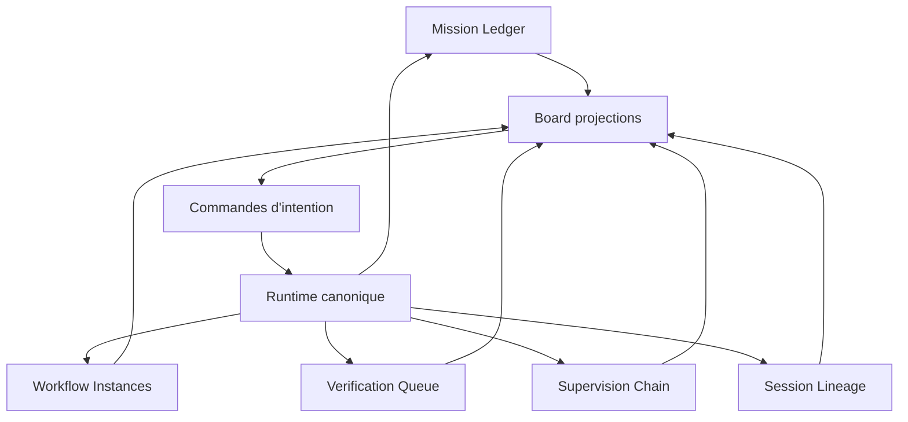

## Context

Grimoire veut absorber plusieurs patterns utiles :

- `Switchboard` pour le kanban de dispatch, les plans persistants et le routage par complexite ;
- `multiclaude` pour le superviseur de runs, le `forward progress` et la reprise pragmatique ;
- `beads` pour le ledger de travail et la lisibilite temporelle ;
- `gascity` pour la separation `recipe` / `workflow instance` ;
- `LLMSecurityGuide` pour le `least agency`, les allowlists MCP et la validation d'outputs.

Le risque principal est de construire un board brillant mais causalement faux : un kanban qui porte ses propres etats, ses propres hooks, ses propres transitions et sa propre vision du `done`, en concurrence avec le runtime et le ledger.

Le projet veut aussi permettre :

- un backlog natif editable par l'utilisateur ;
- une assignation automatique au bon agent ;
- des hooks lies au cycle de vie des tasks ;
- une integration aux flows Grimoire existants ;
- une garantie qu'aucune task ne disparaisse avant completion explicite.

## Decision

Grimoire adopte le `Mission Board` comme **projection causale et surface de commande bornee** du control plane, et non comme source de verite parallele.

### Sous-decisions structurant le produit

1. **La source de verite primaire reste hors UI**.

   Le `Mission Ledger`, les `Workflow Instances`, la `Verification Queue`, la `Supervision Chain` et le `Session Lineage` restent les plans canoniques.

2. **Le board emet des commandes d'intention, pas des mutations d'etat libres**.

   Toute action utilisateur ou systeme devient une commande validee, journalisee et appliquee par le control plane.

3. **La promesse produit correcte n'est pas un flow immortel**.

   Le systeme n'essaie pas de rendre l'execution infinie. Il interdit l'arret silencieux. Une task doit avancer, se bloquer explicitement, escalader, se mettre en pause ou etre annulee avec cause tracee.

4. **L'assignation automatique est deterministe et explicable**.

   Le routage est fonde sur une matrice `type x complexite x risque x capacites -> recipe + lane + verification profile`, versionnee et surchargeable.

5. **La cloture est fail-closed**.

   Aucun `done` sans verification acceptee, evidence rattachee et garde de cloture satisfaite. Aucune mission parente ne cloture si un enfant requis reste non terminal.

6. **La webview n'est jamais une autorite causale**.

   Le drag and drop, les colonnes et la mise en scene graphique n'ont pas le droit de definir un etat canonique par eux-memes.

## Decision detaillee

Le `Mission Board` est donc un **control plane visuel** au sens operatoire : il montre l'etat derive et permet de piloter le systeme, mais il ne peut rien savoir seul.

## Consequences

### Positives

- l'etat reste rejouable, diffable et auditable ;
- l'UX peut devenir riche sans casser le noyau ;
- la verification garde la main sur le mot `done` ;
- la supervision peut traiter les `stalls` comme incidents canoniques ;
- les hooks restent relies a des evenements stables et testables ;
- les flows existants sont reutilisables via `recipeRef` au lieu d'etre remplaces.

### Negatives

- la V1 demande plus de rigueur qu'un simple board local ;
- certaines interactions spectaculaires, comme le drag and drop direct, doivent etre degradees en commandes validees ;
- la specification du contrat de task, des read models et des guards devient incontournable ;
- une partie des benefices n'est visible qu'apres la mise en place du trio ledger, workflow instances, verification queue.

### Trade-offs assumés

- on accepte un peu plus de structure pour eviter une double source de verite ;
- on privilegie la causalite et la fiabilite sur la demonstration rapide ;
- on absorbe des patterns externes, pas leurs dependances ni leur vocabulaire produit.

## Alternatives considerees

### Alternative A - Cloner Switchboard comme board intelligent autonome

Rejetee.

Cette option accelere la demo, mais cree immediatement une concurrence entre etat UI, etat runtime et etat de verification. Elle favorise les hooks UI, les transitions opaques et les divergences silencieuses.

### Alternative B - Garder un backlog simple sans control plane visuel

Rejetee.

Cette option minimise la complexite initiale, mais ne repond ni au besoin d'operabilite, ni au besoin de causalite visible, ni a la supervision de flux multi-agents.

### Alternative C - Laisser le chat piloter tout le systeme sans board principal

Rejetee.

Le chat reste une interface puissante, mais n'offre pas a lui seul une lecture causale continue des dependances, des incidents, des verifications et des missions parentes.

### Alternative D - Faire du board une projection causale a commandes bornees

Retenue.

Cette option respecte la these Grimoire-first, garde la verification comme verrou de realite, et permet une DA forte sans perdre l'ancrage systeme.

## Impacts attendus sur le programme

- renforcement direct de `GTA-TKT-001`, `GTA-TKT-003`, `GTA-TKT-008`, `GTA-TKT-009`, `GTA-TKT-011` et `GTA-TKT-012` ;
- creation d'une famille de tasks dediees au backlog natif, au routage causal et au plane de hooks ;
- obligation de documenter la matrice de routage et les gardes de cloture avant une UI avancee ;
- cadrage de la DA du board autour des rooms Grimoire, sans glissement vers un dashboard SaaS generique.

## Guardrails non negociables

1. Si le board sait quelque chose que le ledger, les workflow instances, la verification queue ou la supervision ne savent pas, l'architecture derive deja.
2. Si une cloture peut se produire sans `verification.accepted`, le board ment.
3. Si une task peut disparaitre sans etat terminal ou incident explicite, le control plane est incomplet.
4. Si l'assignation automatique ne peut pas etre expliquee en une rationale lisible, elle doit etre consideree comme non fiable.

## Status

`PROPOSED`

Cette decision devient `ACCEPTED` lorsque :

- la spec `Mission Board` est figee au niveau du contrat de task, des colonnes derivees et des guards de cloture ;
- la matrice de routage minimale est versionnee ;
- un scenario e2e `create -> qualify -> route -> run -> verify -> close or reopen` passe sans etat parallele UI.
