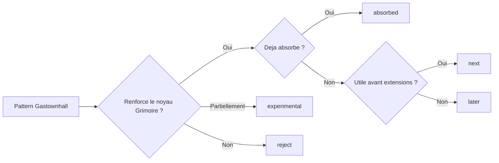
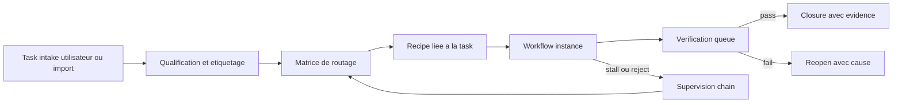

# Features et Tasks - Adaptation Gastownhall -> Grimoire

## But

Recenser toutes les features Gastownhall qui valent une absorption dans Grimoire, distinguer ce qui est deja integre de ce qui reste a prendre, puis preparer un backlog de tasks directement actionnable.

Cet artefact complete le plan directeur et les tickets existants. Il ne remplace ni [PLAN-adaptation-gastownhall-grimoire.md](./PLAN-adaptation-gastownhall-grimoire.md), ni [TICKETS-adaptation-gastownhall-grimoire.md](./TICKETS-adaptation-gastownhall-grimoire.md).

## Artefacts complementaires

- [DOC-TECHNIQUE-adaptation-gastownhall-grimoire.md](./DOC-TECHNIQUE-adaptation-gastownhall-grimoire.md)
- [GUIDE-utilisation-adaptation-gastownhall-grimoire.md](./GUIDE-utilisation-adaptation-gastownhall-grimoire.md)
- [SPEC-mission-board-grimoire.md](./SPEC-mission-board-grimoire.md)
- [ADR-007-mission-board-control-plane-causal.md](./ADR-007-mission-board-control-plane-causal.md)
- [VISUAL-BRIEF-mission-board-grimoire.md](./VISUAL-BRIEF-mission-board-grimoire.md)
- [UX-MAP-mission-board-grimoire.md](./UX-MAP-mission-board-grimoire.md)
- [MOTION-SPEC-mission-board-grimoire.md](./MOTION-SPEC-mission-board-grimoire.md)
- [CONTRAT-mission-board-grimoire.md](./CONTRAT-mission-board-grimoire.md)
- [DOC-TECHNIQUE-mission-board-grimoire.md](./DOC-TECHNIQUE-mission-board-grimoire.md)
- [GUIDE-utilisation-mission-board-grimoire.md](./GUIDE-utilisation-mission-board-grimoire.md)
- [PLAN-implementation-mission-board-grimoire.md](./PLAN-implementation-mission-board-grimoire.md)
- [MATRICE-verification-mission-board-grimoire.md](./MATRICE-verification-mission-board-grimoire.md)
- [SUITE-tests-mission-board-grimoire.md](./SUITE-tests-mission-board-grimoire.md)
- [WIREFRAMES-mission-board-grimoire.md](./WIREFRAMES-mission-board-grimoire.md)
- [LIVRABLE-FINAL-mission-board-grimoire.md](./LIVRABLE-FINAL-mission-board-grimoire.md)

## Regles de tri

- `absorbed` : la primitive est deja materialisee ou solidement engagee dans le code et les read models.
- `next` : la primitive est interessante, utile maintenant, et merite un paquet de travail proche.
- `later` : la primitive est utile mais doit attendre la fermeture du front `contrat -> preuve -> cockpit minimal`.
- `experimental` : la primitive a de la valeur seulement comme extension optionnelle.
- `reject` : la primitive ou sa forme source ne doit pas entrer dans le noyau Grimoire.

## Decision finale retenue

- Priorite de cette tranche : `memoire, contexte et tokens` avant marketplace, federation ou inflation de surfaces.
- Spine canonique retenue : `Mission Ledger` + `Workflow Instances` + `Verification Queue` + `Session Lineage`.
- `Redis` et `Qdrant` restent des backplanes optionnels, jamais des sources de verite paralleles.
- Le package doit rester executable avec ou sans MCP : meme contrat metier, transport different seulement.

## Tranche finale retenue

| Tranche | Contenu | Resultat attendu |
| --- | --- | --- |
| `T0` | `Mission Ledger`, `Workflow Instances`, `Pack Registry`, `Session Lineage` | spine contractuelle rejouable et lisible sans transcript brut |
| `T1` | `Seance`, `Memory Context`, progressive disclosure, `Qdrant` optionnel, `Redis` optionnel | rappel borne, etat chaud explicite et parite MCP / CLI/API |
| `T2` | `Verification Queue`, supervision, evidence et escalation | progression fail-closed et blocages visibles |
| `T3` | surfaces operatoires board et backlog natif | cockpit causal utilisable sans source de verite parallele |
| `T4` | marketplace puis commons experimental | externalisation gouvernee sans contaminer le noyau |

## Inventaire complet des features absorbables

| Source Gastownhall | Feature source | Traduction Grimoire cible | Statut | Ancrage principal |
| --- | --- | --- | --- | --- |
| `beads` | Unites structurees de travail, preuve et memoire | `Mission Ledger` | absorbed | `GTA-TKT-001`, `GTA-TKT-002` |
| `gastown` | Regroupement de travail oriente workspace | `Mission Bundle` | next | extension `GTA-01` |
| `gascity` | Separation `recipe` / execution | `Workflow Instance` et `Recipe` | next | `GTA-TKT-003` |
| `gascity` | Checkpoints et reprise de runs | `Workflow checkpoints` et `resume context` | next | `GTA-TKT-003` |
| `witness / deacon / dogs` | Triage, health et escalation | `Supervision Chain` | next | `GTA-TKT-008` |
| `refinery` | File de verification explicite | `Verification Queue` | absorbed | `GTA-TKT-009` |
| `refinery` | Verification reliee a la cloture de branche | `Branch Finisher` durci | absorbed | `GTA-TKT-010`, `GTA-TKT-012` |
| `refinery` | Verdicts, attestations et evidence lies | `Evidence Pack` + `Verification Trust` | absorbed | `GTA-TKT-010` |
| `seance` | Genealogie et interrogation de sessions closes | `Session Lineage` + surface `Seance` read-only | next | `GTA-TKT-006`, `GTA-TKT-007` |
| `gascity-packs` | Manifest de pack versionne | `Pack Registry` | absorbed | `GTA-TKT-004` |
| `gascity-packs` | `includes`, `requires`, `overlays`, `policies`, `tests` | Composition de packs gouvernee | absorbed | `GTA-TKT-005` |
| `gascity-packs` | Materialisation deterministe | `pack.lock.json` et fingerprint | absorbed | `GTA-TKT-005` |
| `marketplace` | Catalogue publiable et installable | `Verified Marketplace` | absorbed | `GTA-TKT-013` |
| `marketplace` | Gates de publication, install et compatibilite | `Pack install/publish gates` | next | `GTA-TKT-014` |
| `stamps / trust tiers` | Signaux de confiance sur preuves et livrables | `Attestations` et `Verification Trust` non sociaux | next | extension `GTA-TKT-010` / `GTA-TKT-014` |
| `gascity-otel` | Export observabilite vers stack externe | `OTEL adapter` borne sur events canoniques | later | extension plan directeur |
| `wasteland` | Federation optionnelle | `Grimoire Commons` | experimental | `GTA-TKT-015`, `GTA-TKT-016` |
| `tmux-adapter` | Isolation shell/workspace par multiplexage | Inspiration de cadrage seulement | reject | rejet explicite du plan |
| `Dolt` et backend source | Ledger relationnel impose | Adaptateur eventuel, jamais noyau | reject | rejet explicite du plan |
| Vocabulaire produit source | `Mayor`, `Gas Town`, `Gas City`, `Wasteland` comme canon produit | Traduction Grimoire-native uniquement | reject | these Grimoire-first |

## Etat actuel dans Grimoire

### Deja absorbé ou fortement engagé

- `Mission Ledger` et ses projections runtime.
- `Pack Registry` avec validation, resolution, overlays et lock deterministe.
- `Session Lineage` sur les sessions et traces existantes.
- `Verification Queue`, `Evidence Pack`, `Library`, `Supervision` et `Branch Finisher` cote runtime.
- `Verified Marketplace` au niveau contrat et generation de catalogue.

### Encore intéressantes a prendre rapidement

- `Mission Bundle` pour regrouper plusieurs items sous un objectif operatoire coherent.
- `Workflow Instance` avec checkpoints, reprise et comparaison de runs.
- `Supervision Chain` avec vraie file d'incidents, severites et escalades.
- `Seance` read-only pour interroger des sessions closes sans transcript brut.
- `Pack install/publish gates` pour rendre le marketplace fail-closed.
- `Verification Trust` comme lecture compacte de la force de preuve, sans basculer dans la reputation sociale.

### A garder pour plus tard

- `OTEL adapter` sur la spine evenementielle canonique, une fois les contrats stabilises.
- Surfaces dediees packs/policies dans le board au-dela du minimum deja present.

### A garder experimentales seulement

- `Grimoire Commons` et toute federation inter-projets.

### A ne pas importer comme tel

- `tmux`, `git worktree`, `Dolt` et toute hypothese de backend impose.
- Le vocabulaire produit Gastownhall comme surface user-facing.
- Toute gamification sociale des stamps ou trust tiers.

## Features recommandées par ordre de valeur

| Rang | Feature | Pourquoi maintenant | Parent |
| --- | --- | --- | --- |
| 1 | Pack install/publish gates | Le contrat marketplace existe deja, il faut maintenant le rendre bloqueur et explicable | `GTA-TKT-014` |
| 2 | Supervision Chain | Le runtime a les surfaces, mais pas encore la file unifiee d'incidents et d'escalades | `GTA-TKT-008` |
| 3 | Workflow Instance | Le lineage est utile, mais il manque encore la vraie reprise d'execution | `GTA-TKT-003` |
| 4 | Surface `Seance` | Le board gagnera une lecture inter-session beaucoup plus solide | `GTA-TKT-007` |
| 5 | Mission Bundle | Permet de lire les travaux multi-items comme un objectif coherent | extension `GTA-01` |
| 6 | Verification Trust | Compacte la chaine preuve -> verdict -> attestation pour l'operateur | extension `GTA-TKT-010` |
| 7 | OTEL adapter borne | Ouvre l'observabilite externe sans reouvrir la causalite interne | extension later |
| 8 | Commons experimental | Peut ouvrir un terrain de federation, mais uniquement hors noyau | `GTA-TKT-015`, `GTA-TKT-016` |

## Apports complementaires hors Gastownhall

Les references `multiclaude`, `Switchboard` et `LLMSecurityGuide` ne changent pas la these du plan. Elles l'affinent.

| Source | Pattern utile | Traduction Grimoire cible | Tickets parents |
| --- | --- | --- | --- |
| `multiclaude` | Superviseur de runs, health loop, nudge loop, reprise pragmatique | `Supervision Chain` + `Workflow Instances` avec etat persistant minimal | `GTA-TKT-008`, `GTA-TKT-003` |
| `Switchboard` | Plan persistant, kanban de dispatch, routage par complexite | `Mission Ledger` + `Operator Surfaces` + classes de complexite | `GTA-TKT-011`, `GTA-TKT-012` |
| `LLMSecurityGuide` | OWASP Agentic, least agency, MCP allowlist, memory poisoning | `Pack policies` + `Verification Queue` + supervision securite | `GTA-TKT-005`, `GTA-TKT-008`, `GTA-TKT-009`, `GTA-TKT-010` |
| `Redis` | Etat chaud, locks distribues, TTL, streams, Pub/Sub et buffers courts | `Hot State Plane` optionnel pour heartbeats, leases, rate limits et event bus runtime | `GTA-TKT-003`, `GTA-TKT-008`, `GTA-TKT-012` |
| `Qdrant` | Memoire semantique, collections, payload filters et recall vectoriel | `Semantic Recall Plane` pour `Memory Context`, `Seance` et lecture inter-session bornee | `GTA-TKT-006`, `GTA-TKT-007`, `GTA-TKT-009` |

## Redis et Qdrant comme backplanes optionnels

Ces deux briques renforcent la these du plan a condition de rester des backplanes optionnels ou des `Tool Providers`, jamais des sources de verite concurrentes du `Mission Ledger`, du `Context Ledger` ou des artefacts canoniques.

| Brique | Role nominal | Mode MCP | Mode restreint CLI/API | Ce que la brique ne doit pas devenir |
| --- | --- | --- | --- | --- |
| `Redis` | etat chaud runtime, locks, leases, heartbeats, rate limits, streams et buffers de travail | adaptateur ou serveur MCP quand l'hote l'autorise | `redis-cli` ou client SDK avec les memes cles canoniques, TTL et garde-fous | source canonique des decisions, missions, preuves ou resume durable |
| `Qdrant` | memoire semantique, recall contextuel, payload filters et recherche vectorielle | serveur MCP Qdrant ou wrapper MCP Grimoire | `grimoire memory`, client Python ou REST API via `qdrant-local` ou `qdrant-server` | store unique d'un fait stable sans pointeur vers doc, runtime ou ledger |

- `Redis` a la meilleure affinite avec la retention chaude et l'execution courte : locks avec expiration, heartbeats, files d'attente ephemeres, rate limits, event bus et conversation history courte via streams. Le pattern pertinent est donc `runtime hot state`, pas `memoire projet canonique`.
- `Qdrant` a la meilleure affinite avec la memoire semantique durable et les recalls filtres : collections, payload metadata, recherche vectorielle et retrieval progressif. Le pattern pertinent est donc `semantic recall plane`, pas `source de verite documentaire`.
- En environnement `MCP restrained`, le produit ne doit pas bifurquer. Seul le transport change : meme contrat metier, memes identifiants (`missionId`, `taskId`, `traceId`, `memoryRef`), meme politique de provenance et meme policy fail-closed.
- Pour `Qdrant`, le depot est deja aligne avec cette direction via [memory-system.md](../../grimoire-kit/docs/memory-system.md), qui expose `qdrant-local`, `qdrant-server`, la recherche progressive et la CLI `grimoire memory`.
- Pour `Redis`, la bonne posture est de le traiter comme plugin ou provider optionnel, conforme a [plugin-development.md](../../grimoire-kit/docs/plugin-development.md), puis de lui donner un double acces `MCP` ou `CLI/API` sans coupler le runtime a la disponibilite d'un host MCP.
- Les deux briques doivent rester subordonnees au noyau causal : si `Redis` ou `Qdrant` est indisponible, vide ou interdit par policy, Grimoire degrade vers `in-process`, `local` ou JSON fallback sans changer la these produit ni perdre la source canonique.

## Decorticage critique de l'idee: vers un Mission Board natif

L'idee est directionnellement juste, mais sa forme brute doit etre corrigee. Ce que Grimoire doit absorber de Switchboard, multiclaude et de Gastownhall n'est pas un kanban qui pilote par lui-meme. C'est un control plane causal ou backlog, dispatch, hooks, workflow instances, preuve et verification racontent la meme histoire.

### Ce qu'il faut garder, corriger ou refuser

| Element de l'idee | Verdict | Traduction Grimoire recommandee | Pourquoi |
| --- | --- | --- | --- |
| Backlog editable nativement par l'utilisateur | garder fort | `Mission Backlog` branche sur le `Mission Ledger` | C'est la bonne porte d'entree pour rendre le board operatoire et non purement observatoire |
| Assignation automatique au bon agent | garder sous contrat | matrice de routage explicable `type x complexite x risque x capacites -> recipe + lane` | Une heuristique opaque cree des comportements non rejouables et impossibles a debugger |
| Flow qui ne peut pas s'arreter tant que tout nest pas termine | reformuler fortement | invariant `no silent stall, no premature closure` avec `blocked`, `escalated`, `paused` et `cancelled` explicites | Interdire tout arret est mauvais ; interdire l'arret silencieux est la bonne contrainte |
| Hooks sur les taches | garder mais borner | hooks canoniques derives des evenements runtime et du ledger | Un hook branche sur la seule UI devient du theatre d'automatisation |
| Nouveaux flows selon les types de taches | garder avec discipline | petite famille de recipes et profiles de verification, pas une inflation de workflows | Sinon le systeme devient inmaintenable et chaque ticket exige sa propre liturgie |
| Tickets classiques avec labels et options | garder et enrichir | labels, type, priorite, severite, dependances, acceptation, profil de preuve, pack policy, flow hint | Les metadata PM seules ne suffisent pas a piloter une execution agentique |
| Design board specifique | garder | cockpit mystique et technique Grimoire-first | Le board doit etre lisible a 1x et raconter les roles, etats et actions avant toute decoration |

### These produit recommandee

1. La source de verite reste `Mission Ledger` + `Workflow Instances` + `Verification Queue` + `Session Lineage`.
2. Une task est un contrat executable, pas juste une carte de backlog.
3. Le board est une projection et une surface de commande bornees par des evenements canoniques.
4. L'orchestrateur route vers une lane specialisee a partir d'une matrice explicable, jamais par intuition cachee.
5. La supervision garantit la progression: une task avance, se bloque explicitement, escalade ou est annulee, mais ne disparait jamais dans une zone grise.

### Contrat de task backlog recommande

| Champ | Role operatoire | Note |
| --- | --- | --- |
| `taskId` | identite stable et addressable | requis pour ledger, board et lineage |
| `title` | lecture immediate | doit rester court et actionnable |
| `description` | contexte de travail | supporte format libre ou template |
| `labels[]` | filtrage et categorisation | syntaxe user-friendly, gouvernance stable |
| `type` | choix de recipe | ex: `research`, `architecture`, `implementation`, `incident`, `documentation`, `security`, `asset` |
| `priority` et `severity` | arbitrage operatoire | garder des enums bornes |
| `complexity` | routage et gates | derivee ou validee lors de la qualification |
| `dependencies[]` | ordre causal | jamais seulement visuel |
| `acceptance_criteria[]` | definition d'acceptation | reliees a la verification |
| `evidence_profile` | niveau de preuve attendu | ex: `light`, `standard`, `strict`, `security_critical` |
| `flow_hint` | proposition initiale de flow | aide, mais ne remplace pas le routage |
| `policy_pack` | policies et contraintes associees | utile pour securite, packs et extensions |
| `origin` | provenance de la task | `user`, `import`, `runtime`, `self-heal`, `verification` |
| `owner_kind` | type de responsable courant | `human`, `agent`, `system` |

### Matrice de routage recommandee

| Signal principal | Recipe ou flow prioritaire | Lane specialisee | Gate minimale |
| --- | --- | --- | --- |
| `research` ou `discovery` | cadrage puis synthese | `analyst` ou `pm` | hypothese, sources, decision proposee |
| `architecture` | review structurelle puis plan | `architect` puis challenge cible | ADR ou decision explicite |
| `implementation` standard | recipe d'implementation avec verification | `dev` ou `quick-flow-solo-dev` | tests ou preuve de comportement |
| `incident` ou `regression` | incident response + debug | `dev` + supervision | cause, mitigation, non-regression |
| `documentation` | documentation engineering | `tech-writer` | clarte, references, structure |
| `security` | review securite + verification renforcee | lane securite et verification | controles appliques et traces |
| `asset` ou `ux` | pipeline visuel gouverne | `ux-designer` ou `art-director` | lisibilite, palette, integration room |

### Hooks canoniques a introduire

| Hook | Declencheur | Usage |
| --- | --- | --- |
| `task.created` | creation manuelle ou import | normaliser labels, type, origine et profil minimal |
| `task.qualified` | qualification finie | calculer complexite, risque et lanes candidates |
| `task.assigned` | task routee | lier recipe, pack policy et verification profile |
| `workflow.started` | instance lancee | ouvrir heartbeat, checkpoint et trace runtime |
| `checkpoint.missed` | heartbeat absent ou etape stale | emettre incident, nudge ou reassignation |
| `verification.failed` | gate refusee | reouvrir la task avec `evidence gap` explicite |
| `task.blocked` | dependance, policy ou evidence manquante | calculer action suivante ou escalation |
| `mission.closure.requested` | tentative de fermeture parent | bloquer si une task obligatoire reste non terminale |
| `task.closed` | verification acceptee | archiver preuve, lineage et projections board |

### L'invariant correct de non-arret

Le systeme ne doit pas chercher un flow immortel. Il doit chercher un flow incapable de mourir silencieusement.

| Etat | Autorise | Condition |
| --- | --- | --- |
| `completed` | oui | verification acceptee et evidence rattachee |
| `blocked` | oui | cause, dependance et action suivante explicites |
| `escalated` | oui | destinataire et motif explicites |
| `paused` | oui | pause traquee et reversible |
| `cancelled` ou `quarantined` | oui | raison explicite et tracee |
| `unknown`, `silent`, `stalled` sans incident | non | doit etre remappe vers supervision |
| `done` sans verification fraiche | non | refus fail-closed |
| fermeture de mission avec enfant obligatoire ouvert | non | blocage automatique |

La bonne promesse produit n'est donc pas: "le flow ne peut jamais s'arreter". La bonne promesse est: "aucune task ni mission critique ne peut sortir du radar sans etat terminal explicite, preuve ou escalation".

### Integration aux flows Grimoire deja disponibles

| Famille de task | Reuse prioritaire | Ce qu'il faut ajouter |
| --- | --- | --- |
| cadrage et recherche | `grimoire-brainstorming`, `grimoire-product-discovery` | intake backlog et evidence profile `research` |
| architecture | `grimoire-architecture-review`, `grimoire-writing-plans` | routing critique et challenge systematique sur decisions structurantes |
| implementation | `grimoire-writing-plans`, `grimoire-subagent-dev`, `grimoire-verification` | binding task -> recipe -> workflow instance |
| debug et incident | `grimoire-systematic-debugging`, `grimoire-incident-response` | hooks de stall et taxonomie d'incidents |
| documentation | `grimoire-documentation-engineering` | acceptation documentaire et provenance des sources |
| securite | `grimoire-security-review`, `grimoire-verification` | policies fail-closed et evidence securite |
| assets et UI | `grimoire-2d-asset-pipeline`, `grimoire-visual-orchestration` | gates de lisibilite, palette et room integration |

### Direction DA et UX Grimoire-native

- Le board doit ressembler a un systeme d'exploitation agentique installe dans un bureau mystique et technique, conformement au guide visuel Grimoire.
- Les cartes doivent privilegier `Paper` et `Ink`, avec usage semantique de `Storm` pour runtime, `Verdigris` pour handoff, `Brass` pour verification acceptee, `Ember` pour incident ou refus, `Memory` pour lineage et seance.
- Les rooms et surfaces peuvent etre specialisees sans casser le noyau: `Intake Desk`, `War Room`, `Workshop`, `Branch Finisher`, `Seance Archive`, `Watchtower`.
- La motion doit rester semantique: tether directionnel pour handoff, convergence ou divergence pour memory read or write, flash serre pour reject, jamais de pluie gratuite de particules.
- Le board doit rester lisible a l'echelle 1x: silhouette claire, badge simple, statuts immediats, pas de surcharge SaaS ou de gamification sociale.

### Angles morts et risques a contenir

- Cloner Switchboard trop litteralement produirait une deuxieme source de verite concurrente du runtime.
- Trop de hooks sans canon d'evenements creerait une chaine fragile et opaque.
- Une auto-assignation sans matrice explicite serait spectaculaire en demo mais difficile a fiabiliser.
- Un backlog "classique" sans profil de preuve ni lien aux flows reduirait Grimoire a un simple ticketing board.
- Un board trop joli mais peu causal contredirait directement la these du cockpit minimal et explicable.

## Backlog de tasks preparees

## Paquet A - Packs gouvernes et fail-closed

| Task | Parent | Resultat attendu | Dependances | Gate |
| --- | --- | --- | --- | --- |
| `GTA-TASK-001` | `GTA-TKT-014` | Ajouter un evaluateur de compatibilite `core version -> pack version -> surfaces` reutilisable par install et publish | contrat marketplace existant | Un pack incompatible retourne des raisons lisibles et deterministes |
| `GTA-TASK-002` | `GTA-TKT-014` | Refuser l'installation d'un pack sans lock valide ou avec fingerprint divergent | `GTA-TASK-001` | Le mode install est fail-closed sur lock absent ou mismatch |
| `GTA-TASK-003` | `GTA-TKT-014` | Produire un rapport de publication listant provenance, statut, compatibilite, policies et tests manquants | `GTA-TASK-001` | Un pack non publishable expose des raisons exhaustives |
| `GTA-TASK-004` | `GTA-TKT-014` | Ajouter un mode `dry-run` d'installation avec diff des composants, overlays et policies materialises | `GTA-TASK-002` | L'operateur peut voir le perimetre exact sans write |
| `GTA-TASK-005` | `GTA-TKT-014` | Exposer dans le catalogue `official/community/experimental/internal` comme statuts de distribution, sans ambiguite produit | `GTA-TASK-003` | Le catalogue ne masque jamais provenance ni statut |
| `GTA-TASK-006` | `GTA-TKT-014` | Ajouter une projection read-only packs/policies minimale pour l'operateur | `GTA-TASK-004` | Une installation ou publication peut etre comprise sans lire le JSON brut |

## Paquet B - Supervision Chain operatoire

| Task | Parent | Resultat attendu | Dependances | Gate |
| --- | --- | --- | --- | --- |
| `GTA-TASK-007` | `GTA-TKT-008` | Definir la taxonomie d'incidents `alert`, `blocked`, `escalated`, `noise`, `stale`, `rejected` | aucune | Toute alerte projetable rentre dans une categorie canonique |
| `GTA-TASK-008` | `GTA-TKT-008` | Mapper `preflight`, `quick-check`, `memory-lint`, `self-heal`, runtime errors et verification rejects sur cette taxonomie | `GTA-TASK-007` | Les checks existants se projettent dans une file unique |
| `GTA-TASK-009` | `GTA-TKT-008` | Introduire des politiques d'escalade et de relance par severite | `GTA-TASK-008` | Un incident critique pointe toujours vers une action suivante |
| `GTA-TASK-010` | `GTA-TKT-008` | Construire la vue `supervision queue` avec bruit filtre, contexte et blocage explicite | `GTA-TASK-009` | Le board distingue bruit, blocage et escalation |
| `GTA-TASK-011` | `GTA-TKT-008` | Ajouter des scenarios de preuve `stuck`, `stall`, `reject`, `replay drift` | `GTA-TASK-010` | Les principaux incidents sont rejouables dans les tests |

## Paquet C - Workflow Instances et reprise

| Task | Parent | Resultat attendu | Dependances | Gate |
| --- | --- | --- | --- | --- |
| `GTA-TASK-012` | `GTA-TKT-003` | Definir le contrat `recipe` vs `workflow instance` avec etats, checkpoints et artefacts lies | aucune | L'instance se distingue clairement du workflow source |
| `GTA-TASK-013` | `GTA-TKT-003` | Lier `workflow instance` a `missionId`, `taskId`, `traceId`, `verificationRef` et `evidenceRef` | `GTA-TASK-012` | Une execution se reconstruit sans inference libre |
| `GTA-TASK-014` | `GTA-TKT-003` | Ajouter `resume context`, retries et abort causes dans le modele | `GTA-TASK-013` | Une reprise n'introduit pas de duplication d'effet |
| `GTA-TASK-015` | `GTA-TKT-003` | Projeter les instances dans le board et l'investigation sans logique metier parallele | `GTA-TASK-014` | Le cockpit peut lire les checkpoints et la divergence de runs |
| `GTA-TASK-016` | `GTA-TKT-003` | Ajouter la suite de tests `resume`, `abort`, `duplicate`, `divergence` | `GTA-TASK-015` | La reprise est testee end-to-end |

## Paquet D - Seance et lecture inter-session

| Task | Parent | Resultat attendu | Dependances | Gate |
| --- | --- | --- | --- | --- |
| `GTA-TASK-017` | `GTA-TKT-007` | Definir le contrat read-only de requete `session -> run -> trace -> mission -> evidence` | `GTA-TKT-006` | Aucune mutation possible via la surface |
| `GTA-TASK-018` | `GTA-TKT-007` | Supporter les filtres par mission, run, trace, agent et tag | `GTA-TASK-017` | Une session close se requete sans transcript complet |
| `GTA-TASK-019` | `GTA-TKT-007` | Ajouter une reponse compacte `qui a decide quoi, quand, sur quelle preuve` | `GTA-TASK-018` | La reponse est derivee du lineage et du ledger, pas d'un resume libre |
| `GTA-TASK-020` | `GTA-TKT-007` | Integrer `Seance` dans une surface board minimale ou Library read-only | `GTA-TASK-019` | L'operateur peut naviguer des sessions closes depuis le cockpit |

## Paquet E - Extensions utiles mais non immediates

| Task | Parent | Resultat attendu | Dependances | Gate |
| --- | --- | --- | --- | --- |
| `GTA-TASK-021` | extension `GTA-01` | Ajouter `Mission Bundle` pour regrouper plusieurs items sous un meme objectif | `Mission Ledger` stable | Un bundle se lit sans casser la granularite item |
| `GTA-TASK-022` | extension `GTA-TKT-010` | Formaliser un score compact `Verification Trust` derive de preuves, controles et attestations | Evidence Pack stable | Le score reste explicable et non social |
| `GTA-TASK-023` | extension later | Exposer un adaptateur OTEL borne sur les evenements canoniques et non sur des heuristiques UI | contrats runtime stables | Aucune source externe ne devient source de verite |

## Paquet F - Orchestration observable et self-healing

| Task | Parent | Resultat attendu | Dependances | Gate |
| --- | --- | --- | --- | --- |
| `GTA-TASK-024` | `GTA-TKT-008` | Introduire un superviseur runtime avec heartbeat, health loop et nudge loop relies aux incidents canoniques | `GTA-TASK-008` | Un run stalled produit un signal, une relance et une cause explicite |
| `GTA-TASK-025` | `GTA-TKT-003` | Persister un `run state` minimal entre etapes et checkpoints pour relire la progression sans transcript | `GTA-TASK-013` | L'operateur peut comparer l'etat courant au dernier checkpoint |
| `GTA-TASK-026` | `GTA-TKT-008` | Ajouter des playbooks de self-heal pour workers bloques, sessions orphelines et verification stalled | `GTA-TASK-024`, `GTA-TASK-025` | Les recuperations L1/L2 sont automatiques, bornees et tracees |
| `GTA-TASK-027` | `GTA-TKT-010` | Formaliser une discipline `forward progress` et `verification before completion` dans les verdicts de fin et la cloture des missions parentes | `GTA-TASK-009` | Un run ou une mission ne peut ni rester silencieusement stalled, ni clore tant qu'un item obligatoire reste non terminal, ni finaliser sans preuve fraiche |

## Paquet G - Control plane visuel et routage par complexite

| Task | Parent | Resultat attendu | Dependances | Gate |
| --- | --- | --- | --- | --- |
| `GTA-TASK-028` | `GTA-TKT-011` | Introduire un artefact de plan canonique par mission, lisible a la fois par le board et le runtime | `GTA-TASK-002` | Le board affiche le meme plan que le ledger |
| `GTA-TASK-029` | `GTA-TKT-012` | Ajouter les classes de complexite `trivial`, `standard`, `complex`, `expert` pour guider dispatch, review et evidence attendue | `GTA-TASK-028` | Une carte et un run exposent la meme classe de complexite |
| `GTA-TASK-030` | `GTA-TKT-012` | Implementer des transitions automatiques de colonnes derivees d'evenements canoniques, jamais de la webview seule | `GTA-TASK-028` | Le kanban n'est jamais une source de verite parallele |
| `GTA-TASK-031` | `GTA-TKT-011` | Projeter dependances, blocages et lots de verification en cartes actionnables | `GTA-TASK-029`, `GTA-TASK-030` | L'operateur voit quoi faire sans lire les logs bruts |

## Paquet H - Baseline de securite agentique

| Task | Parent | Resultat attendu | Dependances | Gate |
| --- | --- | --- | --- | --- |
| `GTA-TASK-032` | `GTA-TKT-005` | Encoder `least agency`, allowlist MCP, remote backend opt-in et denylist secrets au niveau des pack policies | `GTA-TASK-005` | Un pack sensible reste fail-closed par defaut |
| `GTA-TASK-033` | `GTA-TKT-008` | Ajouter la taxonomie OWASP LLM 2025 et Agentic 2026 aux incidents et alertes de supervision | `GTA-TASK-007` | Les incidents agentiques se classent avec un vocabulaire stable |
| `GTA-TASK-034` | `GTA-TKT-009` | Valider les outputs d'outils et les ecritures memoire avant re-injection dans une execution critique | `GTA-TASK-009` | Un output suspect bloque la transition et demande revision |
| `GTA-TASK-035` | `GTA-TKT-010` | Ajouter des evidences securite minimales pour prompt injection, memory poisoning et MCP malveillant dans l'evidence pack | `GTA-TASK-033`, `GTA-TASK-034` | Un run critique expose ses controles securite appliques |

## Paquet I - Backlog natif, dispatch causal et hook plane

| Task | Parent | Resultat attendu | Dependances | Gate |
| --- | --- | --- | --- | --- |
| `GTA-TASK-039` | `GTA-TKT-001` | Etendre le contrat task du `Mission Ledger` avec labels, type, priorite, severite, dependances, acceptation, profil de preuve, `flow_hint` et `policy_pack` | `GTA-TKT-001` | Une task saisie par l'utilisateur est executable sans prompt implicite ni champ hors contrat |
| `GTA-TASK-040` | `GTA-TKT-011` | Ajouter une surface minimale de creation et d'edition de backlog avec filtres, labels et templates de ticket | `GTA-TASK-039`, `GTA-TKT-011` | L'utilisateur peut creer une task operatoire sans toucher au JSON brut |
| `GTA-TASK-041` | `GTA-TKT-012` | Implementer une matrice de routage `type x complexite x risque x capacites -> recipe + lane + verification profile` | `GTA-TASK-039`, `GTA-TKT-003`, `GTA-TKT-012` | Le dispatch est explicable, rejouable et overrideable |
| `GTA-TASK-042` | `GTA-TKT-008` | Introduire un bus de hooks canoniques task lifecycle derive uniquement des evenements runtime et du ledger | `GTA-TASK-039`, `GTA-TKT-008` | Aucun hook critique ne depend du drag and drop UI ou d'une webview seule |
| `GTA-TASK-043` | `GTA-TKT-009` | Appliquer l'invariant `no silent stall, no premature closure` sur tasks, runs et missions parentes | `GTA-TASK-042`, `GTA-TKT-009`, `GTA-TASK-027` | Toute task ouverte avance, se bloque explicitement, escalade ou est annulee avec cause traquee |
| `GTA-TASK-044` | `GTA-TKT-003` | Lier chaque task a une `recipe` par defaut et autoriser un rebind controle lors d'un replan | `GTA-TASK-041`, `GTA-TKT-003` | Un changement de flow reste trace dans le lineage et ne casse pas la causalite |
| `GTA-TASK-045` | `GTA-TKT-012` | Ajouter les colonnes derivees `Intake`, `Qualified`, `Assigned`, `Running`, `Review`, `Verified`, `Blocked`, `Done` comme projections du ledger et de la verification queue | `GTA-TASK-040`, `GTA-TASK-041`, `GTA-TASK-042` | Le board reflete exactement le statut canonique et ne cree aucun etat parallele |
| `GTA-TASK-046` | `GTA-TKT-008` | Ajouter des playbooks de nudge, reassignation et escalation pour task stale, reject, `evidence gap` et reviewer manquant | `GTA-TASK-042`, `GTA-TASK-043` | Une task ouverte retrouve soit une lane, soit une escalation explicite |
| `GTA-TASK-047` | `GTA-TKT-012` | Integrer labels, dependances, evidence class, provenance et statut de flow dans la carte operateur selon la grammaire visuelle Grimoire | `GTA-TASK-040`, `GTA-TASK-045` | La carte suffit pour comprendre quoi faire, pourquoi, et avec quel niveau de preuve |
| `GTA-TASK-048` | `GTA-TKT-009` | Construire le scenario e2e `ticket manuel -> qualification -> dispatch -> workflow -> verification -> closure ou reopen` | `GTA-TASK-039`, `GTA-TASK-047` | Le cycle complet se rejoue sans sortie de route hors contrat |

## Paquet J - Memoire, contexte et tokens

| Task | Parent | Resultat attendu | Dependances | Gate |
| --- | --- | --- | --- | --- |
| `GTA-TASK-049` | `GTA-TKT-003` | Definir le contrat `Hot State Plane` pour leases, heartbeats, locks, rate limits et buffers courts avec baseline `in-process` | `GTA-TASK-013` | Les cles runtime chaudes ont un schema, une retention et une expiration explicites |
| `GTA-TASK-050` | `GTA-TKT-008` | Ajouter un provider `Redis` optionnel avec parite fonctionnelle MCP puis CLI/API sans changer les identifiants ni les policies | `GTA-TASK-049`, `GTA-TASK-024` | Le runtime degrade proprement sans `Redis` et aucune decision canonique ne depend du store chaud |
| `GTA-TASK-051` | `GTA-TKT-006` | Definir le contrat `Semantic Recall Plane` relie a `Session Lineage`, `memoryRef`, provenance, fraicheur et progressive disclosure `L1/L2/L3` | `GTA-TASK-017` | Une reponse de rappel expose source, niveau de detail, fraicheur et fallback |
| `GTA-TASK-052` | `GTA-TKT-007` | Brancher `Qdrant` en mode `qdrant-local` ou `qdrant-server`, avec transport MCP puis CLI/API et fallback local via `grimoire memory` | `GTA-TASK-051`, `GTA-TASK-018` | `Seance` et `Memory Context` fonctionnent en mode borne meme sans MCP |
| `GTA-TASK-053` | `GTA-TKT-009` | Ajouter des gates de verification pour provenance du recall, index stale ou vide, et blocage des reinjections douteuses dans les executions critiques | `GTA-TASK-034`, `GTA-TASK-051`, `GTA-TASK-052` | Aucun rappel externe ne peut influencer une transition critique sans preuve et sans fallback |
| `GTA-TASK-054` | `GTA-TKT-012` | Projeter la sante du `Hot State Plane` et du `Semantic Recall Plane` dans supervision, `Seance` et surfaces operateur sans transcript brut | `GTA-TASK-050`, `GTA-TASK-052`, `GTA-TASK-010`, `GTA-TASK-020` | L'operateur voit disponibilite, mode actif et degradation sans lire les logs bruts |

## Paquet X - Experimental uniquement

| Task | Parent | Resultat attendu | Dependances | Gate |
| --- | --- | --- | --- | --- |
| `GTA-TASK-036` | `GTA-TKT-015` | Definir le schema minimal `participant -> wanted item -> completion -> validation -> attestation` | noyau et packs stables | Le schema reste optionnel et hors noyau |
| `GTA-TASK-037` | `GTA-TKT-016` | Fournir un provider local fichier pour les commons | `GTA-TASK-036` | La federation locale fonctionne sans service externe |
| `GTA-TASK-038` | `GTA-TKT-016` | Exposer des vues read-only `wanted/completions/attestations` | `GTA-TASK-037` | Rien n'impose les commons aux projets qui n'en veulent pas |

## Ordre de lancement recommande

1. Paquet A - Packs gouvernes et fail-closed.
2. Paquet C - Workflow Instances et reprise.
3. Paquet D - Seance et lecture inter-session.
4. Paquet J - Memoire, contexte et tokens.
5. Paquet B - Supervision Chain operatoire.
6. Paquet H - Baseline de securite agentique.
7. Paquet F - Orchestration observable et self-healing.
8. Paquet G - Control plane visuel et routage par complexite.
9. Paquet I - Backlog natif, dispatch causal et hook plane.
10. Paquet E - Extensions utiles mais non immediates.
11. Paquet X - Experimental uniquement.

## Regles de lancement

- Aucun paquet `later` ou `experimental` ne passe devant un paquet `next` non ferme.
- Aucune task n'est `done` sans preuve exploitable rattachee au ticket parent.
- Toute absorption garde la these `Grimoire-first` et la spine `contrat -> preuve -> cockpit minimal`.
- Les hooks critiques derivent d'evenements canoniques ; ils ne prennent jamais la webview ou le drag and drop comme source de verite.
- Une auto-assignation doit toujours pouvoir etre expliquee par la matrice de routage et surchargee explicitement par l'operateur.
- Une mission ne peut pas clore tant qu'une task obligatoire reste non terminale ; inversement le systeme doit autoriser `blocked`, `paused`, `escalated` et `cancelled` comme sorties explicites.
- Les patterns `tmux`, `git worktree` et webview-kanban restent des moyens d'implementation optionnels, jamais des prerequis de produit.
- Toute feature dont la forme source impose `tmux`, `git worktree`, `Dolt` ou un vocabulaire produit concurrent reste rejetee ou traduite.
- En environnement `MCP restrained`, `Redis` et `Qdrant` restent accessibles via CLI/API ou fallback local avec le meme contrat de provenance et de verification.

## Definition of done de cet artefact

- Toutes les features Gastownhall interessantes pour Grimoire sont classees.
- Le statut `absorbed / next / later / experimental / reject` est explicite.
- Les tasks preparees sont mappees a des tickets parents deja presents dans le plan.
- L'ordre de lancement protege le front prioritaire actuel du projet.
