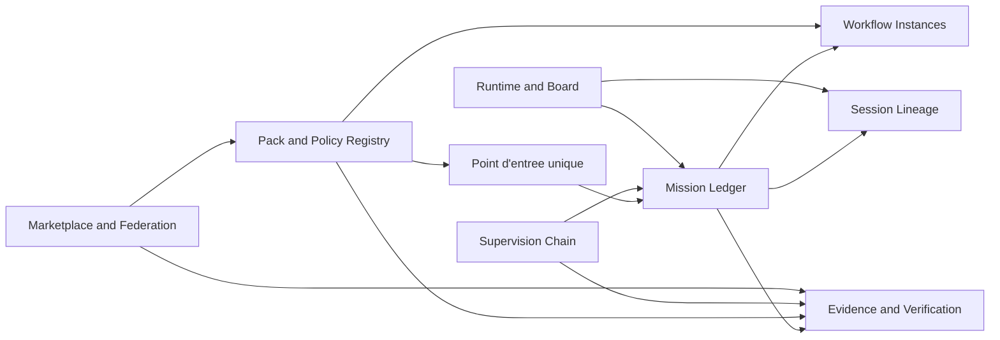

# Plan d'Adaptation Gastownhall -> Grimoire

> Projet : **Grimoire**
> Statut : **plan directeur d'adaptation**
> Positionnement : **absorber les primitives utiles de Gastownhall sans importer ses contraintes de produit, de backend ni de vocabulaire**

## 1. Objectif

Formaliser une trajectoire complete pour adapter les concepts utiles de l'ecosysteme Gastownhall dans Grimoire, en gardant une these claire :

- renforcer le noyau agentique et ses contrats ;
- rendre le board plus operatoire et plus explicable ;
- industrialiser packaging, provenance, verification et supervision ;
- preparer une eventuelle federation sans la rendre structurante trop tot.

Ce plan s'appuie sur :

- [benchmark-github-agent-os-game-ui.md](../../docs/exploitation/benchmark-github-agent-os-game-ui.md) ;
- [matrice-capabilities-agent-os-game-ui.md](../../docs/exploitation/matrice-capabilities-agent-os-game-ui.md) ;
- [plan-maitre-agent-os-game-ui.md](../../docs/exploitation/plan-maitre-agent-os-game-ui.md) ;
- [agent-frameworks.md](../../docs/references/agent-frameworks.md) ;
- [TICKETS-adaptation-gastownhall-grimoire.md](./TICKETS-adaptation-gastownhall-grimoire.md) ;
- [SPEC-mission-ledger-grimoire.md](./SPEC-mission-ledger-grimoire.md) ;
- [SPEC-pack-registry-grimoire.md](./SPEC-pack-registry-grimoire.md) ;
- [SPEC-mission-board-grimoire.md](./SPEC-mission-board-grimoire.md) ;
- [ADR-007-mission-board-control-plane-causal.md](./ADR-007-mission-board-control-plane-causal.md) ;
- [DOC-TECHNIQUE-adaptation-gastownhall-grimoire.md](./DOC-TECHNIQUE-adaptation-gastownhall-grimoire.md) ;
- [GUIDE-utilisation-adaptation-gastownhall-grimoire.md](./GUIDE-utilisation-adaptation-gastownhall-grimoire.md) ;
- [VISUAL-BRIEF-mission-board-grimoire.md](./VISUAL-BRIEF-mission-board-grimoire.md) ;
- [UX-MAP-mission-board-grimoire.md](./UX-MAP-mission-board-grimoire.md) ;
- [MOTION-SPEC-mission-board-grimoire.md](./MOTION-SPEC-mission-board-grimoire.md) ;
- [CONTRAT-mission-board-grimoire.md](./CONTRAT-mission-board-grimoire.md) ;
- [DOC-TECHNIQUE-mission-board-grimoire.md](./DOC-TECHNIQUE-mission-board-grimoire.md) ;
- [GUIDE-utilisation-mission-board-grimoire.md](./GUIDE-utilisation-mission-board-grimoire.md) ;
- [PLAN-implementation-mission-board-grimoire.md](./PLAN-implementation-mission-board-grimoire.md) ;
- [MATRICE-verification-mission-board-grimoire.md](./MATRICE-verification-mission-board-grimoire.md) ;
- [SUITE-tests-mission-board-grimoire.md](./SUITE-tests-mission-board-grimoire.md) ;
- [WIREFRAMES-mission-board-grimoire.md](./WIREFRAMES-mission-board-grimoire.md) ;
- [LIVRABLE-FINAL-mission-board-grimoire.md](./LIVRABLE-FINAL-mission-board-grimoire.md).

## 2. These de pilotage

- **Grimoire reste Grimoire-first** : Forge, runtime, board et gouvernance restent les surfaces de reference.
- **On absorbe des primitives, pas des produits** : Beads, Gas Town, Gas City et Wasteland servent de reservoir de patterns, pas de roadmap imposee.
- **Le cockpit causal et la preuve passent avant l'economie federative**.
- **Les choix de backend de Gastownhall restent optionnels** : ni `tmux`, ni `git worktree`, ni `Dolt`, ni une ergonomie CLI-first ne deviennent des prerequis du noyau.
- **Le point d'entree user-facing reste unique** : aucun doublon du role `Mayor` n'est cree cote Grimoire.
- **Tout artefact publie doit porter un statut, une provenance, une policy et une preuve**.
- **La priorite de la tranche finale reste `memoire -> contexte -> tokens`** : on sort l'etat utile du transcript le plus tot possible et on borne les surfaces de rappel.

## 3. Decisions de traduction

| Concept source | Decision | Equivalent Grimoire cible | Commentaire |
| --- | --- | --- | --- |
| Mayor | Adopter directement | `grimoire-master` | Le point d'entree unique existe deja et doit rester unique. |
| Beads | Traduire | `Mission Ledger` | Le point cle est le ledger structure, pas le backend Dolt. |
| Convoy | Traduire | `Mission Bundle` | Unite de suivi pour plusieurs items relies a un meme objectif. |
| Molecule / Formula | Traduire | `Workflow Instance` et `Recipe` | Une recette versionnee instanciee en execution tracable. |
| Witness / Deacon / Dogs | Traduire | `Supervision Chain` | Chaine interne de sante, triage, relance et escalation. |
| Refinery | Traduire | `Verification Queue` et `Branch Finisher` | Les claims `done` passent par une file de verification et de preuve. |
| Seance | Adopter fortement | `Session Lineage` | Reprise, interrogation et contextualisation des sessions precedentes. |
| Packs / Overrides | Adopter fortement | `Pack Registry` et `Overlays` | C'est la meilleure base pour distros et packaging. |
| Marketplace | Reporter | `Verified Marketplace` | A lancer seulement apres contrat de pack et politique de provenance. |
| Wasteland | Rendre experimental | `Grimoire Commons` | Federation et commons de travail, mais hors noyau initial. |
| Stamps / Trust Tiers | Reduire | `Attestations` et `Verification Trust` | D'abord des signaux de verification, pas une gamification sociale. |
| gascity-otel | Adopter partiellement | `OTEL adapter` | Seulement apres stabilisation du canon runtime et des evenements. |

## 4. Architecture cible

### 4.1 Planes a construire

| Plane | Role | Regle de conception |
| --- | --- | --- |
| `Mission Ledger` | Suivre missions, dependances, claims, preuves, escalades et attestations | Lisible machine, rejouable, versionnable, interrogeable sans transcript brut |
| `Workflow Plane` | Instancier recipes, checkpointer l'execution et suivre les etapes | Aucun workflow critique ne reste un simple texte non instancie |
| `Pack Plane` | Composer packs, overlays, providers, policies, scripts et preuves de compatibilite | Le packaging ne contourne jamais la gouvernance |
| `Lineage Plane` | Donner une genealogie session -> run -> trace -> evidence -> decision | La reprise ne depend pas d'une relecture manuelle complete |
| `Supervision Plane` | Detecter blocages, relancer, escalader, cloturer ou isoler | Les pannes agentiques deviennent visibles et routables |
| `Hot State Plane` | Porter leases, heartbeats, rate limits, locks et buffers courts | `Redis` reste optionnel, interchangeable avec `in-process`, et ne devient jamais source canonique |
| `Semantic Recall Plane` | Porter recall semantique, `Memory Context` et progressive disclosure | `Qdrant` reste optionnel, remplaçable par fallback local, et ne stocke jamais seul un fait stable |
| `Operator Plane` | Rendre tout cela operable dans le board et les vues runtime | Le board reste un cockpit causal, pas un theatre |
| `Ecosystem Plane` | Publier, distribuer, puis federer | Ne jamais preceder les contrats, la provenance et les gates |

### 4.2 Decisions structurantes

- **Persistences de base** : le noyau reste compatible avec le filesystem et les journaux existants ; un index relationnel local est autorise ; un adaptateur Dolt peut exister plus tard mais ne devient pas la base obligatoire.
- **Format des packs** : la description de pack est traduite dans un format Grimoire coherent avec le repo ; le plan recommande un manifest YAML plutot qu'un portage direct du `pack.toml` de Gas City.
- **Source de verite** : le runtime canonique reste porte par les evenements et les read models ; les plans documentaires deviennent des entrees et des projections, pas la seule source de statut.
- **Statuts** : tout pack, workflow, skill, hook ou UI surface doit afficher `stable`, `experimental` ou `internal`.
- **Backplanes optionnels** : `Redis` et `Qdrant` peuvent etre exposes via MCP quand le host l'autorise, mais doivent toujours garder un chemin compatible CLI/API ou fallback local pour les environnements `MCP restrained`.
- **Parite de contrat** : en mode MCP ou en mode CLI/API, les memes identifiants, contraintes de provenance, politiques de retention et gates de verification s'appliquent.

## 5. Workstreams d'adaptation

Les identifiants `GTA-*` evitent toute collision avec les `GM-*` deja presents dans le plan maitre.

### GTA-01 — Mission Ledger et plan de preuve

**But** : introduire une unite machine-readable commune pour mission, tache, dependance, claim, evidence, escalation et attestation.

**Scope** :

- definir le schema canonique des objets du ledger ;
- relier le ledger aux evenements runtime et aux evidences existantes ;
- relier `Mission Ledger` au `verification-view`, `task-view` et `runtime-dashboard-view` ;
- definir une surface de requete et d'export.

**Livrables** :

- schema du ledger ;
- adaptateurs d'ingestion depuis les artefacts existants ;
- projection vers les vues runtime ;
- tests de replay, idempotence et reconstruction de statut.

**Gate** : une mission critique peut etre reconstruite apres replay avec ses dependances, son evidence ref et son verdict de verification.

**Alignement Grimoire** : WS2, WS7, WS8.

### GTA-02 — Workflow instances et recipes

**But** : transformer skills, prompts et workflows repetables en executions instanciees, checkpointables et comparables.

**Scope** :

- distinguer `recipe` et `workflow instance` ;
- stocker etapes, checkpoints, retries, verdicts et artefacts ;
- relier les workflows instancies a `traceId`, `taskId` et `evidenceRef` ;
- supporter la reprise et la comparaison entre runs.

**Livrables** :

- modele d'instance de workflow ;
- projection runtime ;
- contrat de checkpoint et reprise ;
- tests de resume et de divergence.

**Gate** : un workflow interrompt puis repris garde un etat explicable et ne duplique pas ses effets.

**Alignement Grimoire** : WS2, WS5, WS8.

### GTA-03 — Packs, overlays et policy registry

**But** : doter Grimoire d'un modele de packs compose, versionnable et override-friendly, inspire de Gas City mais adapte au repo.

**Scope** :

- definir le manifest de pack ;
- supporter `includes`, `requires`, `overrides`, `overlay_dirs`, `providers`, `policies`, `tests` ;
- ajouter une notion de hash de contenu et de provenance ;
- relier les packs aux skills, hooks, workflows, prompts et assets ;
- formaliser une compatibilite `core version -> pack version`.

**Livrables** :

- spec `Pack Registry` ;
- validateur de pack ;
- strategie d'overrides ;
- matrice de compatibilite ;
- statuts `stable/experimental/internal`.

**Gate** : un pack compose avec overlay et policy reste deterministe, validable et traçable sans forker le noyau.

**Alignement Grimoire** : WS1, WS6, WS9.

### GTA-04 — Session Lineage et seance Grimoire

**But** : donner a Grimoire une vraie primitive de reprise, de genealogie et d'interrogation des sessions precedentes.

**Scope** :

- unifier `sessionId`, `runId`, `traceId`, `correlationId` et references de preuve ;
- detecter les predecesseurs d'une session ;
- supporter un mode lecture et questionnement de sessions closes ;
- relier cela a la memoire stale ou contradictoire.

**Livrables** :

- modele de lineage ;
- index des sessions ;
- surface de requete read-only ;
- regles stale-memory et conflits.

**Gate** : un operateur peut repondre a `qui a decide quoi, quand, et sur quelle preuve ?` sans relire tout le transcript.

**Alignement Grimoire** : WS8.

### GTA-05 — Chaine de supervision et escalation

**But** : transformer les checks et hooks existants en une chaine coherente de detection, triage, relance et escalation.

**Scope** :

- definir les roles internes de supervision ;
- detecter stuck agents, stalls, echec de verification, memoire incoherente, drift de config ;
- unifier health-check, self-heal, memory-lint, preflight et quick-check dans une vue de supervision ;
- ajouter des niveaux d'escalation et des actions de recuperation.

**Livrables** :

- taxonomie des incidents ;
- boucle de supervision ;
- projections UI de probleme et de triage ;
- tests de blocage et d'escalation.

**Gate** : un blocage critique remonte automatiquement vers une file explicite avec contexte, severite, cause probable et action suivante.

**Alignement Grimoire** : WS5, WS7, WS8.

### GTA-06 — Verification queue et Branch Finisher

**But** : faire passer les transitions `review -> done` et les claims de completion par une file de verification et de preuve plus forte.

**Scope** :

- unifier `verification-view`, `branch-finisher-view` et evidence packs ;
- interdire les completions sans chaines minimales de verification ;
- ajouter la notion de batch et d'isolation d'un lot defaillant ;
- preparer, plus tard, un mode bisecting sans l'imposer d'emblee.

**Livrables** :

- spec de verification queue ;
- table des verrous et verdicts ;
- automatisation d'evidence pack enrichie ;
- tests de refusal, allow et isolation.

**Gate** : un claim `done` sans preuve, sans policy ou sans verdict ne passe jamais dans l'etat final.

**Alignement Grimoire** : WS5, WS7, WS8.

### GTA-07 — Surfaces operatoires dans le board

**But** : exposer les nouvelles primitives dans le board, sans faire glisser l'UI vers un role decoratif.

**Scope** :

- `War Room` pour missions et dispatch ;
- `Library Room` pour lineage et memoire ;
- `Branch Finisher` pour verification queue ;
- vues de supervision, packs et policies ;
- vues de diff inter-sessions et causalite.

**Livrables** :

- read models cibles ;
- surface minimale de navigation ;
- contracts UI ;
- suites e2e sur scenarios critiques.

**Gate** : un utilisateur expert peut diagnostiquer une derive, verifier une completion et retrouver la provenance d'une surface sans transcript brut.

**Alignement Grimoire** : WS4, WS5, WS8.

### GTA-08 — Marketplace verifie et distribution

**But** : publier des packs et bundles Grimoire de maniere gouvernee, sans ouvrir trop vite une supply chain incontrôlee.

**Scope** :

- registre des packs verifies ;
- metadata de provenance, statut, compatibilite et tests ;
- parcours installation, upgrade, rollback et deprecation ;
- distinction entre `official`, `community`, `experimental`.

**Livrables** :

- spec de distribution ;
- conventions de publication ;
- job de validation ;
- documentation contributeur et operateur.

**Gate** : aucun pack installable ne peut masquer sa provenance, sa policy, son statut ou son perimetre de compatibilite.

**Alignement Grimoire** : WS9.

### GTA-09 — Grimoire Commons et federation experimentale

**But** : preparer une federation optionnelle inspiree de Wasteland, mais sous forme d'extension experimentale et non de noyau.

**Scope** :

- protocole minimal `participant -> wanted item -> completion -> validation -> attestation` ;
- support local d'abord, puis provider git ou remote ;
- identite portable et historique d'attestations ;
- mode experimental, sans claim public de complétude.

**Livrables** :

- schema `Commons` ;
- provider local ou fichier ;
- vues `wanted/completions/attestations` ;
- guide de non-claim et de statut experimental.

**Gate** : la federation fonctionne en perimetre borne sans rien imposer au noyau ni aux projets qui n'en veulent pas.

**Alignement Grimoire** : apres WS9, lot experimental.

## 6. Phasage recommande

### Phase A — Internaliser les primitives structurantes

- GTA-01 `Mission Ledger` ;
- GTA-02 `Workflow Instances` ;
- GTA-03 `Pack Registry`.

**Sortie attendue** : Grimoire gagne ses equivalents de Beads et Gas City sans basculer dans leur stack.

### Phase B — Rendre la machine reprenable et gouvernee

- GTA-04 `Session Lineage` ;
- GTA-05 `Supervision Chain` ;
- GTA-06 `Verification Queue`.

**Sortie attendue** : les blocages, reprises, verdicts et preuves deviennent systematiques.

### Phase C — Rendre ces primitives visibles et utilisables

- GTA-07 `Operator Surfaces` ;
- GTA-08 `Verified Marketplace`.

**Sortie attendue** : le board devient la surface naturelle d'operation, et les packs deviennent publiables sans drift.

### Phase D — Ouvrir l'ecosysteme sans casser le noyau

- GTA-09 `Grimoire Commons`.

**Sortie attendue** : federation optionnelle, locale d'abord, puis extensible.

## 7. Ordre de lancement concret

1. Verrouiller le schema du `Mission Ledger` et sa correspondance avec les vues runtime existantes.
2. Verrouiller le manifest de pack, ses overlays, ses policies et son statut.
3. Unifier les identifiants runtime et construire le `Session Lineage`.
4. Brancher un `Semantic Recall Plane` borne avec `Qdrant` ou fallback local, relie au `Session Lineage` et a la progressive disclosure.
5. Brancher un `Hot State Plane` minimal avec `in-process` par defaut et `Redis` optionnel pour leases, heartbeats, rate limits et buffers courts.
6. Construire la supervision et l'escalation sur les checks existants.
7. Unifier `Branch Finisher`, `verification-view` et `Evidence Pack`.
8. Exposer missions, preuves, supervision, recall et lineage dans le board.
9. Ouvrir la distribution de packs verifies.
10. Garder federation et commons comme lot experimental final.

## 8. Gates transverses

| Gate | Question | Evidence attendue |
| --- | --- | --- |
| `G1 Contract Gate` | Les schemas et read models reconstruisent-ils le meme etat ? | Tests contrat, replay, idempotence |
| `G2 Provenance Gate` | Toute surface activable declare-t-elle provenance, policy, statut et owner ? | Validateur de pack, metadata, review security |
| `G3 Verification Gate` | Un `done` reste-t-il prouvable et bloquable ? | Evidence pack, verification queue, verdicts |
| `G4 Lineage Gate` | Une session et sa genealogie sont-elles relisibles sans transcript complet ? | Session index, lineage query, stale-memory alerts |
| `G5 Operator Gate` | Le board augmente-t-il vraiment la comprehension et l'action ? | Scenarios e2e, walkthrough expert, audit view |
| `G6 Externalization Gate` | La distribution ou la federation restent-elles optionnelles et non-invasives ? | Compat matrix, install tests, mode experimental explicite |

## 9. Rejets explicites

- Copier directement le vocabulaire ou les abstractions publiques de Gas Town.
- Introduire `tmux`, `git worktree` ou `Dolt` comme obligations structurantes du noyau.
- Lancer un marketplace avant l'existence d'un contrat de pack valide.
- Transformer les attestations en mecanique sociale avant d'en faire des preuves operatoires.
- Ouvrir trop tot la federation inter-projets avant d'avoir un noyau, des packs et une verification stabilises.
- Diluer le board en vue generique d'observabilite externe au lieu de conserver un cockpit causal centre Grimoire.

## 10. Risques et mitigations

| Risque | Effet | Mitigation |
| --- | --- | --- |
| Sur-copie de Gastownhall | Drift produit et dette cognitive | Garder une traduction Grimoire-native et documenter les non-adoptions |
| Deux sources de verite | Conflits entre docs, runtime et ledger | Faire du ledger et des evenements le plan operatoire, les docs deviennent projections et contrats |
| Redis ou Qdrant elevés au rang de verite canonique | Drift contextuel, rappel trompeur, etats orphelins | Garder `Mission Ledger`, `Session Lineage` et les artefacts repo comme autorite ; stores externes = cache, index ou aide au rappel |
| Packaging avant gouvernance | Supply chain fragile | Gate `Provenance Gate` obligatoire avant publication |
| Lineage trop bavard | Bruit, cout, faux sentiment de comprehension | Progressive disclosure, stale-memory gates, vues specialisees |
| Federation prematuree | Scope creep et dettes ops | Maintenir GTA-09 en mode experimental, local d'abord |

## 11. Definition of done du plan

- Grimoire dispose d'un equivalent de `Beads` sous forme de ledger structure et prouvable.
- Grimoire dispose d'un equivalent de `Gas City packs` sous forme de packs, overlays, policies et compatibilite explicites.
- Grimoire dispose d'un equivalent de `Seance` pour lineage et reprise de sessions.
- Grimoire dispose d'un equivalent de `Refinery` pour verification et evidence queue.
- Le board expose missions, preuves, supervision et lineage comme surfaces operatoires natives.
- Marketplace et federation restent des extensions optionnelles et gouvernees.

## 12. Slice minimale recommandee pour lancer l'adaptation

Si l'objectif est d'ouvrir la mise en oeuvre sans disperser le repo, la premiere slice doit rester etroite :

1. `GTA-01` : schema `Mission Ledger` relie aux vues runtime existantes ;
2. `GTA-03` : spec de `Pack Registry` et validateur minimal ;
3. `GTA-04` : `Session Lineage` borne sur les traces et evenements existants ;
4. plan de rappel semantique borne avec `Qdrant` ou fallback local, sans transcript brut comme memoire nominale ;
5. plan d'etat chaud borne avec `Redis` ou `in-process`, sans divergence MCP versus CLI/API.

Cette slice donne la base structurelle pour tout le reste sans engager marketplace, federation ou refonte prematuree de l'UI.

## 13. Artefacts d'execution associes

Le plan directeur est maintenant complete par trois artefacts operatoires :

- [TICKETS-adaptation-gastownhall-grimoire.md](./TICKETS-adaptation-gastownhall-grimoire.md) pour l'ordre d'execution, les dependances et les gates ticket par ticket ;
- [SPEC-mission-ledger-grimoire.md](./SPEC-mission-ledger-grimoire.md) pour le contrat de la couche `Mission Ledger` ;
- [SPEC-pack-registry-grimoire.md](./SPEC-pack-registry-grimoire.md) pour le contrat de packaging, d'overrides et de distribution gouvernee.
- [FEATURES-ET-TASKS-adaptation-gastownhall-grimoire.md](./FEATURES-ET-TASKS-adaptation-gastownhall-grimoire.md) pour l'inventaire complet des features absorbables, leur statut, et les tasks preparees par paquet.

Ordre recommande de lecture et d'activation :

1. lire ce plan directeur ;
2. ouvrir le paquet de tickets ;
3. consulter l'inventaire des features et des tasks preparees ;
4. verrouiller la spec `Mission Ledger` ;
5. verrouiller la spec `Pack Registry` ;
6. seulement ensuite ouvrir la mise en oeuvre par slice.
