# Plan hooks vague suivante Grimoire Kit

## But

Definir la prochaine vague d'integration des concepts Grimoire Kit dans les hooks natifs sans diluer le role des hooks ni du task-flow.

Le principe directeur est simple :

- les hooks doivent **intercepter, scorer, injecter, apprendre et signaler** ;
- le task-flow doit **executer, prouver et orchestrer** ;
- les jobs longs doivent rester **hors hook**.

## Point de depart

La couche hook actuelle couvre deja quatre choses de facon satisfaisante :

- intake guardrails ;
- execution guardrails ;
- validation deterministe locale ;
- context capsules.

La vague suivante ne doit donc pas ajouter une seconde couche de blocage. Elle doit ajouter une couche de **jugement**, puis une couche d'**apprentissage**, puis une couche de **rappel contextuel**.

## Decision

Le prochain lot hook-native doit suivre cet ordre dur :

1. Evaluer la qualite des sorties avant aggregation.
2. Apprendre automatiquement depuis les echecs et reussites repetes.
3. Injecter un meilleur triage et de meilleurs rappels au moment du prompt.
4. Verifier les preuves documentaires et le drift cible apres edition.
5. Alimenter des signaux faibles d'early warning sans lancer de scans lourds.

## Diagramme cible

```mermaid
flowchart LR
    A[UserPromptSubmit] --> B[Triage et rappel]
    B --> C[SubagentStart]
    C --> D[Capsule contexte et procedural memory]
    D --> E[SubagentStop]
    E --> F[Evaluation et trust]
    F --> G[PostToolUse]
    G --> H[Validation deterministe et preuves ciblees]
    H --> I[PreCompact et Stop]
    I --> J[Learnings, telemetry, workflow analysis]
    J --> K[Task-flow et jobs longs hors hook]
```

## Roadmap priorisee

## Phase 1 - Jugement de sortie

### Intention

Transformer `SubagentStop` d'un simple point de trace en point de jugement qualite et confiance.

### Concepts a brancher

- `evaluator`
- `quality-score`

### Evenements cibles

- `SubagentStop`
- `PostToolUse` sur sorties documentaires ou artefacts generes

### Effets attendus

- score multi-dimension par sortie ;
- drapeau jaune ou rouge avant aggregation ;
- base concrete pour CVTL et trust scoring ;
- telemetry plus exploitable que la simple trace brute.

### Regle d'integration

- evaluation courte et attribuable ;
- jamais de scan depot complet ;
- jamais de blocage sur heuristique seule ;
- blocage reserve aux cas deja couverts par validation deterministe.

## Phase 2 - Apprentissage automatique

### Intention

Faire des hooks la porte d'entree du feedback loop, sans les transformer en moteur de consolidation complet.

### Concepts a brancher

- `learnings`
- `failure-museum`
- `procedural-memory`

### Evenements cibles

- `SubagentStop`
- `Stop`
- `PreCompact`
- `PostToolUse` en cas d'echec repete

### Effets attendus

- creation automatique d'un learning apres repetition d'un meme pattern ;
- enregistrement d'une entree failure museum quand la cause et la regle sont claires ;
- enrichissement progressif de la memoire procedurale par type de tache.

### Regle d'integration

- seuils simples et explicites ;
- pas de creation de learning a chaque echec unitaire ;
- deduplication obligatoire ;
- ecriture uniquement dans les surfaces memoire deja autorisees par la gouvernance.

## Phase 3 - Triage et rappel au prompt

### Intention

Ameliorer le cap initial pris par `grimoire-master` avant meme le premier dispatch.

### Concepts a brancher

- `concierge`
- `procedural-memory` en lookup
- `nudge-engine`
- `rag-auto-inject` en mode borne

### Evenement cible

- `UserPromptSubmit`

### Effets attendus

- suggestion de routing plus fine ;
- rappel des patterns qui ont deja fonctionne ;
- rappel des erreurs connues avant de repartir dans le meme mur ;
- contexte externe injecte seulement si le prompt manque de substance exploitable.

### Regle d'integration

- le hook enrichit `additionalContext`, il ne remplace pas la decision du master ;
- l'injection RAG reste conditionnelle et courte ;
- pas de retrieval si le prompt est deja specifique, local et executable.

## Phase 4 - Preuve documentaire et drift cible

### Intention

Etendre `PostToolUse` aux garanties documentaires a faible latence.

### Concepts a brancher

- `ref-validator`
- `semantic-chain` en mode cible

### Evenement cible

- `PostToolUse`

### Effets attendus

- references markdown cassees detectees immediatement ;
- drift faible mais visible entre artefacts relies ;
- meilleure cohesion entre plan, doc et implementation.

### Regle d'integration

- verification limitee aux fichiers touches et a leurs voisins logiques ;
- pas de scan global de toute la documentation ;
- blocage seulement si l'erreur est deterministe, courte et directement attribuable.

## Phase 5 - Signaux faibles et fermeture intelligente

### Intention

Faire remonter la pression systemique sans executer les analyses lourdes dans les hooks.

### Concepts a brancher

- `workflow-analyzer`
- `early-warning` en alimentation de signaux
- `session-lifecycle` en fermeture legere

### Evenements cibles

- `PreCompact`
- `Stop`

### Effets attendus

- resume de session plus utile ;
- liste des patterns de failure a surveiller ;
- identification des skills ou workflows sous-utilises ;
- matiere exploitable pour le task-flow, le daemon ou la consolidation hors session.

### Regle d'integration

- les hooks alimentent ou resument ;
- les calculs lourds restent dans le daemon, le task-flow ou une commande dediee.

## Matrice evenement -> concept -> payload -> cout -> risque

| Evenement | Concept | Outil | Payload ou sortie hook | Cout | Risque | Decision d'integration |
| --- | --- | --- | --- | --- | --- | --- |
| `UserPromptSubmit` | Intent routing suggestif | `concierge.py` | `additionalContext` avec agent suggere, complexite, risques | Faible | Faible | Oui, priorite haute |
| `UserPromptSubmit` | Rappel proceduriel | `procedural-memory.py` | `additionalContext` avec 1-3 patterns | Faible | Faible | Oui, priorite haute |
| `UserPromptSubmit` | Nudge de rappel | `nudge-engine.py` | `additionalContext` avec warning ou reminder | Faible | Moyen | Oui, mais borne |
| `UserPromptSubmit` | Injection RAG | `rag-auto-inject.py` | `additionalContext` avec 1-3 chunks | Moyen | Moyen | Oui, seulement sur prompts ambigus |
| `SubagentStop` | Evaluation multi-dimension | `evaluator.py` | trace structuree + score + grade | Faible | Faible | Oui, priorite maximale |
| `SubagentStop` | Trust scoring derive | `evaluator.py` + runtime policy | flag vert jaune rouge | Faible | Moyen | Oui, juste apres evaluation |
| `SubagentStop` | Learning auto | `learnings.py` | entree learning candidate | Faible | Moyen | Oui, sur seuil seulement |
| `SubagentStop` | Failure capture | `failure-museum.py` | entree echec candidate | Faible | Moyen | Oui, sur pattern clair seulement |
| `PostToolUse` | Score qualite artefact | `quality-score.py` | details de score, warning non bloquant | Faible | Faible | Oui, pour artefacts cibles |
| `PostToolUse` | Validation references docs | `ref-validator.py` | `decision=block` ou warning cible | Faible | Faible | Oui, priorite haute pour `.md` |
| `PostToolUse` | Drift semantique cible | `semantic-chain.py` | warning ou contexte additionnel | Moyen | Moyen | Oui, en mode scope reduit |
| `PreCompact` | Workflow recap | `workflow-analyzer.py` | capsule de fin de session | Faible | Faible | Oui, priorite moyenne |
| `PreCompact` | Early-warning feed | `early-warning.py` | signaux agreges, pas de scan | Faible | Faible | Oui, uniquement comme alimentation |
| `Stop` | Learnings consolidation legere | `learnings.py` | resume ou write-back borne | Faible | Moyen | Oui |
| `Stop` | Session closure hygiene | `session-lifecycle.py` | resume session, actions post-session courtes | Faible | Moyen | Oui, en mode leger |

## Ce qui ne doit pas passer par les hooks

| Concept | Outil | Pourquoi non | Landing zone correcte |
| --- | --- | --- | --- |
| Dream consolidation complete | `dream.py` | trop large, trop transversal, trop couteux | daemon ou commande dediee |
| Oracle strategique | `oracle.py` | analyse profonde, pas une reaction hook | task-flow ou workflow dedie |
| Digital twin | `digital-twin.py` | simulation lourde et scenario-driven | workflow architecture |
| Project graph | `project-graph.py` | scan structurel large | task-flow ou dashboard |
| Dashboard | `dashboard.py` | aggregation et presentation, pas reaction immediate | commande ou UI |
| Darwinism | `agent-darwinism.py` | evolution longue, batch, potentiellement instable | cycle de review ou daemon |
| Mycelium | `mycelium.py` | partage transverse et non local au hook | runtime outille ou workflow dedie |
| Indexation RAG complete | `rag-indexer.py` | lourde, I/O intensive | task-flow, daemon ou CI |

## Regles d'architecture pour la vague suivante

1. Aucun hook nouveau ne doit faire de scan global du depot.
2. Toute logique durable nouvelle doit atterrir dans `grimoire-kit/framework/tools/` et etre referencee dans `controlFiles`.
3. Les hooks peuvent enrichir, scorer, demander ou bloquer ; ils ne doivent pas lancer de pipeline long.
4. Le blocage doit rester reserve aux validations deterministes, rapides et attribuables.
5. Toute integraton heuristique doit commencer en `shadow` ou `canary` avant promotion `enforced`.

## Ordre d'execution recommande

1. Etendre `SubagentStop` avec `evaluator`.
2. Brancher `ref-validator` sur `PostToolUse` pour les fichiers Markdown touches.
3. Ajouter le lookup `concierge` + `procedural-memory` a `UserPromptSubmit`.
4. Ajouter les write-backs seuils vers `learnings` et `failure-museum`.
5. Ajouter `workflow-analyzer` et les signaux `early-warning` dans `PreCompact` et `Stop`.
6. Ajouter `rag-auto-inject` seulement apres stabilisation des quatre points precedents.

## Definition de done de la vague

- chaque integration est extraite dans le kit plutot que laissee dans un wrapper shell ;
- chaque hook concerne reference son moteur durable dans `controlFiles` ;
- la nouvelle logique passe en `shadow` puis `canary` avant `enforced` ;
- les hooks restent rapides et ne remplacent jamais le task-flow ;
- le gain constate est visible dans la qualite d'aggregation, la memoire et la reduction de re-travail.