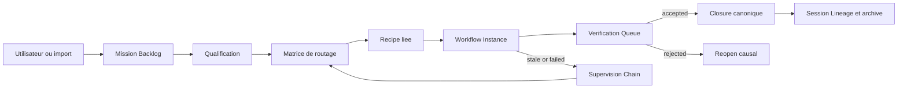
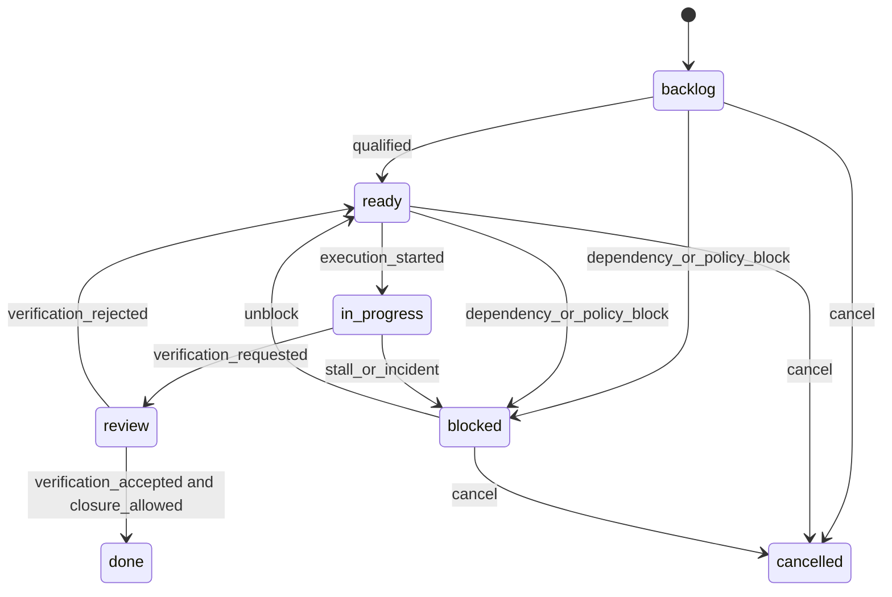

# SPEC — Mission Board Grimoire

> Projet : **Grimoire**
> Statut : **spec initiale**
> Plan source : [PLAN-adaptation-gastownhall-grimoire.md](./PLAN-adaptation-gastownhall-grimoire.md)
> Tickets lies : [TICKETS-adaptation-gastownhall-grimoire.md](./TICKETS-adaptation-gastownhall-grimoire.md)
> Decision source : [ADR-007-mission-board-control-plane-causal.md](./ADR-007-mission-board-control-plane-causal.md)

---

## 1. Objet

Definir le `Mission Board` de Grimoire : une surface operatoire, lisible et actionnable qui projette l'etat canonique du `Mission Ledger`, des `Workflow Instances`, de la `Verification Queue`, de la `Supervision Chain` et du `Session Lineage`.

Le `Mission Board` n'est pas un kanban autonome. Il est un control plane causal : il montre des read models derives et emet des commandes d'intention bornees. Il ne porte jamais sa propre source de verite sur l'existence, le statut, la verification ou la cloture d'une task.

## 2. Buts et non-buts

### 2.1 Buts

- offrir un backlog natif editable par l'utilisateur avec etiquettes, dependances et criteres d'acceptation ;
- rendre le routage de tasks automatique, deterministe, explicable et surchargeable ;
- lier chaque task a une `recipe`, une `workflow instance`, un profil de verification et un paquet de policies ;
- garantir le `forward progress` par supervision, checkpoints, relances et escalades ;
- interdire toute cloture sans evidence exploitable et verdict explicite ;
- faire du board une projection du noyau canonique, pas une couche parallele.

### 2.2 Non-buts

- cloner `Switchboard` ou son ergonomie a l'identique ;
- faire du drag and drop la primitive de mutation d'etat ;
- imposer `tmux`, `git worktree`, `Dolt`, un backend distant ou un format externe ;
- ouvrir un marketplace avance ou une federation comme prerequis ;
- remplacer les flows Grimoire existants par un meta-workflow generique et flou.

## 3. Principes de conception

- **Projection only** : toute colonne, tout badge et toute room derive d'un etat canonique deja present ailleurs.
- **Commands, not state mutation** : le board emet des intentions ; le runtime applique ou refuse la mutation.
- **No silent stall** : une task ouverte avance, se bloque explicitement, escalade, se met en pause ou est annulee avec cause tracee.
- **Fail-closed verification** : `done` sans verification acceptee et preuve fraiche est invalide.
- **Deterministic routing** : l'assignation automatique repose sur une matrice versionnee, jamais sur une intuition opaque.
- **Policy-bounded automation** : les outils, les hooks, la memoire et les integrations externes restent soumis a `policy_pack` et `evidence_profile`.
- **Grimoire-first DA** : la lecture, la causalite et la lisibilite a 1x passent avant le spectaculaire.

## 4. Perimetre fonctionnel

Le `Mission Board` couvre les domaines suivants :

- `Mission Backlog` ;
- qualification et enrichissement de tasks ;
- matrice de routage vers lanes et recipes ;
- projection des `Workflow Instances` ;
- projection de la `Verification Queue` ;
- projection de la `Supervision Chain` ;
- lecture `Session Lineage` et `Seance Archive` ;
- commandes d'intention bornees ;
- lecture causale de la mission parente et des dependances.

Il ne couvre pas en V1 :

- federation inter-projets ;
- marketplace public ;
- runtime provider externe obligatoire ;
- edition manuelle du JSON canonique par l'utilisateur.

## 5. Vue d'ensemble



## 6. Contrat canonique de task

La task est une entite canonique du `Mission Ledger`. Le board la lit et la commande, mais ne la possede pas.

### 6.1 Blocs de donnees obligatoires

| Bloc | Champ | Requis | Mutabilite | Role |
| --- | --- | --- | --- | --- |
| Identite | `taskId` | oui | set-once | identifiant stable et addressable |
| Identite | `missionId` | oui | set-once | rattachement a la mission parente |
| Provenance | `origin` | oui | set-once | `user`, `import`, `runtime`, `self-heal`, `verification` |
| Provenance | `requestId` | oui | set-once | corrige les doublons et le replay |
| Provenance | `idempotencyKey` | oui | set-once | rend la mutation replay-safe |
| Cadrage | `title` | oui | mutable-through-command | verbe d'action court |
| Cadrage | `description` | oui | mutable-through-command | contexte de travail |
| Cadrage | `type` | oui | mutable-through-command | `research`, `architecture`, `implementation`, `incident`, `documentation`, `security`, `asset`, `ux` |
| Cadrage | `labels[]` | non | mutable-through-command | filtres et regroupements humains |
| Priorisation | `priority` | oui | mutable-through-command | `p0`, `p1`, `p2`, `p3` |
| Priorisation | `severity` | non | mutable-through-command | `low`, `medium`, `high`, `critical` |
| Qualification | `complexity` | oui | mutable-through-command | `trivial`, `standard`, `complex`, `expert` |
| Qualification | `acceptanceCriteria[]` | oui | mutable-through-command | definition d'acceptation testable |
| Qualification | `flowHint` | non | mutable-through-command | suggestion initiale, non autoritaire |
| Qualification | `evidenceProfile` | oui | mutable-through-command | `light`, `standard`, `strict`, `security_critical` |
| Qualification | `policyPack` | non | mutable-through-command | jeu de constraints et garde-fous |
| Relations | `dependencies[]` | non | mutable-through-command | dependances vers autres tasks |
| Relations | `bundleRef` | non | mutable-through-command | regroupement de mission ou d'objectif |
| Execution | `recipeRef` | non | mutable-through-command | flow cible choisi par le routage |
| Execution | `workflowInstanceId` | non | runtime-managed | instance en cours ou archivee |
| Verification | `verificationRef` | non | runtime-managed | verdict canonique le plus recent |
| Verification | `evidenceRefs[]` | non | runtime-managed | preuves rattachees |
| Trajectoire | `traceId` | oui | runtime-managed | lien vers trace runtime courante |
| Trajectoire | `sessionRefs[]` | non | runtime-managed | genealogie inter-session |

### 6.2 Facettes de statut

Le statut visible du board ne doit pas ecraser la richesse causale. La task est donc decomposee en facettes.

| Facette | Valeurs autorisees | Portee |
| --- | --- | --- |
| `lifecycle` | `backlog`, `ready`, `in_progress`, `review`, `blocked`, `done`, `cancelled` | etat principal canonique |
| `qualification` | `pending`, `qualified`, `rejected` | maturite de cadrage |
| `assignment` | `unassigned`, `assigned`, `released` | prise en charge courante |
| `execution` | `idle`, `running`, `checkpoint_due`, `paused`, `failed` | run actif et progression |
| `verification` | `none`, `queued`, `verifying`, `accepted`, `rejected`, `needs_work` | droit de finaliser |
| `supervision` | `healthy`, `stale`, `escalated`, `quarantined` | anti-zone grise |

### 6.3 Exemple canonique

```yaml
apiVersion: grimoire/v1alpha1
kind: MissionTask
metadata:
  taskId: task-board-041
  missionId: mission-board-native
  origin: user
  createdAt: 2026-04-16T10:00:00Z
  requestId: req-20260416-board-001
  idempotencyKey: idem-20260416-board-001
spec:
  title: Lier le board aux etats canoniques
  description: Projeter les colonnes du board a partir du ledger, des workflow instances et de la verification queue.
  type: implementation
  labels:
    - board
    - ledger
    - hooks
  priority: p1
  severity: medium
  complexity: complex
  acceptanceCriteria:
    - Les colonnes sont derivees du statut canonique.
    - Une cloture sans verification acceptee est refusee.
    - Une task stale emet un incident explicite.
  flowHint: implementation-standard
  evidenceProfile: strict
  policyPack: board-core-safe
  dependencies:
    - task-ledger-002
  routing:
    lane: dev
    recipeRef: flow://implementation-standard
    verificationProfile: strict
    rationale:
      - type=implementation
      - complexity=complex
      - evidenceProfile=strict
status:
  lifecycle: ready
  qualification: qualified
  assignment: assigned
  execution: idle
  verification: none
  supervision: healthy
refs:
  traceId: trace-board-041
  workflowInstanceId: null
  evidenceRefs: []
  verificationRef: null
```

## 7. Machine d'etat canonique

### 7.1 Etats principaux



### 7.2 Colonnes derivees du board

Les colonnes ne sont jamais des statuts primaires. Elles sont des projections deterministes.

| Colonne board | Predicate canonique |
| --- | --- |
| `Intake` | `lifecycle=backlog` et `qualification=pending` |
| `Qualified` | `lifecycle=ready` et `assignment=unassigned` |
| `Assigned` | `lifecycle=ready` et `assignment=assigned` et `execution=idle` |
| `Running` | `lifecycle=in_progress` et `execution in {running, checkpoint_due, paused}` |
| `Review` | `lifecycle=review` et `verification in {queued, verifying}` |
| `Verified` | `lifecycle=review` et `verification=accepted` |
| `Blocked` | `lifecycle=blocked` ou `supervision in {stale, escalated, quarantined}` |
| `Done` | `lifecycle=done` |

## 8. Contrat de routage

Le routage prend des signaux canoniques et retourne une decision journalisee.

### 8.1 Signaux d'entree

- `type`
- `complexity`
- `severity`
- `evidenceProfile`
- `policyPack`
- presence ou absence de dependances bloquantes
- disponibilite logique de lane
- `flowHint` eventuel

### 8.2 Sorties obligatoires

- `lane`
- `recipeRef`
- `verificationProfile`
- `reviewMode`
- `rationale[]`
- `overrideable`

### 8.3 Matrice de routage minimale

| Type | Complexite | Sortie lane | Recipe | Verification |
| --- | --- | --- | --- | --- |
| `research` | `trivial` ou `standard` | `analyst` | `flow://research-standard` | `light` |
| `research` | `complex` ou `expert` | `pm` puis `analyst` | `flow://research-deep` | `standard` |
| `architecture` | toute sauf `trivial` | `architect` | `flow://architecture-review` | `strict` |
| `implementation` | `trivial` | `quick-flow-solo-dev` | `flow://implementation-light` | `light` |
| `implementation` | `standard` | `dev` | `flow://implementation-standard` | `standard` |
| `implementation` | `complex` ou `expert` | `dev` avec review cible | `flow://implementation-rigorous` | `strict` |
| `incident` | toute | `dev` avec supervision | `flow://incident-response` | `strict` |
| `documentation` | toute | `tech-writer` | `flow://documentation-engineering` | `standard` |
| `security` | toute | `dev` avec gate securite | `flow://security-review` | `security_critical` |
| `asset` ou `ux` | toute | `ux-designer` ou `art-director` | `flow://visual-orchestration` | `standard` |

### 8.4 Regles du routeur

1. `flowHint` peut proposer une direction, jamais imposer la decision finale.
2. `severity=critical` eleve au minimum le `verificationProfile` a `strict`.
3. `policyPack` peut interdire certaines lanes, recettes ou outils.
4. Si une dependance bloquante existe, la task ne peut pas entrer en `Running`.
5. Toute decision de routage doit stocker `rationale[]` et accepter un `override` operateur trace.

## 9. Plane d'evenements et hooks canoniques

Les hooks se branchent sur des evenements runtime et ledger, jamais sur l'UI seule.

### 9.1 Evenements minimums

| Evenement | Emetteur canonique | Consommateurs attendus |
| --- | --- | --- |
| `task.created` | Mission Ledger | qualification, read model intake |
| `task.qualified` | qualification engine | routeur, read model war room |
| `task.routed` | routeur | assignment, projections board |
| `task.assignment.confirmed` | assignment service | workshop, supervision |
| `workflow.instance.started` | workflow runtime | workshop, heartbeat, trace |
| `workflow.checkpoint.recorded` | workflow runtime | workshop, supervision, lineage |
| `workflow.stale.detected` | supervision | watchtower, escalation, reroute |
| `verification.requested` | verification queue | branch finisher |
| `verification.accepted` | verification queue | closure guard, verified column |
| `verification.rejected` | verification queue | reopen flow, branch finisher |
| `task.blocked` | ledger or supervision | watchtower, dependency loom |
| `task.unblocked` | ledger or supervision | reroute, war room |
| `mission.closure.requested` | operator command | mission guard |
| `mission.closure.blocked` | mission guard | board, branch finisher |
| `task.closed` | closure service | archive, lineage, done projection |

### 9.2 Side effects autorises

| Evenement | Side effects autorises | Side effects interdits |
| --- | --- | --- |
| `task.created` | normalisation labels, qualification preview | choix arbitraire de lane sans trace |
| `task.routed` | assignment, binding recipe, verification profile | mutation d'etat UI locale seule |
| `workflow.stale.detected` | incident, nudge, reassignation, escalation | fermeture silencieuse |
| `verification.rejected` | reopen, evidence gap, retour lane | passage direct en `done` |
| `mission.closure.requested` | evaluation des enfants, blocage ou acceptation | fermeture des enfants par raccourci |

### 9.3 Anti-patterns explicites

- hook base uniquement sur drag and drop ;
- hook base sur presence visuelle d'une carte ;
- routeur qui ne persiste pas sa rationale ;
- mutation `done` sans passage par `verification.accepted` ;
- reouverture qui ecrase l'episode precedent au lieu d'en creer un nouveau.

## 10. Commandes du board et garde-fous

| Commande | Preconditions | Effets canoniques | Refus obligatoire |
| --- | --- | --- | --- |
| `create_task` | payload valide | `task.created` | identite ou acceptance criteria manquantes |
| `qualify_task` | task existe et non `done` | enrichit `complexity`, `evidenceProfile`, `policyPack` | mutation directe de lane |
| `approve_route` | qualification `qualified` | cree `task.routed` | route sans rationale |
| `override_route` | operateur explicite | nouvelle decision tracee | override silencieux |
| `start_execution` | pas de dependance bloquante, lane valide | `workflow.instance.started`, `lifecycle=in_progress` | task non qualifiee |
| `record_checkpoint` | instance active | `workflow.checkpoint.recorded` | checkpoint sans instance |
| `request_verification` | criteria atteignables, preuves minimales presentees | `verification.requested`, `lifecycle=review` | envoi en review sans evidence profile respecte |
| `accept_verification` | verdict `accepted` | task eligible a la cloture | acceptation hors verification queue |
| `reject_verification` | verdict `rejected` | reopen, `lifecycle=ready` | rejet sans cause explicite |
| `block_task` | raison documentee | `task.blocked` | blocage sans cause |
| `unblock_task` | dependance ou cause resolue | `task.unblocked` | retour direct en running sans reroute |
| `escalate_task` | incident, stale ou policy breach | supervision `escalated` | escalation sans contexte |
| `close_task` | `verification=accepted` et closure guard valide | `task.closed`, `lifecycle=done` | preuve ou verdict manquant |
| `close_mission` | tous les enfants requis sont terminaux et verifies | mission `completed` | enfant requis encore ouvert |

## 11. Invariants de verification et de cloture

1. Toute task ouverte a une provenance, un `requestId` et une `idempotencyKey`.
2. Toute colonne du board est reconstitutable a partir de donnees canoniques.
3. Toute task en `review` a un `verificationRef` vivant ou un `evidence gap` explicite.
4. Toute task en `in_progress` a un `workflowInstanceId` ou un incident ouvert.
5. Toute task stale doit produire `workflow.stale.detected` et un statut de supervision non `healthy`.
6. Aucun `done` sans `verification=accepted` et sans `evidenceRefs[]` non vides quand `evidenceProfile` n'est pas `light`.
7. Aucune mission parente ne cloture si une task requise reste non terminale.
8. Toute reouverture preserve les references d'episode precedent dans le lineage.

## 12. Definitions operatoires

### 12.1 Definition of Ready

- type, priorite et criteria d'acceptation presents ;
- qualification `qualified` ;
- dependances connues ;
- `evidenceProfile` determine ;
- route preview disponible.

### 12.2 Definition of Done

- verification acceptee ;
- preuves rattachees et lisibles ;
- aucun incident ouvert pour la task ;
- closure event enregistre ;
- lineage et read models mis a jour.

## 13. Obligations de read models et surfaces

| Room | Projection lue | Commandes autorisees |
| --- | --- | --- |
| `Intake Desk` | tasks `backlog` et `qualification=pending` | `create_task`, `qualify_task` |
| `War Room` | colonnes derivees, dependances, bundles | `approve_route`, `override_route`, `block_task`, `unblock_task` |
| `Workshop` | instances actives, checkpoints, heartbeat | `start_execution`, `record_checkpoint`, `escalate_task` |
| `Branch Finisher` | verification queue, evidence gaps | `request_verification`, `accept_verification`, `reject_verification`, `close_task` |
| `Seance Archive` | lineage, decisions, preuves closes | lecture seule |
| `Watchtower` | incidents, stale, escalations | `escalate_task`, reroute, quarantine |

## 14. Securite et policies

- `policyPack` borne l'usage des outils, MCPs, ecritures memoire et integrations externes.
- `evidenceProfile=security_critical` impose validation d'outputs d'outils avant re-injection.
- aucune recipe sensible n'est routable sans allowlist explicite des surfaces autorisees.
- les commandes board restent locales au control plane et n'executent jamais un outil dangereux par simple interaction UI.
- toute integration externe de ticketing reste secondaire face au ledger local.

## 15. Economie de memoire, contexte et tokens

Le `Mission Board` doit servir la priorite strategique suivante : **minimiser la charge de contexte et les couts de tokens sans perdre la causalite**.

### 15.1 Progressive disclosure obligatoire

| Niveau | Surface | Charge cible | Contenu autorise |
| --- | --- | --- | --- |
| `L1` | carte de board | minimale | titre, etat, lane, counts, badges, dernier evenement |
| `L2` | dossier lateral | moyenne | acceptance criteria, rationale, refs, evidence gap, prochain checkpoint |
| `L3` | deep fetch | explicite seulement | lineage detaille, preuves, traces, decisions, episodes precedents |

### 15.2 Interdictions

- aucun transcript brut sur une carte ;
- aucun transcript brut dans le drawer par defaut ;
- aucun fetch profond automatique au chargement du board ;
- aucune duplication longue des preuves, reviews ou traces dans plusieurs projections.

### 15.3 Regles de conception associees

- les cartes exposent des references et des compteurs avant d'exposer du texte long ;
- la rationale de routage doit rester courte et lisible sans deep fetch ;
- les lineage et evidence packs sont dereferences a la demande ;
- une mission lourde doit rester pilotable sans ouvrir tous ses episodes ni toutes ses preuves.

## 16. Integration avec les flows Grimoire existants

| Type | Flow cible prioritaire | Notes |
| --- | --- | --- |
| `research` | `grimoire-brainstorming` ou `grimoire-product-discovery` | produit hypotheses et synthese |
| `architecture` | `grimoire-architecture-review` puis `grimoire-writing-plans` | impose decision explicite |
| `implementation` | `grimoire-subagent-dev` ou `grimoire-writing-plans` | verifie puis cloture |
| `incident` | `grimoire-incident-response` ou `grimoire-systematic-debugging` | supervision stricte |
| `documentation` | `grimoire-documentation-engineering` | garde structure et references |
| `security` | `grimoire-security-review` | renforce verdicts et policies |
| `asset` ou `ux` | `grimoire-visual-orchestration` ou `grimoire-2d-asset-pipeline` | respecte la DA canonique |

## 17. Gates d'acceptation de cette spec

- le board n'introduit aucun etat primaire propre ;
- la task a un contrat canonique complet et borne ;
- la colonne `Verified` est une projection, pas un statut fondamental ;
- le routage est deterministe, explicable et surchargeable ;
- la cloture de task et de mission est fail-closed ;
- les hooks reposent sur des evenements canoniques ;
- la supervision couvre explicitement le risque de `silent stall` ;
- l'economie de memoire, contexte et tokens est explicite dans les projections ;
- la surface UX peut se brancher sans contredire le ledger.

## 18. Questions encore ouvertes

1. Faut-il versionner la matrice de routage dans un fichier dedie ou l'inclure d'abord dans le `Mission Ledger` ?
2. Le `Mission Bundle` doit-il devenir un objet de premier rang dans cette V1 ou rester une relation secondaire sur mission et task ?
3. La projection `Verified` doit-elle rester une colonne distincte ou devenir un mode de lecture du `Branch Finisher` une fois les read models stabilises ?
