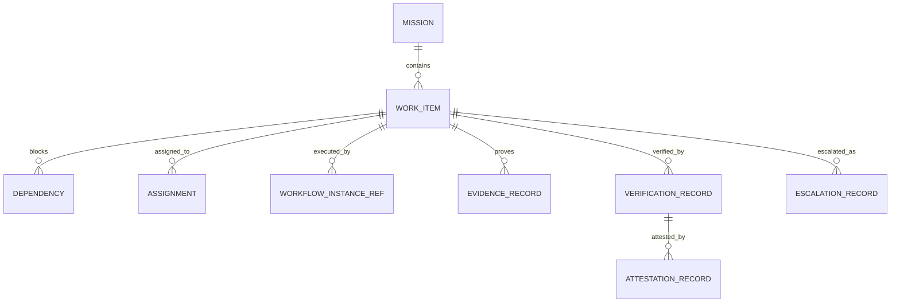

# SPEC — Mission Ledger Grimoire

> Projet : **Grimoire**
> Statut : **spec initiale**
> Plan source : [PLAN-adaptation-gastownhall-grimoire.md](./PLAN-adaptation-gastownhall-grimoire.md)
> Tickets lies : [TICKETS-adaptation-gastownhall-grimoire.md](./TICKETS-adaptation-gastownhall-grimoire.md)

---

## 1. Objet

Definir le `Mission Ledger` de Grimoire : une couche canonique, machine-readable et rejouable qui unifie ce que les artefacts actuels dispersent entre tickets, traces, evenements runtime, evidence packs et verdicts de verification.

Le `Mission Ledger` est l'equivalent Grimoire de la meilleure idee de `Beads` : un registre structure de travail, d'etat, de dependances et de preuve. Il n'est pas un portage de Beads ni un choix de backend Dolt.

## 2. Buts et non-buts

### 2.1 Buts

- fournir une source de verite operatoire pour missions, items, dependances, preuves et verdicts ;
- permettre replay, relecture, diff et audit sans transcript brut obligatoire ;
- relier les evenements runtime aux read models board ;
- stabiliser les references `traceId`, `requestId`, `evidenceRef`, `verificationRef` et `missionId` ;
- preparer la verification queue, le session lineage et les futures attestations.

### 2.2 Non-buts

- remplacer tout le corpus documentaire de planification ;
- imposer un backend SQL distribue ou une technologie particuliere ;
- devenir un issue tracker generaliste pour tout le depot ;
- exposer une federation inter-projets en V1 ;
- remplacer les contrats runtime existants au lieu de s'y raccorder.

## 3. Principes

- **Canonical but additive** : le ledger ajoute une couche operatoire sans casser les contrats runtime existants.
- **Event-linked** : chaque mutation importante garde un lien vers les evenements et traces qui l'ont produite.
- **Replay-safe** : le ledger doit etre reconstructible a partir des evenements et protections d'idempotence.
- **Proof-first** : un statut final sans evidence ou verdict explicite est invalide.
- **Read-friendly** : les surfaces board lisent des projections du ledger, pas des syntheses opaques.
- **Backend-agnostic** : la spec de donnees est separee du mode de persistence.

## 4. Perimetre fonctionnel

Le `Mission Ledger` couvre les objets suivants :

- `Mission` ;
- `WorkItem` ;
- `Dependency` ;
- `WorkflowInstanceRef` ;
- `Assignment` ;
- `EvidenceRecord` ;
- `VerificationRecord` ;
- `EscalationRecord` ;
- `AttestationRecord`.

Le `Session Lineage` reste une couche voisine, referencee par le ledger mais specifiee separement.

## 5. Vue d'ensemble



## 6. Modele de donnees canonique

### 6.1 Mission

Unite operatoire de plus haut niveau. Une mission regroupe plusieurs items de travail lies a un meme objectif, une meme tranche d'execution ou un meme paquet de preuve.

Champs minimums :

- `missionId`
- `title`
- `status`
- `priority`
- `owner`
- `createdAt`
- `updatedAt`
- `sourceRefs[]`
- `labels[]`
- `traceRefs[]`

Statuts autorises :

- `planned`
- `ready`
- `active`
- `blocked`
- `verifying`
- `completed`
- `archived`

### 6.2 WorkItem

Unite de travail atomique ou quasi-atomique rattachee a une mission.

Champs minimums :

- `itemId`
- `missionId`
- `title`
- `type`
- `status`
- `priority`
- `actor`
- `source`
- `requestId`
- `idempotencyKey`
- `createdAt`
- `updatedAt`
- `traceId`
- `taskRef`

Types autorises en V1 :

- `task`
- `workflow_step`
- `verification_gate`
- `incident`
- `decision`
- `handoff`

Statuts autorises :

- `backlog`
- `ready`
- `in_progress`
- `blocked`
- `review`
- `done`
- `cancelled`

### 6.3 Dependency

Relation structuree entre items.

Champs minimums :

- `dependencyId`
- `fromItemId`
- `toItemId`
- `type`
- `status`

Types autorises :

- `blocks`
- `relates_to`
- `supersedes`
- `requires_verification_of`

### 6.4 WorkflowInstanceRef

Reference de workflow instancie liee a un item.

Champs minimums :

- `workflowInstanceId`
- `itemId`
- `recipeRef`
- `status`
- `checkpointRef`
- `currentStepId`
- `traceId`

### 6.5 Assignment

Trace qui fait quoi, sous quelle responsabilite et dans quel mode.

Champs minimums :

- `assignmentId`
- `itemId`
- `assignee`
- `role`
- `status`
- `assignedAt`
- `releasedAt`

### 6.6 EvidenceRecord

Preuve technique rattachee a un item.

Champs minimums :

- `evidenceId`
- `itemId`
- `evidenceRef`
- `kind`
- `summary`
- `source`
- `createdAt`
- `traceId`
- `metadata`

Kinds autorises en V1 :

- `test_report`
- `coverage_report`
- `screenshot`
- `log_excerpt`
- `artifact`
- `manual_assertion`

### 6.7 VerificationRecord

Verdict explicite sur un item ou sur un panier de preuves.

Champs minimums :

- `verificationId`
- `itemId`
- `verificationRef`
- `status`
- `verdict`
- `checkedBy`
- `checkedAt`
- `evidenceRefs[]`
- `policyRefs[]`
- `traceId`

Statuts autorises :

- `queued`
- `verifying`
- `accepted`
- `rejected`
- `needs_work`

Verdicts autorises en V1 :

- `pass`
- `fail`
- `warn`
- `inconclusive`

### 6.8 EscalationRecord

Objet structure de blocage ou de severite.

Champs minimums :

- `escalationId`
- `itemId`
- `severity`
- `reason`
- `openedAt`
- `openedBy`
- `status`
- `contextRefs[]`

Severites autorisees :

- `critical`
- `high`
- `medium`
- `low`

### 6.9 AttestationRecord

Attestation operatoire emise apres verification. En V1, elle reste un signal de preuve, pas un systeme de reputation sociale.

Champs minimums :

- `attestationId`
- `verificationId`
- `subjectRef`
- `author`
- `type`
- `summary`
- `createdAt`
- `metadata`

Types autorises en V1 :

- `verification_attestation`
- `review_attestation`
- `compliance_note`

## 7. Identite, correlation et idempotence

### 7.1 Regles d'identite

- Les objets canoniques utilisent des identifiants stables et non reemployes.
- Les identifiants externes (`taskRef`, `traceId`, `verificationRef`) restent preservables comme references, mais ne remplacent pas les IDs internes.
- Toute mutation critique doit porter `requestId` et `idempotencyKey` si elle provient d'une action runtime.

### 7.2 Regles de correlation

- `traceId` relie l'objet aux evenements runtime et aux sessions.
- `requestId` relie une action utilisateur ou systeme a sa cascade de mutations.
- `evidenceRef` et `verificationRef` sont les pivots de lecture humaine et de recherche.

### 7.3 Regles d'idempotence

- Une mutation identique portant la meme paire `(type, idempotencyKey)` ne doit produire aucun doublon.
- Une evidence en double doit etre fusionnee ou ignoree selon `evidenceRef` et `kind`.
- Une verification en double avec le meme `verificationRef` doit etre rejouable sans alterer le verdict final.

## 8. Sources d'alimentation du ledger

### 8.1 Sources runtime

Le ledger consomme en priorite :

- `TASK_UPDATE`
- `TASK_TRANSITION`
- `WORKFLOW_STEP`
- `TOOL_CALL`
- `VERIFICATION_GATE`
- `RUNTIME_ERROR`
- `AGENT_STATUS_UPDATE`
- `STATE_SNAPSHOT` comme bootstrap et non comme mutation metier primaire.

### 8.2 Sources documentaires

Les artefacts de planification peuvent initialiser ou enrichir le ledger, mais ne deviennent pas sa source de mutation prioritaire.

Exemples :

- tickets existants ;
- evidence packs ;
- handoffs et go/no-go ;
- matrices de verification.

## 9. Projection vers les vues runtime

Le ledger ne remplace pas les vues runtime ; il les alimente.

Projections attendues en V1 :

- `task-view` pour l'etat des `WorkItem` ;
- `verification-view` pour `VerificationRecord` et `EvidenceRecord` ;
- `runtime-dashboard-view` pour les KPIs mission et verification ;
- `branch-finisher-view` pour les items verrouilles par verification ;
- `audit-view` pour les lectures causales et incidents.

## 10. Persistence et materialisation

### 10.1 Exigence de spec

La spec n'impose pas un backend unique.

### 10.2 Materialisation recommandee

V1 recommande trois couches :

- `journal canonique` : derive des evenements existants et des mutations ledger ;
- `snapshot materialise` : etat reconstruit du ledger ;
- `index local` : couche de requete optionnelle pour recherches rapides.

### 10.3 Arborescence recommandee

```text
_grimoire-runtime-output/mission-ledger/
  journal/
    ledger-events.jsonl
  snapshots/
    latest.json
  indexes/
    mission-ledger.sqlite
  evidence/
    manifests/
```

Le fichier ou la base precise relevent de l'implementation, pas de cette spec.

## 11. Exemples minimums

### 11.1 Mission

```json
{
  "missionId": "mis_01JQ4D9Q8K7P2V6F1W0A",
  "title": "Stabiliser le Mission Ledger",
  "status": "active",
  "priority": "P0",
  "owner": "grimoire-master",
  "sourceRefs": ["GTA-TKT-001", "GTA-TKT-002"],
  "traceRefs": ["trace-runtime-42"],
  "createdAt": "2026-04-10T12:00:00Z",
  "updatedAt": "2026-04-10T12:10:00Z"
}
```

### 11.2 Verification record

```json
{
  "verificationId": "vrf_01JQ4DC5K1R9A8M7D2XZ",
  "itemId": "itm_01JQ4DB0QWE7M2LP9TT9",
  "verificationRef": "verify://mission-ledger/itm_01JQ4DB0QWE7M2LP9TT9",
  "status": "accepted",
  "verdict": "pass",
  "checkedBy": "qa",
  "checkedAt": "2026-04-10T12:14:00Z",
  "evidenceRefs": [
    "evidence://tests/mission-ledger-contract",
    "evidence://coverage/mission-ledger"
  ],
  "policyRefs": ["policy://verification/minimal-chain"],
  "traceId": "trace-runtime-42"
}
```

## 12. Contraintes de securite et de gouvernance

- Aucune mutation critique du ledger sans provenance minimale.
- Aucune transition vers `done` sans reference vers un `VerificationRecord` acceptable.
- Aucune attestation sans verification liee.
- Les lectures board peuvent etre plus riches que les objets canoniques, mais jamais moins traçables.
- Les exports du ledger doivent distinguer `fact`, `inference` et `manual_assertion` quand cela s'applique.

## 13. Tests requis

### 13.1 Tests de contrat

- validation des schemas ;
- rejection des payloads incomplets ;
- compatibilite additive des champs optionnels.

### 13.2 Tests de replay

- replay identique ;
- deduplication ;
- out-of-order borne ;
- reconstruction a partir d'un snapshot puis d'un delta.

### 13.3 Tests de projection

- projection vers `verification-view` ;
- projection vers `task-view` ;
- projection vers `runtime-dashboard-view`.

### 13.4 Tests de preuve

- refus de `done` sans verification ;
- refus d'attestation orpheline ;
- recherche d'une evidence par `missionId`, `itemId` et `verificationRef`.

## 14. Questions laissees ouvertes volontairement

- format exact de l'index local ;
- strategie de compaction et d'archivage ;
- niveau de granularite des `manual_assertion` ;
- extension future du modele d'attestation vers une federation ;
- exposition d'une API read-only dediee au ledger.

## 15. Definition of done de la spec

- les objets canoniques du `Mission Ledger` sont nommes et bornes ;
- les liens obligatoires de provenance, evidence et verification sont explicites ;
- la spec reste compatible avec les evenements runtime et les vues existantes ;
- aucun choix de backend n'est fige prematurement ;
- la spec peut servir de base a `GTA-TKT-001` et `GTA-TKT-002` sans re-cadrage supplementaire.
