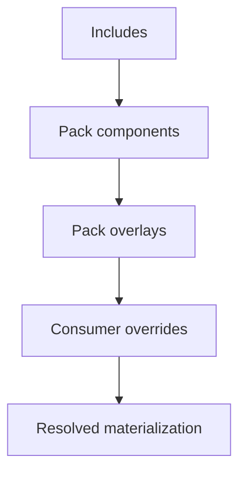

# SPEC — Pack Registry Grimoire

> Projet : **Grimoire**
> Statut : **spec initiale**
> Plan source : [PLAN-adaptation-gastownhall-grimoire.md](./PLAN-adaptation-gastownhall-grimoire.md)
> Tickets lies : [TICKETS-adaptation-gastownhall-grimoire.md](./TICKETS-adaptation-gastownhall-grimoire.md)

---

## 1. Objet

Definir le `Pack Registry` de Grimoire : une couche de packaging, composition et gouvernance permettant de distribuer et de surcharger proprement des ensembles de skills, prompts, workflows, hooks, policies, tools, assets et surfaces associees.

Le `Pack Registry` s'inspire des `packs` et `overrides` de Gas City, mais reste Grimoire-native : vocabulaire, structure, surfaces cibles et gates de verification sont adaptes au repo et a sa gouvernance documentaire et runtime.

## 2. Buts et non-buts

### 2.1 Buts

- definir une unite officielle de packaging composable ;
- permettre `includes`, `overlays`, `overrides`, `requires` et `policies` avec ordre de precedence explicite ;
- tracer provenance, statut, compatibilite et preuve d'un pack ;
- supporter la distribution sans casser le noyau ;
- preparer un marketplace verifie et des distros plus riches.

### 2.2 Non-buts

- remplacer les repertoires `.github/*` et `_grimoire-runtime/*` par une abstraction opaque ;
- rendre la distribution externe obligatoire ;
- autoriser des patches arbitraires sans verification ni policy ;
- confondre packaging et federation inter-projets ;
- introduire une supply chain avant d'avoir un contrat valide et des gates strictes.

## 3. Principes

- **Pack-first, core-safe** : un pack enrichit le noyau mais ne peut pas le contourner silencieusement.
- **Declarative composition** : la composition passe par un manifest explicite, jamais par convention cachée seule.
- **Consumer precedence** : l'operateur ou le projet consommateur garde la precedence sur les providers, overrides et certaines politiques.
- **Fail-closed validation** : un pack incomplet, ambigu ou non traçable est refuse.
- **Surface-aware** : chaque composant d'un pack declare sa surface cible et son statut.
- **Status-aware** : `stable`, `experimental` et `internal` sont des statuts contractuels.

## 4. Concept de pack

Un pack est un dossier versionnable qui porte :

- un manifest `pack.yaml` ;
- zero ou plusieurs composants materialises ;
- zero ou plusieurs overlays ;
- zero ou plusieurs policies ;
- zero ou plusieurs tests et preuves associes.

Le pack est la plus petite unite officielle de composition et de publication au-dessus d'un artefact isole.

## 5. Surfaces cibles

Un pack peut porter des composants sur ces surfaces :

- `skill`
- `prompt`
- `workflow`
- `instruction`
- `hook`
- `tool`
- `asset`
- `ui_surface`
- `policy`
- `docs`

Chaque composant declare sa surface et son niveau de criticite.

## 6. Structure recommandee

```text
packs/
  observability-core/
    pack.yaml
    skills/
    prompts/
    workflows/
    instructions/
    hooks/
    policies/
    tools/
    overlays/
    tests/
    docs/
```

Le dossier exact de stockage peut evoluer. Cette spec fixe la structure logique, pas la seule arborescence possible.

## 7. Manifest canonique `pack.yaml`

### 7.1 Champs obligatoires

- `apiVersion`
- `kind`
- `metadata.name`
- `metadata.version`
- `metadata.status`
- `metadata.owner`
- `metadata.description`
- `compatibility.core`
- `components`

### 7.2 Champs recommandes

- `metadata.tags[]`
- `metadata.license`
- `metadata.source`
- `metadata.provenance`
- `requires[]`
- `includes[]`
- `policies[]`
- `tests[]`
- `overlays[]`
- `exports[]`

### 7.3 Exemple minimal

```yaml
apiVersion: grimoire/v1alpha1
kind: Pack
metadata:
  name: mission-ledger-core
  version: 0.1.0
  status: experimental
  owner: grimoire-core
  description: Components for mission ledger projections and policies.
  tags:
    - ledger
    - runtime
compatibility:
  core:
    min: 0.1.0
    max: 0.x
components:
  - id: ledger-schemas
    surface: workflow
    path: workflows/ledger-sync.prompt.md
    status: experimental
  - id: ledger-policy
    surface: policy
    path: policies/verification-minimal.yaml
    status: stable
tests:
  - id: ledger-schema-contract
    kind: contract
    path: tests/ledger-schema-contract.yaml
```

## 8. Meta-modele du manifest

### 8.1 Metadata

Champs :

- `name` : identifiant stable du pack ;
- `version` : version semantique ou compatible avec la politique du projet ;
- `status` : `stable`, `experimental`, `internal` ;
- `owner` : equipe, agent ou groupe responsable ;
- `description` : description courte ;
- `tags[]` : etiquettes de recherche ;
- `license` : licence applicable si publication ;
- `source` : source declarative d'origine ;
- `provenance` : references vers commits, artifacts ou audits.

### 8.2 Compatibility

Le bloc `compatibility` declare au minimum :

- version minimale du core ;
- version maximale ou mode de compatibilite ;
- compatibilites optionnelles de surfaces.

Exemple :

```yaml
compatibility:
  core:
    min: 0.1.0
    max: 0.x
  surfaces:
    - ui_surface/runtime-dashboard
    - workflow/mission-ledger
```

### 8.3 Components

Chaque composant declare :

- `id`
- `surface`
- `path`
- `status`
- `criticality`
- `policyRefs[]`
- `exports[]`

`criticality` autorises en V1 :

- `low`
- `medium`
- `high`

### 8.4 Includes

`includes[]` declare les packs parents ou dependances de composition.

Regles :

- les includes sont resolves avant les composants du pack courant ;
- un cycle d'include est une erreur bloquante ;
- un include n'ecrase pas silencieusement un composant de meme identite sans regle explicite d'override.

### 8.5 Requires

`requires[]` declare les prerequis de surfaces ou de composants.

Exemple :

```yaml
requires:
  - surface: tool
    id: observatory-export
  - surface: policy
    id: verification-minimal
```

Une exigence non satisfaite bloque l'activation du pack.

### 8.6 Overlays

`overlays[]` declare des repertoires ou fragments qui enrichissent une surface sans recrire tout le pack.

Types d'overlay autorises en V1 :

- `file_overlay`
- `component_patch`
- `prompt_override`
- `policy_extension`

L'overlay est explicite, localisable et traçable.

### 8.7 Policies

`policies[]` declare les politiques que le pack fournit ou exige.

Exemples de policies :

- provenance requise ;
- verification minimale ;
- activation read-only ;
- interdiction d'une surface sans trust level.

### 8.8 Tests

Chaque pack doit declarer ses tests ou suites minimales.

Kinds autorises en V1 :

- `contract`
- `integration`
- `smoke`
- `policy`
- `visual`

Un pack `stable` sans tests declares est invalide.

## 9. Resolution et precedence

### 9.1 Ordre de resolution



### 9.2 Regles

- les includes forment la base la plus basse ;
- le pack courant ajoute ses composants ;
- les overlays du pack courant appliquent leurs enrichissements ;
- les overrides du consommateur priment sur les valeurs par defaut du pack ;
- les providers ou settings deja definis par le consommateur ne sont pas ecrases silencieusement ;
- toute collision sans strategie explicite est une erreur bloquante.

### 9.3 Lock file recommande

La resolution materialisee doit produire un lock file ou equivalent declarant :

- versions resolues ;
- hash de contenu ;
- includes effectifs ;
- overlays appliques ;
- policies resultantes.

## 10. Provenance et verification

### 10.1 Provenance minimale

Un pack publiable doit declarer au minimum :

- source de code ou de contenu ;
- owner ;
- statut ;
- compatibilite ;
- tests ;
- policies.

### 10.2 Verification minimale

Avant activation ou publication, le validateur doit verifier :

- schema du manifest ;
- existence des composants declares ;
- satisfaction des `requires` ;
- absence de cycles ;
- statut autorise ;
- presence de tests minimaux ;
- coherence `surface -> policy -> criticality`.

### 10.3 Publication

Un pack ne peut etre publie comme `stable` que s'il passe :

- validation schema ;
- validation composants ;
- validation policies ;
- validation compatibilite ;
- execution des tests declares.

## 11. Exemples de composants

### 11.1 Skill

```yaml
components:
  - id: mission-ledger-planning
    surface: skill
    path: skills/mission-ledger/SKILL.md
    status: experimental
    criticality: medium
    policyRefs:
      - policy://provenance-required
```

### 11.2 Hook

```yaml
components:
  - id: ledger-post-edit
    surface: hook
    path: hooks/ledger-post-edit.json
    status: stable
    criticality: high
    policyRefs:
      - policy://verification-minimal
```

### 11.3 UI surface

```yaml
components:
  - id: board-ledger-panel
    surface: ui_surface
    path: ui/runtime-dashboard/ledger-panel.json
    status: experimental
    criticality: medium
```

## 12. Modes de consommation

### 12.1 Local

Un projet consomme un pack depuis un chemin local versionne dans le repo ou dans un dossier de packs permis.

### 12.2 Remote verifie

Un projet peut consommer un pack depuis une source distante uniquement si :

- la provenance est resolue ;
- la compatibilite est verifiee ;
- les policies minimales sont satisfaites.

### 12.3 Internal only

Un pack `internal` peut exister sans publication externe mais doit tout de meme respecter les contrats de manifest et de validation.

## 13. Validation et erreurs bloquantes

Erreurs bloquantes en V1 :

- `metadata.name` manquant ;
- `metadata.status` invalide ;
- composant declare avec `path` absent ;
- cycle d'include ;
- requirement non satisfait ;
- composant `high` sans `policyRefs` ;
- pack `stable` sans tests ;
- collision de composant sans regle explicite.

## 14. Tests requis

### 14.1 Tests de contrat

- schema du manifest ;
- enum des statuts ;
- champs obligatoires ;
- composants invalides.

### 14.2 Tests de resolution

- include unique ;
- include multiple ;
- cycle d'include ;
- overlay et precedence ;
- provider consommeur prioritaire.

### 14.3 Tests de gouvernance

- refus d'un composant critique sans policy ;
- refus d'un pack stable sans tests ;
- refus d'un pack sans compatibilite core ;
- generation du lock file de resolution.

## 15. Questions laissees ouvertes volontairement

- emplacement definitif du registre de packs ;
- strategie de signature ou d'attestation cryptographique ;
- format exact du lock file ;
- protocole du futur marketplace ;
- prise en charge de packs purement documentaires ou assets-only sans runtime.

## 16. Definition of done de la spec

- le `pack.yaml` est defini avec ses champs obligatoires et optionnels ;
- l'ordre de resolution `includes -> overlays -> overrides` est borne ;
- provenance, compatibilite, policies et tests sont contractuels ;
- la spec reste compatible avec la gouvernance d'artefacts existante ;
- la spec peut servir de base directe a `GTA-TKT-004` et `GTA-TKT-005`.
