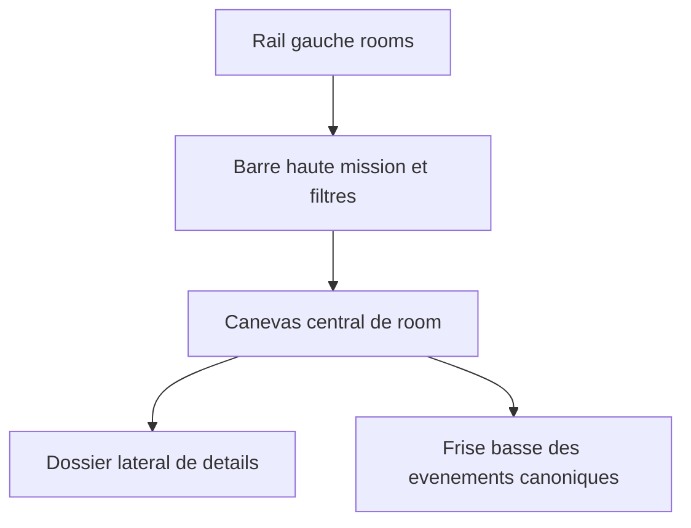
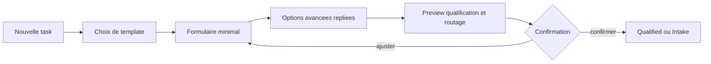

# UX Map — Mission Board Grimoire

> Projet : **Grimoire**
> Sources : [SPEC-mission-board-grimoire.md](./SPEC-mission-board-grimoire.md), [ADR-007-mission-board-control-plane-causal.md](./ADR-007-mission-board-control-plane-causal.md), [VISUAL-BRIEF-mission-board-grimoire.md](./VISUAL-BRIEF-mission-board-grimoire.md)

---

## 1. These UX

Le `Mission Board` doit permettre de lire, piloter et verifier une task sans la sortir de son contexte causal. L'UX ne doit pas flatter l'impression de controle ; elle doit offrir un controle reel sur des entites deja canoniques.

## 2. Shell global

Le shell est constant dans toutes les rooms.



### 2.1 Rail gauche

- plaques de rooms ;
- compteurs critiques ;
- acces rapide a la mission active ;
- ancrage visuel stable pour la navigation.

### 2.2 Barre haute

- contexte de mission ou bundle ;
- filtres ;
- recherche ;
- bascule de session ou scope ;
- eventuel mode de lecture specialise.

### 2.3 Canevas central

- une seule vue primaire par room ;
- pas de KPIs generiques dominant la lecture ;
- priorite aux entites actives et aux decisions a prendre.

### 2.4 Dossier lateral

- details de la task selectionnee ;
- historique recent ;
- commandes d'intention ;
- preuves, lineage, criteres d'acceptation.

### 2.5 Frise basse

- derniers evenements canoniques ;
- lectures d'incident et checkpoints ;
- jamais un chat flottant qui remplace la causalite.

## 3. Rooms et questions primaires

| Room | Question a laquelle elle repond | Vue primaire | Commande dominante |
| --- | --- | --- | --- |
| `Intake Desk` | Qu'est-ce qui entre dans le systeme et comment le qualifier ? | pile intake + formulaire de task | creer, qualifier |
| `War Room` | Quelle est la situation tactique de la mission ? | board a colonnes derivees | arbitrer, rerouter |
| `Workshop` | Que font les lanes et les runs en ce moment ? | stacks de runs actifs | ouvrir, reprendre, nudger |
| `Branch Finisher` | Qu'est-ce qui peut etre verifie ou cloture ? | verification queue | demander verification, clore, rouvrir |
| `Seance Archive` | Qui a decide quoi, quand, sur quelle preuve ? | lineage et decision cards | relire, comparer |
| `Watchtower` | Qu'est-ce qui derive, stagne ou demande escalation ? | supervision queue | escalader, reassigner |

## 4. Navigation et priorites de lecture

### 4.1 Landing pages

- premier contact: `Intake Desk` si aucune task n'existe ;
- usage courant: `War Room` sur la mission active ;
- crise ou derive: `Watchtower` prioritaire ;
- cloture: `Branch Finisher` prioritaire.

### 4.2 Regle de navigation

- l'utilisateur entre par intention metier, pas par type de composant ;
- la room suivante doit etre suggerable depuis l'etat de la task ;
- aucune room secondaire ne doit dupliquer la room primaire.

## 5. First-run et creation de task manuelle



### 5.1 Formulaire minimal

Champs obligatoires :

- `title`
- `description`
- `type`
- `labels[]`
- `acceptanceCriteria[]`

### 5.2 Options de ticket repliees

- `severity`
- `dependencies[]`
- `flowHint`
- `evidenceProfile`
- `policyPack`

### 5.3 Preview de routage

Le preview doit afficher :

- `complexity` proposee ;
- lane candidate ;
- `recipeRef` proposee ;
- profil de verification ;
- rationale lisible.

L'utilisateur confirme ou ajuste. La task n'entre jamais directement en `Running` depuis la creation.

## 6. Anatomie de carte de task

### 6.1 Face compacte

| Zone | Contenu |
| --- | --- |
| Bandeau haut | sigil d'etat, `taskId`, fraicheur du dernier evenement, sceau de verification |
| Corps | titre, sous-ligne causale, lane ou responsable, type, priorite |
| Socle | dependances, criteria satisfaits, preuves, action primaire |

### 6.2 Champs visibles sur la face

- `taskId`
- `title`
- `lifecycle`
- `type`
- `priority`
- `severity` si `medium` ou plus
- `complexity`
- lane ou assignee courant
- `verification`
- compteur de preuves
- compteur de dependances
- age du dernier evenement canonique

### 6.3 Champs secondaires dans le dossier

- description complete ;
- labels ;
- acceptance criteria ;
- evidence profile ;
- policy pack ;
- origin ;
- flow hint ;
- workflow instance ;
- lineage et historique de rebind ;
- trace IDs, evidence refs et verification refs.

### 6.4 Actions primaires

| Projection | Action primaire |
| --- | --- |
| `Intake` | `Qualifier` |
| `Qualified` | `Confirmer le routage` |
| `Assigned` | `Ouvrir la lane` |
| `Running` | `Ouvrir le run` |
| `Review` | `Ouvrir la verification` |
| `Verified` | `Clore` |
| `Blocked` | `Escalader` ou `resoudre la dependance` |
| `Done` | `Ouvrir la seance` |

## 7. Dossier lateral

Le dossier lateral est la zone de verite operatoire d'une carte selectionnee. Il est structure en onglets courts.

| Onglet | Contenu |
| --- | --- |
| `Overview` | contexte, rationale de routage, prochain checkpoint |
| `Acceptance` | criteres et etat de satisfaction |
| `Execution` | lane, recipe, workflow instance, checkpoints |
| `Verification` | preuves, verdicts, evidence gaps |
| `Lineage` | sessions, decisions, reouvertures |
| `Commands` | actions autorisees et refusables |

## 8. Room notes detaillees

### 8.1 Intake Desk

- vue stable de creation et de prequalification ;
- cartes volontairement sobres ;
- forte presence `Paper` et `Verdigris`.

### 8.2 War Room

- colonne derivee et dependency loom ;
- lecture tactique par mission, bundle ou filtre ;
- aucune action de mutation implicite par simple deplacement.

### 8.3 Workshop

- accent `Storm` ;
- stacks de runs actifs ;
- checkpoints et heartbeat visibles sur la tranche de carte.

### 8.4 Branch Finisher

- accent `Brass` pour readiness ;
- `Ember` reserve aux rejets et evidence gaps ;
- aucun `done` direct sans guard satisfaite.

### 8.5 Seance Archive

- lecture calme `Paper + Memory` ;
- decision cards, traces, preuves ;
- pas de resume opaque non ancre.

### 8.6 Watchtower

- accent `Storm` ;
- `Ember` seulement pour les alertes reelles ;
- tri par severite, stale, quarantined.

## 9. Microcopy et langue d'interface

- verbes d'action courts ;
- raisons de refus explicites ;
- aucune microcopy magique du type `AI decided` ;
- toujours repondre a `pourquoi ici ?` et `quoi ensuite ?`.

Exemples :

- `Route proposee: architecture-review car type=architecture et verification=strict.`
- `Cloture refusee: verification acceptee absente.`
- `Task stale: aucun checkpoint recent, nudge ou escalation requis.`

## 10. Accessibilite et clavier

- focus fort sur carte et sur commande ;
- navigation clavier room -> colonne -> carte -> dossier ;
- reduced motion complet ;
- aucun contraste ambigu entre badge et fond ;
- toutes les commandes importantes ont une alternative au drag and drop.

## 11. Red flags UX

- state owner UI ;
- colonnes non derivees ;
- drag and drop qui change le canon ;
- pluie de badges ;
- charts, donuts et KPIs avant les tasks ;
- chat flottant qui couvre le board ;
- theme SaaS generique avec grosses capsules arrondies ;
- animation continue de surface.

## 12. Wireframe textuel minimal

```text
+---------------------------------------------------------------+
| Rooms | Mission: Board Native | Filters | Search | Session    |
+-------+-------------------------------------------------------+
| Intake| [Qualified] [Assigned] [Running] [Review] [Blocked]   |
| War   |  task-041  Lier le board aux etats canoniques         |
| Work  |  type=implementation  complexity=complex              |
| Finish|  route: dev / implementation-standard                 |
| Seance|  deps:1  evidence:2  verify:queued  next: review      |
| Watch |                                                       |
+-------+--------------------------------------+----------------+
| Canonical events: task.routed -> verification.requested ...   |
+---------------------------------------------------------------+
```

Ce wireframe n'est pas une maquette finale. Il fixe la hierarchie d'information et la discipline causale.
