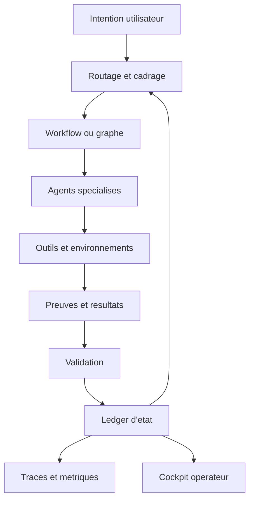
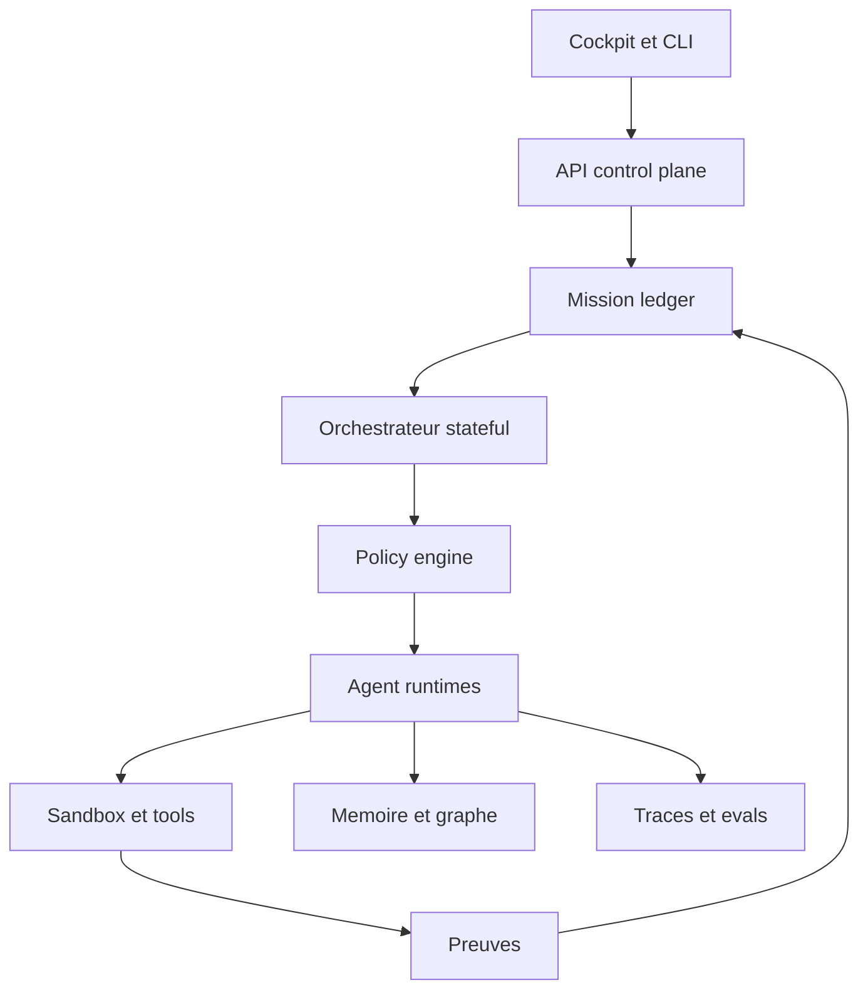

# Cartographie des modeles de pilotage agentique

## Intention

Ce rapport repond a une question structurante : quand on dit "piloter des agents", de quoi parle-t-on reellement ?

Le corpus montre que le pilotage agentique n'est pas un seul pattern. C'est un spectre qui va du simple agent outille a un control plane distribue avec etat, sandbox, observabilite, routage, workflows, memoire et supervision humaine.

## Vue d'ensemble

Un bon systeme ne laisse jamais l'agent etre la source de verite. L'agent propose, agit et rapporte. Le ledger, les contrats et les preuves gouvernent.

## Taxonomie principale

| Type de pilotage | Depots representatifs | Controle | Autonomie | Usage ideal |
| --- | --- | ---: | ---: | --- |
| Agent mono-boucle outille | `Octogent`, `browser-use`, exemples SDK | Moyen | Moyen | Automatiser une tache bornee avec outils. |
| Multi-agent par roles | `BMAD-METHOD`, `crewAI`, `superpowers`, `ruflo` | Moyen a fort | Fort | Diviser le travail entre specialistes. |
| Workflow procedural | `BMAD-METHOD`, `superpowers`, `gas town/gascity` | Fort | Moyen | Delivery reproductible, QA, documentation, planification. |
| Graphe d'etat | `langgraph`, `agent-framework`, `openai-agents-python` | Tres fort | Moyen a fort | Runs longs, reprise, human-in-the-loop, branching. |
| Plateforme visuelle | `dify`, `langflow`, `switchboard` | Moyen | Moyen | Prototypage, operations internes, collaboration produit. |
| IDE-native orchestration | `vscode-copilot-chat`, `switchboard`, `pixel-agents` | Moyen | Moyen | Pilotage local, terminaux, prompts et outils d'editeur. |
| Control plane infra | `kagent`, `agent-sandbox` | Tres fort | Variable | Environnements isoles, multi-tenant, GitOps, Kubernetes. |
| Memoire et contexte | `mempalace`, `CodeGraphContext`, `graphify`, `beads` | Fort | Indirect | Reduire relecture, conserver historique et dependances. |
| Observabilite et evals | `langfuse`, `gascity-otel`, `vscode-copilot-chat` | Tres fort | Indirect | Debug, audit, qualite et optimisation. |
| Securite active | `shannon`, `LLMSecurityGuide`, guardrails SDK | Tres fort | Variable | Valider actions risquees et vulnerabilites exploitables. |

## Agent mono-boucle outille

### Agent mono-boucle outille - principe

L'agent fonctionne en boucle `penser -> agir -> observer`, avec une liste d'outils. Le controle vient surtout des instructions, des outils autorises et de la limite d'iterations.

### Agent mono-boucle outille - exemples observes

- `Octogent` expose une boucle agentique locale avec worker pool, outils fichiers, bash, recherche et memoire SQLite.
- `browser-use` specialise la boucle sur l'automatisation de navigateur.
- Les exemples de `openai-agents-python`, `agent-framework` et `haystack` montrent la base commune : agent, instructions, outils, modele, execution.

### Agent mono-boucle outille - avantages

- Simple a comprendre et a deployer.
- Bon point d'entree pedagogique.
- Tres efficace pour taches bornees.
- Faible overhead conceptuel.

### Agent mono-boucle outille - defauts

- Peu robuste si la tache devient longue.
- La reprise apres panne est difficile sans etat externe.
- La qualite depend fortement de la definition des outils.
- Le drift n'est pas naturellement visible.

### Agent mono-boucle outille - conditions de reussite

- Outils strictement types et peu ambigus.
- Budget d'iteration.
- Trace de chaque tool call.
- Sortie validee par un contrat.
- Escalade humaine sur action a risque.

## Multi-agent par roles

### Multi-agent par roles - principe

Le travail est reparti entre plusieurs agents specialises : analyste, architecte, developpeur, reviewer, testeur, securite, operateur. Le pilotage devient un probleme de delegation, de handoff et d'arbitrage.

### Multi-agent par roles - exemples observes

- `BMAD-METHOD` structure des agents en roles metier avec skills et workflows.
- `crewAI` distingue `Crews` pour autonomie collaborative et `Flows` pour controle evenementiel.
- `superpowers` propose des sous-agents specialises, avec revue en etapes et verification.
- `ruflo` pousse le modele vers swarm, consensus, agents specialises et memoire.
- `gas town` introduit une coordination persistante avec Mayor, rigs, polecats, convoys, beads et watchdogs.

### Multi-agent par roles - avantages

- Specialisation des responsabilites.
- Meilleure couverture des angles morts.
- Parallelisation possible.
- Lecture organisationnelle intuitive pour une equipe humaine.

### Multi-agent par roles - defauts

- Cout de coordination eleve.
- Risque de contradictions inter-agents.
- Risque de duplication ou de travaux concurrents.
- Si le handoff est textuel et non structure, la chaine se fragilise.

### Multi-agent par roles - conditions de reussite

- Matrice de routage stable : type de tache, complexite, risque, capacites.
- Handoff structure : mission, contexte, non-objectifs, preuves attendues.
- Un ledger unique des taches et decisions.
- Validation croisee sur sorties critiques.
- Budget de concurrence et coupe-circuit.

## Workflow procedural

### Workflow procedural - principe

Le pilotage repose sur des etapes explicites : cadrage, plan, implementation, test, revue, documentation, cloture. L'agent ne choisit pas librement la methode ; il suit une recette.

### Workflow procedural - exemples observes

- `BMAD-METHOD` organise des workflows complets d'analyse, PRD, architecture, stories, dev, QA et documentation.
- `superpowers` rend les skills obligatoires avant action : brainstorming, plan, TDD, review, verification.
- `gas town/gascity` transforme le workflow en formules, molecules, ordres et controleurs.

### Workflow procedural - avantages

- Reduction forte du drift.
- Tres pedagogique.
- Compatible avec le travail en equipe.
- Facilite l'audit et la repetabilite.

### Workflow procedural - defauts

- Peut devenir lourd pour taches simples.
- Risque de ritualiser au lieu de mesurer.
- La qualite depend de la granularite des etapes.

### Workflow procedural - conditions de reussite

- Etapes observables et terminables.
- Preuves attachees a chaque transition.
- Sorties intermediaires stockees.
- Possibilite de shortcut controle pour taches triviales.
- Politique de reprise apres interruption.

## Graphe d'etat

### Graphe d'etat - principe

Le run est une machine d'etat. Les transitions sont explicites, persistees, inspectables et parfois interruptibles. Le graphe peut contenir des agents, des fonctions deterministes, des outils, des validations et des humains.

### Graphe d'etat - exemples observes

- `langgraph` met en avant durable execution, memory, human-in-the-loop et debugging de chemins d'execution.
- `agent-framework` combine graph-based workflows, streaming, checkpointing, time-travel, DevUI et OpenTelemetry.
- `openai-agents-python` expose agents, handoffs, guardrails, sessions, tracing et sandbox agents.
- `haystack` utilise pipelines et workflows transparents pour RAG, routing, memory et generation.

### Graphe d'etat - avantages

- Meilleure base production.
- Reprise et audit plus naturels.
- Tests plus precis.
- Separation claire entre etat, action et decision.

### Graphe d'etat - defauts

- Plus couteux a concevoir.
- Peut etre trop bas niveau pour des equipes non techniques.
- Demande une vraie discipline de schema d'etat.

### Graphe d'etat - conditions de reussite

- State store versionne.
- Transitions idempotentes.
- Erreurs representees comme etats, pas seulement logs.
- Human interrupts modelises.
- Contrats de sortie par noeud.

## Plateforme visuelle

### Plateforme visuelle - principe

Le pilotage est rendu manipulable par un canvas, un kanban ou une interface. Les noeuds, cartes ou composants representent taches, agents, outils ou etapes.

### Plateforme visuelle - exemples observes

- `dify` combine workflow, RAG, agents, modeles, observabilite et backend-as-a-service.
- `langflow` propose un visual builder et expose flows en API ou MCP server.
- `switchboard` declenche des agents via un kanban et route par complexite.
- `pixel-agents` visualise les agents comme personnages et lit les transcripts pour refleter l'activite.
- `Design/ui` sert de reference de systeme de composants reutilisables.

### Plateforme visuelle - avantages

- Adoption rapide.
- Bonne lisibilite operateur.
- Excellent pour demonstration, prototypage et collaboration.
- Permet de rendre visibles les files d'attente, blocages et roles.

### Plateforme visuelle - defauts

- Risque de confondre l'affichage avec l'etat reel.
- Les flows visuels peuvent masquer les contrats de securite.
- La complexite peut se deplacer dans des noeuds difficiles a versionner.

### Plateforme visuelle - conditions de reussite

- UI = projection du ledger, jamais source de verite unique.
- Export textuel ou API de chaque flow.
- Historique de changements.
- Statuts synchronises avec le runtime reel.
- Diff clair entre planifie, en cours, verifie, bloque et annule.

## IDE-native orchestration

### IDE-native orchestration - principe

Le systeme pilote des agents deja presents dans l'IDE ou les terminaux. Il exploite les API de terminal, les tool calls, les prompts, les hooks et les transcripts.

### IDE-native orchestration - exemples observes

- `vscode-copilot-chat` documente les outils, toolsets, confirmations, schemas d'entree, tool results et tests.
- `switchboard` utilise `terminal.sendText`, modes trigger/paste, colonnes et routage par complexite.
- `pixel-agents` observe les JSONL de Claude Code pour animer l'etat.
- `gas town/tmux-adapter` expose les agents tmux par WebSocket.

### IDE-native orchestration - avantages

- Tres proche du travail reel des developpeurs.
- Peu de friction d'installation si l'IDE est deja en place.
- Compatible avec plusieurs fournisseurs d'agents.
- Peut exploiter les outils natifs de l'editeur.

### IDE-native orchestration - defauts

- Fragile si les formats de transcripts changent.
- Les terminaux peuvent se desynchroniser.
- La securite depend des permissions du host.
- Les prompts envoyes via terminal sont difficiles a contraindre.

### IDE-native orchestration - conditions de reussite

- Gestion stricte du cycle de vie des terminaux.
- Watchdog anti-stall.
- Journal de dispatch independant de l'UI.
- Confirmation sur commandes dangereuses.
- Adaptateurs par fournisseur, pas parsing universel fragile.

## Control plane infra

### Control plane infra - principe

Les agents, outils, sandboxes et modeles deviennent des ressources declaratives. Un controleur observe l'etat desire et reconcilie l'etat reel.

### Control plane infra - exemples observes

- `kagent` represente agents, model configs et tool servers comme ressources Kubernetes.
- `agent-sandbox` fournit un CRD `Sandbox`, des templates, claims, warm pools et lifecycle pause/resume.
- `gas town/gascity` propose runtime providers dont Kubernetes, controleur, superviseur, config declarative.

### Control plane infra - avantages

- Gouvernance forte.
- Compatible multi-tenant.
- Isolation et audit facilitees.
- Bon alignement GitOps.

### Control plane infra - defauts

- Overhead d'exploitation.
- Besoin de competences Kubernetes et securite.
- Les schemas CRD deviennent des contrats de long terme.

### Control plane infra - conditions de reussite

- RBAC minimal.
- Isolation reseau et fichiers.
- Lifecycle de sandbox explicite.
- Observabilite infra et applicative correlee.
- Strategie de migration de schemas.

## Memoire et contexte

### Memoire et contexte - principe

Le pilotage s'appuie sur un substrat qui conserve l'historique, les relations, les decisions, les taches, les preferences et le code indexe.

### Memoire et contexte - exemples observes

- `mempalace` stocke le verbatim localement, avec wings, rooms, drawers, recherche semantique, graph temporel et MCP tools.
- `CodeGraphContext` indexe le code avec tree-sitter et graphe pour callers, callees, imports et relations.
- `graphify` combine AST, extraction LLM, multimodalite, communautes de graphe et hooks always-on.
- `beads` remplace les plans Markdown par un issue tracker graphe, versionne, avec dependances et compaction.
- `LLMLingua` compresse le prompt pour reduire cout et perte de contexte utile.

### Memoire et contexte - avantages

- Reduction de relecture brute.
- Meilleure continuite inter-sessions.
- Recherche plus structurelle que keyword-only.
- Peut reduire le cout par tache reussie.

### Memoire et contexte - defauts

- Memory poisoning.
- Obsolescence silencieuse.
- Confiance excessive dans des inferences.
- Cout d'indexation et de maintenance.

### Memoire et contexte - conditions de reussite

- Provenance sur chaque memoire.
- Statut : extrait, infere, ambigu, obsolete.
- Freshness et invalidation.
- Separation memoire utilisateur, projet, session, agent.
- Verification avant action sur memoire recuperee.

## Observabilite et evaluation

### Observabilite et evaluation - principe

Le systeme produit des traces, metriques, evenements, datasets, scores et rapports exploitables pour comprendre et ameliorer les runs.

### Observabilite et evaluation - exemples observes

- `langfuse` couvre tracing, prompt management, evaluations, datasets, playground et API.
- `agent-framework` expose OpenTelemetry, DevUI et debugging workflows.
- `vscode-copilot-chat` insiste sur tool result formatting, confirmations, tests et lecture du prompt.
- `gascity-otel` signale l'importance d'une couche OpenTelemetry.

### Observabilite et evaluation - avantages

- Debug causal.
- Mesure cout/qualite.
- Detection de derive.
- Support incident et audit.

### Observabilite et evaluation - defauts

- Bruit si la taxonomie d'evenements est pauvre.
- Les metriques peuvent etre trompeuses sans datasets representatifs.
- L'instrumentation tardive est couteuse.

### Observabilite et evaluation - conditions de reussite

- Identifiant unique de run.
- Correlation intention -> plan -> tool call -> sortie -> validation.
- Evaluations rejouables.
- Dashboards orientes decision.
- Conservation maitrisee des traces sensibles.

## Securite active

### Securite active - principe

La securite n'est pas seulement une instruction systeme. Elle devient un ensemble de politiques, tests, sandboxes, approvals, scanners, red teams et preuves d'exploitabilite.

### Securite active - exemples observes

- `LLMSecurityGuide` couvre OWASP LLM et OWASP Agentic, dont goal hijack, tool misuse, privilege abuse, memory poisoning et rogue agents.
- `shannon` correle analyse statique et exploitation dynamique, avec preuves d'exploitabilite.
- `openai-agents-python` expose guardrails, human-in-the-loop et sandbox agents.
- `vscode-copilot-chat` impose confirmation pour outils a effet de bord.
- `agent-sandbox` isole les workloads d'agents.

### Securite active - avantages

- Reduction des degats reels.
- Meilleure confiance operateur.
- Passage plus credible vers production.

### Securite active - defauts

- Friction si toutes les actions demandent confirmation.
- Faux sentiment de securite si les tests ne couvrent que les prompts.
- Les agents peuvent contourner des politiques mal placees.

### Securite active - conditions de reussite

- Least agency : autonomie minimale necessaire.
- Politiques au niveau outil/action.
- Sandbox par defaut pour code non fiable.
- Approval contextuel selon risque.
- Tests adversariaux sur memoire, outils et delegation.

## Matrice de choix

| Objectif | Meilleur point de depart | A completer obligatoirement |
| --- | --- | --- |
| Apprendre les bases | Agent mono-boucle outille | Traces, tool schema, validation. |
| Construire un produit robuste | Graphe d'etat | Observabilite, sandbox, evals, memoire. |
| Piloter une equipe d'agents | Workflow procedural + multi-agent par roles | Ledger, handoffs, budgets, review. |
| Reduire cout et tokens | Memoire structuree + compression | Mesure de perte, qualite, freshness. |
| Deployer en environnement sensible | Control plane infra | RBAC, sandbox, audit, policies. |
| Rendre l'operation visible | Plateforme visuelle | Ledger runtime, sync status, anti-stall. |
| Industrialiser securite | Securite active | Red team, exploit proof, approval gates. |

## Decisions structurantes

### Decision 1 : le ledger avant le cockpit

Le cockpit visuel est utile, mais il ne doit jamais posseder l'etat. Le ledger doit contenir les missions, taches, transitions, blocages, preuves, budgets et validations. L'UI lit et agit via API.

### Decision 2 : le graphe avant le swarm

Le swarm augmente le debit, mais il amplifie aussi les erreurs. Un graphe d'etat donne d'abord la capacite a reprendre, expliquer, interrompre et auditer.

### Decision 3 : les tools avant les prompts

Un systeme pilotable depend de tools bien decrits, bornes et testes. Les prompts ne compensent pas un outil ambigu ou trop puissant.

### Decision 4 : la memoire avec provenance avant la memoire totale

Tout retenir n'est pas utile si rien n'est date, source ou invalidable. Une bonne memoire est moins volumineuse et plus fiable.

### Decision 5 : la preuve avant la declaration

Le corpus converge sur un invariant : un agent ne doit pas declarer termine sans preuve fraiche. Cette regle vaut pour tests, builds, securite, livraison et documentation.

## Architecture recommandee

Cette architecture est volontairement composee. Elle reprend les meilleurs elements du corpus sans dependre d'un seul framework.

## Conclusion

Le pilotage agentique mature se reconnait a trois proprietes.

- Il transforme l'autonomie en etats observables.
- Il transforme les actions en preuves verifiables.
- Il transforme la memoire en contexte gouverne.

Un projet qui ne possede pas ces trois proprietes peut fonctionner en demonstration. Il ne possede pas encore les fondations d'un vrai pilotage.
