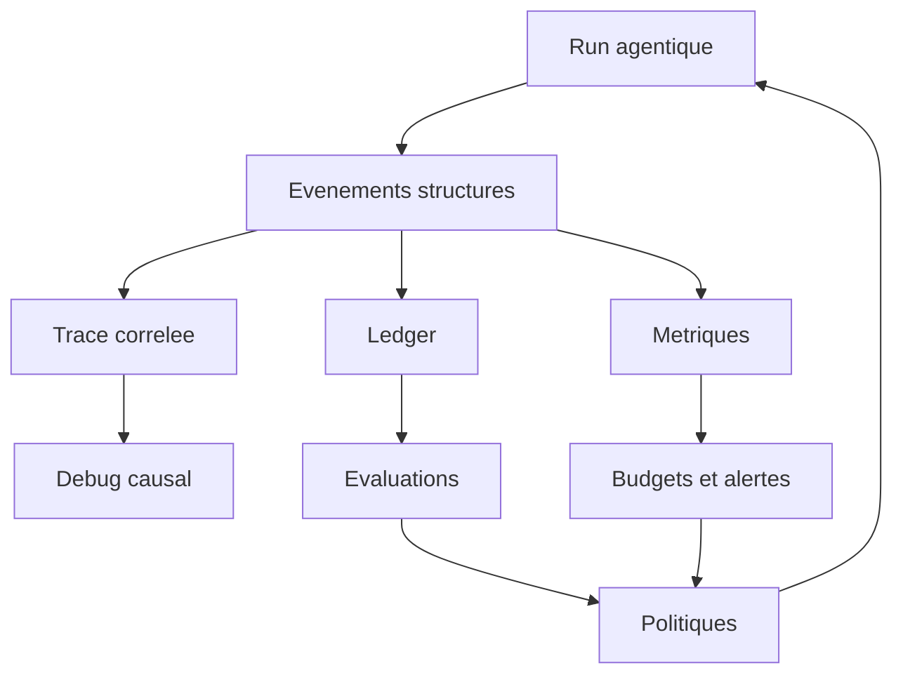

# Performance, efficacite et observabilite des systemes agentiques

## These

La performance d'un systeme agentique ne se mesure pas a la vitesse d'un appel modele. Elle se mesure au cout par tache reussie, verifiee et recuperable.

Un agent rapide qui hallucine, boucle, oublie son contexte ou agit sans preuve est moins performant qu'un systeme plus controle qui termine correctement et laisse un audit exploitable.

## Dimensions de performance

| Dimension | Question a poser | Mauvaise mesure | Bonne mesure |
| --- | --- | --- | --- |
| Latence | Combien coute le run de bout en bout ? | Temps d'un appel LLM isole | Latence par classe de tache et par phase. |
| Cout tokens | Quel volume est consomme pour produire une preuve ? | Tokens par message | Cout par tache reussie et verifiee. |
| Qualite | Le resultat est-il juste et exploitable ? | Note subjective | Tests, evals, contrats de sortie, review. |
| Robustesse | Que se passe-t-il quand un outil echoue ? | Taux de succes happy path | Reprise, retries bornes, etats bloques explicites. |
| Contexte | L'agent sait-il quoi lire et quoi ignorer ? | Taille maximale du contexte | Precision de recuperation et perte informationnelle. |
| Securite | L'agent peut-il nuire ? | Absence d'incident observe | Taux de blocage, tests adversariaux, preuve de policy. |
| Operabilite | Peut-on comprendre un echec ? | Logs bruts | Trace correlee intention, action, resultat, validation. |

## Observations par mecanisme

### Prompt compression

`LLMLingua` montre que la compression de prompt peut reduire fortement cout et taille de contexte, tout en conservant l'information utile si elle est calibree. Le corpus signale aussi un danger : la compression peut supprimer des contraintes rares mais critiques.

Le bon usage n'est donc pas : compresser tout. Le bon usage est : compresser selon le role du contexte.

| Type de contexte | Compression recommandee | Risque |
| --- | --- | --- |
| Logs volumineux | Forte compression possible | Perte d'un signal rare. |
| Documentation generale | Compression moderee | Perte de nuance. |
| Instructions systeme | Compression tres faible | Suppression d'un invariant. |
| Preuves de test | Pas de compression destructive | Fausse conclusion. |
| Secrets ou donnees sensibles | Filtrage avant compression | Fuite ou retention indesirable. |

### Graph context

`CodeGraphContext` et `graphify` montrent une idee cle : l'agent doit naviguer par structure, pas seulement par recherche textuelle.

Un graphe de code ou de connaissance ameliore trois choses.

- Il reduit les lectures inutiles.
- Il rend les dependances visibles.
- Il force la distinction entre relation extraite, inferee et ambigue.

Le defaut principal est la stale knowledge. Un graphe perime devient plus dangereux qu'une absence de graphe, car il donne une impression d'autorite.

### Memoire persistante

`mempalace`, `beads`, `gas town` et les sessions de frameworks agents montrent que la memoire est utile quand elle est structuree.

| Forme de memoire | Exemple | Valeur |
| --- | --- | --- |
| Verbatim semantique | `mempalace` | Retrouver une decision ou une preference sans resume destructeur. |
| Issue graph | `beads` | Piloter dependances, blocages, claims et etat de travail. |
| Session store | `openai-agents-python`, `openclaw` | Reprendre une conversation ou un run. |
| Code graph | `CodeGraphContext`, `graphify` | Orienter l'exploration dans un repo. |
| Checkpoint state | `langgraph`, `agent-framework` | Reprendre un workflow long ou interrompu. |

La memoire efficace respecte trois regles.

- Elle cite sa provenance.
- Elle expose sa fraicheur.
- Elle peut etre invalidee.

### Parallelisme et batching

Le corpus montre plusieurs styles de parallelisme.

- `superpowers` recommande un agent par domaine independant.
- `switchboard` route des lots de plans a des lanes specialisees.
- `Octogent` propose un worker pool local.
- `ruflo` pousse la logique de swarm et consensus.
- `vscode-copilot-chat` fournit des outils ou le modele peut appeler plusieurs capacites selon le contexte.

Le parallelisme ameliore le debit uniquement si les taches sont independantes. Sinon, il amplifie les conflits.

| Situation | Strategie efficace | Strategie dangereuse |
| --- | --- | --- |
| Bugs dans modules independants | Agents separes, scopes etroits | Un agent global qui melange les causes. |
| Refactoring partage | Sequence controlee | Agents concurrents sur memes fichiers. |
| Recherche documentaire | Batching par corpus | Repeter le meme contexte partout. |
| Implementation produit | Lane plan -> code -> review -> acceptation | Swarm libre sans ledger. |
| Securite | Analyse parallele par famille d'attaque | Exploitation non bornee. |

### Observabilite

`langfuse`, `agent-framework`, `vscode-copilot-chat`, `kagent` et `gascity-otel` convergent sur un principe : sans trace, on ne pilote pas, on raconte.

Une trace exploitable doit relier :

- l'intention initiale ;
- le plan retenu ;
- le modele et les parametres ;
- les outils proposes ;
- les outils appeles ;
- les resultats des outils ;
- les decisions de continuation ;
- les validations ;
- les erreurs et blocages ;
- le cout et les tokens ;
- les interventions humaines.

## Scorecard d'efficacite

| Famille | Efficacite brute | Efficacite verifiee | Cout de controle | Commentaire |
| --- | ---: | ---: | ---: | --- |
| Agent mono-boucle | Forte sur tache simple | Moyenne | Faible | Tres bon pour apprendre, fragile pour runs longs. |
| Multi-agent par roles | Forte si partitionnable | Variable | Moyen | Depend de la qualite des handoffs. |
| Workflow procedural | Moyenne | Forte | Moyen | Excellent ratio qualite/risque. |
| Graphe d'etat | Moyenne a forte | Tres forte | Eleve | Meilleure base pour production critique. |
| Plateforme visuelle | Forte en adoption | Moyenne | Moyen | Necessite un ledger externe fiable. |
| Control plane infra | Variable | Tres forte | Eleve | Pertinent pour multi-tenant et actions risquees. |
| Memoire et contexte | Forte si gouvernee | Forte | Moyen | Reduit la relecture, augmente les risques de stale context. |
| Observabilite et evals | Indirecte | Tres forte | Moyen | Ne produit pas la valeur seule, mais rend le systeme ameliorable. |

## Indicateurs recommandes

### Indicateurs de run

| Indicateur | Description | Decision permise |
| --- | --- | --- |
| `run_success_verified` | Succes avec preuve, pas simple declaration. | Mesurer le vrai taux de reussite. |
| `tool_call_count` | Nombre d'actions outil. | Detecter loops et bruit. |
| `tool_error_rate` | Echecs outil par run. | Ameliorer wrappers et retries. |
| `human_interrupt_count` | Nombre d'interventions humaines. | Calibrer friction et autonomie. |
| `resume_success` | Reprise depuis checkpoint. | Evaluer resilience. |
| `cost_per_verified_task` | Cout total divise par taches validees. | Comparer modeles et strategies. |
| `context_hit_quality` | Qualite de recuperation memoire/contexte. | Ajuster index et retrieval. |
| `policy_block_count` | Actions bloquees par policy. | Mesurer securite reelle. |

### Indicateurs de produit

| Indicateur | Description | Risque detecte |
| --- | --- | --- |
| Drift de scope | Ecart entre mission et sortie. | Subagent drift. |
| Dette memoire | Memoires obsoletes utilisees. | Memory poisoning ou stale context. |
| Taux de silent stall | Runs sans progres ni etat final. | Absence de watchdog. |
| Taux de rework | Taches rouvertes apres validation. | Validation insuffisante. |
| Couverture eval | Scenarios evalues vs scenarios supportes. | Fausse confiance. |

## Patterns de performance observes

### Pattern 1 : contexte en couches

Les systemes efficaces ne donnent pas tout le contexte a tout le monde. Ils separent contexte global stable, contexte de tache, contexte de fichier, memoire pertinente et preuves fraiches.

`superpowers` et `BMAD-METHOD` le font par skills et workflows. `graphify` le fait par graph report et requetes ciblees. `mempalace` le fait par wings, rooms et drawers.

### Pattern 2 : routage cout/risque

`switchboard` met en scene le routage par complexite, avec lanes Planner, Lead Coder, Coder, Intern, Reviewer et Acceptance Tester. Le principe est generalisable : le modele ou l'agent premium doit etre reserve aux decisions a fort risque ou forte ambiguite.

Un routeur mature tient compte de criticite, complexite, besoin de raisonnement, besoin d'outils, surface de securite, cout et historique de reussite par type de tache.

### Pattern 3 : preuve attachee au ledger

`superpowers` insiste sur evidence before claims. `gas town` stocke le travail dans `beads`. `openai-agents-python` et `langgraph` structurent sessions et etat. La lecon : la preuve doit etre attachee au run, pas noyee dans une conversation.

### Pattern 4 : sandbox comme optimisation indirecte

La sandbox ralentit parfois l'action individuelle, mais augmente l'efficacite globale en reduisant les degats, reprises manuelles et audits defensifs. `agent-sandbox`, `openclaw`, `openai-agents-python` et `shannon` montrent que l'isolation est une condition de passage a l'echelle.

### Pattern 5 : observabilite native

Ajouter Langfuse ou OpenTelemetry apres coup est possible, mais les meilleurs designs prevoient la trace dans le modele d'etat. L'observabilite n'est pas un add-on ; c'est le systeme nerveux du pilotage.

## Anti-patterns de performance

| Anti-pattern | Symptome | Correction |
| --- | --- | --- |
| Contexte total | Le modele recoit trop et rate l'essentiel. | Retrieval structure + compression controlee. |
| Swarm par defaut | Beaucoup de sorties, peu de decisions. | Paralleliser seulement les taches independantes. |
| Prompt-only routing | Les agents choisissent sans matrice stable. | Routeur deterministe avec override explicite. |
| Logs bruts | Impossible de comprendre une panne. | Trace correlee et schema d'evenements. |
| Validation narrative | L'agent dit que c'est bon. | Preuve fraiche attachee au ledger. |
| UI optimiste | Le board affiche termine mais le run n'a pas valide. | Statut derive du ledger runtime. |
| Memoire sans TTL | Une decision obsolete influence l'action. | Freshness, invalidation et provenance. |

## Playbook de mesure

### Etape 1 : definir les classes de taches

Ne mesure pas un taux global unique. Classe les taches : recherche, planification, code, revue, test, documentation, securite, operation.

### Etape 2 : definir le contrat de reussite

Chaque classe doit avoir un contrat verifiable. Exemple : une tache de code est reussie si le diff repond au plan, les tests cibles passent et les validations adjacentes pertinentes ne regressent pas.

### Etape 3 : instrumenter les transitions

Chaque transition doit produire un evenement. Les evenements doivent inclure `run_id`, `task_id`, `agent_id`, `tool_id`, `state_before`, `state_after`, `evidence_uri` et `policy_decision`.

### Etape 4 : mesurer la perte contextuelle

Pour tout mecanisme de compression ou retrieval, compare la reponse obtenue avec contexte brut, contexte compresse, contexte graphe et memoire recuperee.

### Etape 5 : etablir des budgets

Les budgets doivent couvrir tokens, outils, limite d'execution, concurrence, retries, taille de contexte, fichiers touches et surface de permissions.

## Architecture d'observabilite cible

## Recommandations

1. Mesurer le cout par tache validee, pas le cout par appel modele.
2. Rendre chaque etat de run explicite : actif, bloque, escalade, annule, termine, verifie.
3. Separer memoire de session, memoire projet, memoire utilisateur et graph de code.
4. Compresser le contexte seulement apres classification du type de contenu.
5. Utiliser le parallelisme comme accelerateur de taches independantes, pas comme strategie par defaut.
6. Instrumenter les tool calls avant de multiplier les agents.
7. Attacher la preuve au ledger, pas au transcript seul.
8. Prevoir le mode degrade : outil indisponible, modele indisponible, sandbox bloquee, budget atteint.

## Conclusion

L'efficacite agentique est une propriete de systeme. Elle nait de l'assemblage entre routage, contexte, memoire, outils, etat, politiques, validation et observabilite. Le modele LLM est important, mais il ne remplace aucune de ces couches.
