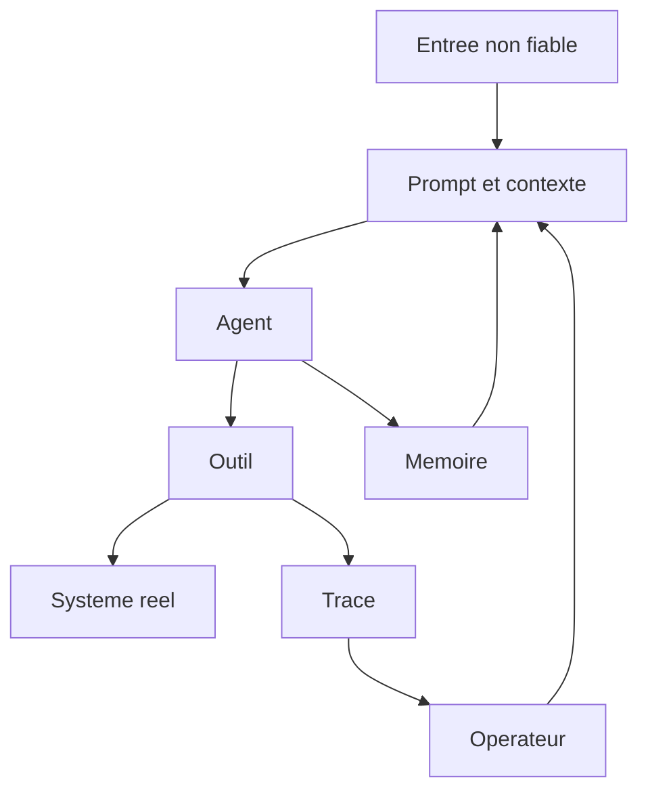

# Defauts, risques et garde-fous du pilotage agentique

## These

Un systeme agentique echoue rarement parce qu'il manque d'intelligence. Il echoue parce qu'il manque de bornes.

Les risques principaux ne sont pas seulement des hallucinations textuelles. Ce sont des actions mal routees, des outils trop puissants, une memoire contaminee, des couts non bornes, des sessions bloquees et des interfaces qui donnent une impression de controle sans preuve runtime.

## Modele de menace



Chaque fleche peut etre attaquee. La securite ne peut donc pas vivre uniquement dans le prompt systeme.

## Risques prioritaires

| Risque | Description | Depots qui eclairent le risque | Garde-fou principal |
| --- | --- | --- | --- |
| Goal hijack | L'objectif de l'agent est redirige par entree, outil ou memoire. | `LLMSecurityGuide`, `browser-use`, `openclaw` | Intention signee, scope borne, validation humaine sur changement d'objectif. |
| Tool misuse | L'agent utilise un outil legitime de facon dangereuse. | `vscode-copilot-chat`, `openai-agents-python`, `shannon` | Policy engine par outil et confirmation sur effet de bord. |
| Privilege abuse | L'agent herite de permissions trop larges. | `openclaw`, `kagent`, `agent-sandbox` | Least privilege, identite par session, sandbox. |
| Memory poisoning | Une donnee persistante corrompt les decisions futures. | `mempalace`, `graphify`, `CodeGraphContext` | Provenance, invalidation, statut extrait/infere/ambigu. |
| Silent stall | Un run ne progresse plus sans etat final. | `gas town`, `switchboard`, `pixel-agents` | Watchdog, heartbeat, etats bloques explicites. |
| Runaway cost | Boucles, retries ou parallelisme explosent le budget. | `ruflo`, `Octogent`, `switchboard` | Budget par run, concurrence bornee, coupe-circuit. |
| Subagent drift | Un sous-agent optimise une sous-tache et oublie l'objectif global. | `superpowers`, `BMAD-METHOD`, `crewAI` | Handoff structure, revue de conformite, scope strict. |
| False UI truth | L'interface affiche un etat different du runtime reel. | `switchboard`, `pixel-agents`, `tmux-adapter` | UI derivee du ledger, synchronisation et statut de confiance. |
| Supply chain agentique | Tools, MCP, skills ou personas malveillants. | `LLMSecurityGuide`, `graphify`, `claude-skills` | Registre signe, allow-list, review, pinning. |
| Prompt compression loss | Une contrainte critique disparait pendant compression. | `LLMLingua` | Classement du contexte, tests de perte, no-compress zones. |

## Defauts recurrents observes

### Defaut 1 : orchestration confondue avec prompt engineering

Un prompt peut orienter. Il ne peut pas garantir une transition d'etat, une reprise, une politique d'outil ou une preuve de validation.

Le bon design deplace les garanties hors du prompt : schema, ledger, policy engine, tests, sandbox, observabilite.

### Defaut 2 : agents specialises sans protocole de handoff

Les roles sont utiles seulement si le passage de relais est structure.

Un handoff minimal contient mission, contexte suffisant, non-objectifs, fichiers ou surfaces autorisees, preuves attendues, conditions d'escalade et format de sortie.

### Defaut 3 : memoire sans statut epistemique

Une memoire peut etre vraie, perimee, inferee, ambigue ou fausse. Si le systeme ne distingue pas ces etats, il traite toute recuperation comme verite.

Le pattern robuste de `graphify` est utile : relation extraite, inferee ou ambigue. Il faut generaliser ce statut a toute memoire agentique.

### Defaut 4 : sandbox optionnelle sur actions mutantes

L'execution de code, la navigation authentifiee, les commandes shell et les operations reseau doivent etre isolees par defaut des que la tache touche une surface reelle.

`agent-sandbox` montre un modele infra. `openclaw` distingue sessions main et non-main. `shannon` illustre le besoin de bornes quand un agent execute des exploits autorises.

### Defaut 5 : observabilite installee apres la panne

Les traces ajoutees apres incident ne reconstruisent pas toujours les decisions internes. Le modele d'evenement doit etre present des la conception.

## Garde-fous par couche

| Couche | Garde-fous obligatoires | Preuve attendue |
| --- | --- | --- |
| Entree utilisateur | Classification de risque, normalisation, refus ou clarification sur ambiguite critique. | Log de decision de routage. |
| Routage | Matrice type x risque x complexite x capacite. | Route choisie et justification. |
| Planification | Plan verifiable, taches atomiques, dependances. | Plan lie au ledger. |
| Delegation | Handoff structure, scope, budgets. | Carte de dispatch stockee. |
| Tool calls | Schema, allow-list, confirmation, policy. | Invocation et decision policy. |
| Execution | Sandbox, limite d'execution, rollback, idempotence. | Trace d'environnement et sortie. |
| Memoire | Provenance, freshness, invalidation, separation scopes. | Source et statut de chaque memoire. |
| Validation | Tests, evals, review, preuve fraiche. | Evidence URI attachee. |
| UI | Projection du ledger, pas source de verite. | Statut runtime synchronise. |
| Incident | Escalade, dead-letter, pause, annulation. | Etat final explicite. |

## Garde-fous de securite

### Least agency

Un agent recoit l'autonomie minimale necessaire. Cela signifie :

- pas d'acces global aux fichiers si une sous-arborescence suffit ;
- pas de shell si une API typee suffit ;
- pas d'ecriture si lecture suffit ;
- pas de reseau si la tache est locale ;
- pas de memoire persistante si le contexte est ponctuel.

### Policy engine

Les decisions de securite doivent etre structurees.

```yaml
action_policy:
  read_file:
    risk: low
    approval: never
  edit_file:
    risk: medium
    approval: scoped
  shell_command:
    risk: high
    approval: required_when_mutating
  network_request:
    risk: high
    approval: required_when_external
  secret_access:
    risk: critical
    approval: explicit
```

### Approvals contextuels

La confirmation doit expliquer le risque reel. Confirmer "lancer une commande" ne suffit pas. Il faut montrer commande, repertoire, fichiers touches possibles, reseau, secrets, effet irreversible et plan de rollback.

### Sandboxing

Le sandboxing doit couvrir filesystem, reseau, processus, variables d'environnement, secrets, cycle de vie, artefacts de sortie et logs.

## Anti-patterns critiques

| Anti-pattern | Pourquoi c'est dangereux | Remplacement correct |
| --- | --- | --- |
| Swarm sans ledger | Personne ne sait qui fait quoi ni pourquoi. | Ledger de missions et claims atomiques. |
| UI comme verite | L'etat reel peut diverger. | UI comme projection synchronisee. |
| Outils globaux | L'agent peut toucher trop large. | Scopes et allow-lists. |
| Memoire totale | Le faux et l'obsolete persistent. | Memoire gouvernee avec provenance. |
| Succes narratif | Le resultat est cru sans preuve. | Verification fraiche obligatoire. |
| Retry infini | Cout et bruit explosent. | Retries bornes et dead-letter queue. |
| Prompt de securite seul | Le modele peut ignorer ou oublier. | Policies hors modele. |
| Compression aveugle | Contraintes critiques supprimees. | Zones non compressibles. |
| Handoff brut | Le sous-agent invente son scope. | Dispatch card structuree. |

## Grille Go/No-Go

| Domaine | Go | No-Go |
| --- | --- | --- |
| Etat | Tous les runs ont etat final explicite ou blocage explicite. | Un run peut mourir silencieusement. |
| Outils | Chaque outil a schema, portee, risque et policy. | Un shell ou navigateur a acces large sans controle. |
| Memoire | Toute memoire a source, date, scope et statut. | Les agents consomment memoire indistincte. |
| Validation | La cloture exige preuve fraiche. | La cloture repose sur declaration de l'agent. |
| Observabilite | Run, tool calls et validations sont correles. | Logs non correles ou transcripts seulement. |
| Securite | Prompt injection, tool misuse et memory poisoning sont testes. | Les tests ne couvrent que le happy path. |
| UI | Le cockpit indique la confiance de synchronisation. | Les cartes sont modifiees hors ledger. |
| Budget | Cout, concurrence et retries sont bornes. | Parallelisme libre et budgets implicites. |

## Protocole d'incident

Un systeme agentique doit savoir s'arreter proprement.

Etats recommandes :

- `running` : travail actif ;
- `waiting_approval` : action bloquee par decision humaine ;
- `blocked` : dependance ou erreur recuperable ;
- `escalated` : intervention experte requise ;
- `paused` : arret volontaire avec reprise possible ;
- `cancelled` : arret demande ou policy ;
- `failed` : echec non recupere ;
- `verified` : termine avec preuve ;
- `archived` : sortie durable classee.

Le point important : `blocked`, `escalated`, `paused` et `cancelled` sont des etats sains. Le vrai echec est le stall silencieux.

## Tests adversariaux necessaires

| Test | Objectif |
| --- | --- |
| Injection dans contenu lu | Verifier que l'agent ne suit pas des instructions cachees dans fichiers ou pages. |
| Tool output poisoning | Verifier qu'un resultat outil malicieux ne change pas l'objectif. |
| Memory poisoning | Verifier qu'une memoire falsifiee ne devient pas verite durable. |
| Budget runaway | Verifier les coupe-circuits sur boucle et parallelisme. |
| Permission escalation | Verifier qu'un agent ne peut pas elargir son scope seul. |
| UI desync | Verifier que le cockpit detecte divergence runtime. |
| Sandbox escape | Verifier que les actions dangereuses restent contenues. |
| Handoff drift | Verifier qu'un sous-agent respecte mission et non-objectifs. |

## Recommandations finales

1. Placer les politiques hors du prompt.
2. Ne jamais exposer un outil puissant sans scope et audit.
3. Rendre chaque blocage explicite et visible.
4. Refuser la memoire sans provenance.
5. Exiger une preuve fraiche avant toute cloture.
6. Deployer la sandbox avant l'autonomie large.
7. Versionner les workflows, tools, skills et policies.
8. Tester les attaques agentiques comme des cas produit normaux.

## Conclusion

Les bons systemes agentiques n'empechent pas seulement les erreurs. Ils rendent les erreurs localisables, bornees et recuperables. C'est cette capacite a contenir l'echec qui separe un prototype impressionnant d'un vrai projet de pilotage.
