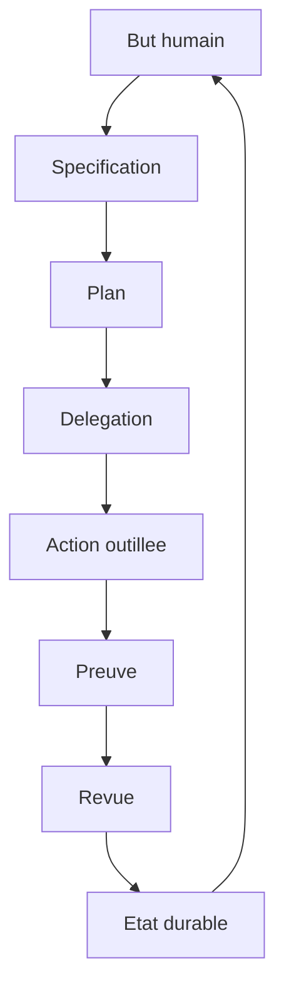
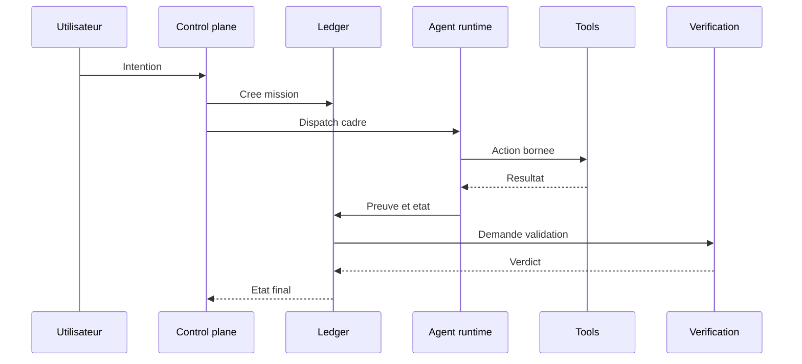

# Guide d'enseignement pour creer un vrai projet de pilotage agentique

## Objectif pedagogique

Ce document enseigne comment creer un vrai projet de pilotage agentique. Il ne s'agit pas de "mettre plusieurs agents ensemble". Il s'agit de construire un systeme capable de cadrer, router, executer, observer, securiser, reprendre et verifier le travail d'agents.

Le bon resultat attendu : un control plane ou les agents sont des travailleurs specialises, pas des sources de verite incontrolees.

## Definition

Un projet de pilotage agentique est un systeme qui transforme une intention humaine en un ensemble d'actions agentiques controlees, observables et verifiables.

Il contient au minimum :

- un modele d'etat ;
- un routeur d'intention ;
- des agents ou runtimes ;
- des outils bornes ;
- une memoire gouvernee ;
- une politique de securite ;
- une file de validation ;
- une observabilite ;
- une surface operateur.

## Le modele mental



Le systeme boucle, mais il ne boucle pas dans le vide. Chaque passage produit un etat et une preuve.

## Partie 1 : les types de pilotage

### Pilotage par prompt

C'est le niveau le plus simple. On ecrit une instruction et on espere que le modele suit.

Il est utile pour apprendre, mais insuffisant pour production. Il ne garantit ni reprise, ni preuve, ni politique d'action.

A enseigner comme base, pas comme architecture cible.

### Pilotage par tools

L'agent possede des outils types. La qualite depend de la precision du schema, des erreurs et de la description.

A enseigner tot, car un mauvais outil cree plus de degats qu'un mauvais prompt.

Principes :

- un outil fait une chose claire ;
- les entrees sont validees ;
- les effets de bord sont explicites ;
- les erreurs disent quoi faire ensuite ;
- les outils dangereux demandent confirmation.

### Pilotage par workflow

Le systeme impose des etapes : cadrer, planifier, faire, tester, relire, valider.

`BMAD-METHOD` et `superpowers` sont de bons modeles pedagogiques : ils rendent la methode visible et obligent l'agent a ne pas sauter les phases.

A enseigner comme discipline de projet.

### Pilotage par graphe d'etat

Le systeme modelise le run comme un graphe de noeuds et transitions.

`langgraph`, `agent-framework` et `openai-agents-python` montrent le type de fondation utile pour les workflows longs : checkpointing, human-in-the-loop, sessions, handoffs, tracing.

A enseigner comme architecture de robustesse.

### Pilotage par equipes d'agents

Plusieurs agents se partagent le travail. Ce modele marche si les responsabilites sont separees et les handoffs structures.

A enseigner avec prudence : le multi-agent n'est pas un multiplicateur magique. Il devient efficace quand les taches sont partitionnables.

### Pilotage par cockpit visuel

Une UI ou un kanban permet d'observer et declencher.

`switchboard` et `pixel-agents` montrent l'interet d'une surface operateur. Le piege est de faire de l'UI la verite.

A enseigner comme surface de supervision, pas comme base runtime.

### Pilotage par infrastructure declarative

`kagent` et `agent-sandbox` montrent un niveau plus industriel : agents, tools et sandboxes comme ressources declaratives.

A enseigner pour multi-tenant, audit et actions risquees.

## Partie 2 : architecture cible

### Composants

| Composant | Role | A ne pas confondre avec |
| --- | --- | --- |
| Mission ledger | Source de verite des missions, taches, etats et preuves. | Tableau kanban. |
| Routeur | Choisit workflow, agent, modele et policy. | Prompt systeme. |
| Workflow engine | Execute etapes et transitions. | Liste de taches libre. |
| Agent runtime | Appelle modele et outils dans un scope. | Orchestrateur global. |
| Tool registry | Decrit outils, schemas, risques et permissions. | Liste de commandes shell. |
| Memory layer | Fournit contexte source et invalidable. | Historique brut complet. |
| Policy engine | Autorise, bloque ou demande confirmation. | Phrase de securite dans un prompt. |
| Verification queue | Stocke les preuves a verifier. | Message "c'est fini". |
| Observability | Trace, mesure, compare et alerte. | Logs texte non correles. |
| Operator UI | Visualise et permet l'intervention. | Source de verite. |

### Data flow



## Partie 3 : le modele de donnees minimal

### Mission

```yaml
mission:
  id: mission-001
  objective: produire un rapport comparatif
  owner: user
  risk_level: L2
  status: running
  success_contract:
    - livrables crees
    - sources consultees
    - validation documentaire passee
```

### Task

```yaml
task:
  id: task-001
  mission_id: mission-001
  title: analyser les modeles de pilotage
  assignee_type: agent
  state: running
  allowed_surfaces:
    - docs
    - read_only_repos
  blocked_by: []
  evidence: []
```

### Tool policy

```yaml
tool_policy:
  tool: shell_command
  allowed: true
  scope: read_only_inventory
  approval: required_if_mutating
  logs_required: true
```

### Evidence

```yaml
evidence:
  id: evidence-001
  task_id: task-001
  kind: command_output
  source: inventory_run
  freshness: current_session
  verdict: accepted
```

## Partie 4 : les obligatoires

### Obligatoire 1 : etat explicite

Chaque mission et chaque tache doit avoir un etat. Les etats sains incluent `blocked`, `escalated`, `paused` et `cancelled`. Un systeme mature prefere un blocage visible a une fausse progression.

### Obligatoire 2 : separation plan/execution/validation

La meme sortie ne doit pas servir a la fois de plan, d'action et de preuve. Les trois responsabilites doivent etre separees.

### Obligatoire 3 : outils bornes

Les outils doivent etre decrits pour le modele et pour le runtime. Le modele a besoin de savoir quand appeler l'outil. Le runtime a besoin de savoir ce que l'outil a le droit de faire.

### Obligatoire 4 : memoire gouvernee

La memoire doit avoir un scope, une provenance, un statut et une invalidation possible.

### Obligatoire 5 : preuve fraiche

La cloture exige une preuve actuelle. Un transcript ou une promesse ne suffit pas.

### Obligatoire 6 : securite hors prompt

Le prompt peut expliquer les regles. Il ne doit pas etre l'unique mecanisme qui les applique.

### Obligatoire 7 : observabilite native

Si le systeme ne permet pas de reconstruire pourquoi une action a ete prise, il n'est pas pilotable.

### Obligatoire 8 : budget

Chaque run doit avoir des limites : cout, outils, fichiers, retry, concurrence, contexte et autonomie.

## Partie 5 : choisir son architecture

### Projet personnel local

Recommandation : agent mono-boucle + skills + memoire legere + verification.

A reprendre : `superpowers`, `andrej-karpathy-skills`, `Octogent`, `mempalace`.

### Assistant de developpement serieux

Recommandation : workflow procedural + graph context + terminal lifecycle + preuves.

A reprendre : `BMAD-METHOD`, `vscode-copilot-chat`, `graphify`, `CodeGraphContext`, `superpowers`.

### Produit agentique en production

Recommandation : graphe d'etat + observabilite + guardrails + evals + memory layer.

A reprendre : `langgraph`, `agent-framework`, `openai-agents-python`, `langfuse`, `haystack`.

### Systeme multi-agent d'equipe

Recommandation : lanes, roles, ledger, review, acceptance testing, budgets.

A reprendre : `switchboard`, `gas town`, `crewAI`, `BMAD-METHOD`, `superpowers`.

### Environnement a risque

Recommandation : sandbox, RBAC, policy engine, audit, security evals.

A reprendre : `agent-sandbox`, `kagent`, `shannon`, `LLMSecurityGuide`, `openclaw`.

## Partie 6 : exercices d'enseignement

### Exercice 1 : construire un agent outille

Objectif : creer un agent qui lit un dossier, produit un resume et cite les fichiers consultes.

Critere de reussite : outils types, logs d'appels, sortie structuree et refus si le dossier n'existe pas.

### Exercice 2 : ajouter un workflow

Objectif : imposer les phases cadrage, plan, execution, validation.

Critere de reussite : aucune execution sans plan, etat de chaque phase et preuve attachee a la validation.

### Exercice 3 : ajouter un ledger

Objectif : stocker missions, taches, statuts, preuves et blocages.

Critere de reussite : source de verite independante de l'UI, taches atomiquement claimees et etat final explicite.

### Exercice 4 : ajouter des policies

Objectif : bloquer ou confirmer les actions a risque.

Critere de reussite : shell mutating soumis a policy, reseau externe soumis a policy et secrets jamais exposes dans prompts.

### Exercice 5 : ajouter memoire et graph context

Objectif : orienter l'agent vers les bonnes sources sans tout relire.

Critere de reussite : provenance affichee, statut extrait/infere/ambigu et invalidation possible.

### Exercice 6 : ajouter observabilite et evals

Objectif : mesurer cout, reussite, erreurs et derive.

Critere de reussite : trace correlee, dataset de tests et metrique cout par tache validee.

## Partie 7 : erreurs pedagogiques a eviter

### Commencer par un swarm

Le swarm impressionne, mais il masque les fondamentaux. Il faut d'abord enseigner le ledger, les tools, les policies et la validation.

### Enseigner les prompts avant les systemes

Le prompt est une interface. Le systeme est l'architecture qui maintient l'etat et applique les regles.

### Ignorer les echecs

Un bon cours doit inclure les pannes : tool indisponible, memoire fausse, budget atteint, conflit de taches, injection, sandbox bloquee.

### Montrer une UI sans expliquer la verite runtime

Une UI peut rendre le systeme comprehensible, mais elle doit etre presentee comme une projection du ledger.

## Partie 8 : grille de maturite

| Niveau | Description | Limite |
| --- | --- | --- |
| Niveau 0 | Prompt manuel. | Non pilotable. |
| Niveau 1 | Agent outille. | Peu de reprise et de validation. |
| Niveau 2 | Workflow explicite. | Peut manquer d'observabilite. |
| Niveau 3 | Ledger et preuves. | Base serieuse, encore mono-runtime. |
| Niveau 4 | Multi-agent controle. | Demande budgets et policies. |
| Niveau 5 | Control plane observable et sandboxe. | Niveau cible pour production sensible. |

## Partie 9 : cahier des charges minimal

Un vrai projet de pilotage agentique doit livrer les elements suivants.

| Element | Description |
| --- | --- |
| Mission Ledger | Missions, taches, etats, preuves, blocages. |
| Runtime Adapter | Interface stable vers chaque fournisseur d'agent. |
| Tool Registry | Outils, schemas, scopes, risques, policies. |
| Workflow Engine | Transitions, checkpoints, reprise, human interrupts. |
| Memory Service | Recherche, graph, provenance, invalidation. |
| Policy Engine | Autorisation, refus, confirmation, audit. |
| Verification Queue | Tests, evals, reviews, preuves. |
| Observability Pipeline | Traces, metriques, couts, incidents. |
| Operator Console | Vue missions, agents, blocages, budgets. |
| Incident System | Escalade, pause, annulation, reprise. |

## Partie 10 : meilleur chemin de construction

1. Construire le ledger.
2. Ajouter un runtime agent mono-boucle.
3. Ajouter un tool registry.
4. Ajouter un workflow simple.
5. Ajouter validation et preuves.
6. Ajouter observabilite.
7. Ajouter memoire gouvernee.
8. Ajouter policies.
9. Ajouter sandbox.
10. Ajouter multi-agent.
11. Ajouter cockpit visuel.
12. Ajouter evals adversariaux et optimisation cout.

Cet ordre evite de construire une interface brillante sur un etat fragile.

## Conclusion

Creer un vrai projet de pilotage agentique, c'est accepter que l'intelligence du modele ne remplace pas l'ingenierie du controle. Les agents deviennent utiles quand ils sont entoures de contrats, d'etats, de preuves, de limites et de boucles d'amelioration.

La formule simple a enseigner est :

```text
Pilotage agentique = etat durable + outils bornes + workflow + memoire gouvernee + preuve + observabilite + securite
```
