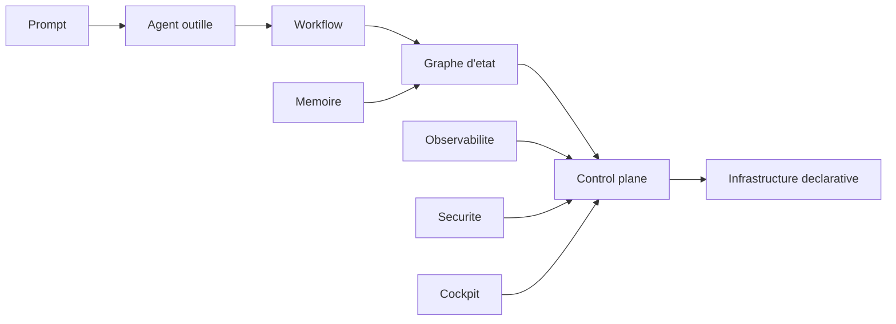

# Documentation technique de l'analyse pilotage agentique

## Portee

Ce document accompagne le package `analyse-pilotage-agentique-2026-04-25`. Il decrit la methode d'analyse, les familles de depots observees, les axes techniques retenus et les limites de l'etude.

Le package est un livrable de cadrage et d'enseignement. Il ne remplace pas un benchmark execute sur chaque framework, mais il fournit une base decisionnelle pour concevoir un projet de control plane agentique.

## Corpus analyse

Le corpus source est le dossier externe `/mnt/Travail/Projets/Dev/Référence-Agentique/`.

Familles principales observees :

- frameworks d'agents et orchestration : `langgraph`, `openai-agents-python`, `agent-framework`, `crewAI`, `haystack`, `Octogent`, `openclaw` ;
- workflows et methode : `BMAD-METHOD`, `superpowers`, `andrej-karpathy-skills`, `claude-skills` ;
- interfaces et cockpits : `switchboard`, `pixel-agents`, `langflow`, `dify`, `Design/ui` ;
- infrastructure et sandbox : `kagent`, `agent-sandbox`, `OpenHands`, `gas town` ;
- memoire, contexte et graphe : `mempalace`, `CodeGraphContext`, `graphify`, `beads` ;
- performance et compression : `LLMLingua` ;
- observabilite et evals : `langfuse`, `gascity-otel`, `vscode-copilot-chat` ;
- securite : `LLMSecurityGuide`, `shannon`.

## Methode

L'analyse a combine quatre niveaux.

1. Inventaire structurel des depots et sous-depots disponibles.
2. Lecture des README, manifests, fichiers de configuration et documents pivots.
3. Extraction de signaux par familles : orchestration, memoire, tools, workflow, sandbox, observabilite, securite, UI.
4. Contre-analyse specialisee sur architecture, performance, risques et efficacite.

La production finale consolide les convergences du corpus plutot que de classer les depots comme gagnants ou perdants.

## Axes d'evaluation

| Axe | Question technique |
| --- | --- |
| Etat | Le systeme represente-t-il le run comme un etat durable et reprenable ? |
| Routage | Comment choisit-il agent, modele, outil et workflow ? |
| Delegation | Les handoffs sont-ils structures et verifiables ? |
| Tools | Les outils sont-ils types, scopes, audites et confirmables ? |
| Memoire | Le contexte recupere a-t-il provenance, fraicheur et statut ? |
| Performance | Le cout est-il mesure par tache validee ? |
| Observabilite | Peut-on reconstruire pourquoi une action a ete prise ? |
| Securite | Les policies vivent-elles hors du prompt ? |
| UI | L'interface est-elle projection du ledger ou source de verite parallele ? |
| Validation | La cloture exige-t-elle des preuves fraiches ? |

## Taxonomie technique



Cette taxonomie n'est pas une hierarchie stricte de valeur. Elle indique la maturite de controle. Un projet peut utiliser un agent simple pour une tache simple, mais il doit connaitre le niveau de risque associe.

## Modele cible propose

Le modele cible recommande est un control plane modulaire.

| Module | Responsabilite |
| --- | --- |
| Mission Ledger | Source de verite des missions, taches, preuves, etats et blocages. |
| Router | Selection de workflow, agent, modele, sandbox et policy. |
| Workflow Engine | Transitions, checkpoints, reprise et interruptions humaines. |
| Agent Runtime Adapters | Abstraction des fournisseurs : IDE, CLI, SDK, service ou swarm. |
| Tool Registry | Schemas d'outils, scopes, risques, confirmations et logs. |
| Memory and Context Layer | Recherche, graphe, compression, provenance et invalidation. |
| Policy Engine | Decisions allow, deny, ask, sandbox, escalate. |
| Verification Layer | Tests, evals, reviews et preuves attachees. |
| Observability Pipeline | Traces, metriques, couts, alerts et datasets. |
| Operator UI | Projection temps reel du ledger et actions operateur controlees. |

## Invariants de conception

### Ledger first

Le ledger doit preceder le cockpit. Une UI peut etre refaite ; une source de verite confuse contamine tout le systeme.

### Policy outside prompt

Les prompts expliquent les regles, mais les policies les appliquent. Les outils, permissions et confirmations doivent etre geres par le runtime.

### Evidence before claims

La validation doit produire ou pointer vers une preuve : test, diff, commande, trace, evaluation, revue, artefact.

### Memory with epistemic status

Toute memoire doit avoir source, scope, fraicheur et statut : extrait, infere, ambigu, verifie, obsolete.

### UI as projection

La surface visuelle ne doit pas devenir une base d'etat parallele. Elle lit le ledger et ecrit via commandes controlees.

## Schema logique minimal

```yaml
mission:
  id: string
  objective: string
  risk_level: L0 | L1 | L2 | L3
  status: proposed | running | blocked | escalated | verified | failed | cancelled
  success_contract: list[string]

task:
  id: string
  mission_id: string
  status: proposed | claimed | running | blocked | review | verified | failed
  assignee: string
  allowed_surfaces: list[string]
  evidence_ids: list[string]

evidence:
  id: string
  task_id: string
  kind: command | test | review | trace | artifact
  uri: string
  verdict: pending | accepted | rejected

policy_decision:
  id: string
  action: string
  decision: allow | deny | ask | sandbox | escalate
  reason: string
```

## Limites

Cette analyse est comparative et qualitative. Elle ne fournit pas :

- un benchmark execute de chaque framework ;
- une mesure normalisee de latence par depot ;
- une certification securite ;
- une recommandation d'achat ;
- une architecture detaillee pour un contexte metier specifique.

Elle fournit en revanche une carte de conception, des invariants et une grille d'enseignement.

## Utilisation recommandee

Pour transformer cette analyse en projet concret :

1. Choisir le niveau de maturite vise.
2. Definir le ledger et le schema d'etat.
3. Selectionner un runtime agentique principal.
4. Definir les tools et leurs policies.
5. Ajouter la verification et les preuves.
6. Ajouter observabilite et datasets.
7. Ajouter memoire et graphe de contexte.
8. Ajouter sandbox et UI operateur.

## Critere de completion du package

Le package est complet si les sept fichiers suivants sont presents :

- `README.md` ;
- `01-cartographie-modeles-pilotage.md` ;
- `02-performance-efficacite-observabilite.md` ;
- `03-defauts-risques-garde-fous.md` ;
- `04-guide-enseignement-projet-pilotage-agentique.md` ;
- `DOC-TECHNIQUE-analyse-pilotage-agentique.md` ;
- `GUIDE-utilisation-analyse-pilotage-agentique.md`.
