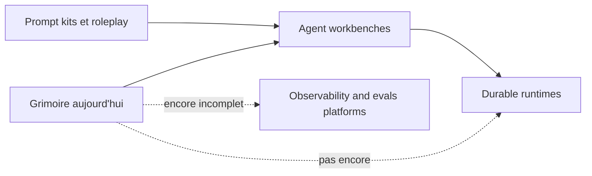

## Audit Agentique Complet — Grimoire

## Verdict

Grimoire n'est pas, a ce stade, un Agent OS industriel pleinement stabilise. En revanche, ce n'est deja plus un simple kit de prompts ou un assemblage de personas. Le projet occupe une position intermediaire rare : un **agent engineering workbench IDE-native** avec une these produit forte, un noyau SDK serieux, un bus MCP deja substantiel, et un actif differenciant concret cote interface operatoire, a savoir le runtime Game UI.

Le point central de l'audit est le suivant :

- **La vision est en avance sur l'execution.**
- **Le noyau SDK est plus mature que le workspace operationnel.**
- **Le runtime Game UI est plus concret que plusieurs promesses "Agent OS" encore documentaires.**
- **La gouvernance d'artefacts, la consolidation du runtime et la discipline d'observabilite sont les principaux goulots.**

En une phrase : **Grimoire est crediblement en train de devenir une plateforme agentique differenciee, mais il est encore plus proche d'un workbench ambitieux que d'un runtime de reference type LangGraph ou Agent Framework.**

## Methode

L'audit combine quatre sources :

- Le code et la documentation du noyau [`grimoire-kit/ARCHITECTURE.md`](../../grimoire-kit/ARCHITECTURE.md) et [`grimoire-kit/README.md`](../../grimoire-kit/README.md).
- Le runtime Grimoire et ses artefacts actifs, notamment [`_grimoire-runtime/core/agents/grimoire-master.md`](../../_grimoire-runtime/core/agents/grimoire-master.md), [`_grimoire-runtime/_memory/shared-context.md`](../../_grimoire-runtime/_memory/shared-context.md), [`_grimoire-runtime-output/GRIMOIRE_TRACE.md`](../../_grimoire-runtime-output/GRIMOIRE_TRACE.md) et [`_grimoire-runtime-output/planning-artifacts`](../../_grimoire-runtime-output/planning-artifacts).
- Les diagnostics internes executes le 2026-04-10 : preflight, harmony-check, early-warning et memory-lint.
- Les references externes structurantes confirmees par documentation officielle : OpenAI Agents SDK, LangGraph et Microsoft Agent Framework.

## Constats factuels

### 1. Le noyau SDK est serieux

Le coeur de [`grimoire-kit/ARCHITECTURE.md`](../../grimoire-kit/ARCHITECTURE.md) montre un vrai decoupage de plateforme : core, CLI, MCP, memoire, registre, tools, archetypes. Ce n'est pas une coquille marketing. Le serveur MCP de [`grimoire-kit/src/grimoire/mcp/server.py`](../../grimoire-kit/src/grimoire/mcp/server.py) expose **20 tools MCP**. Le repo compte **196 fichiers de tests Python**, **32 fichiers de tests TypeScript** pour le runtime Game UI, et **53 fichiers d'archetypes**.

Conclusion : le projet a deja depasse le stade "concept" sur le SDK. Il y a une vraie base produit, un vrai packaging et une vraie surface testee.

### 2. Le workspace operationnel est nettement moins harmonise

Les diagnostics du workspace racine sont beaucoup plus severes que ceux du SDK seul.

- Preflight workspace : `GO avec reserves`.
- Harmony workspace : **0/100**, avec **555 dissonances**.
- Repartition dominante : **511 duplications**, **10 references cassees**, **28 fichiers hors gabarit**, **6 problemes de nommage**.
- Early warning workspace : **WATCH**, avec **22 %** de commits recents relies a des corrections d'erreurs.

Le signal le plus important n'est pas le score lui-meme. C'est la nature des dissonances : le systeme souffre surtout d'un **exces d'artefacts proches**, pas d'un manque de contenu.

### 3. La duplication est devenue une dette structurelle

Le harmony check pointe massivement des agents au contenu tres proche dans [`_grimoire-runtime/bmm/agents`](../../_grimoire-runtime/bmm/agents), [`_grimoire-runtime/cis/agents`](../../_grimoire-runtime/cis/agents) et [`_grimoire-runtime/tea/agents`](../../_grimoire-runtime/tea/agents). Ce n'est pas un detail cosmetique : cela brouille les frontieres de responsabilite, rend le routage plus fragile et fait glisser le projet d'un "OS avec primitives nettes" vers un "catalogue de profils rhetoriques".

Cette dette touche directement votre promesse produit. Un Agent OS n'est pas un grand nombre d'agents. C'est un petit nombre de primitives stables, plus un systeme robuste de composition.

### 4. Le legacy et le runtime actif coexistent encore trop mal

Les references cassees detectees dans [`_grimoire/_config/custom/workflows/boomerang-orchestration.md`](../../_grimoire/_config/custom/workflows/boomerang-orchestration.md) et [`_grimoire/_config/custom/workflows/subagent-orchestration.md`](../../_grimoire/_config/custom/workflows/subagent-orchestration.md) montrent qu'une partie du patrimoine documentaire et des workflows ne suit plus la topologie actuelle du repo.

Le meme probleme apparait sur la memoire. Le linter de [`grimoire-kit/framework/tools/memory-lint.py`](../../grimoire-kit/framework/tools/memory-lint.py) inspecte principalement `_grimoire/_memory` et `_grimoire-output/Grimoire_TRACE.md`, alors que le projet opere largement via `_grimoire-runtime/_memory` et `_grimoire-runtime-output/GRIMOIRE_TRACE.md`. Autrement dit : **votre outillage d'audit memoire regarde encore surtout l'ancien centre de gravite**.

Ce point est majeur. En agentique, une memoire mal alignee vaut presque autant qu'une absence de memoire, car elle degrade la confiance du systeme.

### 5. L'observabilite existe, mais elle n'est pas encore unifiee

Le projet dispose d'ingredients solides :

- Une spec de trace dans [`grimoire-kit/framework/grimoire-trace.md`](../../grimoire-kit/framework/grimoire-trace.md).
- Un middleware de trace dans [`grimoire-kit/framework/tools/synapse-trace.py`](../../grimoire-kit/framework/tools/synapse-trace.py).
- Un evaluateur dans [`grimoire-kit/src/grimoire/core/evaluator.py`](../../grimoire-kit/src/grimoire/core/evaluator.py).
- Un trust scorer dans [`grimoire-kit/src/grimoire/core/trust_scorer.py`](../../grimoire-kit/src/grimoire/core/trust_scorer.py).

Mais la preuve operationnelle reste inegale. Le debut de [`_grimoire-runtime-output/GRIMOIRE_TRACE.md`](../../_grimoire-runtime-output/GRIMOIRE_TRACE.md) contient de nombreuses entrees `unknown -> unknown`, ce qui signale un probleme de qualite de donnees de trace. L'intention est bonne, l'instrumentation existe, mais la chaine complete "trace fiable -> replay utile -> diagnostic defendable" n'est pas encore totalement stabilisee.

### 6. Le bus MCP est reel et plus avance qu'il n'y parait

Le projet n'est pas en train de "decouvrir MCP". Il l'utilise deja comme axe structurant :

- Workspace MCP configure dans [`.vscode/mcp.json`](../../.vscode/mcp.json).
- Serveur MCP Grimoire dans [`grimoire-kit/src/grimoire/mcp/server.py`](../../grimoire-kit/src/grimoire/mcp/server.py).
- Proxy externe dans [`grimoire-kit/framework/tools/mcp-proxy.py`](../../grimoire-kit/framework/tools/mcp-proxy.py).
- Policy locale minimale dans [`_grimoire-runtime/_config/mcp-policy.yaml`](../../_grimoire-runtime/_config/mcp-policy.yaml).

Point positif : le serveur sait charger une policy, classifier les serveurs par transport, auth, mutabilite, niveau de confiance et signaler un mode `fail_closed_remote_hosts`.

Point limitant : la policy actuelle reste **minimale**, le proxy workspace est **integralement desactive** dans l'etat observe, et l'environnement courant ne permettait pas d'executer completement le rapport de policy du serveur faute de dependance `mcp` installee dans le contexte d'execution utilise. Donc la gouvernance MCP existe davantage comme **capacite du code** que comme **control plane pleinement opere**.

### 7. Le runtime Game UI est votre actif le plus concret et le plus defendable

Le runtime `grimoire-game` est, a ce stade, l'element le plus proche d'un vrai control plane agentique visible.

Preuves fortes :

- Contrats types et enveloppes canoniques dans [`grimoire-kit/apps/grimoire-game/src/contracts/schemas.ts`](../../grimoire-kit/apps/grimoire-game/src/contracts/schemas.ts).
- Gouvernance des mutations et RBAC fail-closed dans [`grimoire-kit/apps/grimoire-game/src/server/auth/rbac.ts`](../../grimoire-kit/apps/grimoire-game/src/server/auth/rbac.ts).
- Adaptateur runtime avec replay, idempotence, audit et erreurs bornees dans [`grimoire-kit/apps/grimoire-game/src/bridge/agent-adapter.ts`](../../grimoire-kit/apps/grimoire-game/src/bridge/agent-adapter.ts).
- Tests d'integration sur les surfaces gouvernees dans [`grimoire-kit/apps/grimoire-game/tests/integration/surface-governance.test.ts`](../../grimoire-kit/apps/grimoire-game/tests/integration/surface-governance.test.ts).
- Tests de contrat sur l'enveloppe canonique dans [`grimoire-kit/apps/grimoire-game/tests/contracts/canonical-envelope-pilot.contract.test.ts`](../../grimoire-kit/apps/grimoire-game/tests/contracts/canonical-envelope-pilot.contract.test.ts).

Le verdict ici est net : **la Game UI n'est pas un gadget graphique**. C'est actuellement la meilleure incarnation executable de votre these "observability + replay + bounded control plane".

## Positionnement par rapport au marche

### Face a OpenAI Agents SDK

Les documents officiels de l'OpenAI Agents SDK le positionnent autour d'un petit noyau de primitives : **Agents, Tools, Handoffs, Guardrails, Sessions, Tracing**, avec un discours explicite de minimalisme et de production readiness.

Comparaison :

- Grimoire est **plus riche** en organisation, en protocole humain, en packaging de roles et en conventions projet.
- OpenAI Agents SDK est **plus net** sur le noyau conceptuel et sur l'instrumentation native.

Le marche tend vers des kernels plus petits et plus instrumentes. Grimoire doit en tirer une lecon : **reduire les primitives centrales, pas continuer a multiplier les profils**.

### Face a LangGraph

LangGraph structure les systemes agentiques autour de l'etat, du checkpoint, de l'interruption, de la reprise et du human-in-the-loop. C'est aujourd'hui une reference forte pour les runtimes durables.

Comparaison :

- Grimoire a la vision replay/cockpit et une UI plus differenciante.
- LangGraph est nettement devant sur le **runtime stateful durable** comme discipline d'execution.

Tant que Grimoire ne traite pas ses sessions, traces et checkpoints comme un noyau canonique unique, il restera en dessous de cette categorie de leaders.

### Face a Microsoft Agent Framework

Microsoft Agent Framework pousse une logique de workflows sequentiels, concurrents, handoffs, graphes, checkpoints, interop MCP/A2A et execution in-process ou distribuee.

Comparaison :

- Grimoire est plus original sur la these produit et l'interface de supervision.
- Agent Framework est plus avance sur la **maturite runtime**, l'interoperabilite protocolaire et le discours enterprise.

Si Grimoire veut vraiment tenir la promesse "OS", il doit converger vers une posture **protocol-first** et **runtime-first**, pas seulement prompt-first et persona-first.

### Face aux plateformes d'observabilite et d'evals

Votre propre benchmark interne dans [`docs/exploitation/benchmark-github-agent-os-game-ui.md`](../../docs/exploitation/benchmark-github-agent-os-game-ui.md) identifie justement Langfuse comme reference pour les traces, evals, datasets et la discipline de release.

C'est exact. Aujourd'hui, Grimoire a des briques d'observabilite, mais pas encore une experience comparable a une plateforme d'observabilite agentique mature. Le projet est **bien positionne pour y arriver**, parce que la Game UI peut devenir une vue operatoire native sur ce plan de traces. Mais il manque encore l'unification des signaux et la qualite constante des donnees.

## Forces majeures

- **These produit rare et cohérente.** Le projet pense l'agentique comme une combinaison de kernel, organisation, memoire, QA, et interface operatoire.
- **Noyau SDK defendable.** Packaging, CLI, MCP, memoire pluggable, tests et documentation forment deja une base serieuse.
- **MCP compris comme bus structurant.** Peu de projets OSS IDE-native ont deja un bus aussi clairement integre au coeur du produit.
- **Runtime Game UI concret.** Les surfaces de mutation bornees, les envelopes canoniques, le replay et le RBAC sont des actifs reellement differenciants.
- **Culture de gouvernance.** Completion contract, trust scoring, preflight, harmony check, trace, failure museum : l'obsession de fiabilite est visible partout.

## Faiblesses majeures

- **Inflation d'artefacts.** Trop d'agents, trop de recouvrement semantique, pas assez de primitives stables.
- **Topologie legacy vs runtime actif.** `_grimoire`, `_grimoire-runtime`, `grimoire-kit`, `_grimoire-runtime-output` cohabitent encore de maniere trop ambigue.
- **Observabilite fragmentee.** Les outils existent, l'experience unifiee n'est pas encore la.
- **Memoire auditee sur le mauvais centre de gravite.** C'est un risque structurel, pas un detail.
- **Governance MCP encore partiellement operante.** Bonne direction, mais pas encore un plan de controle completement ferme.

## Ce qu'il faut eviter

- Faire grossir la couche Game UI ou showroom avant d'avoir fige le noyau runtime.
- Continuer a ajouter des agents avant d'avoir fusionne les responsabilites qui se recouvrent.
- Confondre un log Markdown de traces avec un vrai moteur event-sourced et relancable.
- Importer un framework externe complet a la place d'absorber ses patterns utiles.
- Laisser coexister trop longtemps les layouts legacy et runtime sans source de verite explicite.

## Ce qu'il faut continuer d'explorer

- Le **modele canonique d'evenements** entre runtime, replay, verification et UI.
- Les **surfaces de mutation bornees** et le **fail-closed control plane**.
- Le **driver model MCP** avec classification de confiance, mutabilite et allowlists.
- Les **evals reliees aux traces**, pas separees des traces.
- Les **distros et overlays** : garder un noyau stable, pousser les opinions en userland.

## Ou Grimoire se positionne aujourd'hui

### Plus avance que

- Les simples bibliotheques de prompts, skills ou personas.
- Les projets agentiques surtout narratifs ou demo-driven.
- Une partie des workbenches OSS qui ont l'UI sans la gouvernance.

### Moins avance que

- LangGraph sur le runtime durable et la reprise.
- Microsoft Agent Framework sur l'interop runtime et la posture enterprise.
- Les plateformes type Langfuse sur l'observabilite/evals comme produit a part entiere.

### Singulier sur

- L'integration IDE-native.
- La jonction entre methode de travail, protocole d'agents et outillage.
- L'idee d'une surface operatoire game-like qui reste ancree dans des contrats, des mutations bornees et des preuves.

## References a suivre activement

### Canon minimal et runtime

- OpenAI Agents SDK
- LangGraph
- Microsoft Agent Framework
- MCP spec et catalogues de serveurs MCP

### Observabilite et evals

- Langfuse
- Promptfoo
- Arize Phoenix

### Typage, fiabilite et model abstraction

- PydanticAI
- Haystack et Hayhooks

### Ecosystemes agents et workbenches

- Gastownhall, beads, gascity
- multiclaude
- gstack
- OpenHands

### Memoire

- MemPalace
- claude-mem
- mem0

### A utiliser surtout comme references historiques ou tactiques

- AutoGen : utile pour certains patterns, mais pas comme noyau cible.
- Swarm : utile pour penser les primitives minimales, pas comme reference de production.
- CrewAI et Flowise : utiles pour l'import/export de flows et la surface UX, pas comme base de kernel.

## Recommandation de cap

## Suites produites

- [plan-execution-post-audit-agentique-2026-04-10.md](plan-execution-post-audit-agentique-2026-04-10.md)
- [rationalisation-catalogue-agents-2026-04-10.md](rationalisation-catalogue-agents-2026-04-10.md)
- [benchmark-dimensionnel-agentique-2026-04-10.md](benchmark-dimensionnel-agentique-2026-04-10.md)

Le meilleur cap n'est pas de "faire plus d'agentique". C'est de **resserrer le noyau**.

Ordre logique :

- Faire de l'evenement canonique, du checkpoint, de la trace et de la reprise le centre reel du systeme.
- Reduire le nombre de primitives et refactorer le catalogue d'agents vers des roles moins redondants.
- Aligner les outils de memoire et d'audit sur le runtime actif, pas sur le layout legacy.
- Transformer la gouvernance MCP en control plane operationnel, pas seulement en capacite de classification.
- Continuer a investir dans la Game UI, mais uniquement comme projection lisible du noyau runtime.

Si vous tenez cette ligne, Grimoire peut devenir un projet tres singulier : **pas seulement un framework d'agents, mais une plateforme ou l'agentique devient observable, gouvernable et vraiment operable dans l'IDE.**
