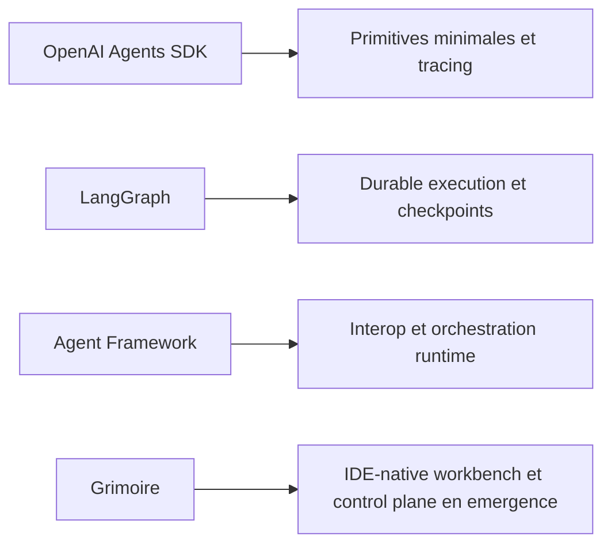

## Benchmark dimensionnel agentique

## But

Comparer Grimoire non pas a des slogans de marche, mais a trois references structurantes de l'agentique actuelle :

- OpenAI Agents SDK pour le noyau minimal, les sessions, les handoffs et le tracing ;
- LangGraph pour l'execution durable stateful ;
- Microsoft Agent Framework pour l'orchestration multi-agent, les graphes et l'interop MCP ou A2A.

## Lecture rapide

## Comparaison par dimension

| Dimension | OpenAI Agents SDK | LangGraph | Agent Framework | Grimoire aujourd'hui | Verdict |
| --- | --- | --- | --- | --- | --- |
| Primitives du noyau | Tres petit noyau : agents, tools, handoffs, guardrails, sessions, tracing | Noyau centre sur graphe et etat | Noyau centre sur agents, workflows, orchestrations et interop | Noyau riche mais encore diffus, avec trop de couches de personas | Grimoire est derriere sur la sobriete conceptuelle |
| Execution durable | Partielle, surtout via sessions et loop SDK | Reference forte : persistence, interrupts, resume, checkpointers | Forte : workflows, checkpoints, resume | Partielle : replay et snapshots existent, mais pas encore runtime canonique unique | LangGraph et Agent Framework devant |
| Sessions et memoire de run | Primitive officielle du SDK | Thread state et memory de workflow | Checkpoints et execution state | Memoire riche, mais encore mal alignee entre legacy et runtime actif | Grimoire a de la matiere, mais pas encore la bonne unification |
| Handoffs et orchestration | Handoffs explicites et peu de primitives | Graph transitions explicites | Sequential, concurrent, handoff, group chat, graph | Orchestration riche au niveau methode, plus floue au niveau noyau runtime | Grimoire est fort en methode, plus faible en forme canonique |
| Bus tools et MCP | Support tools et integrations, MCP present dans l'ecosysteme | Pas son angle principal | MCP et A2A integrent l'interop dans le discours produit | MCP est deja central, avec serveur, proxy et policy locale | Grimoire est competitif, voire en avance sur l'orientation MCP |
| Guardrails et policies | Guardrails input/output comme primitives natives | Human-in-the-loop et controle via graphe | Gouvernance workflow et providers | Policies runtime et MCP presentes mais encore partialement operees | Grimoire est en transition, pas encore au niveau produit des leaders |
| Tracing et observabilite | Tracing natif mis en avant | Debugging et ecosysteme LangSmith | Runtime et workflow events | Traces, evaluator et trust scorer existent, mais experience fragmentee | Grimoire a les briques, pas encore le systeme unifie |
| Evals et regression | Tracing d'abord, evals indirectes via ecosysteme | Ecosysteme externe surtout | Enterprise patterns et samples | Evaluator et trust scorer locaux, evidence pack encore partiel | Grimoire est prometteur mais pas encore mature |
| UX IDE-native | Pas l'angle central | Studio et outillage externes | Pas son avantage distinctif principal | Integration IDE-native forte, hooks, agents, runtime game et cockpit | Avantage reel de Grimoire |
| Surface operatoire visible | Dashboard et traces, pas de these spatiale propre | Studio de graphes et debug | Outils et samples, pas de cockpit signature | Game UI et Cockpit V5 comme these produit forte | Avantage potentiel fort de Grimoire |
| Gouvernance humaine et methode | Relativement legere par design | Runtime pur | Runtime et enterprise orchestration | Forte densite de protocoles, skills, verification, completion contract | Avantage differenciant, a condition de ne pas surcharger le noyau |
| Packaging, distro, overlays | SDK clair, scope borne | Framework et runtime de reference | Framework multi-runtime et multi-langage | Vision distro ou overlay interessante mais encore partielle | Grimoire doit encore durcir son ABI produit |

## Ou Grimoire mene vraiment

### 1. IDE-native workbench

Ni LangGraph ni Agent Framework ni OpenAI Agents SDK ne portent, dans leur proposition coeur, une these aussi forte de workbench IDE-natif gouverne par skills, instructions, hooks, registry et surfaces operatoires.

### 2. Couplage methode plus runtime

Grimoire est beaucoup plus explicite que les references sur la transformation `travail humain -> protocole -> artefacts -> preuves`.

### 3. Control plane visible via la Game UI

Le couple `contracts + guardrails + replay + cockpit spatial` est original. C'est l'un des rares angles ou Grimoire peut viser un leadership produit au lieu de simplement rattraper le marche.

## Ou Grimoire est derriere

### 1. Runtime canonique stateful

LangGraph et Agent Framework sont plus clairs sur l'etat, la reprise, les checkpoints et la semantique d'execution. C'est le plus gros ecart technique defendable.

### 2. Primitives noyau trop nombreuses

OpenAI Agents SDK montre une direction de marche importante : peu de primitives, beaucoup d'expressivite. Grimoire est aujourd'hui trop charge en personas, profils et couches methodologiques pour pretendre au meme niveau de nettete conceptuelle.

### 3. Observabilite unifiee

Les leaders mettent le tracing et la session au centre. Grimoire a des composants comparables, mais pas encore une experience unifiee ni une chaine de preuves totalement stable.

## References a absorber par domaine

| Domaine | Reference prioritaire | Ce qu'il faut absorber | Ce qu'il faut refuser |
| --- | --- | --- | --- |
| Noyau minimal | OpenAI Agents SDK | Peu de primitives, guardrails, sessions, tracing | Copier tout le modele SDK comme base unique |
| Runtime durable | LangGraph | Checkpoints, interrupts, resume, stateful workflow discipline | Importer le framework a la place d'un noyau propre |
| Interop runtime | Agent Framework | Sequential or concurrent, graph orchestration, MCP ou A2A, providers | Se lier a un stack vendor-specific |
| Observabilite | Langfuse | Datasets, traces, releases, evidence discipline | Deleguer la source de verite a un SaaS externe |
| Evals | promptfoo et ecosysteme evals | Harness de regression et gates | Demarrer par de gros benchmarks flous avant le canon runtime |
| Typage et structures | PydanticAI | Validation stricte, model abstraction propre | Surcouche additionnelle si le noyau n'est pas resserre |
| Memoire | MemPalace, claude-mem, mem0 | Patterns de recall, couches memoire, memoire locale utile | Ajouter un backend de plus sans aligner les outils existants |

## Positionnement resultante

Le bon positionnement de Grimoire aujourd'hui n'est pas :

- "le runtime durable de reference" ;
- "la meilleure plateforme d'observabilite agentique" ;
- "le framework minimaliste le plus propre".

Le bon positionnement est plutot :

- **un agent engineering workbench IDE-native**, deja tres outille ;
- **avec un control plane visible en emergence** via la Game UI ;
- **et une possibilite credible d'evoluer vers un Agent OS**, a condition de reduire son catalogue conceptuel et de canoniser son runtime.

## Conclusion tactique

Grimoire ne gagnera pas en essayant de battre LangGraph sur le pur runtime, OpenAI Agents SDK sur la sobriete ou Agent Framework sur la largeur d'interop en copiant leur terrain.

Grimoire peut gagner s'il fait trois choses :

- resserrer son noyau plus fortement que son discours actuel ;
- faire du cockpit une projection superieure d'un runtime canonique ;
- transformer sa gouvernance, ses preuves et son integration IDE-native en avantage produit defendable.
