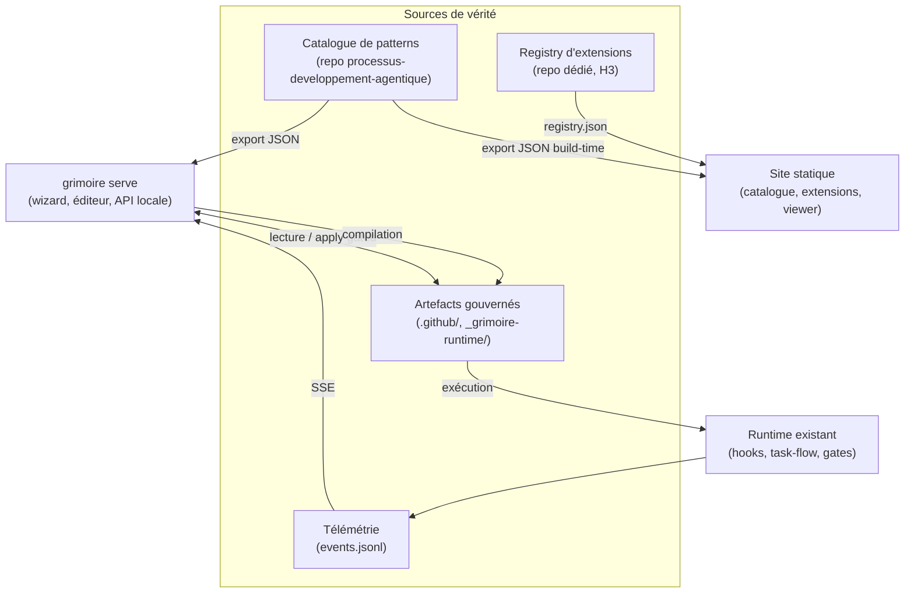

# Documentation technique — Cadrage extensions et blueprint

## Périmètre du package

Ce package cadre trois capacités futures de Grimoire Forge : le système
d'extensions (puis marketplace), le setup web, et l'éditeur blueprint. Il
contient les décisions structurantes, la roadmap par horizons et les trois
schémas JSON conçus pour l'état final.

## Architecture cible

Deux modes pour une seule UI : le site statique (lecture) et `grimoire serve`
(mutations). Le blueprint compile vers les artefacts ; le runtime existant
exécute. Aucun moteur d'exécution nouveau n'est introduit.

## Contrats du package

| Contrat | Fichier | Statut |
| --- | --- | --- |
| Manifeste d'extension v1 | `schemas/extension.schema.json` | Éprouvé : extension réelle `grimoire-kit/extensions/crewai/` installée et désinstallée de bout en bout |
| Export catalogue v1 | `schemas/catalogue-export.schema.json` | Éprouvé : `exports/catalogue-export.json` généré depuis le catalogue réel (78 patterns, 141 relations, 30 contrats, 50 use-cases, 52 anti-patterns) |
| Format blueprint v1 | `schemas/blueprint.schema.json` | Draft validé par l'exemple onboarding-crew ; à éprouver par le viewer |

Les trois schémas utilisent JSON Schema draft 2020-12. Les champs H3/H4
(`permissions`, `provides.nodes`, `compiled`, `telemetry`) sont présents dès la
v1 pour éviter les migrations structurelles.

## Dépendances externes

| Dépendance | Rôle | Risque |
| --- | --- | --- |
| `Concepts/processus-developpement-agentique` | Source du catalogue exporté | Structure des fiches à stabiliser ; l'export sert de test de conformité |
| `Concepts/reference-agentique-audit/inventory.json` | Inventaire des frameworks candidats | Statique, faible |
| `grimoire-kit` (`grimoire.sh`, `adapters/`, `archetypes/`) | Hôte du CLI `ext` et des usecases du wizard | Coordination avec le cycle de release du kit |
| Cytoscape.js + elkjs | Rendu du viewer | Réévaluation prévue à l'entrée de l'éditeur H2 |

## Points d'intégration avec l'existant

| Surface existante | Intégration |
| --- | --- |
| `hook-safety-registry.json` | Tout hook d'extension y est enregistré en `shadow` |
| `grimoire-skill-analyzer` | Gate qualité des skills fournies par les extensions |
| `_grimoire-runtime-output/*/events.jsonl` | Source unique du replay et de l'overlay télémétrie |
| `web/src/_socle/` | La page extensions et le viewer s'ajoutent à côté d'`observability.html` |
| `archetypes/` de grimoire-kit | Alimentent le wizard de setup H2 sans duplication |

## Validation effectuée

- Les trois schémas sont des JSON valides et compilent en JSON Schema draft 2020-12.
- `exemples/crewai.extension.json` et le manifeste réel `grimoire-kit/extensions/crewai/extension.json` valident `extension.schema.json`.
- `exemples/onboarding-crew.blueprint.json` valide `blueprint.schema.json`.
- Les IDs de patterns cités (`ORC-01`, `GOV-01`, `QUA-04`...) existent dans le catalogue source.

## Implémentation H1 réalisée

| Livrable | Emplacement | Preuve |
| --- | --- | --- |
| Script d'export catalogue | `processus-developpement-agentique/scripts/export-catalogue.py` | `exports/catalogue-export.json` valide le schéma |
| CLI extensions | `grimoire-kit/src/grimoire/tools/ext_manager.py` + `grimoire.sh ext` | 18 tests unitaires (`tests/unit/tools/test_ext_manager.py`), suites tools et core vertes |
| Extension pilote CrewAI | `grimoire-kit/extensions/crewai/` | Cycle add/list/verify/remove complet sur projet témoin ; hook enregistré puis retiré en mode shadow dans `hook-safety-registry.json` |

Restent pour clore H1 : la page extensions statique du site et le blueprint
viewer read-only (consommateur de `catalogue-export.json`).
