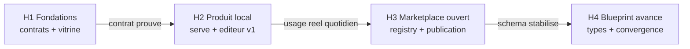

# Roadmap par horizons — Extensions, marketplace et blueprint

Chaque horizon livre un produit utilisable seul. Le passage à l'horizon suivant
est conditionné par un critère de sortie vérifiable, pas par une date.

## Vue d'ensemble

## H1 — Fondations

Objectif : prouver le contrat d'extension et rendre le catalogue visible.

| Chantier | Livrable | Dépendances |
| --- | --- | --- |
| Cadrage | Ce package (brief, roadmap, trois schémas) | — |
| Manifeste d'extension | `extension.schema.json` + manifeste CrewAI réel | Cadrage |
| Extension pilote CrewAI | Adaptateur crews vers artefacts Grimoire, installable | Manifeste |
| CLI | `grimoire ext add\|list\|remove\|verify` dans `grimoire.sh` | Manifeste |
| Page extensions statique | Générée depuis manifestes + `inventory.json` de l'audit | Manifeste |
| Export catalogue | Script build-time dans `processus-developpement-agentique`, JSON versionné | Cadrage |
| Blueprint viewer read-only | Graphe des 78 patterns + vue « mon setup actuel », Cytoscape.js | Export catalogue |

Critère de sortie : CrewAI installée et fonctionnelle via CLI, viewer publié,
schémas validés par des exemples réels.

## H2 — Produit local

Objectif : le setup et l'édition depuis le navigateur, en local.

| Chantier | Livrable |
| --- | --- |
| `grimoire serve` | Process local servant l'UI du site + API : lecture/écriture d'artefacts, installation d'extensions, stream SSE des `events.jsonl` |
| Wizard de setup | Questionnaire usecases fondé sur les `archetypes/` de grimoire-kit, génération de config, installation des extensions choisies |
| Éditeur blueprint v1 | Édition du graphe, compilation vers artefacts, apply gated. Limites assumées : connexions non typées, pas de subgraphs |
| Deuxième extension | LangGraph ou Langfuse, pour éprouver le manifeste sur un cas différent |

Critère de sortie : setup complet d'un projet depuis le navigateur ; usage
quotidien réel du serve et de l'éditeur par au moins un utilisateur (toi).
Si l'usage ne prend pas, arrêt et analyse avant tout investissement H3.

## H3 — Marketplace ouvert

Objectif : passer de la page vitrine à une place de marché contribuable.

| Chantier | Livrable |
| --- | --- |
| Registry | Repo git dédié faisant index (modèle Homebrew taps) : `registry.json` versionné, semver par extension, checksums |
| Publication | `grimoire ext publish` ouvrant une PR sur le registry |
| CI de conformité | Validation schéma, mapping patterns obligatoire, score `grimoire-skill-analyzer` au-dessus du seuil, hooks déclarés en shadow |
| Sécurité et curation | Permissions déclaratives vérifiées, revue obligatoire pour les tiers, fast-track pour les extensions internes |
| Marketplace web | Recherche, filtres par famille de patterns, matrice de compatibilité runtime, stats d'installation |

Précondition d'entrée : le schéma de manifeste n'a subi aucun changement
structurel sur 3 à 4 extensions réelles.

Critère de sortie : une extension tierce soumise, validée par la CI et
installée sans intervention manuelle.

## H4 — Blueprint avancé et convergence

Objectif : transformer le dessin en pseudo-code vérifiable, et faire converger
marketplace et blueprint.

| Chantier | Livrable | Actif du catalogue exploité |
| --- | --- | --- |
| Pins typés | Une connexion invalide ne compile pas | `contrats-formels-agentiques.md` (32 contrats) |
| Linting normatif | Détection d'anti-patterns en live, overlay de conformité (contrôles satisfaits par le flow) | `anti-patterns-agentiques.md`, catalogue des contrôles |
| Subgraphs et composition | Use-cases et archétypes comme nodes composites réutilisables | 50 capacités, `noyau-extensions-archetypes.md` |
| Debug complet | Replay des events sur le graphe, timeline, télémétrie live | Flux `events.jsonl` existants |
| Simulation pré-exécution | Vérification du flow avant apply | `simulation-pre-execution-agentique.md` |
| Node packs | Les extensions fournissent des nodes (`provides.nodes` du manifeste) | Manifeste v1 anticipé |
| Blueprints publiables | Les fichiers `.blueprint` deviennent des artefacts distribuables sur le marketplace | Format `.blueprint` v1 anticipé |

Critère de sortie : un flow composé de nodes d'extension, validé par le linting
normatif, compilé, exécuté par le runtime existant et rejoué dans le viewer.

## Invariants sur toute la trajectoire

- Le blueprint compile, le runtime existant exécute. Jamais de moteur parallèle.
- Une seule source de vérité par donnée (voir le brief de cadrage).
- Un seul format `.blueprint` du viewer H1 au marketplace H4.
- Tout hook issu d'une extension démarre en mode shadow, sans exception.
