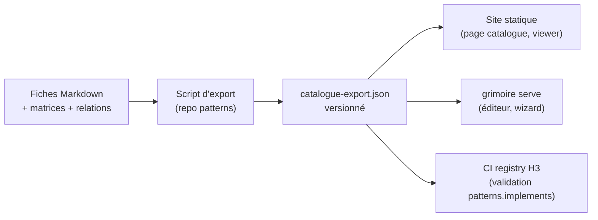

# Spécification — Export catalogue

L'export catalogue est un JSON généré depuis le repo
`Concepts/processus-developpement-agentique` (source de vérité unique) et
consommé par le site, le viewer, puis l'éditeur. Schéma :
[schemas/catalogue-export.schema.json](schemas/catalogue-export.schema.json).

## Principe

- Un script d'export vit **dans le repo de patterns**, pas dans la Forge : la norme évolue là-bas, l'export suit.
- Le JSON produit est versionné et committé comme artefact de build (`catalogue-export.json`), avec le commit source tracé dans les métadonnées.
- Le site et le blueprint ne lisent jamais les fichiers Markdown du catalogue directement : uniquement l'export.

## Contenu exporté

### Métadonnées

| Champ | Rôle |
| --- | --- |
| `catalogVersion` | Version sémantique du catalogue |
| `generatedAt` | Date ISO de génération |
| `source.repository`, `source.commit` | Traçabilité vers le repo de patterns |

### Familles

Une entrée par famille de patterns : `id` (préfixe `ORG`, `ORC`, `GOV`, `QUA`,
`KNO`, `RUN`, `COG`, `MOD`), `slug` (dossier source), `name`, `description`.

### Patterns

Une entrée par pattern, extraite des fiches Markdown structurées
(tableaux Intention / Problème / Solution / Contrôles / Anti-pattern) :

| Champ | Source dans la fiche | Usage aval |
| --- | --- | --- |
| `id`, `family`, `name` | Titre `## XXX-NN : Nom` | Node du graphe |
| `intent`, `problem`, `solution` | Tableau d'en-tête | Panneau de détail du viewer |
| `controls` | Ligne Contrôles | Overlay de conformité (H4) |
| `antiPattern` | Ligne Anti-pattern | Linting normatif (H4) |
| `maturity` | `matrice-maturite-patterns.md` | Filtre et badge dans le viewer |
| `docPath` | Chemin + ancre de la fiche | Lien profond depuis le viewer |

### Relations

Extraites des sections Relations des fiches (bullets `- **Verbe** XXX-NN`).
Chaque relation : `from`, `to`, `kind` (normalisé), `label` (verbe source
conservé pour l'affichage). Le vocabulaire réel des fiches compte une
quarantaine de verbes ; la normalisation les projette sur neuf kinds, les
formes passives (« Alimenté par », « Gouverné par »...) inversant la direction :

| Kind | Verbes sources (formes actives) |
| --- | --- |
| `founds` | Fonde, Socle de |
| `depends` | Dépend de, S'appuie sur |
| `feeds` | Alimente, Nourrit, Sert |
| `governs` | Gouverne |
| `produces` | Produit |
| `triggers` | Déclenche, Escalade vers |
| `extends` | Étend, Spécialise |
| `reinforces` | Renforce, Complète |
| `related` | Tout le reste (À ne pas confondre avec, Cousin de, Analogue de, Tracé par...) |

Ce sont les edges du viewer H1 et la base des règles de composition H4. Le
graphe Mermaid de `relations-patterns.md` reste une visualisation, pas une
source d'extraction.

### Contrats

Extraits de `contrats-formels-agentiques.md` (32 contrats). Chaque contrat :
`id` (slug, ex. `task-envelope`), `name`, `fields` avec `name`, `obligation`
(`required`, `recommended`, `conditional`, `optional`), `role`.

Les contrats deviennent les **types de pins** du blueprint en H4 : une
connexion est valide si le contrat du pin sortant correspond à celui du pin
entrant. Ils sont exportés dès H1 pour que le format `.blueprint` puisse y
faire référence sans nouvel export.

### Use-cases et anti-patterns

- `useCases` : les 50 capacités optionnelles (id, name, description, patterns mobilisés). Nodes composites en H4.
- `antiPatterns` : id, name, description, patterns concernés. Alimentent le linting H4.

## Pipeline de génération

Le script échoue si une fiche ne respecte pas la structure attendue : l'export
sert ainsi de test de conformité structurelle du catalogue lui-même.

## Évolution

- L'export est additif : les consommateurs ignorent les champs inconnus.
- Un changement structurel incrémente la version majeure de `catalogVersion` ; le viewer affiche la version consommée.
