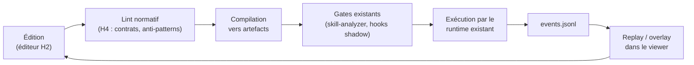

# Spécification — Format `.blueprint`

Un fichier `.blueprint.json` décrit un flow agentique comme un graphe de nodes
typés. Le même format traverse toute la trajectoire : le viewer H1 le lit,
l'éditeur H2 l'écrit, le linting H4 le vérifie, le marketplace H4 le distribue.
Schéma : [schemas/blueprint.schema.json](schemas/blueprint.schema.json).
Exemple : [exemples/onboarding-crew.blueprint.json](exemples/onboarding-crew.blueprint.json).

## Principes

1. **Le blueprint compile, il n'exécute pas.** La section `compiled` trace les artefacts générés ; le runtime existant les exécute.
2. **Diffable** : JSON stable, clés ordonnées, ids explicites. Un blueprint se revoit en PR comme du code.
3. **Indépendant du moteur de rendu** : les positions sont des métadonnées d'affichage ; la sémantique est dans les nodes, pins et edges.
4. **Ancré dans le catalogue** : chaque node référence un pattern, un artefact ou un node d'extension ; chaque pin référence un contrat de l'export catalogue.

## Structure

### En-tête

| Champ | Rôle |
| --- | --- |
| `blueprintVersion` | Version du format (entier, `1`) |
| `id`, `name`, `description` | Identité du flow |
| `catalogRef.version` | Version de l'export catalogue référencée |
| `extensions` | Extensions requises avec contrainte semver (pour les nodes d'extension) |

### Nodes

Chaque node : `id` (unique dans le fichier), `kind`, `ref`, `label`,
`position`, `config`, `pins`.

| Kind | `ref` pointe vers | Exemple |
| --- | --- | --- |
| `pattern` | Un pattern du catalogue | `ORC-01` |
| `artifact` | Un artefact du repo cible | `.github/agents/dev.agent.md` |
| `composite` | Un use-case ou un sous-blueprint | `use-case:revue-adversariale` ou un chemin `.blueprint.json` |
| `extension-node` | Un node fourni par une extension | `crewai/crewai-crew` |

Les pins déclarent `id`, `direction` (`in`/`out`) et `contract` (id de contrat
de l'export catalogue, ex. `task-envelope`, `handoff-packet`).

### Edges

Chaque edge relie un pin sortant à un pin entrant : `from` (`nodeId.pinId`),
`to` (`nodeId.pinId`), `contract`.

- H1/H2 : le contrat est déclaratif, non vérifié (affichage seulement).
- H4 : la compilation échoue si les contrats des deux pins ne correspondent pas — c'est le typage du pseudo-code visuel.

### Compilation (`compiled`)

Renseignée par l'éditeur à chaque apply :

| Champ | Rôle |
| --- | --- |
| `at` | Date ISO du dernier apply |
| `catalogVersion` | Version du catalogue au moment de la compilation |
| `artifacts` | Liste des artefacts générés : `path`, `hash` (sha256), `sourceNode` |

Permet de détecter la dérive : si le hash d'un artefact sur disque ne
correspond plus, le blueprint est marqué désynchronisé dans le viewer.

### Télémétrie (`telemetry`)

Lie les nodes aux flux d'événements existants pour le replay et l'overlay live :

| Champ | Rôle |
| --- | --- |
| `bindings[].nodeId` | Node concerné |
| `bindings[].eventSource` | `hook-runtime` ou `task-flow` |
| `bindings[].match` | Critères de corrélation sur les événements JSONL (clé/valeur) |

Le viewer H4 rejoue un `events.jsonl` en surlignant les nodes dont le binding
matche, dans l'ordre des timestamps.

## Cycle de vie

## Distribution (H4)

Un `.blueprint.json` est publiable sur le marketplace comme artefact autonome :
ses dépendances sont explicites (`catalogRef`, `extensions`), son installation
est une copie + un apply gated. C'est le modèle Unreal : on partage des
blueprints, pas seulement des plugins.
