# Architecture cible et diagrammes - Grimoire Agent OS

## 1. Vue contexte

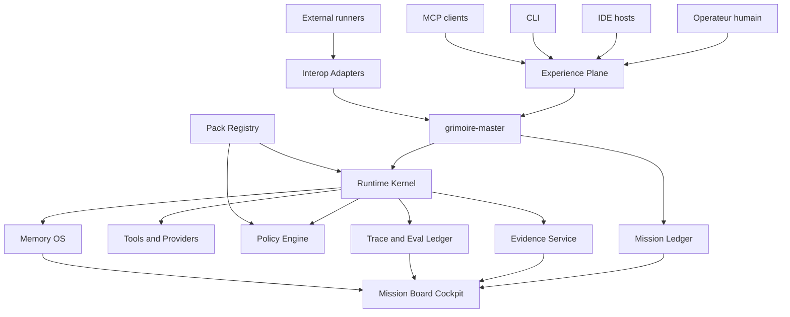

Lecture :

- l'humain ne parle pas a une armee d'agents visibles ;
- `grimoire-master` reste le point d'entree ;
- le ledger tient l'etat metier ;
- le runtime execute ;
- le cockpit lit des projections.

## 2. Vue conteneurs

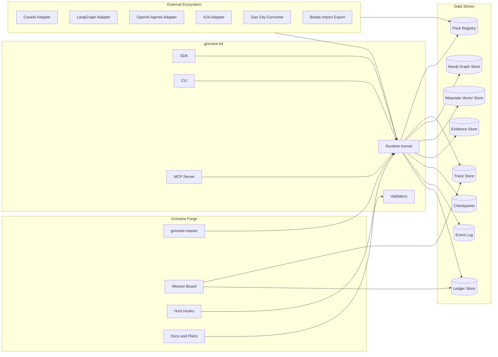

## 3. Architecture en plans

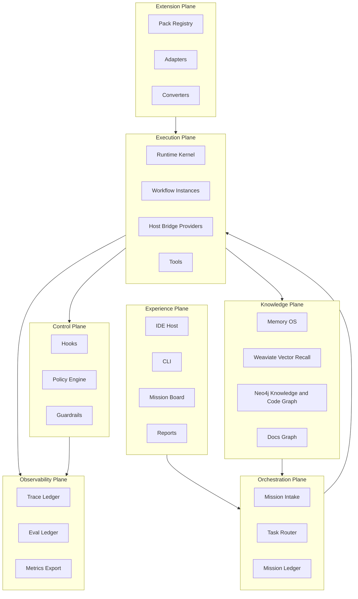

## 4. Sequence mission vers fermeture

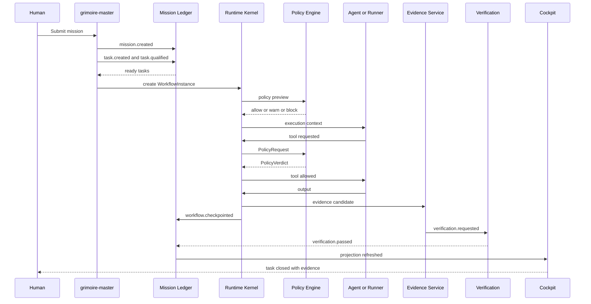

## 5. Lifecycle d'une task

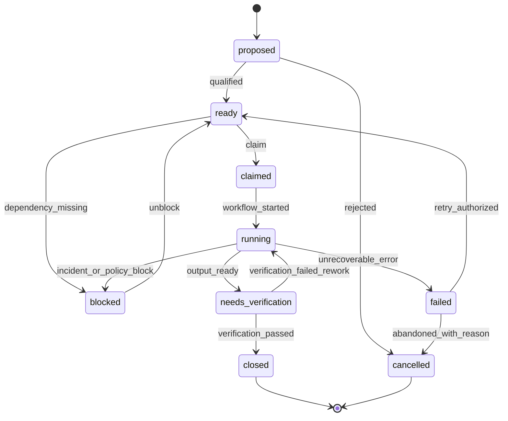

## 6. Lifecycle d'un workflow

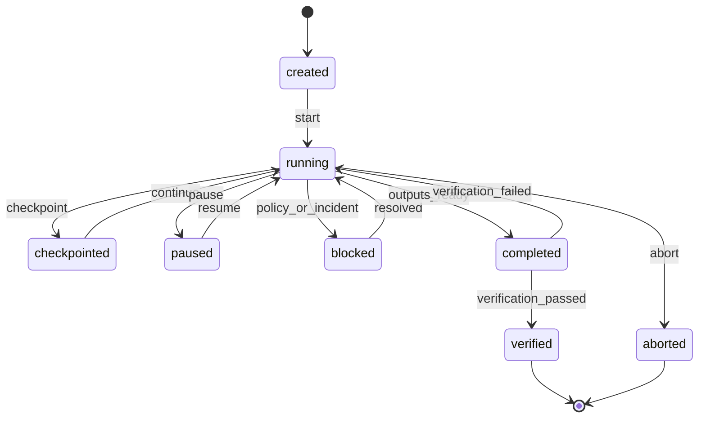

## 7. Hook and Guardrail Plane

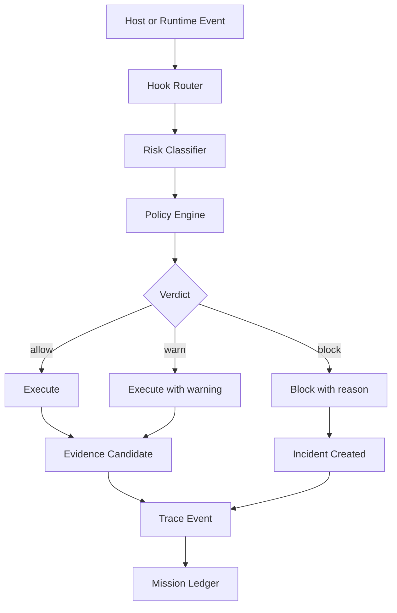

## 8. Pack activation

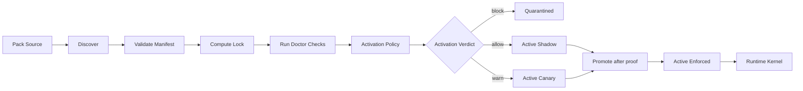

## 9. Memory OS flow

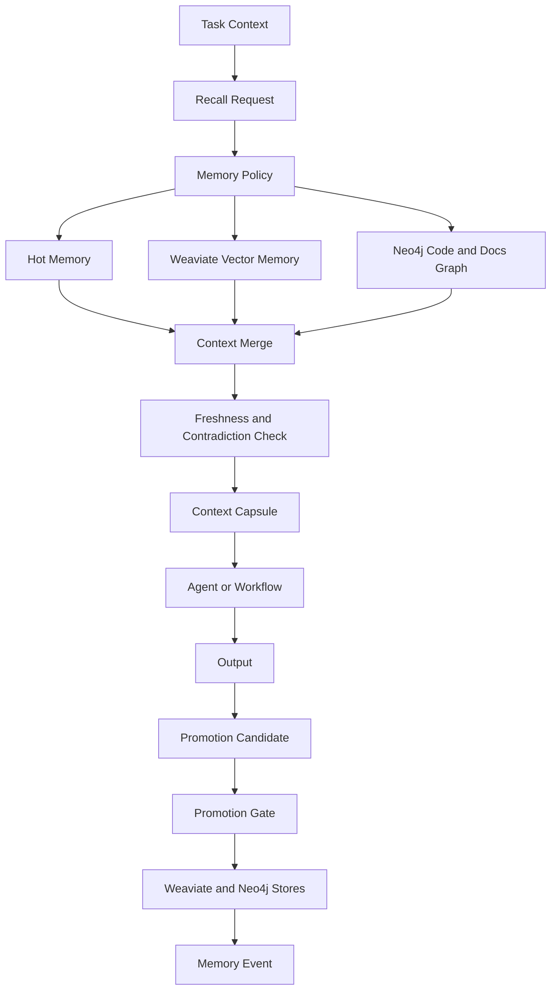

## 10. Data stores et ownership

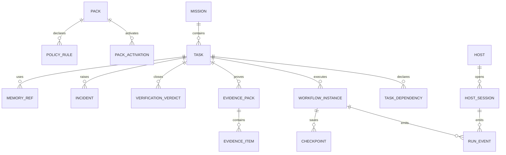

## 11. Host Bridge routing

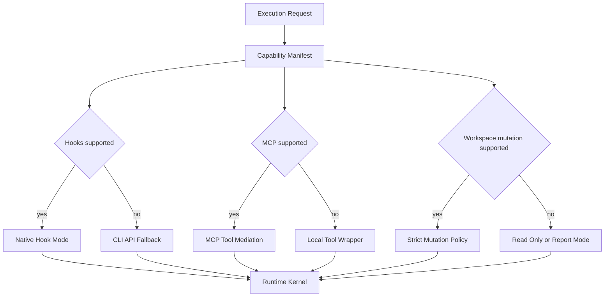

## 12. Interop externe

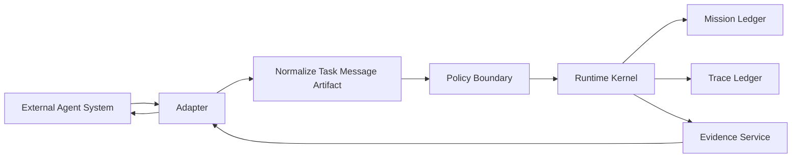

Regle :

- l'agent externe peut executer ;
- Grimoire conserve task, policy, trace, evidence et closure.

## 13. Deploiements cibles

### 13.1 Local developer

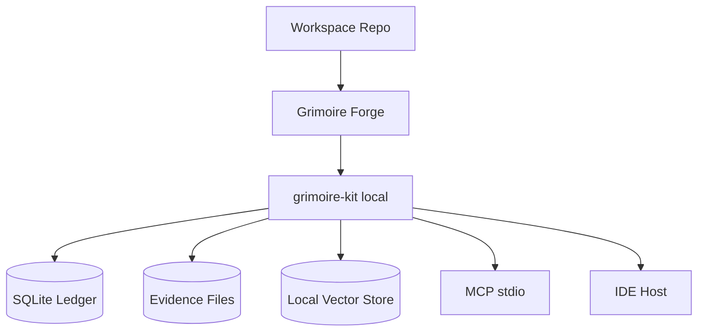

### 13.2 Team shared

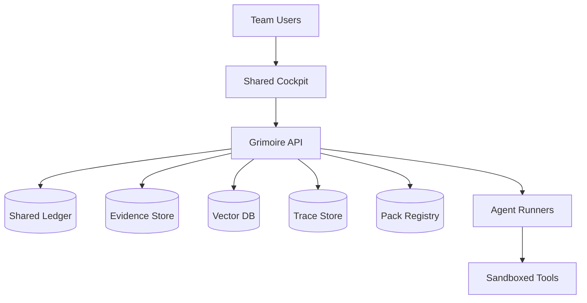

### 13.3 Enterprise controlled

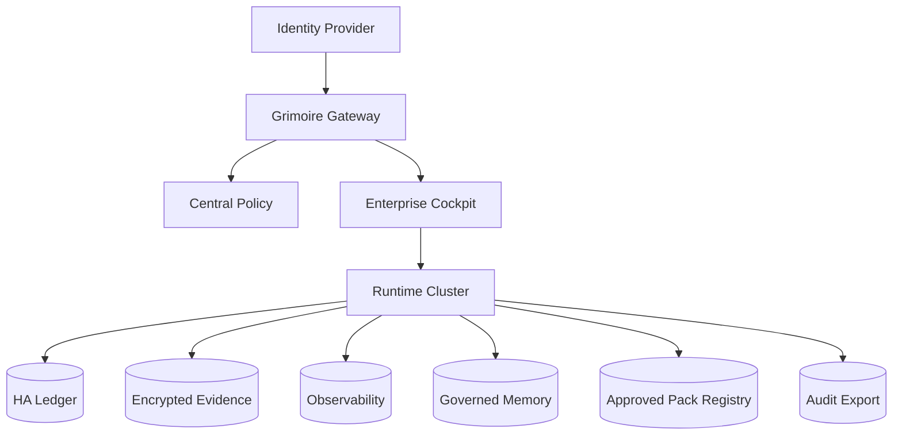

## 14. Trust boundaries

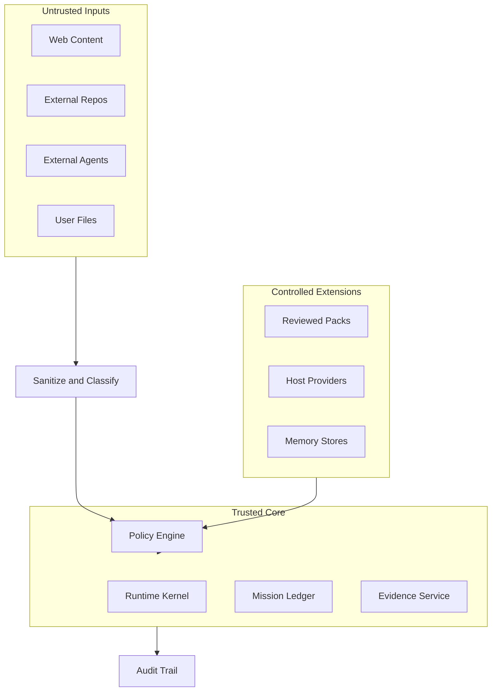

## 15. Projection cockpit

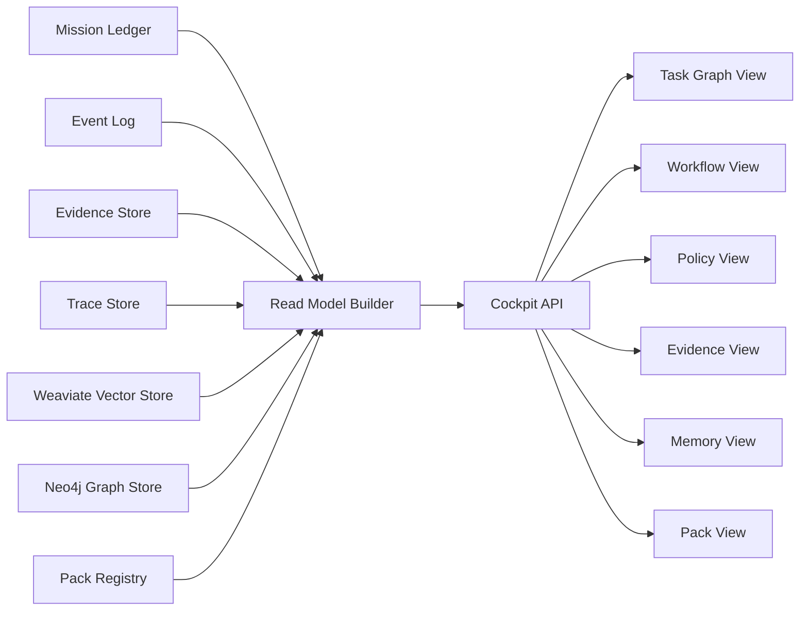

## 16. Schema mental final

```text
Forge = preuve vivante et cockpit.
kit = noyau distribuable.
ledger = source de verite.
runtime = execution.
policy = controle.
evidence = fermeture.
memory = contexte gouverne.
packs = extension.
trace = mesure.
adapters = interop.
```
