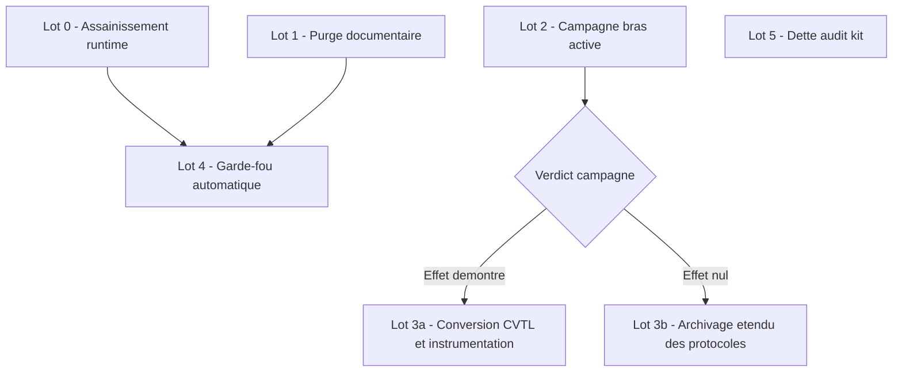

## Principe directeur

L'évaluation du 2026-07-12 (voir `DOC-TECHNIQUE-durcissement-agentique.md` pour les sources) établit une corrélation nette : un pattern fonctionne dans la mesure exacte où il est du code exécuté hors du LLM ; sous forme de prose contextuelle, son effet mesuré est nul. Le plan applique donc une règle unique à tous les artefacts :

> Chaque pattern est durci en mécanique exécutée et instrumentée, ou archivé. Aucun pattern ne subsiste à l'état de prose.

## Vue d'ensemble des lots

Les lots 0, 1, 2 et 5 sont indépendants et parallélisables. Le lot 4 dépend des lots 0 et 1 (le garde-fou doit naître au vert). Le lot 3 dépend du verdict du lot 2.

## Lot 0 — Assainissement runtime

Objectif : rétablir la fiabilité de la télémétrie avant de bâtir dessus.

| # | Action | Cible | Critère d'acceptation |
| --- | --- | --- | --- |
| 0.1 | Corriger ou retirer la tâche `vscode-agent-terminals-autoprune` (exit=2 reproductible depuis avril) | `.vscode/tasks.json`, `grimoire-task-flow.sh` | `latest.json` sans échec récurrent ; plus d'`emit-rejected` dans `events-errors.jsonl` |
| 0.2 | Diagnostiquer `grimoire-rtk-rewrite` : déclaré `enforced`, 0 invocation loggée | `grimoire-hook-gateway.sh`, registre | Invocations visibles dans le log safety-gate, ou hook rétrogradé avec justification |
| 0.3 | Aligner `grimoire-doc-drift` : registre `canary` mais 100 % des événements en `shadow` | `hook-safety-registry.json` | Mode du registre et `effectiveMode` des logs cohérents |
| 0.4 | Supprimer `grimoire-terminal-guard` (shadow permanent, 0 événement) | registre, scripts hooks | Hook absent du registre ; `hooks-status` et `grimoire-hooks-smoke.sh` verts |
| 0.5 | Purger les fixtures des journaux de production (`mcp-audit.jsonl` avec outils factices, `.event-log.jsonl`, `.router-stats.jsonl` obsolètes) | `_grimoire-runtime/_memory/`, `_grimoire-runtime-output/` | Journaux de prod sans données synthétiques ; fixtures déplacées sous `test-artifacts/` si conservées |

## Lot 1 — Purge documentaire

Objectif : retirer des instructions chargées à chaque session tout ce qui promet sans exécuter — le mécanisme exact dont la campagne benchmark a mesuré l'inefficacité.

| # | Action | Cible | Critère d'acceptation |
| --- | --- | --- | --- |
| 1.1 | Retirer DCF et AORA de `copilot-instructions.md` et de `grimoire-master.agent.md` (aucun artefact exécutable sous ces sigles) | `.github/copilot-instructions.md`, `.github/agents/` | Zéro occurrence des sigles sans artefact associé |
| 1.2 | Supprimer le bloc UDF des instructions (tracker vide, 0 artefact `_dyn-*` créé) ; archiver `udf-registry.yaml` | `copilot-instructions.md`, `grimoire-master.agent.md`, `_grimoire-runtime/_config/` | Bloc absent des instructions ; registre déplacé en archive avec note de décision |
| 1.3 | Passer en revue chaque section restante de `copilot-instructions.md` : conserver uniquement ce qu'un mécanisme dur consomme | `.github/copilot-instructions.md` | Chaque section citée par un hook, une task ou un test identifiable |
| 1.4 | Acter les verdicts déjà rendus : PIP en observer-only, ELSS archivé | docs de cartographie, instructions | Statuts reflétés partout où les sigles apparaissent |

Décision requise (utilisateur) : suppression définitive de l'UDF ou sursis avec obligation d'un cas d'usage réel — voir section « Décisions ouvertes ».

## Lot 2 — Campagne « bras activé »

Objectif : produire la donnée causale qui manque — mesurer l'usage forcé du standard, pas sa présence passive.

| # | Action | Cible | Critère d'acceptation |
| --- | --- | --- | --- |
| 2.1 | Concevoir le mécanisme d'activation : hook `SessionStart` imposant l'enveloppe de tâche + `gate check` bloquant avant clôture | `grimoire-kit/evals/` | Mécanisme testé sur 1 run pilote ; l'enveloppe et le gate apparaissent dans les traces |
| 2.2 | Pré-enregistrer le protocole amendé : comptage séparé des régressions dures (build ou test cassé) et des adaptations de tests vertes | `grimoire-kit/docs/evals-protocol.md` | Protocole committé avant tout run |
| 2.3 | Corriger `JUDGING.md` : la clause « tests du nouveau package » de refactor-handlers ne doit plus décider seule d'un 0/10 | `evals/witnesses/web-app-todo/JUDGING.md` | Grille amendée et committée avant les runs |
| 2.4 | Exécuter la campagne : 8 tâches, 3 bras (baseline, governed passif, activé), répétitions selon budget validé ; retirer fix-timezone-display des répétitions pleines (témoin de bruit nul) | runner headless | 100 % des runs terminés ; journal et sorties archivés |
| 2.5 | Analyser selon le critère pré-enregistré et publier le rapport | `grimoire-kit/evals/reports/` | Rapport committé ; verdict explicite : effet démontré ou non |

Point de décision : le verdict de 2.5 sélectionne le lot 3a ou le lot 3b.

## Lot 3 — Conversion ou archivage des protocoles soft

### Lot 3a — Si l'activation forcée démontre un effet

| # | Action | Critère d'acceptation |
| --- | --- | --- |
| 3a.1 | Convertir CVTL en hook `SubagentStop` : seconde passe réelle sur sorties marquées critiques, événement tracé | Déclenchements comptables dans `GRIMOIRE_TRACE.jsonl` |
| 3a.2 | Instrumenter HUP et QEC : événement de déclenchement identifiable dans la trace | Compteurs non nuls après une session de travail représentative |
| 3a.3 | Généraliser le mécanisme d'activation validé aux sessions Forge (hook `SessionStart` du workspace) | Hook en `shadow` puis promotion via le cycle canary standard |

### Lot 3b — Si l'effet reste non démontré

| # | Action | Critère d'acceptation |
| --- | --- | --- |
| 3b.1 | Archiver HUP, QEC, CVTL, PCE sous statut « théorique, non validé empiriquement » | Sigles retirés des instructions ; note d'archivage dans la cartographie |
| 3b.2 | Ouvrir un chantier de re-conception du standard lui-même (le problème n'est plus le branchement) | Cadrage dédié dans `planning-artifacts/` |

## Lot 4 — Garde-fou automatique « fonctionnel = consommé »

Objectif : empêcher structurellement le retour des protocoles-papier. Dépend des lots 0 et 1 (le check doit passer au vert dès sa création).

| # | Action | Cible | Critère d'acceptation |
| --- | --- | --- | --- |
| 4.1 | Écrire le check : tout sigle ou pattern déclaré dans les instructions doit référencer un artefact exécutable existant | script sous `.github/hooks/scripts/` ou task `preflight` | Check vert sur l'état post-lot 1 ; rouge si on réinjecte un sigle sans artefact |
| 4.2 | Étendre au critère de consommation : artefact exécutable sans événement de trace sur une fenêtre glissante = alerte | même script + journaux hook-runtime | Alerte émise pour un hook à 0 invocation (cas rtk-rewrite reproduit en test) |
| 4.3 | Brancher via le gateway, déclarer au registre, démarrer en `shadow` | `grimoire-hook-gateway.sh`, `hook-safety-registry.json` | `hooks-status` et `grimoire-hooks-smoke.sh` verts ; promotion via cycle canary |

## Lot 5 — Dette de l'audit du 2026-07-08 (côté grimoire-kit)

Objectif : le kit applique son propre catalogue avant de le prescrire. Reprend la priorisation de `AUDIT-bonnes-pratiques-agentiques.md`.

| # | Action | Anti-pattern soldé | Critère d'acceptation |
| --- | --- | --- | --- |
| 5.1 | Rollback transactionnel dans `install_hooks` | effet-partiel-oublié (RUN-14) | Échec en cours d'installation restaure l'état initial ; test couvrant |
| 5.2 | Janitor du journal `stigmergy-events.jsonl` (borne ou rotation) | tout-indexer (KNO-01) | Taille bornée vérifiée par test |
| 5.3 | Champ `schemaVersion` dans `features.json` + migration | save-non-versionnée (RUN-02) | Lecture des deux versions couverte par test |
| 5.4 | Tracer les mutations des endpoints `grimoire serve` | backend-permissif (QUA-08) | Chaque mutation produit un événement observable |
| 5.5 | Exposer hypothèse et seuil de promotion dans `/api/stigmergy.behavior` | mesure-sans-hypothèse (QUA-13) | Réponse API enrichie ; documentée |

## Décisions ouvertes (arbitrage utilisateur)

1. **Budget de la campagne bras activé** : 108 runs (7 tâches × 3 bras × 5 répétitions + 3 runs de contrôle fix-timezone), estimation 70 à 75 USD (extrapolée de juillet à 0,55-0,61 USD/run, bras activé majoré). Tout est prêt ; seul le lancement attend ce go.
2. **Re-câblage runtime des hooks repo** : le diagnostic du lot 0 montre que le canal gateway n'est plus joué en mode enforced depuis le 2026-05-27 — le runtime actif (Claude Code) n'a aucun bloc `hooks` dans `.claude/settings.json`. Décider : brancher les hooks repo dans le runtime Claude Code, ou acter que la gouvernance gateway ne vit que sous VS Code Copilot.
3. **terminal-guard côté produit kit** : le hook est supprimé de la Forge (lot 0.4), mais les templates du kit (`framework/agentic-standard/templates/`) et la mitigation THR-009 de `src/grimoire/policies/security.py` (qui référence un test inexistant) le proposent toujours. Retirer du produit ou implémenter réellement.
4. **faux-done à la compilation blueprint** (item 6 de l'audit kit) : passer le warning en blocker ou conserver l'UX actuelle — l'audit lui-même le classe « à débattre ».

Décision close : **UDF supprimé** le 2026-07-12 (voir `archives/NOTE-decision-udf.md`).

## Suivi

| Lot | Statut | Bloqué par |
| --- | --- | --- |
| 0 — Assainissement runtime | Terminé (2026-07-12) | — |
| 1 — Purge documentaire | Terminé (2026-07-12) | — |
| 2 — Campagne bras activé | Préparé (2.1-2.3 livrés, mécanisme validé en sandbox) ; exécution 2.4-2.5 en attente | Décision budget (n° 1) |
| 3 — Conversion ou archivage | En attente | Verdict lot 2 |
| 4 — Garde-fou automatique | Terminé (2026-07-12) — hook `grimoire-pattern-consumption` en shadow | — |
| 5 — Dette audit kit | Terminé (2026-07-12) — arbre de travail kit, non committé | — |

## Journal d'exécution (2026-07-12)

- **Lot 0** : tasks terminal-prune retirées (le script cible `vscode-terminal-prune.py` n'existait pas — cause de l'exit=2) ; `grimoire-rtk-rewrite` rétrogradé en shadow (RTK vit dans le hook Claude global, hors gateway) ; `grimoire-terminal-guard` supprimé atomiquement (manifest, script, registre, instance standard) ; 3 fixtures git-trackées purgées ; doc-drift : aucune correction — canary = shadow effectif par conception du gate. Digests des 10 hooks enforced re-promus après stabilisation des surfaces ; `hooks-status` et `grimoire_standard_verify` verts.
- **Lot 1** : purge UDF complète (instructions, agents builders, wrapper-spec, skills, templates dynamiques, 2 tasks cleanup, registre archivé) ; AORA/DCF retirés des instructions ; PIP marqué observer-only. La prose AORA/DCF/PIP du persona `_grimoire-runtime/core/agents/grimoire-master.md` est laissée au verdict du lot 3.
- **Lot 2** : bras `activated` livré sous `grimoire-kit/evals/witnesses/web-app-todo/activated/` (hooks SessionStart + Stop fail-closed bornés, install.sh, README), protocole v2 pré-enregistré (régressions dures vs adaptations), JUDGING corrigé, collect.py : bug v1 corrigé (verify/gate évalués sur le mauvais task-id — cause mécanique des « missing evidence » de juillet).
- **Lot 4** : check `grimoire-pattern-consumption-check.py` (statique bloquant + dynamique warning), manifeste de gouvernance des sigles, task quality, hook SessionStart en shadow via gateway. Constat du check dynamique : 10/10 hooks enforced sans événement depuis le 2026-05-27 (voir décision ouverte n° 2).
- **Lot 5** : dette de l'audit du 08/07 déjà largement soldée par le commit kit `cde5d7a5` ; écarts résiduels comblés (migration lecture `schemaVersion`, journalisation `PUT /api/blueprints`, hypothèse + seuil dans le bloc behavior). 14 tests verts, ruff et mypy propres.
- **Découverte structurelle majeure** : le journal safety-gate enforced est gelé depuis le 2026-05-27 — l'infrastructure de hooks qualifiée de « vivante » par l'évaluation est dormante depuis le basculement de runtime. C'est la décision ouverte n° 2.
