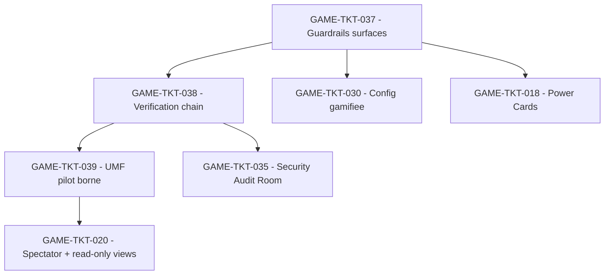

## But

Documenter la trajectoire d'implementation qui a servi a fermer la tranche runtime bornee de `GAME-TKT-037`, `GAME-TKT-038` et `GAME-TKT-039` dans `grimoire-kit/apps/grimoire-game`.

### Mise a jour runtime locale du 2026-04-11

- `GAME-TKT-037`, `GAME-TKT-038` et `GAME-TKT-039` sont couverts et valides localement sur leur tranche runtime bornee.
- `GAME-TKT-030` et la tranche runtime locale de `GAME-TKT-035` doivent etre lus ici comme dependances deja satisfaites localement.
- Tout reliquat futur sur ce paquet doit etre recadre explicitement comme extension UI, multi-host, produit ou documentation, et non comme reouverture du coeur runtime livre.

Le principe directeur est volontairement strict:

- `GAME-TKT-037` ferme la gouvernance des surfaces d'execution avant exposition large.
- `GAME-TKT-038` rend la verification reconstructible avant extension des claims de confiance.
- `GAME-TKT-039` reste un pilote borne et non un chantier de migration generale.

## Sources operatoires

- [PLAN-implementation-web-gaming.md](./PLAN-implementation-web-gaming.md)
- [TICKETS-web-gaming.md](./TICKETS-web-gaming.md)
- [EPICS-grimoire-game.md](./EPICS-grimoire-game.md)
- [TECH-grimoire-game.md](./TECH-grimoire-game.md)
- [CONTRAT-runtime-agentic-guardrails.md](./CONTRAT-runtime-agentic-guardrails.md)
- [MATRICE-verification-agentic-guardrails-web-gaming.md](./MATRICE-verification-agentic-guardrails-web-gaming.md)
- [SUITE-tests-agentic-guardrails-web-gaming.md](./SUITE-tests-agentic-guardrails-web-gaming.md)

## Perimetre cible

| Ticket | Intention | Sorties attendues | Gates d'entree |
| --- | --- | --- | --- |
| `GAME-TKT-037` | Gouverner toutes les surfaces d'execution activables du scope runtime | Registre des surfaces, policy minimale, trust status, refus fail-closed, exposition UI | `GAME-TKT-001`, `GAME-TKT-004` |
| `GAME-TKT-038` | Rendre la verification reconstructible a posteriori | Chaine `action -> controles -> verdict -> evidenceRef`, replay stable, vues audit/verification coherentes | `GAME-TKT-008`, `GAME-TKT-010` |
| `GAME-TKT-039` | Piloter une enveloppe canonique bornee sur lectures critiques | Projection commune runtime/replay/spectateur/multi-session, compatibilite des contrats existants | `GAME-TKT-001`, `GAME-TKT-003`, `GAME-TKT-020`, `GAME-TKT-038` |

## Landing zones techniques

| Zone | Role dans le paquet |
| --- | --- |
| `grimoire-kit/apps/grimoire-game/src/contracts/schemas.ts` | Extension additive des schemas d'enveloppe, metadata et events critiques |
| `grimoire-kit/apps/grimoire-game/src/contracts/events.ts` | Helpers de creation/parsing des events et projections compatibles |
| `grimoire-kit/apps/grimoire-game/src/server/auth/rbac.ts` | Decision d'autorisation, raisons de refus et audit d'activation |
| `grimoire-kit/apps/grimoire-game/src/state/game-state.ts` | Conservation des metadata utiles a la verification et aux projections |
| `grimoire-kit/apps/grimoire-game/src/state/verification-view.ts` | Lecture de la chaine de verification orientee AIVS |
| `grimoire-kit/apps/grimoire-game/src/state/audit-view.ts` | Filtrage des refus, surfaces bloquees, findings et preuves |
| `grimoire-kit/apps/grimoire-game/src/state/session-view.ts` | Projection multi-session et read-only compatible avec le pilote d'enveloppe |
| `grimoire-kit/apps/grimoire-game/tests/integration/auth-rbac.test.ts` | Base des garde-fous OWASP Agentic Skills |
| `grimoire-kit/apps/grimoire-game/tests/integration/verification-view.test.ts` | Base de la chaine de verification |
| `grimoire-kit/apps/grimoire-game/tests/integration/runtime-source-fs.test.ts` | Replay, persistence et compatibilite des metadata |
| `grimoire-kit/apps/grimoire-game/tests/integration/session-view.test.ts` | Projection multi-session et read-only pilote |

## Work packages

### WP-01 - Inventaire et typage des surfaces d'execution

But:

Poser une source de verite minimale pour les surfaces activables du board.

Sous-lots:

1. `037-A` - Definir `surfaceType`, `trustStatus`, `riskLevel`, `requiredPolicy` et `origin`.
2. `037-B` - Cartographier le scope prioritaire: skill tree, plugins, power cards, hooks, MCP nodes.
3. `037-C` - Rendre cette cartographie lisible dans les vues de configuration et d'audit.

Gate de sortie:

- Aucune surface du scope prioritaire n'est encore anonyme, sans origine ou sans policy minimale.

### WP-02 - Enforcement d'activation fail-closed

But:

Refuser toute activation qui n'est pas qualifiee, avant mutation reelle.

Sous-lots:

1. `037-D` - Etendre l'autorisation pour distinguer role, surface et niveau de policy.
2. `037-E` - Refuser les activations sans metadata minimale ou avec `trustStatus=blocked`.
3. `037-F` - Journaliser refus et decisions d'activation avec raison explicite.

Gate de sortie:

- Un noeud activable non qualifie ne peut pas passer en actif via UI ni via runtime.

### WP-03 - Chaine de verification orientee AIVS

But:

Rendre une verification critique relisible et reconstruisible hors contexte oral.

Sous-lots:

1. `038-A` - Ajouter `traceId`, `actionId`, `verificationRef` et `evidenceRefs` aux transitions critiques.
2. `038-B` - Rendre le replay et les projections stables face a ces metadata.
3. `038-C` - Exposer verdict, controles executes et manques dans `verification-view` et `audit-view`.

Gate de sortie:

- Un reviewer retrouve depuis les vues runtime la sequence `action -> controles -> verdict -> evidenceRef` sans detective work externe.

### WP-04 - Pilote d'enveloppe canonique de message

But:

Valider une projection commune sur un panier borne d'evenements sans casser `v1`.

Sous-lots:

1. `039-A` - Definir une enveloppe pilote additive et compatible avec les payloads existants.
2. `039-B` - Mapper au moins `TASK_UPDATE`, `WORKFLOW_STEP`, `VERIFICATION_GATE`, `ERROR` et les projections spectateur.
3. `039-C` - Prouver que `session-view`, `audit-view` et les lectures read-only convergent sur la meme semantique.

Gate de sortie:

- Deux surfaces de lecture au moins consomment la meme projection canonique sans regression visible.

### WP-05 - Suite de verification et evidences

But:

Verifier le paquet par preuves executables et non par intention.

Sous-lots:

1. `QA-A` - Couvrir `GAME-TKT-037` par contrat, integration, negatif et audit log.
2. `QA-B` - Couvrir `GAME-TKT-038` par verification view, replay et blocage de transitions.
3. `QA-C` - Couvrir `GAME-TKT-039` par interop runtime/replay/spectateur et compatibilite ascendante.

Gate de sortie:

- Les suites referencees dans [SUITE-tests-agentic-guardrails-web-gaming.md](./SUITE-tests-agentic-guardrails-web-gaming.md) passent et les preuves sont retrouvables par ticket.

## Definition of ready du paquet

- Les tickets parents `GAME-TKT-037`, `GAME-TKT-038` et `GAME-TKT-039` sont geles fonctionnellement.
- Les landing zones runtime ont ete valides cote architecture.
- La compatibilite additive du contrat `v1` a ete choisie explicitement.
- Les vues de lecture ciblees sont bornees: `verification-view`, `audit-view`, `session-view`, projections spectateur.

## Definition of done du paquet

- Le runtime refuse toute activation non qualifiee du scope prioritaire.
- Les transitions critiques exposent une chaine de verification consultable et rejouable.
- Le pilote d'enveloppe canonique couvre un panier borne sans casser la compatibilite des consommateurs existants.
- Les matrices et suites de verification associees sont a jour.
- Les claims publics restent bornes a l'alignement et au pilote, jamais a une conformite complete.
- Etat atteint localement sur la tranche runtime verifiee au 2026-04-11.

## Hors scope explicite

- Toute revendication de conformite complete a OWASP Agentic Skills Top 10, AIVS ou IEEE P3394 UMF.
- Toute migration massive de tous les payloads runtime vers une nouvelle enveloppe avant validation du pilote.
- Toute UI supplementaire qui ne renforce ni l'audit, ni la verification, ni la gouvernance des activations.
- Toute ouverture de nouvelles surfaces d'execution avant fermeture de `GAME-TKT-037` sur le scope prioritaire.
