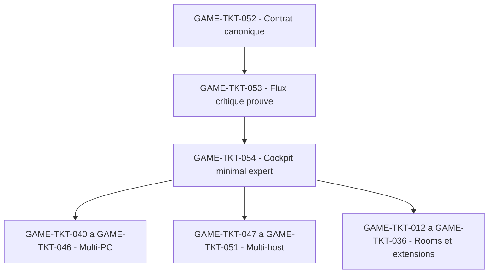

## But

Conserver le front post-challenge comme trajectoire de reference deja prouvee localement pour le runtime `grimoire-kit/apps/grimoire-game`.

Le principe directeur reste volontairement strict:

- `GAME-TKT-052` gele le contrat canonique `run/host/proof` sur un panier critique borne ;
- `GAME-TKT-053` prouve un seul flux critique mono-host avant toute extension large ;
- `GAME-TKT-054` livre un cockpit minimal expert branche sur cette meme spine avant multi-PC, multi-host et rooms riches.

Mise a jour locale au 2026-04-12:

- `GAME-TKT-052` est couvert localement par le contrat canonique, ses gardes et ses refus fail-closed.
- `GAME-TKT-053` est prouve localement par le flux critique mono-host `preview -> validation -> commit borne` et son miroir refuse.
- `GAME-TKT-054` est couvert localement par le cockpit minimal expert et ses projections runtime.
- Ce paquet ne doit donc plus etre relu comme un front runtime local encore ouvert, mais comme la reference de verification qui conditionne les reliquats suivants.

## Sources operatoires

- [PLAN-implementation-web-gaming.md](./PLAN-implementation-web-gaming.md)
- [TICKETS-web-gaming.md](./TICKETS-web-gaming.md)
- [EPICS-grimoire-game.md](./EPICS-grimoire-game.md)
- [PAQUET-execution-agentic-guardrails-runtime.md](./PAQUET-execution-agentic-guardrails-runtime.md)
- [PAQUET-execution-host-bridge-agentique-externe.md](./PAQUET-execution-host-bridge-agentique-externe.md)
- [../../../docs/exploitation/paquet-execution-prioritaire-post-challenge-agent-os-game-ui.md](../../../docs/exploitation/paquet-execution-prioritaire-post-challenge-agent-os-game-ui.md)

## Perimetre cible

| Ticket | Intention | Sorties attendues | Gates d'entree |
| --- | --- | --- | --- |
| `GAME-TKT-052` | Figer une spine canonique unique | Identites canoniques, provenance, policy minimale, verification minimale, refus fail-closed | `GAME-TKT-001`, `GAME-TKT-003`, `GAME-TKT-004`, `GAME-TKT-037`, `GAME-TKT-047`, `GAME-TKT-048`, `GAME-TKT-049` |
| `GAME-TKT-053` | Prouver un flux critique mono-host | `preview -> validation -> commit borne`, replay, evidence pack borne, scenario miroir refuse | `GAME-TKT-005`, `GAME-TKT-008`, `GAME-TKT-010`, `GAME-TKT-038`, `GAME-TKT-052` |
| `GAME-TKT-054` | Livrer une seule surface operateur utile | Inspection, preuve, replay et explication dans le meme cockpit minimal | `GAME-TKT-011`, `GAME-TKT-014`, `GAME-TKT-053` |

## Landing zones techniques

| Zone | Role dans le paquet |
| --- | --- |
| `grimoire-kit/apps/grimoire-game/src/contracts/events.ts` | Figer les identites canoniques et les envelopes critiques du panier borne |
| `grimoire-kit/apps/grimoire-game/src/contracts/schemas.ts` | Validation Zod stricte des metadata `run/host/proof` |
| `grimoire-kit/apps/grimoire-game/src/bridge/agent-adapter.ts` | Garder la frontiere preview/validation/commit et le rejet fail-closed |
| `grimoire-kit/apps/grimoire-game/src/bridge/runtime-source-fs.ts` | Prouver replay, refus et causalite sans bypass direct |
| `grimoire-kit/apps/grimoire-game/src/server/auth/rbac.ts` | Policy minimale, raisons de refus et audit d'autorisation |
| `grimoire-kit/apps/grimoire-game/src/state/game-state.ts` | Source de verite unique du flux critique et de ses preuves |
| `grimoire-kit/apps/grimoire-game/src/state/verification-view.ts` | Lecture de la chaine `action -> controles -> verdict -> evidence` |
| `grimoire-kit/apps/grimoire-game/src/state/board-view.ts` | Inspection du run critique dans le cockpit minimal |
| `grimoire-kit/apps/grimoire-game/src/state/observability-view.ts` | Resume operateur du flux critique, des refus et du replay |
| `grimoire-kit/apps/grimoire-game/src/state/observability-panel-view.ts` | Presentation UI minimale sans logique parallele |
| `grimoire-kit/apps/grimoire-game/src/state/runtime-dashboard-view.ts` | Facade unique pour l'operateur expert |
| `grimoire-kit/apps/grimoire-game/tests/contracts/` | Contrats canoniques et refus explicites |
| `grimoire-kit/apps/grimoire-game/tests/integration/` | Prouver flux critique, replay, cockpit minimal |
| `_grimoire-runtime-output/test-artifacts/` | Evidence pack borne par ticket et run |

## Work packages

### WP-01 - Contrat canonique borne

But:

Fermer `GAME-TKT-052` sur un seul panier critique sans ouvrir un second contrat concurrent.

Sous-lots:

1. `052-A` - Geler `runId`, `taskId`, `workerId`, `hostId`, `traceId`, `requestId` et `idempotencyKey`.
2. `052-B` - Relier provenance, policy minimale et verification minimale aux mutations critiques du panier borne.
3. `052-C` - Rendre les refus explicites et auditables quand provenance, policy ou verification manquent.

Gate de sortie:

- Un run critique mono-host se reconstruit sans correlation heuristique.
- Une mutation critique invalide est rejetee avec raison explicite.
- Runtime, audit et verification manipulent les memes identites canoniques.

### WP-02 - Flux critique prouve

But:

Fermer `GAME-TKT-053` sur un seul flux `preview -> validation -> commit borne` relie au contrat canonique.

Sous-lots:

1. `053-A` - Selectionner le flux critique de reference et le borner fonctionnellement.
2. `053-B` - Prouver replay, idempotence et scenario miroir refuse sur ce flux.
3. `053-C` - Raccorder le flux au verdict de verification et a l'evidence pack sans synthese manuelle fragile.

Gate de sortie:

- Le flux critique passe de bout en bout en mono-host et mono-projet.
- Le scenario miroir incomplet ou non autorise est refuse explicitement.
- La chaine `action -> decision -> verification -> replay` se relit depuis les vues runtime.

### WP-03 - Cockpit minimal expert

But:

Fermer `GAME-TKT-054` avec une seule surface operateur qui permet d'inspecter et de verifier le flux critique prouve.

Sous-lots:

1. `054-A` - Exposer inspection, timeline, refus et verdict sur les memes read models.
2. `054-B` - Presenter preuve et replay dans la meme surface minimale.
3. `054-C` - Verifier qu'aucune logique metier parallele n'apparait dans le cockpit.

Gate de sortie:

- Un operateur comprend pourquoi une action a ete acceptee ou refusee sans transcript brut complet.
- Inspection, preuve et replay sont aligns sur le meme run critique.
- Le cockpit minimal reste une lecture directe de la spine runtime.

### WP-04 - Suite de verification et evidences

But:

Verifier le front prioritaire par preuves executables et non par intention.

Sous-lots:

1. `QA-A` - Couvrir `GAME-TKT-052` par tests de contrat, rejet et audit.
2. `QA-B` - Couvrir `GAME-TKT-053` par tests d'integration sur le flux critique et son miroir refuse.
3. `QA-C` - Couvrir `GAME-TKT-054` par tests de vues cockpit, walkthrough operateur et coherence replay.

Gate de sortie:

- Les suites critiques passent et chaque preuve est retrouvable par ticket, run et verdict.

## Definition of ready du paquet

- Le panier critique est nomme et borne.
- Les tickets parents `GAME-TKT-052`, `GAME-TKT-053` et `GAME-TKT-054` sont geles fonctionnellement.
- Les landing zones runtime et tests sont explicites.
- Les fronts multi-PC, multi-host et rooms riches acceptent de rester bloques jusqu'a cloture du paquet.

## Definition of done du paquet

- Le runtime dispose d'une spine canonique unique sur un flux critique borne.
- Le flux critique est prouve par replay, refus explicite et evidence pack.
- Le cockpit minimal expert suffit a inspecter, expliquer et verifier ce flux.
- Les extensions plus larges peuvent s'ouvrir sans reouvrir un autre contrat canonique.

Etat local de reference:

- La definition of done ci-dessus est satisfaite sur la tranche runtime locale deja verifiee.
- Les suites [verification-gate.contract.test.ts](../../../../grimoire-kit/apps/grimoire-game/tests/contracts/verification-gate.contract.test.ts), [surface-governance.test.ts](../../../../grimoire-kit/apps/grimoire-game/tests/integration/surface-governance.test.ts), [critical-flow-mono-host.test.ts](../../../../grimoire-kit/apps/grimoire-game/tests/integration/critical-flow-mono-host.test.ts), [runtime-dashboard-view.test.ts](../../../../grimoire-kit/apps/grimoire-game/tests/integration/runtime-dashboard-view.test.ts), [expert-cockpit-view.test.ts](../../../../grimoire-kit/apps/grimoire-game/tests/integration/expert-cockpit-view.test.ts) et [runtime-cockpit-view.test.ts](../../../../grimoire-kit/apps/grimoire-game/tests/integration/runtime-cockpit-view.test.ts) constituent les preuves minimales locales de ce front.

## Hors scope explicite

- Multi-PC et control plane large `GAME-TKT-040` a `GAME-TKT-046`.
- Surface multi-host `GAME-TKT-050` et `GAME-TKT-051`.
- Rooms riches, gamification et configuration large `GAME-TKT-012` a `GAME-TKT-036`.
- Pilote UMF large `GAME-TKT-039` tant que le flux critique de reference n'est pas prouve.
