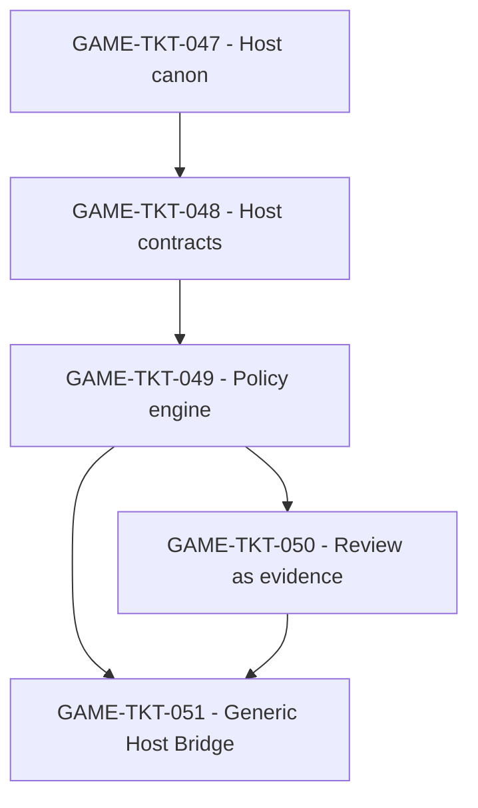

## But

Structurer les tickets `GAME-TKT-047` a `GAME-TKT-051` en trajectoire d'implementation sequencee, testable et sans contradiction avec le front prioritaire du runtime `grimoire-kit/apps/grimoire-game`.

### Mise a jour de sequencing locale (2026-04-12)

- `GAME-TKT-047`, `GAME-TKT-048` et `GAME-TKT-049` sont couverts localement sur leur tranche runtime bornee par [host-policy-engine.test.ts](../../../../grimoire-kit/apps/grimoire-game/tests/integration/host-policy-engine.test.ts), [host-bridge-session.test.ts](../../../../grimoire-kit/apps/grimoire-game/tests/integration/host-bridge-session.test.ts) et [runtime-dashboard-hosts.test.ts](../../../../grimoire-kit/apps/grimoire-game/tests/integration/runtime-dashboard-hosts.test.ts).
- `GAME-TKT-050` et `GAME-TKT-051` sont egalement couverts localement par [host-handoff-view.test.ts](../../../../grimoire-kit/apps/grimoire-game/tests/integration/host-handoff-view.test.ts), [library-view-host-reviews.test.ts](../../../../grimoire-kit/apps/grimoire-game/tests/integration/library-view-host-reviews.test.ts) et [mammouth-host-adapter.test.ts](../../../../grimoire-kit/apps/grimoire-game/tests/integration/mammouth-host-adapter.test.ts).
- `GAME-TKT-038` reste une dependance deja satisfaite localement pour `GAME-TKT-050`; il ne doit pas etre relu ici comme un chantier runtime a rouvrir.
- Ce paquet ne doit donc plus etre relu comme un front runtime local en attente, mais comme une reference de verification deja satisfaite sur le package courant.

Le principe directeur est volontairement strict:

- `GAME-TKT-047` gèle le vocabulaire canonique des hotes avant toute UI specifique.
- `GAME-TKT-048` rend les actions et imports externes replayables et auditables.
- `GAME-TKT-049` ferme la policy d'activation avant tout bridge multi-host.
- `GAME-TKT-050` convertit la review externe en evidence interne.
- `GAME-TKT-051` generalise VS Code en Host Bridge sans divergence semantique.

## Sources operatoires

- [PLAN-implementation-web-gaming.md](./PLAN-implementation-web-gaming.md)
- [TICKETS-web-gaming.md](./TICKETS-web-gaming.md)
- [CONTRAT-host-bridge-agentique-externe.md](./CONTRAT-host-bridge-agentique-externe.md)
- [MATRICE-verification-host-bridge-agentique-externe.md](./MATRICE-verification-host-bridge-agentique-externe.md)
- [SUITE-tests-host-bridge-agentique-externe.md](./SUITE-tests-host-bridge-agentique-externe.md)
- [connectivite-agentique-externe-agent-os-game-ui.md](../../../docs/exploitation/connectivite-agentique-externe-agent-os-game-ui.md)

## Perimetre cible

| Ticket | Intention | Sorties attendues | Gates d'entree |
| --- | --- | --- | --- |
| `GAME-TKT-047` | Figer le modele des hotes externes | `Host Binding`, `Capability Manifest`, registre des hotes et mapping vendeur -> primitive | `GAME-TKT-001`, `GAME-TKT-004`, `GAME-TKT-040` |
| `GAME-TKT-048` | Rendre les actions, reviews et contextes externes auditables | `Invocation Envelope`, `Context Ledger`, `Review Artifact`, events et projections additives | `GAME-TKT-047`, `GAME-TKT-001`, `GAME-TKT-002`, `GAME-TKT-003`, `GAME-TKT-040` |
| `GAME-TKT-049` | Fermer la securite des connecteurs externes | Policy engine, permission prompts, scopes, allowlists, degrade states, audit trail | `GAME-TKT-047`, `GAME-TKT-048`, `GAME-TKT-004`, `GAME-TKT-037` |
| `GAME-TKT-050` | Convertir les reviews externes en evidence cockpit | Ingest review/check/comment -> `Review Artifact` -> evidence refs -> vues runtime | `GAME-TKT-048`, `GAME-TKT-049`, `GAME-TKT-008`, `GAME-TKT-010`, `GAME-TKT-038` |
| `GAME-TKT-051` | Exposer un Host Bridge generic au-dessus du pont VS Code | Surface multi-host, health, capabilities, routines actives, degradation propre | `GAME-TKT-047`, `GAME-TKT-048`, `GAME-TKT-049`, `GAME-TKT-020`, `GAME-TKT-041`, `GAME-TKT-044`, `GAME-TKT-046` |

## Landing zones techniques

| Zone | Role dans le paquet |
| --- | --- |
| `grimoire-kit/apps/grimoire-game/src/contracts/schemas.ts` | Schemas additifs des hotes, invocations, reviews et ledgers |
| `grimoire-kit/apps/grimoire-game/src/contracts/events.ts` | Creation/parsing des events `HOST_*` |
| `grimoire-kit/apps/grimoire-game/src/bridge/agent-adapter.ts` | Frontiere preview/validation/commit pour actions issues d'un hote |
| `grimoire-kit/apps/grimoire-game/src/bridge/agent-connection-health.ts` | Health model des hotes relies aux sessions et aux agents |
| `grimoire-kit/apps/grimoire-game/src/state/audit-view.ts` | Decisions de policy, permission prompts, review artifacts, degradations |
| `grimoire-kit/apps/grimoire-game/src/state/session-view.ts` | Correlation host -> run -> task -> trace |
| `grimoire-kit/apps/grimoire-game/src/state/runtime-dashboard-view.ts` | Surface multi-host lisible par le cockpit |
| `grimoire-kit/framework/tools/tool-registry.py` | Canon des tool providers internes ou externes |
| `grimoire-kit/framework/tools/mcp-proxy.py` | Source de verite technique pour serveurs MCP externes |
| `grimoire-kit/framework/tools/llm-router.py` | Policy de routing gardee cote noyau, jamais cote host |

## Work packages

### WP-01 - Modele canonique des hotes

But:

Poser un vocabulaire stable et unique pour les hotes externes.

Sous-lots:

1. `047-A` - Definir `Host Binding` et `Capability Manifest`.
2. `047-B` - Cartographier Copilot, Claude et un hote MCP-compatible de reference.
3. `047-C` - Exposer un registre des hotes dans les read models runtime.

Gate de sortie:

- Aucun hote externe du scope prioritaire n'est encore informe ou gouverne par du texte libre.

### WP-02 - Contrats d'invocation et de contexte

But:

Rendre toute entree externe rejouable et auditable.

Sous-lots:

1. `048-A` - Definir `Invocation Envelope`.
2. `048-B` - Definir `Context Ledger` et `Review Artifact`.
3. `048-C` - Propager les metadata minimales dans `audit-view`, `session-view` et les dashboards runtime.

Gate de sortie:

- Une action, une review ou un import de contexte externe se relit sans dependance a l'UX du vendeur.

### WP-03 - Policy engine et permission prompts

But:

Bloquer toute mutation non qualifiee provenant d'un hote externe.

Sous-lots:

1. `049-A` - Definir scopes, allowlists et decisions `ALLOW`, `PROMPT`, `DENY`, `DEGRADE`.
2. `049-B` - Integrer les permission prompts et leur journal d'audit.
3. `049-C` - Faire degrader un host stale, incompatible ou hors policy.

Gate de sortie:

- Aucun connecteur externe non approuve ne peut muter l'etat durable.

### WP-04 - Reviews externes comme evidence interne

But:

Faire des reviews externes un citizen de premiere classe du cockpit.

Sous-lots:

1. `050-A` - Mapper review, comment, check et verdict externes sur `Review Artifact`.
2. `050-B` - Relier les findings aux traces, tickets et evidence refs.
3. `050-C` - Exposer le tout dans `audit-view` et `verification-view`.

Gate de sortie:

- Le cockpit reconstruit une review externe sans parser l'interface d'origine.

### WP-05 - Surface multi-host et degradation propre

But:

Generaliser VS Code en Host Bridge generique sans casser le cockpit courant.

Sous-lots:

1. `051-A` - Afficher bindings, capabilities, routines et health dans `runtime-dashboard-view`.
2. `051-B` - Relier les etats `online`, `stale`, `degraded`, `blocked` au health snapshot.
3. `051-C` - Verifier que web, VS Code et host externe lisent la meme semantique de run.

Gate de sortie:

- Un meme run reste lisible depuis plusieurs surfaces sans divergence de causalite.

### WP-06 - Suite de verification et evidences

But:

Verifier le paquet par preuves executables.

Sous-lots:

1. `QA-A` - Couvrir `GAME-TKT-047` et `GAME-TKT-048` par contrats et projections.
2. `QA-B` - Couvrir `GAME-TKT-049` par tests negatifs de policy et degradation.
3. `QA-C` - Couvrir `GAME-TKT-050` et `GAME-TKT-051` par views, replay et interop.

Gate de sortie:

- Les suites referencees dans [SUITE-tests-host-bridge-agentique-externe.md](./SUITE-tests-host-bridge-agentique-externe.md) passent et les preuves sont retrouvables par ticket.

## Definition of ready du paquet

- Les tickets parents `GAME-TKT-047` a `GAME-TKT-051` sont geles fonctionnellement.
- Les landing zones runtime et framework ont ete validees cote architecture.
- La regle `Forge = source de verite` est explicite et acceptee.
- Les surfaces cibles sont bornees: `audit-view`, `session-view`, `runtime-dashboard-view`, `agent-connection-health`.
- Le sequencing respecte le gel post-challenge: `047-049` peuvent etre prepares au fil du front canonique, `050-051` restent fermes tant que la preuve prioritaire n'est pas etablie.

## Definition of done du paquet

- Le runtime connait les hotes externes via des contrats stables.
- Toute entree externe passe par policy, preview et audit.
- Les reviews externes deviennent des evidence refs consultables.
- La surface multi-host n'introduit aucune divergence entre web, VS Code et hotes externes.
- Les claims publics restent bornes a l'alignement contractuel et aux preuves executees.

Etat local de reference:

- La definition of done ci-dessus est satisfaite sur la tranche runtime locale deja verifiee.
- Tout reliquat restant doit etre redecoupe explicitement comme integration vendor, exploitation multi-surface ou orchestration externe plus large.

## Hors scope explicite

- Reproduire l'UX complete de Copilot, Claude ou GitHub dans le cockpit.
- Faire d'un SDK, d'un plugin ou d'un layout `.mcp.json` la source de verite du produit.
- Ouvrir un mode actif-actif multi-host sans gates, policies et budget de mutation.
- Importer des memoires externes comme verite silencieuse.
