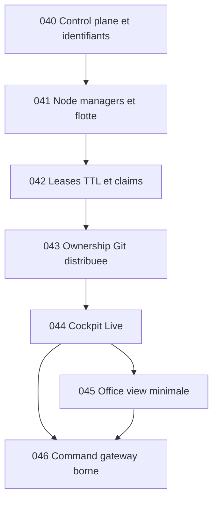

## But

Conserver la tranche multi-PC V1 comme reference de verification locale pour le runtime `grimoire-kit/apps/grimoire-game`.

Ce paquet couvre exclusivement :

- `GAME-TKT-040` control plane logique et enveloppe canonique de run ;
- `GAME-TKT-041` node managers, heartbeats et projection de flotte ;
- `GAME-TKT-042` leases TTL, claims et reprise ;
- `GAME-TKT-043` ownership Git distribuee ;
- `GAME-TKT-044` cockpit live multi-PC ;
- `GAME-TKT-045` office view minimale et war room observateur ;
- `GAME-TKT-046` command gateway borne et mode spectateur partageable.

### Mise a jour locale de verification (2026-04-12)

- `GAME-TKT-040` est prouve localement par [project-registry.test.ts](../../../../grimoire-kit/apps/grimoire-game/tests/integration/project-registry.test.ts).
- `GAME-TKT-041` est prouve localement par [node-registry.test.ts](../../../../grimoire-kit/apps/grimoire-game/tests/integration/node-registry.test.ts).
- `GAME-TKT-042` et `GAME-TKT-043` sont prouves localement par [lease-store.test.ts](../../../../grimoire-kit/apps/grimoire-game/tests/integration/lease-store.test.ts).
- `GAME-TKT-044` est prouve localement par [runtime-cockpit-view.test.ts](../../../../grimoire-kit/apps/grimoire-game/tests/integration/runtime-cockpit-view.test.ts).
- `GAME-TKT-045` est prouve localement par [runtime-observer-view.test.ts](../../../../grimoire-kit/apps/grimoire-game/tests/integration/runtime-observer-view.test.ts).
- `GAME-TKT-046` est prouve localement par [command-gateway.test.ts](../../../../grimoire-kit/apps/grimoire-game/tests/integration/command-gateway.test.ts).
- Ce paquet ne doit donc plus etre relu comme un front runtime local encore ouvert, mais comme une reference de tranche bornee deja validee dans le package courant.

## Sources operatoires

- [PLAN-implementation-web-gaming.md](./PLAN-implementation-web-gaming.md)
- [TICKETS-web-gaming.md](./TICKETS-web-gaming.md)
- [EPICS-grimoire-game.md](./EPICS-grimoire-game.md)
- [TECH-grimoire-game.md](./TECH-grimoire-game.md)
- [CdC-grimoire-game.md](./CdC-grimoire-game.md)
- [../../../docs/exploitation/architecture-cible-v1-runtime-distribue-agent-os-game-ui.md](../../../docs/exploitation/architecture-cible-v1-runtime-distribue-agent-os-game-ui.md)
- [../../../docs/exploitation/paquet-execution-vague-1-agent-os-game-ui.md](../../../docs/exploitation/paquet-execution-vague-1-agent-os-game-ui.md)

## Invariants non negociables

- Un seul control plane logique existe en V1 pour le projet actif.
- Une seule source de verite existe par domaine : code dans Git, execution dans le bus runtime, ownership dans le lease store, lecture UI dans les read models.
- Le cockpit et l'observateur lisent la meme causalite et les memes identifiants canoniques.
- Aucune commande navigateur ne parle directement a Git, au shell ou a une machine distante.
- Toute mutation GUI passe par un gateway borne avec authz, budget, audit et idempotence.
- L'observateur spatial reste read-mostly ; il ne devient jamais une deuxieme surface de commandement.

## Base technique deja disponible

| Brique existante | Reemploi dans la tranche multi-PC |
| --- | --- |
| `src/state/runtime-dashboard-view.ts` | Facade read-only principale pour construire le cockpit sans recreer un store parallele |
| `src/state/runtime-dashboard-ui-view.ts` | Couche UI existante a etendre avec flotte, leases, ownership et focus multi-PC |
| `src/bridge/runtime-dashboard-session.ts` | Synchronisation bootstrap, reconnect et sync incremental deja en place |
| `src/state/canonical-envelope-pilot.ts` | Point d'extension naturel pour les identifiants canoniques et l'enveloppe live |
| `src/bridge/agent-connection-health.ts` | Base pour la sante de presence avant d'introduire la sante des noeuds |
| `src/state/board-view.ts` | Source pour taches, rooms, inspections et decision cards |
| `src/state/observability-panel-view.ts` | Source pour alertes, timeline, focus et attention queue |
| `src/state/collaboration-view.ts` | Source pour handoffs et lecture des interactions entre agents |
| `src/state/verification-view.ts` | Source pour preuves, gates et causalite de verification |

## Ordre d'attaque fichier par fichier

| Ordre | Fichier | Role dans la tranche | Ticket principal |
| --- | --- | --- | --- |
| 1 | `src/contracts/events.ts` | Figer `projectId`, `nodeId`, `leaseId`, `worktreeId`, `runId`, `taskId`, `traceId`, `workerId` et les payloads de presence ou ownership | `GAME-TKT-040` |
| 2 | `src/contracts/schemas.ts` | Valider strictement les nouvelles enveloppes, leases et claims | `GAME-TKT-040` |
| 3 | `src/state/canonical-envelope-pilot.ts` | Projeter les events critiques avec causalite multi-PC stable | `GAME-TKT-040` |
| 4 | `src/server/control-plane/project-registry.ts` | Registre du projet actif, version de registre et lecture canonique du run courant | `GAME-TKT-040` |
| 5 | `src/server/control-plane/node-registry.ts` | Presence, capacites, heartbeat et transitions `live`, `stale`, `offline` | `GAME-TKT-041` |
| 6 | `src/server/control-plane/lease-store.ts` | TTL, renew, expire, reclaim, redelivery et audit d'ownership | `GAME-TKT-042` |
| 7 | `src/bridge/agent-connection-health.ts` | Generaliser le signal agent vers un signal noeud ou worker exploitable par la flotte | `GAME-TKT-041` |
| 8 | `src/bridge/runtime-dashboard-session.ts` | Etendre le sync aux registres control plane et au budget de commande | `GAME-TKT-040`, `GAME-TKT-046` |
| 9 | `src/bridge/runtime-source-fs.ts` | Rejouer claims, expirations, ownership Git et events cockpit sans bypass | `GAME-TKT-042`, `GAME-TKT-043`, `GAME-TKT-046` |
| 10 | `src/state/node-fleet-view.ts` | Vue read-only de la flotte, sante des noeuds, capacites et drift de heartbeat | `GAME-TKT-041` |
| 11 | `src/state/lease-view.ts` | Vue read-only des leases, expirations, conflits et claims actifs | `GAME-TKT-042` |
| 12 | `src/state/runtime-dashboard-view.ts` | Integrer flotte, leases et ownership dans la facade canonique du cockpit | `GAME-TKT-044` |
| 13 | `src/state/runtime-dashboard-ui-view.ts` | Produire les cartes UI et focus multi-PC de l'operateur | `GAME-TKT-044` |
| 14 | `src/state/runtime-cockpit-view.ts` | Presenter une vue experte compacte projet, flotte, verrous, preuves et timeline | `GAME-TKT-044` |
| 15 | `src/state/runtime-observer-view.ts` | Deriver la lecture spatiale a partir des memes read models sans logique parallele | `GAME-TKT-045` |
| 16 | `src/server/control-plane/command-gateway.ts` | Authz, budget de mutation, audit, idempotence et spectator guard | `GAME-TKT-046` |
| 17 | `tests/integration/project-registry.test.ts` | Prouver reconstruction de run et stabilite des identifiants | `GAME-TKT-040` |
| 18 | `tests/integration/node-registry.test.ts` | Prouver transitions de presence et projection de flotte | `GAME-TKT-041` |
| 19 | `tests/integration/lease-store.test.ts` | Prouver expire, reclaim, no double mutation durable | `GAME-TKT-042` |
| 20 | `tests/integration/runtime-cockpit-view.test.ts` | Prouver la lecture operateur sur memes projections que le runtime | `GAME-TKT-044` |
| 21 | `tests/integration/runtime-observer-view.test.ts` | Prouver la parite cockpit contre observateur | `GAME-TKT-045` |
| 22 | `tests/integration/command-gateway.test.ts` | Prouver authz, audit, idempotence et blocage spectateur | `GAME-TKT-046` |

## Work packages

### WP-M0 - Control plane et identifiants canoniques

But : fermer `GAME-TKT-040` avant toute lecture multi-PC.

Sous-lots :

1. Ajouter les identifiants canoniques au contrat runtime.
2. Introduire `project-registry.ts` comme source de verite du projet actif.
3. Etendre l'enveloppe canonique pilote pour les evenements `node.heartbeat`, `lease.claim`, `lease.expire`, `git.ownership` et `command.audit`.
4. Brancher ces identifiants sur `runtime-dashboard-session`.

Gate de sortie :

- Un run multi-PC se reconstruit depuis les events sans inference heuristique.
- Toutes les surfaces de lecture manipulent les memes identifiants et la meme version de registre.

### WP-M1 - Flotte de noeuds et heartbeats

But : fermer `GAME-TKT-041` en rendant visible l'etat de chaque PC.

Sous-lots :

1. Creer `node-registry.ts` avec heartbeat, capacites, version runtime et statut `live`, `stale`, `offline`.
2. Generaliser `agent-connection-health.ts` vers un signal de sante de noeud et de worker.
3. Creer `node-fleet-view.ts` puis le brancher dans `runtime-dashboard-view.ts`.

Gate de sortie :

- Deux PCs peuvent rejoindre le meme projet actif sans duplication de noeud.
- Un noeud stale est visible en moins d'une lecture cockpit.

### WP-M2 - Leases TTL, claims et ownership Git

But : fermer `GAME-TKT-042` et `GAME-TKT-043` avant d'ouvrir le pilotage GUI.

Sous-lots :

1. Creer `lease-store.ts` avec claim, renew, expire, reclaim et journal d'audit.
2. Lier chaque claim a `taskId`, `branch`, `worktreeId`, `nodeId` et `workerId`.
3. Etendre `runtime-source-fs.ts` pour rejeter toute mutation hors ownership actif.
4. Creer `lease-view.ts` puis exposer l'ownership Git dans les inspections.

Gate de sortie :

- Une perte de heartbeat provoque une expiration observable et reclamable.
- Une mutation hors ownership est refusee, auditee et visible cote cockpit.

### WP-M3 - Cockpit Live multi-PC

But : fermer `GAME-TKT-044` avec une vue experte compacte sur projet, flotte, verrous et preuves.

Sous-lots :

1. Etendre `runtime-dashboard-view.ts` avec flotte, leases, ownership Git et focus multi-PC.
2. Etendre `runtime-dashboard-ui-view.ts` avec cartes de flotte, rail d'attention, file des leases et incidents.
3. Creer `runtime-cockpit-view.ts` comme facade experte pour l'operateur.

Gate de sortie :

- L'operateur repond vite a `quel projet est actif`, `quels noeuds sont vivants`, `qui detient le lock`, `quelle preuve explique le blocage`.

### WP-M4 - Observateur spatial et command gateway borne

But : fermer `GAME-TKT-045` et `GAME-TKT-046` sans rouvrir de deuxieme verite produit.

Sous-lots :

1. Creer `runtime-observer-view.ts` a partir des memes read models que le cockpit.
2. Mapper leases, attention queue, handoffs et focus sur la scene spatiale.
3. Creer `command-gateway.ts` pour les commandes GUI bornees.
4. Interdire toute mutation aux tokens spectateur et toute commande directe depuis l'observateur.

Gate de sortie :

- Le cockpit et l'observateur affichent le meme focus, les memes taches et les memes alertes pour un meme run.
- Toute mutation GUI autorisee est authz, idempotente, auditee et fail-closed.

## Criteres de conception par ticket

### `GAME-TKT-040` - Control plane logique V1

- Sorties obligatoires : registre projet, ids canoniques, enveloppe live versionnee.
- Refus explicites : id manquant, registre ambigu, event non versionne.
- Preuves minimales : integration `project-registry`, compatibilite `canonical-envelope-pilot`, sync `runtime-dashboard-session`.

### `GAME-TKT-041` - Node manager multi-PC

- Sorties obligatoires : protocol presence, projection de flotte, statut `live`, `stale`, `offline`.
- Refus explicites : node duplique, heartbeat incoherent, capacites absentes.
- Preuves minimales : integration `node-registry`, projection `node-fleet-view`, alertes cockpit.

### `GAME-TKT-042` - Leases TTL et claims

- Sorties obligatoires : claim, renew, expire, reclaim, redelivery observable.
- Refus explicites : claim concurrent, renew hors TTL, mutation sans lease.
- Preuves minimales : integration `lease-store`, rejection cote `runtime-source-fs`, lecture `lease-view`.

### `GAME-TKT-043` - Ownership Git distribuee

- Sorties obligatoires : branche, worktree, owner et statut dirty par tache mutable.
- Refus explicites : deux owners actifs sur le meme perimetre, worktree absent, branche non resolue.
- Preuves minimales : tests de collisions, inspection cockpit, journal d'audit ownership.

### `GAME-TKT-044` - Cockpit Live multi-PC

- Sorties obligatoires : vue projet, flotte, leases, ownership, preuves, timeline.
- Refus explicites : widget reposant sur une source hors read models canoniques.
- Preuves minimales : `runtime-cockpit-view.test.ts`, scenario operateur, parite des focus.

### `GAME-TKT-045` - Office view minimale

- Sorties obligatoires : scene spatiale utile, rooms, handoffs, halos de focus, badges de blocage.
- Refus explicites : logique metier derivee hors cockpit, commande critique cachee dans la scene.
- Preuves minimales : `runtime-observer-view.test.ts`, walkthrough incident, parite cockpit/scene.

### `GAME-TKT-046` - Command gateway borne

- Sorties obligatoires : liste fermee de commandes, budgets, audit, blocage spectateur.
- Refus explicites : commande sans guardrail, sans audit, sans idempotency key, ou depuis spectator.
- Preuves minimales : `command-gateway.test.ts`, audits de refus et succes, budget de mutation documente.

## Etat local de reference

- La tranche multi-PC V1 est satisfaite localement sur le package courant.
- Tout reliquat restant doit etre redecoupe explicitement comme deploiement multi-machine, interop poste a poste ou UX d'exploitation plus large, et non rouvert comme coeur runtime local absent.

## Sequence de tests et d'evidences

| Ordre | Suite | Ce que la suite prouve |
| --- | --- | --- |
| 1 | `tests/contracts/events.test.ts` | Les envelopes et ids canoniques restent compatibles et strictement valides |
| 2 | `tests/integration/project-registry.test.ts` | Le projet actif et le run courant se reconstruisent proprement |
| 3 | `tests/integration/node-registry.test.ts` | Les heartbeats projettent une flotte fiable |
| 4 | `tests/integration/lease-store.test.ts` | Les claims expirent et se reprennent sans double execution durable |
| 5 | `tests/integration/runtime-dashboard-session.test.ts` | Le sync incremental reste coherent avec le control plane |
| 6 | `tests/integration/runtime-cockpit-view.test.ts` | Le cockpit repond aux questions operatoires sans transcript brut |
| 7 | `tests/integration/runtime-observer-view.test.ts` | La scene reste alignee sur les memes read models |
| 8 | `tests/integration/command-gateway.test.ts` | Les commandes GUI sont bornees, auditees et bloquees pour spectator |

## Definition of ready

- Les identifiants canoniques et les payloads control plane sont geles fonctionnellement.
- Les surfaces de mutation GUI ciblees sont nommees et bornees.
- La discipline `une tache -> une branche -> un owner -> un worktree` est acceptee comme invariant d'execution.

## Definition of done

- Le runtime expose un control plane logique unique pour le projet actif.
- La flotte, les leases, l'ownership Git et les preuves sont lisibles dans une vue cockpit unique.
- L'observateur spatial lit les memes read models et n'introduit aucune logique parallele.
- Toute commande GUI passe par un gateway borne avec audit et blocage read-only.
- Les suites de test critiques de la tranche multi-PC sont vertes.

## Hors scope explicite

- `etcd`, elections fortes, quorum et consensus distribue complet.
- `Syncthing` ou tout mecanisme de sync P2P dans le chemin d'execution canonique.
- `Yjs`, `Automerge` ou toute verite CRDT pour les leases, claims ou ownership.
- Un navigateur qui execute des commandes shell, Git ou machine sans mediation serveur.
