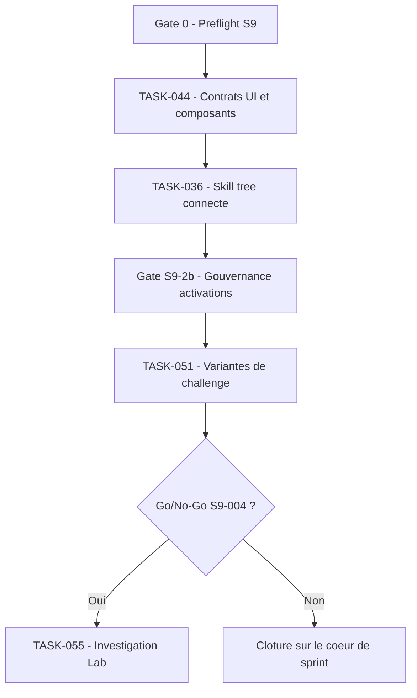

## But

S9 livre une premiere verticale credible de configuration gamifiee sans ouvrir toute l'EPIC-10. Le sprint s'engage sur un socle UI reutilisable, une configuration reliee a la vraie config Grimoire, et les variantes de challenge necessaires pour ouvrir la gouvernance d'execution. L'Investigation Lab n'entre qu'en seconde intention, sous gate explicite.

Le sprint ne livre aucune activation MCP ou skill sans badges de provenance, trust status et policy minimale sur le scope retenu.

## Statut post-challenge

S9 n'est plus un sprint ouvrable immediat dans l'ordre d'execution courant.

Le front post-challenge `GAME-TKT-052 -> GAME-TKT-053 -> GAME-TKT-054` doit etre prouve avant toute ouverture large de configuration gamifiee, de challenge enrichi ou d'Investigation Lab.

Conséquences directes :

- `TASK-044` peut avancer uniquement en preparation et cadrage UI reutilisable ;
- `TASK-036`, `TASK-051` et `TASK-055` restent bloques tant que `GAME-TKT-054` n'est pas prouve ;
- aucun livrable S9 ne doit ouvrir un second chemin canonique hors de la spine prioritaire.

Mise a jour runtime locale du 2026-04-11 :

- La tranche runtime bornee rattachee a `GAME-TKT-030` et `TASK-036` est deja couverte et validee dans `grimoire-kit/apps/grimoire-game`.
- `GAME-TKT-038` est egalement prouve localement et doit etre traite comme dependance satisfaite, non comme chantier runtime encore ouvert.
- Si S9 est reouvert plus tard, `TASK-036` doit etre recadre comme reliquat UI, UX ou produit explicite, et non comme coeur runtime a reimplementer.

## Sources operatoires

- [KICKOFF-S09-grimoire-game.md](KICKOFF-S09-grimoire-game.md)
- [EPICS-grimoire-game.md](EPICS-grimoire-game.md)
- [PAQUET-execution-agentic-guardrails-runtime.md](PAQUET-execution-agentic-guardrails-runtime.md)
- [HANDOFF-S09-grimoire-game.md](HANDOFF-S09-grimoire-game.md)
- [TICKETS-web-gaming.md](TICKETS-web-gaming.md)
- [GO-NO-GO-S09-004-grimoire-game.md](GO-NO-GO-S09-004-grimoire-game.md)
- [CdC-grimoire-game.md](CdC-grimoire-game.md)
- [GDD-grimoire-game.md](GDD-grimoire-game.md)
- [TECH-grimoire-game.md](TECH-grimoire-game.md)
- [WORKFLOW-challenge.md](WORKFLOW-challenge.md)
- [PAQUET-execution-front-prioritaire-post-challenge.md](PAQUET-execution-front-prioritaire-post-challenge.md)

## Engagement coeur

- `TASK-044` : figer le design system S9, produire les mockups HTML prioritaires, puis livrer les composants Svelte reutilisables pour panels et modals critiques.
- `TASK-036` : ticket historique de coeur S9 ; sa tranche runtime locale est deja couverte. Toute reprise future doit viser uniquement un reliquat UI, UX ou produit explicitement redecoupe.
- `TASK-051` : livrer le selecteur de type de challenge et les variantes Investigation, DX Review et Auto-Challenge, sans ouvrir la tranche suivante de l'EPIC-09.

## Conditionnel si gates franchies

- `TASK-055` : Investigation Lab + Verification Gate, uniquement si le socle debug est confirme, que `TASK-051` est termine, et que les flux Kanban ou branches restent stables.

## Hors sprint explicite

- `TASK-037` : configuration prompts in-line.
- `TASK-038` : configuration hooks visuels.
- `TASK-052`, `TASK-053`, `TASK-054`, `TASK-056`, `TASK-057`, `TASK-058`.
- Les dependances EPIC-12 qui ne sont pas strictement necessaires au cadrage S9.

## Repartition par role

- `@dev` : porte `TASK-036` et `TASK-051`, puis integre les composants issus de `TASK-044`.
- `@ux` : pilote `TASK-044`, fournit la direction skill tree et les animations strictement necessaires a `TASK-051`.
- `@qa` : verrouille la persistance, le rendu responsive, les declencheurs de challenge et les pipelines nominaux.
- `@arch` : valide la synchro avec la config reelle, les contrats UI orientes WebSocket, et arbitre le go/no-go vers `TASK-055`.

## Ordre d'execution recommande

1. Confirmer d'abord la fermeture de `GAME-TKT-052`, `GAME-TKT-053` et `GAME-TKT-054` via le paquet post-challenge runtime.
2. Tant que cette gate n'est pas verte, limiter S9 a `TASK-044` en preparation, design system et contrats d'interface reutilisables.
3. Revalider ensuite le preflight S9 : `TASK-035` et `TASK-049` utilisables, flux Kanban ou branches stables, cadrage auth spectateur disponible.
4. Ne reouvrir `TASK-036` qu'apres validation de la gate post-challenge, des contrats UI du skill tree, et d'un recadrage explicite d'un reliquat au-dela de la tranche runtime deja couverte.
5. Fermer la gate de gouvernance S9 sur provenance, trust status et policy minimale avant toute ouverture plus large du scope configuration.
6. Demarrer `TASK-051` une fois le contrat de Challenge Modal gele, sans elargir le perimetre au-dela des trois variantes prevues.
7. Tenir une revue go/no-go S9. Si les gates coeur sont vertes, ouvrir `TASK-055`; sinon, fermer le sprint sur le coeur deja livre.
8. N'ouvrir `TASK-055` qu'avec blocages metier, audit trail et surfaces UI relies a des evenements serveur deja stabilises.

## Gates de sortie

- `Gate 0` : `GAME-TKT-054` est prouve, `TASK-035` et `TASK-049` sont utilisables, les flux Kanban ou branches ne sont pas instables, et le cadrage auth spectateur est disponible.
- `Gate 1` : la direction visuelle S9 est retenue, les contrats UI sont figes, et le rendu panel ou modal reste correct sur les resolutions cibles.
- `Gate 2` : `TASK-036` persiste et recharge la vraie configuration sans divergence visible.
- `Gate 2b` : aucune activation du scope S9 ne passe sans badges de provenance, trust status et policy minimale visibles.
- `Gate 3` : `TASK-051` declenche correctement les variantes Investigation, DX Review et Auto-Challenge sans regression sur la modal de challenge.
- `Gate 4` : `TASK-055` bloque `FIX_PROPOSED` sans root cause, bloque `DONE` sans verification et ecrit un audit log exploitable.

## Tickets associes

- [TICKETS-web-gaming.md](TICKETS-web-gaming.md) section `Paquet Sprint S9 (execution locale)`.
- [HANDOFF-S09-grimoire-game.md](HANDOFF-S09-grimoire-game.md) pour la passation par role et les synchronisations obligatoires.
- [KICKOFF-S09-grimoire-game.md](KICKOFF-S09-grimoire-game.md) pour le demarrage court du sprint.
- [GO-NO-GO-S09-004-grimoire-game.md](GO-NO-GO-S09-004-grimoire-game.md) pour l'ouverture conditionnelle de `TASK-055`.

## Risques principaux et parade

- Risque : surcharge d'integration entre `TASK-036`, `TASK-051` et les sorties de `TASK-044`. Parade : geler les contrats UI avant implementation et refuser toute extension de scope apres `Gate 1`.
- Risque : `TASK-036` livre une configuration activable sans policy ou provenance visibles. Parade : gate S9-2b explicite, refus fail-closed et evidence d'audit associee.
- Risque : `TASK-055` depend d'un socle debug moins stable que prevu. Parade : gate formelle avant ouverture, sans contournement.
- Risque : `TASK-044` derive en exploration design sans fin. Parade : juger la sortie sur l'utilite d'integration et la qualite des contrats UI, pas sur le nombre de directions explorees.
- Risque : `TASK-051` aspire des elements de la tranche suivante de l'EPIC-09. Parade : rester strictement sur les trois variantes et reporter Parallel Dispatcher, Code Review Room et Security Audit Room.

## Hypotheses

- Hypothese : le socle S8 de debug, en particulier `TASK-035` et `TASK-049`, est deja stable ou suffisamment exploitable pour servir de base a S9.
- Hypothese : le cadrage auth spectateur existe au niveau decisionnel ou contractuel, meme si le mode spectateur complet reste planifie plus tard.
