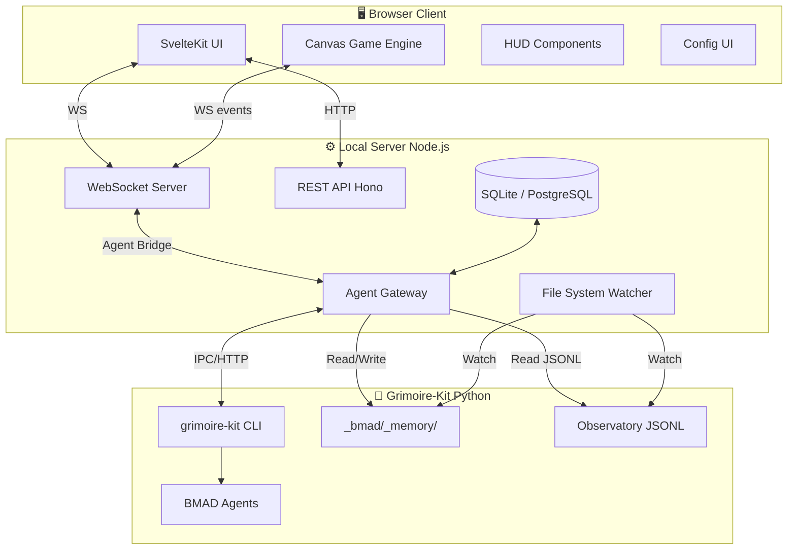

# Document Technique — Architecture Grimoire Game

> Projet : **Grimoire Game** — Architecture et Stack Technique
> Version : 1.1 — Avril 2026
> Auteurs : BMad Master + Architect + Dev (multi-agent)

---

## 1. Choix du langage et du framework

### 1.1 Décision architecture

**TypeScript** est le langage recommandé pour l'intégralité du projet, front et back. Justification :

| Critère | TypeScript (choix) | Python | Rust |
|---|---|---|---|
| Écosystème jeu web | ✅ Canvas 2D, Phaser, WASM | ❌ Limité | ⚠️ Via WASM |
| Temps réel WebSocket | ✅ ws, socket.io | ✅ | ✅ |
| Cohérence avec pixel-agents | ✅ (même stack) | ❌ | ❌ |
| Cohérence avec DeskRPG | ✅ Next.js/TypeScript | ❌ | ❌ |
| Dev velocity | ✅ Haut | ✅ Haut | ❌ Bas |
| Type safety jeu | ✅ | ❌ | ✅ |
| Intégration grimoire-kit (Python) | Via API/WS | Native | ❌ |

**Pour le moteur de jeu :** Canvas 2D API native (pas de framework jeu lourd) — même approche que pixel-agents. Raisons :
- Contrôle total sur le rendu pixel
- Pas de dépendance lourde (Phaser = 8 Mo, Pixi.js = 1 Mo, custom = ~30 Ko)
- Intégration facile dans SvelteKit/React
- Le projet pixel-agents prouve que ça scale

**Pour le framework front :** **SvelteKit** (recommandé vs React) :
- Bundle plus petit
- Réactivité native sans hooks complexes
- SSR pour l'interface de config
- Moins de re-renders indésirables pour l'UI
- WorkAdventure utilise Svelte avec succès

**Cas d'usage alternatif React :** Si l'équipe veut réutiliser du code de pixel-agents (React 19), passer sur Vite + React est acceptable.

### 1.2 Stack complète

```
Frontend:
  - TypeScript 5.x
  - SvelteKit 2.x (framework UI)
  - Canvas 2D (moteur de jeu)
  - CSS custom properties (theming)
  
Backend:
  - Node.js 22 LTS
  - TypeScript (transpilé par tsx ou esbuild)
  - ws (WebSocket server, léger et rapide)
  - Hono ou Fastify (REST API, léger)
  - better-sqlite3 (SQLite local)
  - Zod (validation runtime des schémas TypeScript)
  - optionnel: Drizzle ORM (type-safe DB queries)

Infrastructure locale:
  - SQLite (dev/solo) ou PostgreSQL (multi-users)
  - Fichiers JSONL (lecture des transcripts agents existants)
  - grimoire-kit Python API (bridge via subprocess ou HTTP)
  
Tests:
  - Vitest (unit + integration)
  - Playwright (e2e canvas + UI)
  - Testing Library (composants Svelte)
  
Build:
  - Vite (bundler frontend)
  - esbuild (bundler backend)
  - Docker Compose (déploiement optionnel)
```

---

## 2. Architecture système

### 2.1 Vue d'ensemble



### 2.2 Architecture du moteur de jeu

Pattern : **Entity Component System (ECS)** — standard de l'industrie du jeu vidéo.

```
ECS Architecture:
├── World                     (registre global)
│   ├── EntityManager        (IDs uniques, création/destruction)
│   ├── ComponentStorage     (type-indexé, stockage dense)
│   └── SystemScheduler      (exécution ordonnée des systèmes)
│
├── Components (data seulement, pas de logique):
│   ├── Position             { x, y, z }
│   ├── Velocity             { dx, dy, speed }
│   ├── AgentState           { status, action, target }
│   ├── Sprite               { sheet, frame, direction }
│   ├── AgentMeta            { id, name, role, model, tools }
│   ├── DialogBubble         { text, type, expiresAt }
│   ├── PathTarget           { path: Point[], pathIndex }
│   ├── AnimationState       { clip, frame, loop }
│   ├── Room                 { roomId, occupied }
│   ├── ContextWindow        { tokens: number, maxTokens: number, rateLimitPct: number }
│   └── ParentAgent          { parentId: string | null }   // null si agent racine
│
└── Systems (logique seulement, opèrent sur components):
    ├── MovementSystem       (position + velocity + pathfinding)
    ├── AnimationSystem      (sprite + animationState)
    ├── RenderSystem         (canvas 2D drawing)
    ├── AgentBridgeSystem    (sync WS events → ECS state)
    ├── PathfindingSystem    (A* sur tilemap)
    ├── CollisionSystem      (wall blocking)
    ├── DialogSystem         (bubble lifecycle)
    ├── KanbanSystem         (task card updates)
    ├── HUDSystem            (overlays, bars, badges)
    └── NotificationSystem   (achievement banners, XP floaters, event toasts)
```

### 2.3 Architecture WebSocket évènementielle

Tous les événements passent par un bus évènementiel bidirectionnel :

```typescript
// Types d'événements WS (client → server)
type ClientEvent =
  | { type: 'AGENT_MOVE'; agentId: string; target: Point }
  | { type: 'TASK_CREATE'; task: TaskPayload }
  | { type: 'TASK_ASSIGN'; taskId: string; agentId: string }
  | { type: 'AGENT_CREATE'; template: AgentTemplate }
  | { type: 'AGENT_PAUSE'; agentId: string }
  | { type: 'WORKFLOW_START'; workflowId: string; agentIds: string[] }
  | { type: 'CHALLENGE_START'; artifacts: ArtifactRef[] }
  | { type: 'CONFIG_UPDATE'; key: string; value: unknown }
  | { type: 'RECONNECT_HANDSHAKE'; lastEventId?: string }   // demande resync après reconnexion

// Types d'événements WS (server → client)
type ServerEvent =
  | { type: 'AGENT_STATE'; agentId: string; state: AgentState }
  | { type: 'AGENT_MOVE_START'; from: Point; to: Point }
  | { type: 'AGENT_MESSAGE'; from: string; to: string; content: string }
  | { type: 'TASK_UPDATE'; taskId: string; status: TaskStatus }
  | { type: 'TOOL_CALL'; agentId: string; tool: string; params: unknown }
  | { type: 'WORKFLOW_STEP'; agentId: string; step: string }
  | { type: 'MEMORY_ACCESS'; agentId: string; key: string; op: 'read' | 'write' }
  | { type: 'ERROR'; agentId: string; message: string; level: 'warn' | 'error' }
  | { type: 'SYSTEM_TICK'; timestamp: number; agentCount: number }
  | { type: 'STATE_SNAPSHOT'; agents: AgentState[]; tasks: TaskStatus[]; timestamp: number } // envoyé au reconnect
  | { type: 'XP_GAIN'; agentId: string; amount: number; newTotal: number }       // attribution XP
  | { type: 'ACHIEVEMENT_UNLOCK'; agentId: string; achievement: string }         // achievement débloqué
  | { type: 'CONTEXT_UPDATE'; agentId: string; tokens: number; maxTokens: number; rateLimitPct: number }  // fenêtre contexte LLM
  | { type: 'SUBAGENT_SPAWN'; parentId: string; childId: string; task: string }  // sous-agent créé via runSubagent
```

### 2.4 Agent Bridge — intégration grimoire-kit

Le bridge traduit les activités des agents Python BMAD vers des événements de jeu :

```
grimoire-kit agent trace  →  JSONL files  →  FSWatcher  →  AgentBridgeSystem
                                                               ↓
                                                    Parse JSONL entry
                                                               ↓
                                                    Map to AgentState
                                                               ↓
                                                    Emit WS Event
                                                               ↓
                                                    Update ECS Component
                                                               ↓
                                                    Trigger Animation
```

**Mapping tool → animation :**

```typescript
const TOOL_TO_ANIMATION: Record<string, AnimationClip> = {
  'read_file':                    'sit_read',
  'write_file':                   'sit_type_fast',
  'create_file':                  'sit_type_fast',
  'replace_string_in_file':       'sit_type_slow',
  'multi_replace_string_in_file': 'sit_type_slow',
  'run_in_terminal':              'sit_code',
  'grep_search':                  'search_web',
  'file_search':                  'search_web',
  'list_dir':                     'sit_read',
  'semantic_search':              'sit_think',
  'fetch_webpage':                'search_web',
  'memory':                       '→ WALK_TO_LIBRARY',
  'vscode_askQuestions':          'stand_present',
  'get_errors':                   'sit_read',
  'runSubagent':                  '→ SPAWN_SUBAGENT',
};
```

---

## 3. Design patterns appliqués

### 3.1 Design patterns jeu vidéo

**1. Entity Component System (ECS)**
```
Pourquoi: Performance (cache-friendly), zero couplage entre systèmes,
extensibilité maximale (ajouter un Component = nouvelle feature sans toucher l'existant)
```

**2. Game Loop (requestAnimationFrame)**
```typescript
function gameLoop(timestamp: number) {
  const dt = Math.min((timestamp - lastTime) / 1000, 0.016); // cap à 16ms
  update(dt);
  render();
  lastTime = timestamp;
  requestAnimationFrame(gameLoop);
}
```

**3. State Machine pour personnages**
```
Chaque agent = une state machine explicite (XState recommandé)
States: IDLE | WALKING | WORKING | COMMUNICATING | IN_MEETING | PRESENTING | SLEEPING | PANIC | CONFUSED
Transitions: déclenchées par les events WS
```

**4. Object Pool pour particules/effets**
```
Pool de 200 particules pré-allouées (XP, confetti, sparks)
Évite la GC pressure pendant les animations intenses
```

**5. Quadtree pour spatial queries**
```
Pour collision detection et "qui est dans cette room ?"
Performant jusqu'à 1000 agents simulés
```

**6. Observer/EventBus**
```typescript
class EventBus {
  private handlers = new Map<string, Set<EventHandler>>();
  on(event: string, handler: EventHandler): void
  off(event: string, handler: EventHandler): void
  emit(event: string, data: unknown): void
}
// Usage: bus.on('AGENT_TASK_DONE', updateKanban)
```

**7. Command pattern pour les actions utilisateur**
```
Toute action utilisateur (creér tâche, déplacer agent) = Command objet
→ Undo/Redo support natif
→ Replay et debugging facilités
→ Sérialisable pour tests
```

**8. Factory pattern pour les agents**
```typescript
interface AgentFactory {
  create(template: AgentTemplate): Agent
  clone(source: Agent, options?: Partial<AgentTemplate>): Agent
  destroy(agentId: string): void
}
```

### 3.2 Patterns architecture software

**Repository pattern pour la persistence :**
```typescript
interface TaskRepository {
  findAll(filter?: TaskFilter): Promise<Task[]>
  findById(id: string): Promise<Task | null>
  create(task: CreateTaskDTO): Promise<Task>
  update(id: string, data: UpdateTaskDTO): Promise<Task>
  delete(id: string): Promise<void>
}

class SQLiteTaskRepository implements TaskRepository {
  // implémentation SQLite
}

class InMemoryTaskRepository implements TaskRepository {
  // implémentation pour tests
}
```

**Service layer :**
```
UI / WS handler → Service (business logic) → Repository (data access)
Pas de business logic dans les handlers WS
Pas d'accès DB direct depuis l'UI
```

**Adapter pattern pour les agents externes :**
```typescript
/**
 * AgentAdapter — interface d'abstraction pour tous les systèmes agents externes.
 * Permet la connexion à grimoire-kit (JSONL), Claude Code, OpenClaw, Codex CLI,
 * Factory Droid (.factory/skills/) ou Gemini CLI sans refactoring du cœur.
 *
 * Runtimes fonctionnels en v1.0 : GrimoireJSONLAdapter, ClaudeMemAdapter
 * Runtimes stubs (extensibles) : ClaudeCodeAdapter, OpenClawAdapter
 */
interface AgentAdapter {
  /** Retourne l'état courant de l'agent (snapshot synchrone). */
  readState(): AgentState

  /**
   * Ouvre une connexion au runtime agent (fichier watch, WS, DB cursor).
   * Doit être appelé avant subscribeToEvents().
   */
  connect(): Promise<void>

  /** Ferme proprement la connexion (cleanup watchers, WS, DB cursors). */
  disconnect(): Promise<void>

  /**
   * S'abonne au flux d'événements live de l'agent.
   * @param callback Appelé pour chaque nouvel événement
   * @returns Fonction de cleanup (unsubscribe)
   */
  subscribeToEvents(callback: EventCallback): () => void

  /**
   * Envoie un message ou une commande à l'agent.
   * Non disponible pour les adapters read-only (ex: SpectatorAdapter — lance une erreur).
   */
  sendMessage(message: AgentMessage): Promise<void>

  /** Indique si cet adapter supporte les mutations (envoi de messages). */
  readonly readonly: boolean
}

class GrimoireJSONLAdapter implements AgentAdapter {
  // lit les fichiers JSONL de grimoire-kit
}

class OpenClawAdapter implements AgentAdapter {
  // intègre avec OpenClaw via Gateway WS
}

class ClaudeCodeAdapter implements AgentAdapter {
  // intègre avec Claude Code (comme pixel-agents)
}

class ClaudeMemAdapter implements AgentAdapter {
  // lit la DB SQLite de claude-mem (localhost:37777)
  // accède aux observations via MCP: search → timeline → get_observations
  // Référence: https://github.com/thedotmack/claude-mem
}
```

---

## 4. Structure du projet

```
grimoire-game/
├── src/
│   ├── core/                     # Moteur de jeu
│   │   ├── ecs/
│   │   │   ├── World.ts
│   │   │   ├── EntityManager.ts
│   │   │   ├── ComponentStorage.ts
│   │   │   └── SystemScheduler.ts
│   │   ├── components/
│   │   │   ├── Position.ts
│   │   │   ├── AgentState.ts
│   │   │   ├── Sprite.ts
│   │   │   └── ...
│   │   ├── systems/
│   │   │   ├── MovementSystem.ts
│   │   │   ├── RenderSystem.ts
│   │   │   ├── AnimationSystem.ts
│   │   │   ├── SoundSystem.ts
│   │   │   └── ...
│   │   ├── pathfinding/
│   │   │   ├── AStar.ts
│   │   │   └── TileGraph.ts
│   │   └── GameLoop.ts
│   │
│   ├── game/                     # Logique de jeu
│   │   ├── rooms/
│   │   │   ├── Room.ts
│   │   │   ├── TeamRoom.ts
│   │   │   ├── MeetingRoom.ts
│   │   │   ├── ChallengeRoom.ts
│   │   │   ├── WarRoom.ts
│   │   │   ├── Library.ts
│   │   │   ├── RetroRoom.ts
│   │   │   ├── WorktreeRoom.ts
│   │   │   └── AgentFactory.ts
│   │   ├── agents/
│   │   │   ├── AgentSpawner.ts
│   │   │   ├── AgentStateMachine.ts
│   │   │   ├── CommunicationAgent.ts
│   │   │   ├── OrchestratorAgent.ts
│   │   │   ├── ParallelDispatcher.ts    # decomposition par domaine, isolation contexte (no inheritance), conflict detection avant tether close
│   │   │   └── SubagentDevelopment.ts   # spawn fresh subagent par tâche, 2-stage review loop (spec puis qualité), statuts DONE/DONE_WITH_CONCERNS/NEEDS_CONTEXT/BLOCKED + sélection modèle selon complexité
│   │   ├── kanban/
│   │   │   ├── KanbanBoard.ts
│   │   │   ├── TaskCard.ts
│   │   │   └── TaskService.ts
│   │   └── challenge/
│   │       ├── ChallengeWorkflow.ts
│   │       └── VoteSystem.ts
│   │
│   ├── bridge/                   # Intégration agents externes
│   │   ├── GrimoireJSONLAdapter.ts
│   │   ├── OpenClawAdapter.ts
│   │   ├── ClaudeCodeAdapter.ts
│   │   ├── ClaudeMemAdapter.ts         # claude-mem SQLite reader (localhost:37777)
│   │   ├── LearningsAdapter.ts         # lecture ~/.gstack/projects/*/learnings.jsonl
│   │   ├── AgentConnectionHealth.ts    # diagnostics: statut JSONL, lignes parsées, dernier timestamp
│   │   └── AgentBridgeManager.ts
│   │
│   ├── server/                   # Backend Node.js
│   │   ├── ws/
│   │   │   ├── WSServer.ts
│   │   │   └── EventRouter.ts
│   │   ├── api/
│   │   │   ├── agents.ts
│   │   │   ├── tasks.ts
│   │   │   ├── config.ts
│   │   │   ├── memory.ts
│   │   │   └── xp.ts
│   │   ├── db/
│   │   │   ├── schema.ts
│   │   │   ├── migrations/
│   │   │   └── repositories/
│   │   └── services/
│   │       ├── AgentService.ts
│   │       ├── TaskService.ts
│   │       ├── WorkflowService.ts
│   │       ├── MemoryService.ts
│   │       ├── XpService.ts
│   │       ├── SoundService.ts
│   │       ├── RetroMetricsCollector.ts  # git log + résultats tests → métriques sprint
│   │       ├── LearningsService.ts       # lecture/search learnings gstack avec scores confidence
│   │       ├── GitWorktreeService.ts     # git worktree add/remove, événements BRANCH_MERGED
│   │       ├── PluginService.ts          # activation/difféusion des Power Cards (frontend-design, code-review, security-guidance)
│   │       ├── SystematicDebugService.ts # suivi des 4 phases debug, validation ROOT_CAUSE_IDENTIFIED avant FIX_PROPOSED, compteur FIX_FAILED → ARCHITECTURE_REVIEW_REQUIRED
│   │       ├── VerificationGateService.ts # collecte evidence avant DONE, écrit audit log dans .context/verification-log.jsonl, émet WS VERIFICATION_GATE
│   │       ├── CodeReviewService.ts       # dispatch sous-agents spec-reviewer + quality-reviewer, gestion sévérité Critical/Important/Minor, YAGNI check, bloque progression si Critical non résolu
│   │       └── SecurityAuditService.ts    # OWASP Top 10 + STRIDE threat model, confidence gate ≥ 8/10, zero-noise (17 exclusions), génère cartes Kanban sécu, bloque /ship si CRITICAL
│   │
│   ├── ui/                       # Interface SvelteKit
│   │   ├── components/
│   │   │   ├── GameCanvas.svelte
│   │   │   ├── AgentPanel.svelte
│   │   │   ├── KanbanView.svelte
│   │   │   ├── WorkflowView.svelte
│   │   │   ├── DebugConsole.svelte
│   │   │   ├── ConfigSkillTree.svelte
│   │   │   ├── ChallengeRoom.svelte
│   │   │   ├── TimelineBar.svelte
│   │   │   ├── XpProgressBar.svelte
│   │   │   ├── AchievementNotif.svelte
│   │   │   ├── RetroRoom.svelte
│   │   │   ├── PluginPowerCard.svelte
│   │   │   └── ObservatoryPanel.svelte
│   │   ├── stores/
│   │   │   ├── agents.ts
│   │   │   ├── tasks.ts
│   │   │   ├── game.ts
│   │   │   └── progression.ts
│   │   └── routes/
│   │       └── +page.svelte
│   │
│   └── assets/                   # Sprites, sons, maps (manifest-based)
│       ├── furniture/            # Un dossier par item: sprite.png + manifest.json
│       │   └── desk_dual/
│       │       ├── sprite.png
│       │       └── manifest.json   # { id, name, frames, states, rotations, anchor }
│       ├── floors/               # PNG individuels 16×16
│       ├── walls/                # Tilesets de murs 16×16
│       ├── sprites/              # Personnages (sprite sheets)
│       ├── sounds/
│       └── maps/
│
├── tests/
│   ├── unit/
│   ├── integration/
│   └── e2e/
│
├── scripts/
│   ├── install.sh                # Integration grimoire-kit
│   ├── asset-manager.ts          # Éditeur CLI pour créer/valider les manifest.json d'assets
│   └── generate-assets.ts       # Génération assets programmatique
│
├── package.json
├── tsconfig.json
├── vite.config.ts
└── vitest.config.ts
```

---

## 5. Modèle de données

### 5.1 Schéma SQLite principal

```sql
-- Agents
CREATE TABLE agents (
  id           TEXT PRIMARY KEY,           -- 'agt_001'
  name         TEXT NOT NULL,
  role         TEXT NOT NULL,              -- 'dev', 'qa', 'pm', etc.
  model        TEXT,                       -- 'claude-opus-4', etc.
  persona      TEXT,                       -- prompt persona
  background   TEXT,                       -- background story
  room_id      TEXT,                       -- current room
  status       TEXT DEFAULT 'idle',        -- 'idle', 'working', etc.
  tools        TEXT,                       -- JSON array of tool names
  config       TEXT,                       -- JSON config blob
  context_tokens INTEGER DEFAULT 0,        -- tokens utilisés (fenêtre courante, depuis CONTEXT_UPDATE event)
  context_max    INTEGER DEFAULT 200000,   -- taille max fenêtre contexte (dépend du modèle LLM)
  stats          TEXT,                     -- JSON: { "focus": 80, "speed": 70, "precision": 90 }
  created_at   INTEGER,
  updated_at   INTEGER
);

-- Rooms
CREATE TABLE rooms (
  id           TEXT PRIMARY KEY,           -- 'room_dev_001'
  name         TEXT NOT NULL,
  type         TEXT NOT NULL,              -- 'openspace', 'meeting', 'war_room', etc.
  team_id      TEXT,                       -- owning team
  map_data     TEXT,                       -- JSON tilemap
  capacity     INTEGER DEFAULT 20,
  created_at   INTEGER
);

-- Tasks (Kanban)
CREATE TABLE tasks (
  id           TEXT PRIMARY KEY,           -- 'TASK-042'
  title        TEXT NOT NULL,
  description  TEXT,
  type         TEXT,                       -- 'bug', 'feature', 'infra', 'doc', 'research', 'test', 'refactor', 'security', 'design'
  status       TEXT DEFAULT 'backlog',     -- 'backlog' | 'todo' | 'in_progress' | 'review' | 'done'
  priority     TEXT DEFAULT 'p2',          -- 'p0' | 'p1' | 'p2' | 'p3'
  assigned_to  TEXT REFERENCES agents(id),
  board_id     TEXT REFERENCES rooms(id),
  prompt       TEXT,                       -- pre-built prompt
  depends_on   TEXT,                       -- JSON array of task IDs
  pos_x        REAL DEFAULT 0,             -- kanban card position
  pos_y        REAL DEFAULT 0,
  created_at   INTEGER,
  updated_at   INTEGER,
  done_at      INTEGER
);

-- Messages (logs de communication)
CREATE TABLE messages (
  id           TEXT PRIMARY KEY,
  from_agent   TEXT,
  to_agent     TEXT,
  type         TEXT,                       -- 'handoff', 'request', 'broadcast', 'escalation'
  content      TEXT NOT NULL,
  metadata     TEXT,                       -- JSON (tool calls, workflow step, etc.)
  session_id   TEXT,
  created_at   INTEGER
);

-- Workflows
CREATE TABLE workflow_runs (
  id           TEXT PRIMARY KEY,
  workflow_id  TEXT NOT NULL,              -- référence workflow YAML
  status       TEXT DEFAULT 'running',     -- 'running' | 'paused' | 'done' | 'failed'
  agents       TEXT,                       -- JSON array of involved agent IDs
  current_step TEXT,
  history      TEXT,                       -- JSON array of steps completed
  artifact_ids TEXT,                       -- JSON array
  started_at   INTEGER,
  finished_at  INTEGER
);

-- Memory (index des mémoires agents)
CREATE TABLE agent_memories (
  id           TEXT PRIMARY KEY,
  agent_id     TEXT REFERENCES agents(id),
  scope        TEXT,                       -- 'session' | 'long_term' | 'repo'
  key          TEXT NOT NULL,
  content      TEXT,
  accessed_at  INTEGER,
  updated_at   INTEGER,
  created_at   INTEGER
);

-- XP et progression par agent
CREATE TABLE agent_xp (
  id           TEXT PRIMARY KEY,
  agent_id     TEXT REFERENCES agents(id) UNIQUE,
  total_xp     INTEGER DEFAULT 0,
  level        INTEGER DEFAULT 1,
  updated_at   INTEGER,
  created_at   INTEGER
);

-- Achievements débloqués par agent
CREATE TABLE achievements_unlocked (
  id           TEXT PRIMARY KEY,
  agent_id     TEXT REFERENCES agents(id),
  achievement  TEXT NOT NULL,              -- 'first_deploy', 'on_fire', etc.
  unlocked_at  INTEGER
);

-- Challenges
CREATE TABLE challenges (
  id           TEXT PRIMARY KEY,
  artifact_id  TEXT,
  status       TEXT DEFAULT 'pending',     -- 'pending' | 'running' | 'approved' | 'changes_required' | 'rejected'
  presenter_id TEXT REFERENCES agents(id),
  votes        TEXT,                       -- JSON: {agentId: 'approve'|'changes'|'reject'}
  critique     TEXT,                       -- JSON array of critique items
  score        REAL,
  started_at   INTEGER,
  ended_at     INTEGER
);
```

---

## 6. Performance et optimisations

### 6.1 Rendering pipeline

```
GameLoop (60fps)
├── update(dt)
│   ├── SystemScheduler.runAll(dt)
│   │   ├── InputSystem (1ms budget)
│   │   ├── AgentBridgeSystem (events non-blocking)
│   │   ├── MovementSystem (position updates)
│   │   ├── PathfindingSystem (only when new path needed)
│   │   ├── AnimationSystem (frame increment)
│   │   ├── SoundSystem (event-driven, non-blocking)
│   │   ├── DialogSystem (expiry check)
│   │   ├── KanbanSystem (board state sync)
│   │   ├── HUDSystem (status bar + minimap)
│   │   └── NotificationSystem (XP/achievement toasts)
│   │
└── render()
    ├── ctx.clearRect()
    ├── RenderSystem.draw(world, camera)
    │   ├── Layer 0: Floor tiles (dirty-rect only)
    │   ├── Layer 1: Wall tiles (static, cached offscreen canvas)
    │   ├── Layer 2: Furniture (static, cached)
    │   ├── Layer 3: Agents (dynamic, always redraw)
    │   ├── Layer 4: Particles (pooled)
    │   └── Layer 5: HUD (overlay)
    └── minimapRenderer.draw()    (downsampled, 10fps)
```

### 6.2 Optimisations clés

1. **Dirty rect rendering** : ne redessiner que les zones qui ont changé (floor/walls statiques → cache).
2. **Viewport culling** : ne pas rendre les entités hors écran.
3. **LOD (Level of Detail)** : quand zoom out → pas d'animation de détail, juste icônes d'état.
4. **Object pooling** : particules, bullets, textes flottants.
5. **Web Workers** : Pathfinding A* dans un worker (pas bloquant sur main thread).
6. **Batched WS events** : regrouper les événements par frame (pas d'envoi WS par keystroke).

---

## 7. Sécurité

### 7.1 Modèle d'authentification local

```
grimoire-game server:
├── Token local généré au premier démarrage (UUID v4 aléatoire)
├── Stocké dans ~/.grimoire/game.token
├── Requis en header: Authorization: Bearer <token>
├── Toutes connexions WS validées avec ce token
└── Expiration configurable (défaut: jamais pour localhost)
```

### 7.2 Sanitisation des sorties agents

```typescript
import DOMPurify from 'dompurify';
import { marked } from 'marked';

function renderAgentOutput(raw: string): string {
  // 1. Limiter la longueur
  const truncated = raw.slice(0, 10_000);
  // 2. Sanitiser HTML
  const html = DOMPurify.sanitize(marked(truncated), {
    ALLOWED_TAGS: ['p', 'code', 'pre', 'strong', 'em', 'ul', 'li'],
    ALLOWED_ATTR: ['class']
  });
  return html;
}
```

### 7.3 Rate limiting WebSocket

```typescript
// Max 100 messages/seconde par connexion
const rateLimiter = new RateLimiter({ maxPerSecond: 100 });

ws.on('message', (data) => {
  if (!rateLimiter.allow(ws.id)) {
    ws.close(1008, 'Rate limit exceeded');
    return;
  }
  // ... traitement normal
});
```

### 7.4 Validation des entrées WebSocket (Zod)

Tous les messages `ClientEvent` entrants sont validés avec Zod avant traitement :

```typescript
import { z } from 'zod';

const ClientEventSchema = z.discriminatedUnion('type', [
  z.object({ type: z.literal('AGENT_COMMAND'), agentId: z.string().uuid(), command: z.string().max(500) }),
  z.object({ type: z.literal('TASK_UPDATE'), taskId: z.string().uuid(), status: z.enum(['todo','in_progress','review','done']) }),
  z.object({ type: z.literal('CHALLENGE_VOTE'), challengeId: z.string().uuid(), vote: z.enum(['APPROVE','CHANGES','REJECT']) }),
  z.object({ type: z.literal('RECONNECT_HANDSHAKE'), clientId: z.string().uuid(), lastSeq: z.number().int().nonneg() }),
  // ... autres ClientEvents
]);

ws.on('message', (raw) => {
  const parsed = ClientEventSchema.safeParse(JSON.parse(raw.toString()));
  if (!parsed.success) {
    ws.send(JSON.stringify({ type: 'ERROR', code: 'INVALID_PAYLOAD', detail: parsed.error.flatten() }));
    return; // rejeter silencieusement, ne pas crasher le server
  }
  dispatch(parsed.data);
});
```

**Règles** : tout champ libre (`string`) a une longueur max explicite. Les enums sont fermés. Aucun champ n'est `any`.

### 7.5 Stratégie de reconnexion WebSocket

```
Comportement client lors d'une déconnexion:
  - Reconnexion automatique avec backoff exponentiel:
    1s → 2s → 4s → 8s → 16s → 30s (max, puis intervalle fixe)
  - Pendant la déconnexion: états agents gelés (dernier état connu)
  - Spinner "Reconnecting..." visible sur le canvas (non bloquant)

Comportement serveur à la reconnexion:
  - Vérification du lastEventId envoyé par le client
  - Envoi d'un STATE_SNAPSHOT complet (tous les agents + tâches)
  - Reprise du stream d'événements normalement

Graceful degradation (grimoire-kit non disponible):
  - Mode "Demo": agents simulés avec animations aléatoires
  - Banner "Live data unavailable — demo mode" visible
  - Configuration et Kanban restent fonctionnels (SQLite local)
```

### 7.6 Garde-fous sur les surfaces d'execution

Le runtime existant valide deja strictement `ClientEvent` et `ServerEvent` avec Zod. Le prochain cran ne consiste pas a multiplier les types trop tot, mais a attacher une metadata minimale aux activations et aux transitions critiques.

Projection cible additive:

```typescript
const EventMetaSchema = z.object({
  source: z.enum(['ui', 'runtime', 'adapter', 'verification', 'security', 'replay', 'spectator']),
  actor: z.object({
    kind: z.enum(['user', 'orchestrator', 'agent', 'system', 'spectator']),
    id: z.string().min(1),
    role: AgentRoleSchema.optional()
  }).strict(),
  correlationId: z.string().min(1),
  traceId: z.string().min(1).optional(),
  sessionId: z.string().min(1).optional(),
  taskId: z.string().min(1).optional(),
  surfaceId: z.string().min(1).optional(),
  verificationRef: z.string().min(1).optional()
}).strict();

const SurfaceExecutionRecordSchema = z.object({
  surfaceId: z.string().min(1),
  surfaceType: z.enum(['skill', 'plugin', 'power_card', 'tool', 'mcp', 'hook']),
  origin: z.string().min(1),
  trustStatus: z.enum(['trusted', 'review', 'restricted', 'blocked']),
  riskLevel: z.enum(['low', 'moderate', 'high', 'critical']),
  requiredPolicy: z.object({
    requiresApproval: z.boolean(),
    fileSystem: z.boolean(),
    network: z.boolean(),
    secrets: z.boolean(),
    exec: z.boolean(),
    configWrite: z.boolean()
  }).strict()
}).strict();
```

Regles runtime:

- Aucune activation n'est autorisee sans `origin`, `trustStatus` et `requiredPolicy`.
- `trustStatus=blocked` interdit toute activation, meme pour un orchestrateur.
- Toute decision d'autorisation doit etre visible dans l'audit trail.

Reference d'implementation detaillee:

- [CONTRAT-runtime-agentic-guardrails.md](./CONTRAT-runtime-agentic-guardrails.md)

### 7.7 Chaine de verification orientee AIVS

La Verification Gate actuelle couvre le verdict. Le paquet `GAME-TKT-038` ajoute le minimum necessaire pour reconstruire le verdict sans contexte oral.

Projection cible additive:

```typescript
const VerificationGateEventSchema = ServerEventBaseSchema.extend({
  type: z.literal('VERIFICATION_GATE'),
  result: z.enum(['PASS', 'FAIL']),
  actionId: z.string().min(1),
  verificationRef: z.string().min(1),
  evidenceRefs: z.array(z.object({
    kind: z.enum(['test', 'log', 'coverage', 'artifact', 'screenshot']),
    ref: z.string().min(1)
  }).strict()),
  controlsExecuted: z.array(z.string().min(1)).min(1),
  unmetControls: z.array(z.string().min(1)).default([]),
  meta: EventMetaSchema
}).strict();
```

Lecture attendue dans les vues runtime:

- `verification-view` doit expliciter ce qui manque pour passer `Done`.
- `audit-view` doit permettre de relier action, refus, controles executes et evidence refs.
- `session-view` doit regrouper les transitions critiques par `traceId`, `correlationId` et `verificationRef`.

### 7.8 Pilote d'enveloppe canonique de message

Le runtime `v1` reste la source de verite des contrats. Le pilote `GAME-TKT-039` ne remplace pas `ClientEvent` ni `ServerEvent`. Il introduit une projection commune bornee pour les vues de lecture critique.

Projection cible:

```typescript
const CanonicalEnvelopePilotSchema = z.object({
  header: z.object({
    messageType: z.string().min(1),
    messageVersion: z.literal('pilot-v1'),
    messageId: z.string().min(1),
    emittedAt: z.string().min(1),
    channel: z.enum(['runtime', 'replay', 'spectator', 'session'])
  }).strict(),
  context: EventMetaSchema.extend({
    protocolVersion: z.literal(RUNTIME_PROTOCOL_VERSION)
  }).strict(),
  body: JsonValueSchema
}).strict();
```

Panier borne recommande:

- `TASK_UPDATE`
- `WORKFLOW_STEP`
- `VERIFICATION_GATE`
- `ERROR`
- `SURFACE_POLICY_STATE`

Regle de compatibilite:

- Le pilote est produit par projection ou adapter explicite.
- Toute divergence semantique entre le payload source et l'enveloppe pilote invalide le pilote.

---

## 8. Tests

### 8.1 Stratégie de tests

```
Tests unitaires (Vitest):
  - Pathfinding A* (toutes les configurations de grille)
  - ECS (création/suppression entités, requêtes)
  - State machine agents (transitions valides/invalides)
  - TaskRepository (CRUD)
  - WS event routing

Tests d'intégration (Vitest + SQLite in-memory):
  - Workflow complet tâche (créer → assigner → do → done)
  - Challenge session complète
  - Agent factory (créer → spawn → configure)
  - Memory visualiser sync

Tests e2e (Playwright):
  - Démarrage server + connexion browser
  - Cliquer sur agent → panel s'ouvre
  - Créer une tâche dans Kanban
  - Lancer une challenge session
  - Configuration MCP via UI
```

### 8.2 Coverage cible

| Zone | % minimum |
|---|---|
| ECS Core | 95% |
| Pathfinding | 90% |
| State machines | 90% |
| Services (business logic) | 85% |
| Repositories | 80% |
| API endpoints | 80% |
| Game systems | 70% (hors rendu) |
| Rendu canvas | non couvert (visuel) |

---

## 9. Intégration grimoire-kit

### 9.1 Modification grimoire.sh

```bash
# Dans grimoire.sh setup:
setup_game_board() {
  echo "🎮 Setting up Grimoire Game Board..."
  npm install -g grimoire-game@latest || true
  grimoire-game init --port ${GAME_PORT:-8765} --config ${PROJECT_ROOT}
  echo "✅ Board available at http://localhost:${GAME_PORT:-8765}"
}
```

### 9.2 Lecture automatique de la config BMAD

```typescript
// server/services/GrimoireConfigLoader.ts
export class GrimoireConfigLoader {
  async loadAgents(): Promise<AgentTemplate[]> {
    const configPath = '_bmad/bmm/config.yaml';
    const config = await readYAML(configPath);
    return config.agents.map(parseAgentEntry);
  }
  
  async loadMemory(agentId: string): Promise<MemoryEntry[]> {
    const memPath = `_bmad/_memory/`;
    return scanMemoryFiles(memPath, agentId);
  }
  
  async watchObs(): Observable<TraceEvent> {
    // Watch _bmad-output/**/*.jsonl for new events
    return createFileWatcher('_bmad-output/**/*.jsonl')
      .pipe(parseJSONL(), mapToTraceEvent());
  }
}
```

---

## 10. ADR — Architecture Decision Records

### ADR-GAME-001 : Canvas 2D vs WebGL

**Décision** : Canvas 2D API

**Raisons** :
- Compatibilité maximale (pas de WebGL requis)
- Suffisant pour de la 2D top-down pixel art à 60fps
- Même choix validé par pixel-agents (~800 stars)
- 10x plus simple à maintenir qu'un renderer WebGL custom

**Conséquences** :
- Limitation : pas de shaders pour effets avancés
- Limitation : pas de rendu 3D (futur optionnel via Three.js)
- Avantage : bundle minimal

### ADR-GAME-002 : ECS vs OOP pour le moteur de jeu

**Décision** : ECS (Entity Component System)

**Raisons** :
- Performance par conception (data-oriented)
- Extensibilité sans modification (Open/Closed Principle)
- Pattern standard utilisé dans tous les moteurs modernes (Unity, Godot, Bevy)
- Facilite le testing (systems purs sans side effects)

### ADR-GAME-003 : SvelteKit vs React pour l'UI

**Décision** : SvelteKit (recommandé) avec fallback React si contrainte de portage

**Raisons** :
- Bundle 3x plus petit que l'équivalent React
- Réactivité compilée (meilleure perf à runtime)
- DX supérieure pour les `stores` réactifs (idéal pour état de jeu)
- WorkAdventure utilise Svelte avec succès en production

### ADR-GAME-004 : SQLite vs PostgreSQL

**Décision** : SQLite par défaut, PostgreSQL optionnel

**Raisons** :
- Self-hosted local = nécessité zero dépendance externe
- DeskRPG suit la même approche (SQLite lite / PG production)
- Migration Drizzle si passage PostgreSQL

### ADR-GAME-005 : Observatory.html — migrer ou superviser en lecture seule

**Statut** : Décidé

**Décision** : Superviser en lecture seule (`/observatory` embedded iframe) — ne pas migrer

**Raisons** :
- `_bmad-output/observatory.html` est généré par grimoire-kit, son cycle de vie lui appartient
- Le Game Board n'a pas à dupliquer cette logique (couplage fragile)
- Intégration propre : affichage dans un `<iframe>` sandboxé ou onglet dédié dans le header
- La communication Game Board ↔ Observatory passe par le WS bus existant (events `TRACE_EVENT`)

**Conséquences** :
- Ajouter un bouton `[🔭 Observatory]` dans le header qui ouvre observatory.html en sidebar/onglet
- Pas de nouvelle route dédiée : file server sert le fichier statique existant
- Limitation : pas d'Observatory live si grimoire-kit n'a pas encore généré le fichier

### ADR-GAME-006 : Metadata minimale pour surfaces d'execution et verification

**Statut** : Valide localement sur la tranche runtime `GAME-TKT-037` + `GAME-TKT-038` (verification 2026-04-11)

**Decision** : etendre le protocole runtime `v1` de maniere additive avec une metadata minimale partagee (`source`, `actor`, `correlationId`, `traceId`, `surfaceId`, `verificationRef`) plutot que creer immediatement un second protocole complet.

**Raisons** :
- Le runtime possede deja une base Zod propre dans `schemas.ts`.
- Les vues `verification-view`, `audit-view` et `session-view` ont surtout besoin d'un enrichissement de causalite, pas d'une refonte totale.
- Une extension additive preserve les parseurs et les tests existants.

**Conséquences** :
- Toute activation de surface critique doit porter `origin`, `trustStatus` et `requiredPolicy`.
- Toute transition critique doit pouvoir exposer `traceId`, `actionId` et `verificationRef`.
- Les projections de lecture doivent consommer ces metadata sans contourner `GameState`.

### ADR-GAME-007 : UMF pilote borne par projection read-only

**Statut** : Valide localement sur la tranche runtime `GAME-TKT-039` (verification 2026-04-11)

**Decision** : introduire une enveloppe canonique pilote, bornee aux lectures critiques runtime/replay/spectateur/multi-session, par projection additive et non par remplacement du protocole principal.

**Raisons** :
- Le contrat `v1` actuel est deja deploye dans les projections runtime.
- Le besoin immediat est l'interoperabilite de lecture, pas la migration globale de tous les producteurs.
- Un pilote borne permet de mesurer la valeur sans casser les consommateurs existants.

**Conséquences** :
- Le pilote reste experimental tant qu'au moins deux surfaces n'ont pas prouve leur compatibilite.
- Aucun claim de conformite IEEE P3394 n'est autorise a partir de cette seule decision.
- Toute extension du panier pilote doit etre decidee explicitement et testee.

---

---

## 11. Limitations connues et heuristiques

### 11.1 Détection d'état via heuristiques JSONL

La détection de l'état d'un agent repose sur l'analyse du fichier JSONL de transcript. Le format JSONL de grimoire-kit **ne fournit pas de signal explicite** pour tous les états. Les heuristiques suivantes sont utilisées :

| Situation | Heuristique | Fiabilité |
|---|---|---|
| Agent "en attente" d'input | Idle timer ≥ 3s sans nouvelle ligne JSONL | ⚠️ Faux positifs possibles |
| Agent "terminé" son tour | Absence d'activité ≥ 5s + pas de tool ouvert | ⚠️ Peut manquer les transitions rapides |
| Agent "bloqué" | Même outil répété ≥ 3× en 30s | ⚠️ Fragile sur tâches longues |
| Fin de session | Fichier JSONL non modifié ≥ 30s | ⚠️ Ambiguïté avec tâches lentes |

Les agents peuvent brièvement afficher un état incorrect ou rater une transition. C'est attendu et documenté. Le panel **Connection Diagnostics** (TASK-049) expose les données brutes pour diagnostic.

### 11.2 Désynchronisation terminal / agent

Lors d'ouverture/fermeture rapide de terminaux ou de restauration de sessions, le lien agent ↔ JSONL peut se désynchroniser. Solution : bouton **[Resync]** dans le panel `AgentConnectionHealth`.

### 11.3 Adapter pattern — implémentation partielle en v1.0

Le pattern `AgentAdapter` est défini (section 3.2). Seul `GrimoireJSONLAdapter` est fonctionnel en v1.0. `ClaudeCodeAdapter` et `OpenClawAdapter` sont des stubs extensibles sans refactoring du cœur.

### 11.4 Context tokens — données partielles

Les `context_tokens` sont lus depuis les métadonnées JSONL quand disponibles. Si le modèle ne les expose pas, la barre **Context** affiche `N/A` plutôt qu'une valeur erronée.

---

*Fin du Document Technique — Version 1.1*
