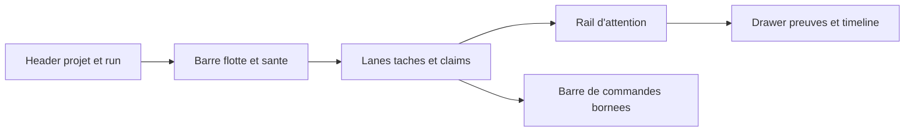

## But

Definir une architecture UX stricte pour les surfaces `Cockpit Live`, `Office View` et `War Room` afin que la V1 multi-PC reste lisible, gouvernable et sans deuxieme source de verite.

Le principe directeur est simple :

- le cockpit sert a comprendre, diagnostiquer et commander dans un cadre borne ;
- l'observateur spatial sert a comprendre, comparer et challenger ;
- les deux lisent exactement les memes projections runtime.

## Questions operatoires a couvrir

Le systeme UX doit permettre a un operateur de repondre vite a ces questions :

1. Quel projet est actif et quel run est en cours ?
2. Quels PCs et quels workers sont vivants, stale ou offline ?
3. Quelle tache est claim, par qui, sur quelle branche et quel worktree ?
4. Pourquoi un ticket est bloque, quel gate a refuse et quelle preuve manque ?
5. Quel handoff vient d'avoir lieu et quel noeud doit reprendre ?
6. Quelle commande GUI reste autorisee, pour quel role, avec quelle trace d'audit ?

## Principes UX non negociables

- Une meme causalite alimente toutes les surfaces.
- Le cockpit est read-mostly, dense et expert.
- L'observateur spatial est explicatif, jamais decoratif seul.
- Les mutations GUI sont rares, bornees et visibles.
- Un token spectateur ne peut jamais provoquer une mutation.
- Un token agent ne peut pas reprendre les commandes d'un orchestrateur.
- Toute action critique doit laisser un audit explorable dans la meme session UI.

## Read models partages

| Read model | Usage cockpit | Usage observateur |
| --- | --- | --- |
| `project-registry` | Header, identite du projet, run courant, version du registre | Badge global dans la war room et banniere de scene |
| `node-fleet-view` | Barre de flotte, sante des noeuds, capacites, fraicheur | Presence physique des PCs, halos de sante, densite d'activite |
| `lease-view` | Table des claims, expirations, conflits, file d'attente | Badges de verrous sur agents, salles et objets de travail |
| `runtime-dashboard-view` | Vue operateur compacte sur taches, alertes et preuves | Source tactique pour l'etat global de la scene |
| `runtime-dashboard-ui-view` | Cards, lanes, timeline et focus | Libelles, panneaux contextuels et HUD scene |
| `collaboration-view` | Graphe de handoffs et traces partagees | Liens spatiaux entre rooms, arcs de handoff, tension inter-equipes |
| `verification-view` | Drawer des preuves, gates, verdicts et evidence refs | Totems de blocage, panneaux de review et signaux de friction |
| `observability-panel-view` | Rail d'attention, timeline et incidents | File d'alertes projetee dans la war room |

## Information architecture du cockpit

### Vue par defaut

Le cockpit s'ouvre sur une vue unique composee de six zones.

### Zone 1 - Header projet et run

Contenu :

- `projectId`, nom du projet et branche de reference ;
- `runId` actif, timestamp de fraicheur et version de registre ;
- statut global `stable`, `warning`, `critical` derive des alertes runtime ;
- indicateur de compatibilite d'enveloppe canonique.

Decision UX :

- l'operateur sait d'emblee s'il regarde la bonne execution ;
- aucun switch de projet implicite n'est cache dans un menu secondaire.

### Zone 2 - Barre flotte et sante

Contenu :

- une card par `nodeId` ;
- sante `live`, `stale`, `offline` ;
- capacites de noeud ;
- nombre de workers actifs ;
- age du dernier heartbeat ;
- resume des claims actifs par noeud.

Decision UX :

- la sante de flotte se lit avant la sante de tache ;
- un noeud stale remonte en tete de barre, pas seulement dans un log.

### Zone 3 - Lanes taches et claims

Contenu :

- colonnes `Backlog`, `Todo`, `In progress`, `Review`, `Done` ;
- pour chaque tache : `taskId`, titre, assignee, `nodeId`, branche, worktree, statut de lease ;
- filtres rapides par room, agent, noeud, trace, branche.

Decision UX :

- une tache mutable expose son ownership Git sans ouvrir un second panneau ;
- une collision d'ownership apparait comme un conflit de lane et de lease, pas comme une simple erreur texte.

### Zone 4 - Rail d'attention

Contenu :

- incidents critiques ;
- security findings bloquants ;
- gaps timeline ;
- expirations de leases ;
- divergence cockpit contre observateur.

Decision UX :

- le rail reste triable par severite et focus ;
- toute carte d'attention pointe vers un `traceId`, un `taskId` ou un `nodeId` resolvable.

### Zone 5 - Drawer preuves et timeline

Contenu :

- sequence d'evenements lies au focus courant ;
- gate de verification, verdict, `evidenceRefs`, controles executes et manquants ;
- historique des claims, renew, expire et reclaim.

Decision UX :

- la preuve est au meme niveau que l'alerte ;
- un blocage n'impose jamais d'aller lire un transcript brut pour comprendre le pourquoi.

### Zone 6 - Barre de commandes bornees

Contenu :

- commandes autorisees par role ;
- etat du budget de mutation ;
- dernier audit succes ou refus ;
- idempotency key de la derniere action critique.

Decision UX :

- aucune commande destructrice n'est exposee sans contexte ;
- les commandes sont explicites et peu nombreuses.

## Information architecture de l'observateur spatial

### Raison d'etre

L'observateur existe pour augmenter la comprehension tactique, notamment sur :

- handoffs inter-rooms ;
- congestion de travail ;
- contention d'ownership ;
- propagation des alertes ;
- difference de focus entre equipes.

### Elements visibles dans la scene

| Element spatial | Source | Sens operatoire |
| --- | --- | --- |
| Avatar de noeud ou agent | `node-fleet-view`, `board-view` | Presence et responsabilite courante |
| Halo de sante | `node-fleet-view` | `live`, `stale`, `offline` |
| Badge de lease | `lease-view` | Claim actif, expiration proche, conflit |
| Arc de handoff | `collaboration-view` | Passage de travail inter-equipes |
| Totem de blocage | `verification-view` | Gate refuse ou preuve manquante |
| Bandeau de focus | `runtime-dashboard-ui-view` | Run, trace ou ticket actuellement suivis |
| Panneau war room | `observability-panel-view` | Rail d'attention partage avec le cockpit |

### Ce que l'observateur ne doit pas faire

- declencher une commande d'ownership Git ;
- executer une mutation runtime sans passer par le gateway borne ;
- cacher des preuves disponibles seulement dans la scene ;
- devenir une vue de planning differente du cockpit.

## Budget de mutation GUI

| Commande | Role minimal | Preconditions | Audit obligatoire |
| --- | --- | --- | --- |
| Re-synchroniser la session cockpit | `orchestrator`, `agent` | `projectId` et `runId` resolus | Oui |
| Rejouer un delta de run | `orchestrator` | focus stable, `traceId` connu | Oui |
| Reclamer une tache expirée | `orchestrator` | lease expirable ou expiree, ownership resolvable | Oui |
| Liberer un lease | `orchestrator` | ownership actif et justification explicite | Oui |
| Basculer un noeud en maintenance logique | `orchestrator` | noeud resolu, aucun spectator | Oui |
| Partager un mode spectateur | `orchestrator` | token read-only emise par gateway | Oui |
| Changer le focus local de lecture | Tous roles | aucune mutation runtime | Non |

Regles :

- `spectator` n'obtient jamais de commande mutationnelle ;
- `agent` n'obtient pas de commandes qui changent ownership Git ;
- `orchestrator` reste le seul role pouvant reclamer, liberer ou rerouter des claims.

## Navigation et synchronisation des focus

Le systeme maintient un focus unique compose de `runId`, `traceId`, `taskId`, `nodeId` et `agentId`.

Regles de navigation :

1. Le cockpit peut imposer le focus de reference.
2. L'observateur peut demander un focus local, mais ne peut pas casser le focus de reference sans action explicite.
3. Tout focus visible dans la scene doit etre resolvable dans le drawer de preuves du cockpit.

## Scenarios UX prioritaires

### Scenario A - Perte de noeud pendant une tache mutable

Le cockpit doit montrer :

- le noeud passe `stale` puis `offline` ;
- le lease arrive a expiration ;
- la tache devient reclaimable ;
- l'audit de reclaim est visible.

L'observateur doit montrer :

- halo degrade sur la room ou l'agent concerne ;
- badge de lease qui clignote ;
- arc de handoff vers le noeud repreneur une fois la reprise acceptee.

### Scenario B - Collision d'ownership Git

Le cockpit doit montrer :

- deux demandes de mutation sur le meme perimetre ;
- un refus sur la seconde demande ;
- la branche et le worktree actifs ;
- la raison de refus.

L'observateur doit montrer :

- deux agents convergeant vers le meme objet de travail ;
- un badge de conflit ;
- aucune possibilite de forcer la mutation depuis la scene.

### Scenario C - Ticket bloque en review faute de preuve

Le cockpit doit montrer :

- le gate `verification` refuse ;
- les `evidenceRefs` manquantes ;
- le focus run et task ;
- les commandes de relance autorisees si le role le permet.

L'observateur doit montrer :

- un totem de blocage dans la room concernee ;
- la propagation du blocage sur les handoffs dependants ;
- la meme causalite que le cockpit.

## Wiring concret avec les fichiers du runtime

| Fichier | Responsabilite UX cible |
| --- | --- |
| `src/state/runtime-dashboard-view.ts` | Source canonique du cockpit multi-PC |
| `src/state/runtime-dashboard-ui-view.ts` | Couche cards, lanes, focus et timeline du cockpit |
| `src/state/node-fleet-view.ts` | Projection sante, capacites et fraicheur de flotte |
| `src/state/lease-view.ts` | Projection claims, expirations et ownership Git |
| `src/state/runtime-cockpit-view.ts` | Agregation experte pour la surface operateur |
| `src/state/runtime-observer-view.ts` | Agregation spatiale lisant les memes read models |
| `src/server/control-plane/command-gateway.ts` | Budget de mutation, authz et audit |

## Definition of done UX

- Le cockpit et l'observateur lisent les memes identifiants, la meme causalite et les memes alertes.
- Toute commande autorisee est nommee, bornee, auditée et rattachee a un role.
- Aucun cas operatoire critique n'impose une lecture de transcript brut pour comprendre l'etat courant.
- La scene spatiale apporte une comprehension additionnelle mesurable sur handoffs, contention et blocages.
