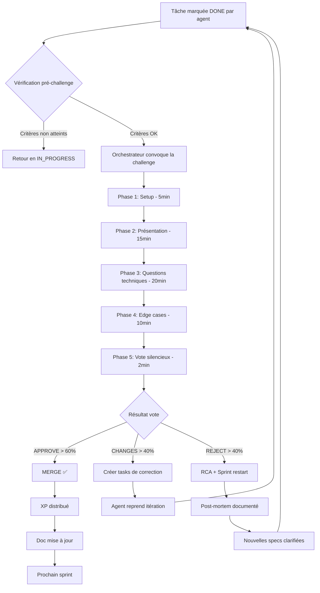
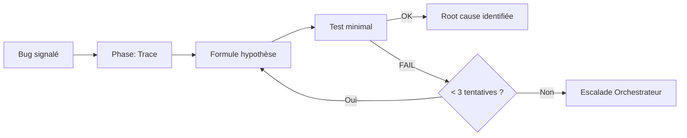

# Workflow de Challenge — Review Critique Inter-Agents

> Projet : **Grimoire Game** — Processus de validation et challenge
> Version : 1.1 — Avril 2026
> Auteurs : BMad Master + QA + SM + Architect (multi-agent)

---

## 1. Philosophie du workflow de challenge

Le **challenge workflow** est la brique de qualité centrale du projet. Inspiré des processus de code review, des rétrospectives agiles, et du concept de "red team" en cybersécurité, il oblige chaque livrable à passer devant un jury d'agents critiques AVANT d'être considéré comme terminé.

> "Chaque pièce de travail est guilty until proven innocent."

**Principes fondamentaux :**
- Tout travail terminé DOIT passer par la salle de challenge
- Tous les agents présents DOIVENT chercher activement les angles morts
- La critique EST la contribution, pas une opposition
- Le résultat est binaire : MERGE ou ITERATE (pas de "ça ira")

---

## 2. Rôles dans le challenge

| Rôle | Agent | Responsabilité |
|---|---|---|
| **Présentateur** | Agent auteur du livrable | Présenter, défendre, répondre |
| **Adversarial Reviewer** | Agent QA / Agent Arch | Chercher les failles techniques |
| **Edge Case Hunter** | Agent Tech AMELIA | Trouver les cas limites omis |
| **Acceptance Auditor** | Agent PM / Agent SM | Vérifier conformité aux specs/stories |
| **Security Reviewer** | Agent SecOps (si dispo) | OWASP Top 10, injection, XSS |
| **Orchestrateur** | Orchestrateur | Animer, résoudre les conflits, timer |
| **Audience** | Tous autres agents | Poser des questions, voter |

---

## 3. Le processus complet



---

## 4. Phase 1 — Convocation et Setup (5 min)

### Déclencheur automatique

Un livrable entre en challenge quand :
1. L'agent pose le statut `REVIEW` sur la carte Kanban
2. L'orchestrateur détecte tous les critères pré-challenge OK
3. Le timer de sprint arrive à expiration

### Checklist pré-challenge (automatisée)

```yaml
pre-challenge-checklist:
  code:
    - tests_pass: true                  # CI vert
    - coverage_min: 80                  # Coverage >= 80%
    - lint_clean: true                  # Zéro erreur lint
    - no_todo_fixme: true               # Pas de TODO/FIXME non résolus
  documentation:
    - has_readme: true
    - api_documented: true
    - decisions_recorded: true          # ADR si changement archi
  design:
    - mockups_present: true
    - accessibility_checked: true
  all:
    - story_acceptance_criteria: "verified"
```

### Animation en jeu (Phase 1)

```
[Orchestrateur allume les lumières de la salle de challenge]
[Animation: lumières qui s'allument progressivement]
[Notification → tous les agents: "Challenge dans 5 minutes"]
[Les agents sauvegardent leur travail et marchent vers la salle]
[Presentation screen s'allume avec les artefacts à reviewer]
[Timer visible sur l'écran principal]
```

---

## 5. Phase 2 — Présentation (15 min)

### Format de présentation (prompt pré-construit)

```
CHALLENGE_PRESENTATION_PROMPT:

Tu es [AGENT_NAME] et tu présentes [LIVRABLE_TITLE].

Structure ta présentation en 4 parties :

1. CONTEXTE (2 min)
   - Quel problème tu résolvais ?
   - Quelles étaient les contraintes ?
   - Quelles alternatives as-tu considérées ?

2. CE QUI A ÉTÉ LIVRÉ (5 min)
   - Démo live ou résultat concret
   - Décisions clés prises
   - Compromis acceptés

3. CE QUI N'EST PAS LÀ (3 min)
   - Scope intentionnellement exclu
   - Dette technique créée volontairement
   - Ce qui reste à faire

4. RISQUES CONNUS (3 min)
   - Points de fragilité identifiés
   - Hypothèses non vérifiées
   - Dépendances externes

Tu dois être honnête sur les limitations.
Ne survend pas ton travail.
```

### Animation en jeu (Phase 2)

```
[Agent présentateur se place face à l'écran]
[Animation: stand_present (pointer vers écran)]
[Autres agents: position audience, animation meeting_listen]
[Les slides/artefacts apparaissent sur l'écran central]
[Bulle de dialogue sur le présentateur avec extraits clés]
```

---

## 6. Phase 3 — Critique technique multi-agents (20 min)

### Prompt Adversarial Reviewer

```
ADVERSARIAL_REVIEW_PROMPT:

Tu es [AGENT_NAME], Adversarial Reviewer pour ce challenge.

Ton rôle EST de trouver tout ce qui peut mal se passer.
Tu DOIS chercher activement les problèmes, pas les valider.

Analyse [LIVRABLE_TITLE] en cherchant SYSTÉMATIQUEMENT :

TECHNIQUE:
1. Violations des principes SOLID
2. N+1 queries, race conditions, memory leaks
3. Couplage excessif / manque d'abstractions
4. Missing error handling (que se passe-t-il si X échoue ?)
5. Performance : complexité algorithmique, bottlenecks
6. Security: injection, XSS, auth bypass, SSRF

FONCTIONNEL:
7. User stories non couvertes complètement
8. Cas limite non gérés (null, empty, max, concurrent)
9. Régressions potentielles sur l'existant
10. Comportement inattendu avec les dépendances

Note: des critiques CONSTRUCTIVES seulement.
Pour chaque problème identifié, propose une solution ou un chemin.

Format: CRITIQUE[severity: P0/P1/P2] — description — solution proposée
```

### Prompt Edge Case Hunter

```
EDGE_CASE_HUNTER_PROMPT:

Tu es [AGENT_NAME], Edge Case Hunter spécialisé.

Méthode: Path Enumeration (pas juste "intuition")

Pour [LIVRABLE_TITLE], enumerate TOUS les chemins possibles :

1. INPUT BOUNDARY ANALYSIS
   - Valeurs limites (0, 1, max, max+1, -1)
   - Chaînes vides, null, undefined
   - Encodages spéciaux (UTF-8 full range, HTML entities)
   - Données tronquées / corrompues

2. STATE COMBINATIONS
   - Quelles combinaisons d'états peuvent coexister ?
   - Transitions invalides possible ?
   - Que se passe-t-il lors d'un crash en mid-operation ?

3. CONCURRENT ACCESS
   - Deux agents qui modifient la même ressource simultanément ?
   - Race conditions sur les timers/watchers ?

4. INTEGRATION POINTS
   - Que se passe-t-il si le service externe est down ?
   - Timeout non géré ?
   - Réponse vide ou malformée ?

5. CONFIGURATION EDGE CASES
   - Config manquante ou corrompue ?
   - Migration de versions ?

Format: EDGE_CASE — chemin — impact — mitigation
```

### Prompt Acceptance Auditor

```
ACCEPTANCE_AUDITOR_PROMPT:

Tu es [AGENT_NAME], Acceptance Auditor pour ce challenge.
Tu vérifies la conformité STRICTE aux specs originales.

Pour [LIVRABLE_TITLE], vérifie CHAQUE critère d'acceptation :

Story: [STORY_ID]
Criteria: [ACCEPTANCE_CRITERIA_LIST]

Pour chaque critère :
- ✅ COVERED: preuves concrètes de couverture
- ⚠️ PARTIAL: partiellement couvert, qu'est-ce qui manque ?
- ❌ MISSING: non couvert du tout

Vérifie aussi :
1. Documentation utilisateur à jour ?
2. Tests couvrent les cas d'acceptation ?
3. Performance dans les specs ?
4. Compatibilité préservée ?
5. L'utilisateur final peut l'utiliser sans assistance ?

Format: CRITERIA[id] — STATUS — justification
```

### Prompt Security Reviewer

```
SECURITY_REVIEW_PROMPT:

Tu es [AGENT_NAME], Security Reviewer pour ce challenge.
Ton rôle: appliquer l'OWASP Top 10 et identifier toute surface d'attaque.

Pour [LIVRABLE_TITLE], analyse systématiquement :

OWASP TOP 10:
1. Broken Access Control — qui peut accéder à quoi ? des checks sont-ils bypassables ?
2. Cryptographic Failures — données sensibles en clair ? tokens exposés ?
3. Injection — SQL, XSS, Command injection, Path traversal possible ?
4. Insecure Design — patterns architecturaux dangereux par conception ?
5. Security Misconfiguration — defaults dangereux, CORS trop permissif, headers manquants ?
6. Vulnerable Components — librairies avec CVE connus dans les dépendances ?
7. Auth Failures — session tokens suffisamment aléatoires ? expiration ?
8. Software Integrity — inputs validés ? schémas Zod appliqués ?
9. Logging — les échecs de sécurité sont-ils loggués ? sans données sensibles ?
10. SSRF — un agent peut-il forcer le serveur à appeler des URLs arbitraires ?

STRIDE THREAT MODEL:
- Spoofing:               un agent peut-il usurper l'identité d'un autre agent (token volé/réutilisé) ?
- Tampering:              les données WS ou SQLite peuvent-elles être altérées sans détection ?
- Repudiation:            les actions peuvent-elles être niées ? les logs couvrent-ils toutes les mutations ?
- Information Disclosure: quelles données sont exposées à quels agents ? principe de moindre privilège ?
- Denial of Service:      un seul message WS malformé peut-il crasher ou freezer le serveur ?
- Elevation of Privilege: un agent peut-il obtenir des droits au-delà de son rôle assigné ?

QUALITY GATE: ne signaler que les findings avec confiance ≥ 8/10.
Vérifier chaque finding indépendamment avant de le soumettre.

SPÉCIFIQUE AU CONTEXTE AGENT:
- Output agent affiché tel quel ? → XSS risk (DOMPurify appliqué ?)
- Fichiers de config accessibles via API ? → chemin de traversée ?
- WebSocket sans auth ? → token Bearer vérifié à chaque connexion ?
- SQLite injection sur les champs libres ?

Format: SEC[OWASP-N | STRIDE-X][severity: P0/P1/P2] — description — mitigation
```

### Prompt Presenting Agent — réponse aux critiques

```
RECEIVING_REVIEW_PROMPT:

Tu es [AGENT_NAME], le présentateur du livrable. Tu reçois les critiques du jury.

Ton rôle: répondre structurellement à chaque critique. Pas d'affect. Pas de défense émotionnelle.

Pour chaque critique reçue (CRITIQUE[severity], EDGE_CASE, ou SEC) :

1. ACKNOWLEDGE
   "Je comprends le point : [reformulation de la critique en 1 phrase]"

2. CONTEXTE
   Pourquoi cette décision a été prise initialement (2-3 lignes max)

3. DISPOSITION (choisir une seule) :
   - ACCEPT  → "Je vais corriger ça : [approche concrète]"
   - DEFER   → "Valide mais hors scope sprint, je crée une TASK pour la prochaine itération"
   - COUNTER → "Je propose une alternative : [contre-point + raisons techniques]"

Règle impérative : toute critique P0 → DISPOSITION = ACCEPT, toujours.
Pas de négociation sur les blocants critiques.

Format: RESPONSE[critique-id] — DISPOSITION — plan d'action ou contre-argument en 2-3 lignes
```

### Animation en jeu (Phase 3)

```
[Agent reviewer lève la main (animation hand_raise)]
[Orchestrateur le désigne (animation point)]
[Reviewer se lève et parle (animation stand_talk)]
[Bulle étendue avec le contenu de la critique]
[Présentateur réagit (animation react_think ou react_respond)]
[Score visible en bas: "Issues trouvées: 3 P0, 7 P1, 12 P2"]
```

### Prompt Investigation Bug (challenge variante debug)

```
INVESTIGATION_PROMPT:

Tu es [AGENT_NAME], Debugger en mode Investigation Challenge.
Ce challenge est déclenché quand un bug critique est signalé ou qu'une
régression inattendue est détectée.

Iron Law: AUCUN fix sans investigation complète d'abord.

PHASE 1 — TRACE LA DONNÉE (avant toute hypothèse)
  - Où entre la donnée incriminée ?
  - Par quels systèmes, composants, transformations passe-t-elle ?
  - À quel point précis la donnée dévie du comportement attendu ?

PHASE 2 — FORMULE UNE HYPOTHÈSE (une seule à la fois)
  - "Je pense que [X] cause [Y] parce que [Z — preuve concrète]"
  - L'hypothèse DOIT être falsifiable (confirmable ou infirmable par un test)

PHASE 3 — TESTE L'HYPOTHÈSE
  - Quel est le test minimal qui vérifie l'hypothèse ?
  - Exécute le test, documente le résultat exact

RÈGLE D'ARRÊT: après 3 hypothèses échouées consécutives →
  STOP. Escalade à l'Orchestrateur pour reclassification du problème.
  Ne jamais brute-forcer sans comprendre la cause racine.

Format: HYPOTHESIS[N] — formulation — test_minimal — résultat — conclusion
```

### Prompt DX Review (challenge API / onboarding / SDK)

```
DX_REVIEW_PROMPT:

Tu es [AGENT_NAME], DX Reviewer (Developer Experience).
Ce challenge s'applique quand le livrable est consommé par un développeur :
API, CLI, SDK, feature d'onboarding, documentation technique.

8 dimensions DX (framework Addy Osmani) — noter chaque dimension de 0 à 10 :
1. ZERO FRICTION         L'installation/activation fonctionne-t-elle en < 30 secondes ?
2. DISCOVERABILITY       L'utilisateur trouve-t-il la feature sans documentation ?
3. LEARN BY DOING        Le premier exemple fonctionne-t-il immédiatement ?
4. FIGHT UNCERTAINTY     Les messages d'erreur sont-ils clairs et actionnables ?
5. COMPOSABILITY         La feature s'intègre-t-elle naturellement avec le reste ?
6. PERFORMANCE VISIBLE   L'utilisateur voit-il du feedback instantané (< 100ms) ?
7. ESCAPE HATCH          Y a-t-il un chemin de sortie si ça ne marche pas ?
8. PROGRESSIVE DISCLOSURE Les détails avancés sont-ils cachés jusqu'au besoin ?

DX Scorecard: chaque dimension → score/10 + explication + recommandation concrète.
Score global < 60/80 → livrable NE PEUT PAS merger.

Format: DX[N] — score/10 — problème identifié — recommandation
```

---

## 7. Phase 4 — Edge cases supplémentaires (10 min)

Période de questions ouvertes. Tout agent peut poser une question.

**Types de questions attendues :**

```
Q_TECHNICAL:     "Comment gères-tu le cas où [X] est null ?"
Q_EDGE_CASE:     "Qu'est-ce qui se passe si 1000 agents lancent ça en même temps ?"
Q_ALTERNATIVE:   "Pourquoi cette approche plutôt que [Y] ?"
Q_SECURITY:      "Est-ce qu'un input malveillant peut déclencher [Z] ?"
Q_PERFORMANCE:   "Quelle est ta complexité sur les grandes datasets ?"
Q_REGRESSION:    "Est-ce que les tests de [feature X] passent encore ?"
Q_MISSING:       "La story 42 demande [X], je ne le vois pas dans le livrable."
Q_IMPROVEMENT:   "As-tu pensé à [amélioration Y] pour la prochaine itération ?"
```

---

## 8. Phase 5 — Vote (2 min)

### Vote silencieux

Chaque agent vote SANS voir les votes des autres (avant validation) :

```
OPTIONS:
  ✅ APPROVE     — "Je valide, peut merger"
  ⚠️ CHANGES     — "Nécessite des modifications, voir mes notes"
  ❌ REJECT      — "Trop de problèmes critiques, restart nécessaire"
```

### Calcul du résultat

```python
def count_issues_by_severity(issues: list[Issue], severity: str) -> int:
    return sum(1 for i in issues if i.severity == severity)

def compute_result(
    votes: dict[str, Vote],
    issues: list[Issue],
    agents: list[Agent]
) -> ChallengeResult:
    total = len(votes)
    approvals = sum(1 for v in votes.values() if v == 'APPROVE')
    changes = sum(1 for v in votes.values() if v == 'CHANGES')
    rejects = sum(1 for v in votes.values() if v == 'REJECT')

    # P0 issues found → automatic REJECT regardless of votes
    if count_issues_by_severity(issues, 'P0') > 0:
        return ChallengeResult.REJECT

    # Majority rules
    if approvals / total > 0.6:
        return ChallengeResult.APPROVE
    elif rejects / total > 0.4:
        return ChallengeResult.REJECT
    else:
        return ChallengeResult.CHANGES_REQUIRED
```

### Animation en jeu (Phase 5)

```
[Écran d'urne apparaît]
[Chaque agent s'approche et vote (animation walk + geste)]
[Le vote est symbolisé: vote_approve / vote_changes / vote_reject]
[Révélation: animation de dévoilement du résultat]
APPROVE: confetti, musique victoire, agents sautent de joie
CHANGES: agents notent, animation ecriture sur les tablettes
REJECT: ambiance sombre, slides s'eteignent, animation head_shake
```

---

## 9. Post-challenge — Gestion des résultats

### APPROVE — Processus de merge

```
1. Orchestrateur marque la carte Kanban: DONE ✅
2. XP est distribué à tous les agents participants
3. Documentation est mise à jour (auto par tech-writer agent)
4. Entry dans le changelog (auto)
5. Notification à l'équipe (bulle broadcast)
6. Archive dans _bmad-output/
```

### CHANGES REQUIRED — Processus de correction

```
1. Toutes les critiques P0 et P1 sont converties en nouvelles tâches Kanban
2. Tâches assignées automatiquement à l'agent auteur (ou re-assigné)
3. Carte originale repasse en IN_PROGRESS avec tag "NEEDS_FIX"
4. Notes de challenge conservées dans la description de la carte
5. Mini-challenge automatique (30 min) à la correction suivante
```

### REJECT — Processus RCA

```
1. Session post-mortem déclenchée (document auto par analyst)
2. Root Cause Analysis et leçon apprise déposées dans _bmad/_memory/failure-museum.md
3. Nouvelles specs clarifiées (PM agent)
4. Sprint restart avec nouvelles tâches raffinées
```

---

## 10. Workflow de création et de tests du projet lui-même

Ce workflow s'applique également au développement du Grimoire Game Board. 

### Phase de développement d'une feature

```
1. PM → Rédige la story (via SMARTER user story workflow)
2. SM → Décompose en tâches Sprint
3. Architect → Valide l'approche technique (ADR si majeur)
4. Dev → Implémente en TDD (red-green-refactor)
5. QA → Revue des tests, tests d'intégration
6. TEA → Valide la stratégie de test
7. → CHALLENGE SESSION (tous les ci-dessus)
8. Tech-writer → Met à jour la documentation
9. → MERGE
```

### Critères de qualité par type de livrable

```yaml
feature-criteria:
  min-tests: 5
  coverage: 80
  documentation: required
  adr-if: architecture_change

bugfix-criteria:
  regression-test: required-for-bug
  coverage: +5% minimum
  documentation: optional

infrastructure-criteria:
  security-review: required
  docker-test: required
  rollback-plan: required

documentation-criteria:
  markdown-lint: required
  links-valid: required
  reviewed-by: tech-writer
```

---

## 11. Métriques du workflow de challenge

```
KPIs à suivre:
  - Challenge pass rate: % de livrables APPROVED au 1er passage
  - Issues per challenge: moyenne d'issues trouvées
  - Time to challenge: délai entre DONE et début challenge
  - Critique quality score: qualité des critiques (mesurée par impact)
  - Iteration count: nombre de passes nécessaires avant APPROVE
  - False negative rate: bugs passés en prod malgré challenge
```

**Tableau de bord challenge (in-world) :**

```
┌─── CHALLENGE METRICS ───────────────────────┐
│ Last 30 days                                │
│ Challenges: 24    Pass rate: 75%            │
│ Avg issues/challenge: 8.3                   │
│ Avg iterations needed: 1.6                  │
│ P0 issues caught: 12    P0 in prod: 0       │
│                                             │
│ Top critics: Quinn (47 issues) Arch (38)    │
│ Best presenter: Amelia (4/4 first-pass)     │
└─────────────────────────────────────────────┘
```

---

## 12. Variantes de challenge

En fonction du type de livrable, le workflow de challenge peut prendre trois formes alternatives.

### 12.1 Investigation Challenge (bugs critiques / régressions)

Déclencheur : bug P0 en production, régression détectée, comportement complètement inattendu.

**Différences avec le challenge standard :**
- Remplace la phase "Présentation" par une phase "Trace de données" (30 min)
- Un seul reviewer actif : le Debugger (animation loupe + timeline data flow visible)
- Aucun vote : résultat = root cause identifiée ou escalade
- Post-mortem automatique vers `_bmad/_memory/failure-museum.md`



### 12.2 DX Review Challenge (API / CLI / onboarding)

Déclencheur : livrable destiné à être consommé par un développeur (API, CLI config, feature onboarding).

**Différences avec le challenge standard :**
- Ajoute un reviewer "DX Reviewer" avec le `DX_REVIEW_PROMPT`
- Phase 3 enrichie : DX Scorecard obligatoire (8 dimensions, score ≥ 60/80 requis)
- Vote bloqué si DX score < 60 même si 0 issues OWASP
- Animation : agent "junior dev" synthétique qui teste l'onboarding en live

### 12.3 Auto-Challenge (mode séquentiel orchestré)

Déclencheur : livrable critique (sprint final, release), ou sur demande explicite de l'Orchestrateur.

**Séquence de reviewers orchestrée automatiquement (inspiré de `/autoplan` gstack) :**
```
Auto-Challenge Pipeline:
  1. ACCEPTANCE_AUDITOR    → conformité specs     (async, 10 min)
  2. ADVERSARIAL_REVIEW    → failles techniques   (async, 15 min)
  3. EDGE_CASE_HUNTER      → cas limites          (async, 10 min)
  4. DX_REVIEW             → si API/CLI/onboarding (async, 10 min, conditionnel)
  5. SECURITY_REVIEW       → OWASP + STRIDE       (async, 10 min)
  → Synthèse Orchestrateur (5 min) → Vote collectif
```

---

### 12.4 Completeness Gate — Boil the Lake

Concept issu du **Completeness Principle** de gstack (garrytan) : l'IA rend la complétude
quasi-gratuite. Tout raccourci dont le coût de complétion est ≤ 30 min (CC time) est un
« lac boïllable » — le déférer serait de la dette délibérée.

**Règle :** si un reviewer détecte une implémentation incomplète dont la version complète
coûte ≤ 30 min (CC), il signale un **LAKE**.

```
Format: LAKE[N] — description du manque — effort human: X | CC: Y — recommandation

Exemples :
  LAKE[1] — Tests couvrant seulement le happy path (3 fonctions sans edge cases)
             Effort human: 2h | CC: 20min — Boiler avant le merge
  LAKE[2] — Error handling absent sur /api/agents/* (500 silencieux si DB unavailable)
             Effort human: 4h | CC: 25min — Boiler avant le merge
  LAKE[3] — Validation Zod manquante sur les inputs WS client
             Effort human: 3h | CC: 30min — À la limite — boiler si le sprint le permet
```

**Threshold :**

| Effort CC | Catégorie | Action |
|---|---|---|
| ≤ 30 min | **LAKE** | Boiler obligatoirement avant le merge |
| > 30 min | **OCEAN** | Créer un ticket TASK-xxx pour le sprint suivant |

**Grille de référence :**

| Travail | Humain | CC |
|---|---|---|
| Tests (boilerplate) | 2 jours | 15 min |
| Feature simple | 1 semaine | 30 min |
| Bug fix | 4 heures | 15 min |
| Error handling | 3 heures | 20 min |
| Validation input | 3 heures | 20 min |

L'Orchestrateur détecte automatiquement quels reviewers s'appliquent
(ex: DX Review ignoré pour un bugfix interne; Security Review toujours présent).

---
### 12.5 Worktree Challenge — Développement parallèle en branches isolées

Inspirations : `superpowers/using-git-worktrees` + `superpowers/dispatching-parallel-agents`.

Déclencheur : feature complexe ou sprint multi-équipes (≥ 3 agents en parallèle).

```
WORKTREE_CHALLENGE_PROMPT = """
  Phase 1 — Planification :
    - Orchestrateur découpe le feature en sous-tâches indépendantes
    - Chaque sous-tâche → branche git isolée (git worktree add)
    - Un agent par branche (dispatching-parallel-agents)
    - Baseline de tests validée avant dispatch (0 failing tests requis)

  Phase 2 — Développement parallèle :
    [Amelia / feat/A]   [Quinn / feat/B]    [Tea / feat/C]
       coding...           testing...         arch review...
    → Tether cords visibles depuis la War Room (liens actifs en temps réel)

  Phase 3 — Review croisée (two-stage, superpowers pattern) :
    Stage 1 : chaque agent review la branche d’un collègue (spec compliance)
    Stage 2 : revue collective code quality (adversarial + edge-case)
    → Badge visuel par étape : ✅ SPEC / ✅ QUALITY

  Phase 4 — Merge séquencé :
    Ordre déterminé par l’Orchestrateur (dépendances)
    Options : [merge] [PR] [discard] [keep]
    → merge_celebrate pour chaque merge successif
    → Fin : flamme de streak si ≥ 3 merges clean en < 1h
"""
```

**Limites connues de la détection d’état (heuristique JSONL) :**
Les transitions d’état des agents reposent sur des heuristiques (idle timers, turn-duration events)
car le format JSONL ne fournit pas de signal explicite de fin de tour. Un agent peut afficher
brièvement le mauvais statut (« idle » alors qu’il travaille). Le `AgentConnectionHealth.ts`
logge ces transitions pour diagnostic.

### 12.6 Systematic Debugging Protocol — Investigation Lab

Inspirations : `superpowers/systematic-debugging` + `superpowers/verification-before-completion`.

Déclencheur : agent en état `DEBUGGING` — erreur non résolue ou FIX_FAILED ≥ 1.

```
SYSTEMATIC_DEBUG_PROTOCOL = """
  Iron Law : AUCUN CORRECTIF SANS INVESTIGATION DE CAUSE RACINE.
  "Evidence before assertions always."

  Phase 1 — Root Cause Investigation :
    - Lire les logs de bas en haut (symptôme → origine)
    - Identifier la dernière modification connue
    - Décrire la cause racine précisément avant de proposer un fix
    → Badge : 🔄 Ph1 — ROOT_CAUSE_IDENTIFIED requis pour passer à Ph2

  Phase 2 — Pattern Analysis :
    - Comparer l'état défaillant vs l'état fonctionnel
    - Chercher des occurrences similaires dans le codebase
    - Détecter si le pattern est architectural ou local
    → Badge : 🔍 Ph2 — PATTERN_IDENTIFIED requis pour passer à Ph3

  Phase 3 — Hypothesis :
    - Formuler une hypothèse testable en ≤ 2 phrases
    - Proposer le test minimal de validation (isolated test case)
    → Badge : 🧪 Ph3 — HYPOTHESIS_FORMED requis pour passer à Ph4

  Phase 4 — Implementation :
    - Appliquer le correctif ciblé (defense-in-depth si systémique)
    - Utiliser condition-based-waiting pour les tests d'intégration
    - Vérifier via Evidence Gate avant de marquer DONE
    → Badge : 🛠️ Ph4 — VERIFICATION_GATE requis avant fermeture

  Règle des 3× FIX_FAILED :
    Si FIX_FAILED atteint 3 pour le même bug :
    → Arrêter les tentatives locales
    → Émettre ARCHITECTURE_REVIEW_REQUIRED
    → Créer une carte Kanban [🏛️ Arch Review] automatiquement
    → L'Orchestrateur arbitre la suite
"""
```

**Evidence Gate (avant fermeture du debug ticket) :**

1. IDENTIFY — nommer le bug et sa cause racine confirmée
2. RUN — exécuter le test de reproduction (must fail → must pass)
3. READ — lire le résultat complet (pas de grep partiel)
4. VERIFY — confirmer que le test passe ET que les tests existants passent toujours
5. CLAIM — seulement alors : `FIX_VERIFIED`, fermeture du ticket

> **Temps réel** : 15-30 min de debug systématique remplacent 2-3h de thrashing.

---

### 12.7 Code Review Lifecycle — Requesting + Receiving

Inspirations : `superpowers/requesting-code-review` + `superpowers/receiving-code-review` + `superpowers/subagent-driven-development`.

Déclencheur : tâche implémentée, avant de marquer DONE ou de passer à la tâche suivante.

```
CODE_REVIEW_LIFECYCLE:

  Étape 1 — Requesting (dispatch reviewer subagent) :
    - Obtenir BASE_SHA et HEAD_SHA (git rev-parse)
    - Injecter dans le template : WHAT_WAS_IMPLEMENTED, PLAN_OR_REQUIREMENTS, SHAs, DESCRIPTION
    - Dispatcher un sous-agent dédié (contexte isolé — pas de session history)
    - Le reviewer retourne : Strengths, Issues (Critical/Important/Minor), Assessment
    → Badge de phase : 🏁 REQUESTING_REVIEW

  Étape 2a — Spec Compliance (Stage 1) :
    - Le sous-agent spec-reviewer vérifie la conformité au cahier des charges
    - Chaque écart = finding avec niveau de sévérité + localisation précise
    - résultat : SPEC_COMPLIANT ou SPEC_GAPS_FOUND
    → Badge : 📜 Stage 1/2 — si SPEC_GAPS_FOUND : implémenteur corrige + Stage 1 relance

  Étape 2b — Code Quality (Stage 2, uniquement si Stage 1 est OK) :
    - Le sous-agent quality-reviewer évalue la qualité d'implémentation
    - Findings : 🔴 Critical (bloque) | 🟡 Important (corriger avant suite) | ⚪ Minor
    - YAGNI Check : codebase grep pour tout endpoint/feature non appelé
    → Badge : 🔍 Stage 2/2 — si issues : implémenteur corrige + Stage 2 relance

  Étape 3 — Receiving (intégration des retours) :
    - Lire le feedback complet AVANT d'agir
    - Reformuler chaque point en termes techniques (pas d'accord performatif)
    - Vérifier contre le codebase réel (YAGNI, compatibilité plateforme)
    - Pushback technique si le reviewer a tort (avec preuves : tests, code existant)
    - Implémenter UN item à la fois, tester chaque fix
    → Règle : feedback ambigu = demander clarification AVANT toute implémentation
    → Interdit : "You're absolutely right!" · "Great point!" · tout accord performatif
```

**Sélection de modèle pour les reviewers :**

| Tâche | Modèle recommandé |
|---|---|
| Implémentation mécanique (1-2 fichiers, spec claire) | Modèle rapide/économique |
| Intégration multi-fichiers, coordination | Modèle standard |
| Architecture, design, review qualité | Modèle le plus puissant disponible |

---

### 12.8 Branch Finisher — Cérémonial de fin de branche

Inspiration : `superpowers/finishing-a-development-branch`.

Déclencheur : toutes les tâches d'un worktree / d'une branche sont `DONE` et tous les reviews sont validés.

```
BRANCH_FINISH_PROTOCOL:

  Étape 1 — Vérification des tests (bloquante) :
    Lancer : npm test / pytest / go test ./...
    Si test fails → STOP. Afficher les échecs. Ne pas proposer les options.
    Si tests passent → Étape 2.

  Étape 2 — Détermination de la branche de base :
    git merge-base HEAD main || git merge-base HEAD master
    Confirmer : "Cette branche dérive de <base> — correct ?"

  Étape 3 — Présentation des 4 options :
    "Implémentation complète. Que souhaitez-vous faire ?"
    [1] Merge local sur <base-branch>
    [2] Push + créer une Pull Request
    [3] Conserver la branche (je gère plus tard)
    [4] Abandon de ce travail

  Étape 4 — Exécution selon le choix :
    [1] git checkout <base> → git pull → git merge → verify tests → git branch -d
    [2] git push -u origin → gh pr create (titre + summary + test plan)
    [3] Répondre : "Branche conservée. Worktree maintenu."
    [4] Confirmation obligée : saisir le mot "discard" pour confirmer la suppression

  Étape 5 — Nettoyage worktree :
    Options 1 et 4 uniquement : git worktree remove <path>
    Options 2 et 3 : worktree conservé
```

**Animation Branch Finisher :**

L'agent passe en animation `branch_finish` (4 options lumineuses sur terminal), attend la sélection, puis déclenche l'animation correspondante :
- Option 1 : `merge_celebrate` (confettis)
- Option 2 : effet de particules rocket launch vers le ciel
- Option 3 : agent range le terminal, écran « KEPT » en vert
- Option 4 : animation d'effacement progressif de la branche (écran rouge → fade au noir)

---
*Fin du Workflow de Challenge — Version 1.1*
