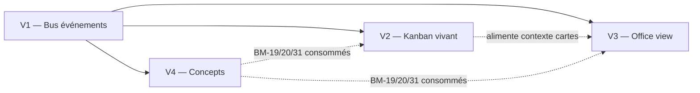

# 06 — Plan d'exécution par vagues

> 4 vagues séquentielles (ADR-S11). Chaque vague livre une valeur utilisateur isolée et produit son propre pack planning-artifact d'exécution au go.
>
> **Règle sacrée** : une vague se ferme quand la baseline de `07-METRIQUES-baseline.md` reste verte ET que le critère de sortie de la vague est observable par l'utilisateur.

## Gates transverses

Avant fermeture de chaque vague :

1. `grimoire-kit/.venv/bin/python framework/tools/preflight-check.py` → vert
2. `grimoire-kit/.venv/bin/python framework/tools/harmony-check.py --project-root .. score` → score ≥ 94
3. `ruff check` → clean
4. `pytest --ignore=tests/e2e` → 100% pass
5. `npm run --prefix grimoire-kit/apps/grimoire-game cockpit:verify` → vert
6. `_grimoire-runtime-output/planning-artifacts/<vague>/` contient DOC-TECHNIQUE + GUIDE-utilisation

## V1 — Vérité : bus d'événements unifié

### Objectif livrable

**Tout signal agent ou hook produit un `GrimoireEvent` unifié, persisté dans un ledger unique, consommable par au moins une surface.**

### Story map (indicatif, à formaliser en pack V1)

1. **S1.1** Définir et publier le schéma `GrimoireEvent` v1.0 dans `src/grimoire/tools/events.py` (+ tests contrat)
2. **S1.2** Refactorer `grimoire-hook-gateway.sh` comme writer unique vers `activity.jsonl`
3. **S1.3** Adapter les 9 scripts hooks pour émettre `GrimoireEvent` (exit codes contract D2)
4. **S1.4** Adapter `grimoire-task-flow.sh` avec le même schéma
5. **S1.5** Endpoint serveur `grimoire-game/src/server/control-plane/events.ts` qui expose :
   - `GET /events?since=<ts>` : rejoue depuis ledger
   - `WS /events/stream` : push temps réel
6. **S1.6** Client TS `src/state/eventFeed.ts` qui branche le WS sur le `GameState`
7. **S1.7** Surface `observability` affiche le compteur roulant brut 24h (première démo visible)
8. **S1.8** Test d'intégration : `pytest -k "event_contract"` + e2e Playwright minimal sur `observability`

### Critères de sortie

- Un `PreToolUse` réel déclenche un événement visible dans le cockpit `observability` en < 2s
- `activity.jsonl` a un seul writer (vérifiable : `lsof` ou logs gateway)
- Schéma JSON validé par tests de contrat

### Risques & mitigation

| Risque | Mitigation |
|---|---|
| Corruption `activity.jsonl` pendant refactor | Backup automatique + writer avec verrou fichier |
| Drift SHA des hooks pendant modif | Passer hooks en `shadow` → modifier → `canary` → `enforced` via gateway |
| Changement de comportement runtime | Canary sur une session test avant enforced |

## V2 — Kanban vivant

### Objectif livrable

**Le Mission Board pilote de vrais agents via drag→trigger, adossé aux rôles Switchboard et au SOG.**

### Prérequis

- V1 complet (sans `GrimoireEvent`, rien à afficher de vivant)

### Story map (indicatif)

1. **S2.1** Refondre le modèle `mission-board` : `column.role ∈ {planner, lead_coder, coder, reviewer, acceptance, analyst, intern}` + mapping sub-agent
2. **S2.2** Handler `triggers.ts` : sur drop d'une carte, POST `/control-plane/dispatch` avec `{ card_id, target_role, prompt_context }`
3. **S2.3** Serveur dispatch : appelle SOG via `runSubagent` → l'agent apparaît dans le ledger V1
4. **S2.4** La carte Mission Board écoute `GrimoireEvent` où `correlation_id == card_id` et reflète le statut (queued, running, blocked, done)
5. **S2.5** Complexity scoring : champ sur la carte, bridge vers `llm_router` pour override model
6. **S2.6** Paste mode (optionnel) : génère prompt + copie presse-papier pour IDE externes
7. **S2.7** Archivage cartes terminées → `_grimoire-runtime-output/mission-board/archive.jsonl`

### Critères de sortie

- Drag réel d'une carte sur une colonne "Coder" → `quick-flow-solo-dev` démarre, son activité remonte dans la carte et dans `observability`
- Le mode mock actuel est explicitement désactivé par défaut (un flag `?mock=1` le restaure pour démo)

## V3 — Office View agent-agnostic

### Objectif livrable

**La surface `observatory` rend les agents comme personnages animés par les événements V1, avec timeline scrubber.**

### Prérequis

- V1 (événements)
- V2 optionnel mais recommandé (cartes = contexte pour les animations)

### Story map (indicatif)

1. **S3.1** Copier mentalement `OfficeState` de Pixel Agents vers `surfaces/office/state.ts` (modèle : layout + tileMap + seats + characters)
2. **S3.2** Character state machine : `idle → walk → type → read → wait` déclenché par `GrimoireEvent` scope `tool` / `subagent`
3. **S3.3** Sub-agent visualization : un `GrimoireEvent` scope `subagent/start` spawn un personnage lié visuellement au master
4. **S3.4** Debug view : panneau latéral listant pour chaque agent les derniers événements bruts (facilite diagnostic)
5. **S3.5** Timeline scrubber : slider temporel qui replay `GrimoireEvent` entre t0 et tN (lecture depuis `activity.jsonl`)
6. **S3.6** Layout minimal fixe (grille 16×12) — éditeur déféré à V5+
7. **S3.7** Réutilisation des assets `grimoire-game-assets/` existants (pas de nouveau pixel art)

### Critères de sortie

- Un agent SOG actif a un personnage visible dans `observatory` animé en temps réel
- Scrub timeline sur 30 derniers événements reproduit l'animation passée
- Aucune régression des surfaces V1/V2

## V4 — Rationalisation des concepts

### Objectif livrable

**Les 42 BM-* sont triés et documentés. `_grimoire-runtime/_memory/bm-registry.md` fait foi. Les 10 concepts "durcir" ont un issue tracker clair.**

### Prérequis

- V1 nécessaire (l'observability permet de vérifier qu'un concept durci fonctionne vraiment)

### Story map (indicatif)

1. **S4.1** Produire `_grimoire-runtime/_memory/bm-registry.md` (source de vérité numérotation)
2. **S4.2** Appliquer ADR-S09 : archivage BM-23 et BM-59 (en-tête `# ARCHIVED` + suppression des refs mortes)
3. **S4.3** Pour chaque concept "durcir" (10 items), ouvrir une story L2 dans un sub-pack `V4-concepts-durcissement/`. Ne pas exécuter toutes maintenant : le pack établit la file.
4. **S4.4** Exécuter 3 durcissements prioritaires dans cette vague :
   - BM-19 Stigmergy : consumer réel dans `mission-board`
   - BM-20 Pheromone board : affichage dans `observability`
   - BM-31 Contradiction log : détecteur automatique sur `decisions-log.md`
5. **S4.5** Mise à jour `.github/copilot-instructions.md` : section "BM-* actifs" + pointeur vers `bm-registry.md`
6. **S4.6** Anomaly detector hooks (D6 de `03-GAP-ANALYSIS-hooks.md`) : burst detection intégré à `grimoire-subagent-trace.sh`

### Critères de sortie

- `bm-registry.md` committé, référencé depuis `.github/copilot-instructions.md`
- BM-19, BM-20, BM-31 visibles dans au moins une surface (tests e2e)
- Dissonances harmony : `orphan` catégorie ≤ 2 (actuellement 4) — doit baisser grâce aux archivages

## Post-V4 — Sortie du pack

Options (hors portée de ce pack) :

- **V5 — Office editor** : éditeur de layout pour `observatory`
- **V5' — Extension VS Code Grimoire** : packager les surfaces comme extension native (ADR-S06 à reverser)
- **V6 — Multi-workspace sync** : compléter BM-06 (cross-workspace memory)
- **V7 — Qdrant par défaut** : activer BM-22 si demande utilisateur

## Cadencement indicatif

Aucune estimation de durée ne figure ici (convention repo). Chaque vague est close quand ses critères de sortie sont atteints.

## Graphe de dépendances

## Règles d'escalade

- Chaque vague peut déclencher un **freeze** (mode `careful` via skill `grimoire-safety-guards`) si une surface de production (site public) est touchée.
- Si `harmony score` descend sous 94 pendant une vague, stop immédiat et review via skill `grimoire-architecture-review`.
- Si `pytest` régresse, rollback automatique du dernier commit via `git revert` (pas de `git reset --hard`, règle opérationnelle).

## Go/No-Go utilisateur

À la livraison de ce pack, l'utilisateur confirme :

- [ ] Vagues acceptées dans l'ordre V1 → V2 → V3 → V4
- [ ] Décisions ouvertes O1-O5 tranchées (voir `05-DECISIONS-rationalisation.md`)
- [ ] Autorisation de procéder en autonomie sur V1

À ce go, l'orchestrateur produit `_grimoire-runtime-output/planning-artifacts/V1-verite-bus-evenements-<date>/` avec les stories S1.1 à S1.8 prêtes à l'exécution.
