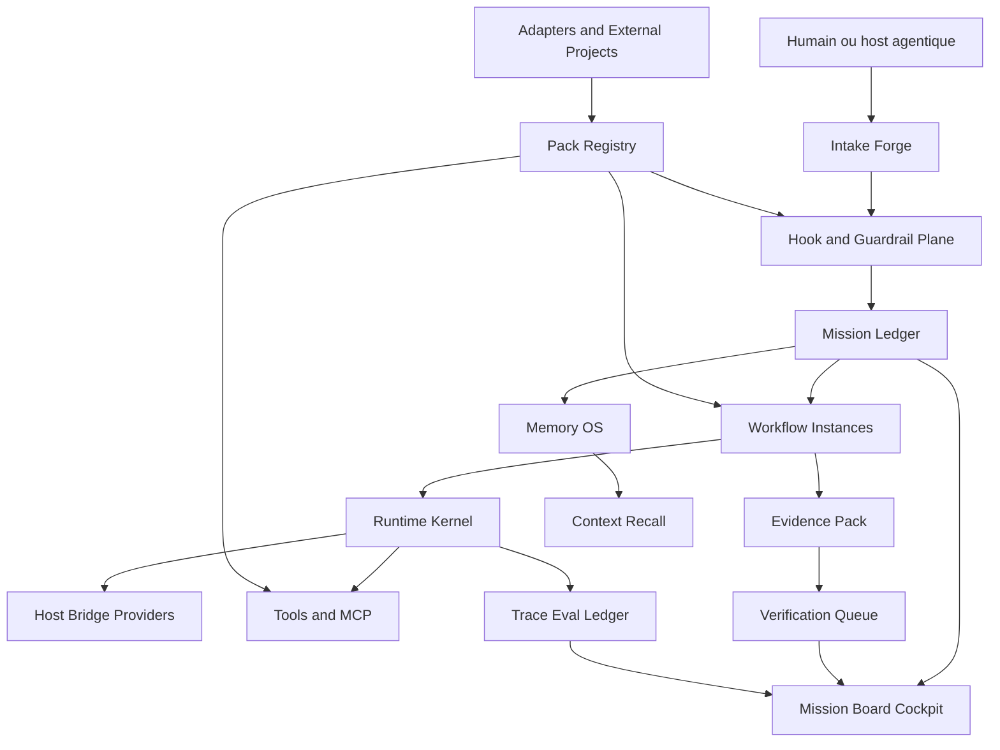

# Plan directeur - Nouveau projet Grimoire Agent OS

## Vision

Grimoire doit devenir un Agent OS operable, verifiable et distribuable.

La version forte de cette vision :

```text
Un humain exprime une mission.
Grimoire la transforme en graphe de travail.
Les agents executent via workflows instancies.
Les hooks bornent les actions.
Les guardrails refusent les mutations non prouvees.
La memoire rappelle le bon contexte.
Le cockpit explique l'etat et les decisions.
Le kit distribue les primitives comme produit reutilisable.
```

## Positionnement des deux moities

| Bloc | Mission | Anti-pattern a eviter |
| --- | --- | --- |
| Grimoire Forge | Chantier vivant, dogfood, bootstrap multi-host, hooks, policy, docs, cockpit de pilotage | Devenir une accumulation de plans sans source de verite unique |
| grimoire-kit | SDK, CLI, MCP, runtime kernel, packs, Memory OS, dashboards, distribution | Devenir un framework abstrait sans preuve d'usage dans Forge |

Forge prouve. Le kit generalise. Forge ne fork pas le kit. Le kit ne devance pas les preuves Forge sur les contrats critiques.

## Architecture cible



## Principe central

Le pivot n'est plus un plan, un agent, un board ou un event isole. Le pivot est le contrat d'execution :

```text
Mission -> Task -> Workflow Instance -> Run Event -> Checkpoint -> Evidence -> Verification Verdict -> Closure
```

Tout le reste est une projection, un adaptateur ou une policy.

## Tracks du nouveau projet

### Track A - Source de verite et nettoyage

But : stopper la fragmentation des plans.

Travail :

- declarer ce paquet comme plan directeur ;
- classer les anciens plans ;
- migrer les decisions utiles vers le backlog unifie ;
- bloquer les nouvelles roadmaps paralleles ;
- ajouter une convention d'identifiants unique.

Sortie :

- registre de plans classe ;
- backlog unifie ;
- mapping anciens IDs vers nouveaux IDs ;
- statut clair pour `active`, `source`, `absorbed`, `superseded`, `incubator`, `archive`.

Gate :

- une nouvelle tache peut etre routee sans relire tous les anciens rapports ;
- un agent sait quel plan est actif ;
- les anciens plans ne pilotent plus directement l'execution.

### Track B - Runtime Kernel

But : creer le noyau durable qui manque encore pour pretendre a un Agent OS.

Primitives :

- `Run`;
- `Mission`;
- `Task`;
- `WorkflowInstance`;
- `Checkpoint`;
- `RunEvent`;
- `PolicyVerdict`;
- `EvidencePack`.

Travail :

- definir les schemas ;
- separer event log, checkpoint, read model et evidence ;
- garantir idempotence et replay ;
- refuser les mutations critiques sans provenance ;
- exposer les contrats depuis grimoire-kit.

Gate :

- un run critique peut etre rejoue ;
- un checkpoint peut reprendre sans doubler les effets ;
- une mutation incomplete est refusee ;
- le cockpit lit une projection issue du kernel.

### Track C - Mission Ledger et task graph

But : absorber le meilleur de Beads sans importer Dolt comme obligation.

Travail :

- creer un ledger Grimoire-native ;
- supporter dependances `blocks`, `relates`, `parent-child`, `discovered-from`, `supersedes` ;
- importer et exporter un format compatible Beads JSONL ;
- ajouter une requete `ready` ;
- garder `source_repo` et `origin` pour Forge + grimoire-kit + packs ;
- lier chaque task a evidence, memory refs et files touchees.

Gate :

- une task a dependance bloquante ne sort pas dans `ready` ;
- une task multi-repo garde sa provenance ;
- un agent peut claim une task sans collision ;
- le Mission Board derive son etat du ledger.

### Track D - Workflow Instances, formulas et orders

But : transformer les procedures en executions instanciees.

Travail :

- definir `Recipe` et `WorkflowInstance` ;
- traduire les formulas Gas City en recipes Grimoire ;
- traduire les orders en automations controller-side ;
- distinguer exec order et agent workflow ;
- introduire checkpoints, retries, resume context et abort reason ;
- lier chaque instance a task, mission, evidence et trace.

Gate :

- une recipe peut etre instanciee plusieurs fois et comparee ;
- un exec order ne consomme pas d'agent inutilement ;
- un workflow bloque devient incident explicite ;
- un resume ne recree pas les effets deja produits.

### Track E - Hook and Guardrail Plane

But : faire des hooks un controle fin et non un deuxieme moteur metier.

Travail :

- stabiliser les events hooks existants ;
- garder le registre de securite avec digest ;
- promouvoir `terminal-guard` seulement apres preuve ;
- connecter `UserPromptSubmit` au triage ledger ;
- connecter `PostToolUse` a evidence et doc drift ;
- connecter `SubagentStop` a evaluation de sortie ;
- connecter `PreCompact` a learning et memory promotion ;
- refuser les hooks qui lancent des workflows longs.

Gate :

- chaque hook a un mode `shadow`, `canary` ou `enforced` ;
- chaque hook promu a control files et digest ;
- une action bloquee donne une raison exploitable ;
- la logique durable vit dans grimoire-kit, pas dans shell.

### Track F - Pack Registry et fusion externe

But : fusionner les projets utiles par packs et adaptateurs.

Travail :

- definir `pack.yaml` Grimoire ;
- ajouter un convertisseur `pack.toml` Gas City vers pack Grimoire ;
- supporter commands, doctor checks, services, formulas, policies, tests ;
- creer `pack.lock.json` ;
- ajouter provenance, hash, owner, compatibility, status ;
- isoler les packs experimentaux.

Gate :

- un pack invalide est refuse ;
- un pack converti reste deterministe ;
- une commande externe ne s'active pas sans policy ;
- un pack apporte ses doctor checks mais ne court-circuite pas le doctor global.

### Track G - Memory OS et Code Graph

But : faire de la memoire un systeme verifiable, pas un sac de contexte.

Travail :

- alimenter `grimoire_memory`, `grimoire_knowledge`, `grimoire_code`, `grimoire_tasks` ;
- lier memory refs aux tasks et evidences ;
- ajouter hot memory locale et Redis optionnel ;
- promouvoir seulement decisions, preuves, incidents, patterns et erreurs repetees ;
- construire le code graph pour symboles, tests, ownership et impact ;
- exposer freshness, provenance et contradiction.

Gate :

- une memoire sans provenance ne rentre pas dans un run critique ;
- une task peut montrer quelles memoires ont ete lues ;
- une memoire stale ou contradictoire produit un warning ;
- le code graph peut expliquer l'impact d'un fichier sans charger tout le repo.

### Track H - Mission Board Cockpit

But : rendre l'orchestration lisible et operable.

Travail :

- unifier Mission Board, runtime dashboard, verification view, memory views et hook ledger ;
- afficher task graph, workflow instance, evidence pack, policy verdict, checkpoint et incident ;
- exposer les refus et les causes ;
- ajouter vues packs et doctor checks ;
- garder la UI comme projection, jamais comme source de verite.

Gate :

- un operateur voit pourquoi une task est bloquee, refusee ou close ;
- une transition critique montre evidence et policy ;
- un run peut etre inspecte sans transcript brut ;
- aucune vue ne cree d'etat metier parallele.

### Track I - Host Bridge, MCP, A2A et providers

But : connecter les hosts sans enfermer Grimoire dans un seul protocole.

Travail :

- garder Codex, Copilot et Claude sur le meme bootstrap ;
- classer les providers par capacite : instructions only, preset, hooks, deep integration ;
- exposer MCP comme transport principal quand disponible ;
- ajouter A2A comme interop agent-agent externe ;
- garder CLI/API comme fallback ;
- aligner hostId, runId, taskId, traceId et requestId.

Gate :

- un host sans hooks peut contribuer sans casser la chaine de preuve ;
- un host avec hooks respecte le registre ;
- un transport different garde le meme contrat metier ;
- les providers externes sont bornes par policy.

### Track J - Observabilite, evals et red team

But : savoir si le systeme marche vraiment.

Travail :

- exporter traces OTel depuis events canoniques ;
- ajouter metriques agent starts, stops, crashes, quarantines, tool calls, verification failures, retries, token use ;
- connecter evals canaries a Mission Packs ;
- ajouter red-team harness prompt injection, tool misuse, memory poisoning, unsafe pack ;
- integrer OWASP Agentic et skills supply-chain.

Gate :

- un echec critique laisse une trace exploitable ;
- un pack dangereux est bloque avant activation ;
- une regression de routing ou de verification remonte ;
- l'observabilite n'expose pas prompts, secrets ou contenus sensibles sans policy explicite.

### Track K - Distribution, documentation et ecosysteme

But : transformer le projet en plateforme adoptable.

Travail :

- docs utilisateur pour kit ;
- docs architecture pour Forge ;
- quickstart minimal ;
- guide de creation de packs ;
- marketplace verifie experimental ;
- community playbook inspire de Gastownhall, mais Grimoire-first ;
- preuves publiques de capabilities sans sur-vendre.

Gate :

- un nouvel utilisateur peut installer le kit, lancer doctor, creer une task et voir le cockpit ;
- un pack externe peut etre audite avant activation ;
- les docs disent ce qui est stable, experimental ou planned ;
- les claims produit correspondent au code.

## Definition de Done globale

Une task est `done` seulement si :

- les criteres d'acceptation sont couverts ;
- l'evidence est liee ;
- les tests ou validations sont mentionnes ;
- les hooks/guardrails impactes sont declares ;
- les docs impactees sont actualisees ou explicitement non concernees ;
- le Mission Ledger peut reconstruire l'etat ;
- le cockpit ou un export peut expliquer la decision.

`done` sans preuve est refuse.
