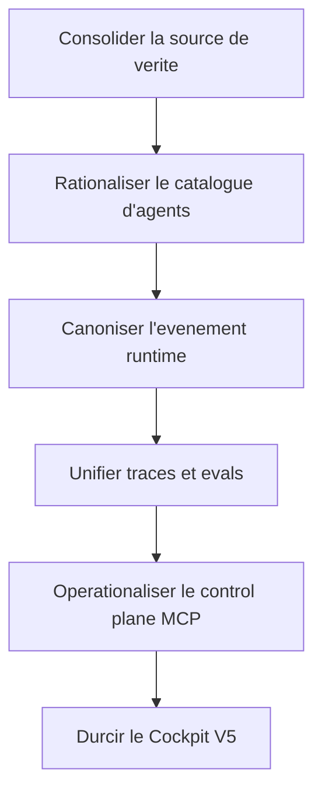

## Plan d'execution post-audit agentique

## But

Transformer l'audit principal en ordre d'execution concret, sans reouvrir le scope ni repartir en brainstorm.

Ce document ne remplace pas le plan maitre. Il sert de **filtre d'execution** sur ce qu'il faut resserrer avant d'ouvrir davantage de surface produit.

## Principe directeur

Le cap n'est pas d'ajouter des capacites. Le cap est de **resserrer le noyau** jusqu'a ce que trois choses deviennent vraies en meme temps :

- le runtime actif a une source de verite nette ;
- la gouvernance des agents n'est plus inflationniste ;
- la Game UI lit et explique des signaux fiables au lieu de compenser un noyau flou.

## Pile prioritaire

| Lot | Objectif | Pourquoi maintenant | Gate de sortie |
| --- | --- | --- | --- |
| L1 | Consolider la source de verite repo et runtime | Le legacy et le runtime actif se marchent dessus | Les chemins actifs, memoires et traces sont univoques |
| L2 | Rationaliser le catalogue d'agents | La duplication brouille le routage et la promesse produit | Le catalogue actif ne contient plus les profils qui devraient etre des modes |
| L3 | Canoniser l'evenement runtime | Sans enveloppe canonique, ni replay ni cockpit ne sont fiables | Toute action critique porte les metadonnees minimales communes |
| L4 | Unifier observabilite et evals | Les briques existent mais ne forment pas encore une chaine de preuve | Traces, evals et trust scoring convergent vers le meme ledger |
| L5 | Operationaliser la gouvernance MCP | Le code a la capacite, le workspace n'a pas encore le control plane | Toute connexion MCP est classee, allowlistee ou refusee |
| L6 | Productiser le Cockpit V5 | La surface doit devenir la projection lisible du noyau, pas une compensation | La boucle `observer -> inspecter -> expliquer -> verifier -> challenger` est complete |

## L1 - Consolider la source de verite

### L1 Scope

- Alignement entre `_grimoire`, `_grimoire-runtime`, `grimoire-kit`, `_grimoire-output` et `_grimoire-runtime-output`.
- Clarification de ce qui est actif, archive, derive ou legacy.
- Reparation des references cassees les plus structurantes.

### L1 Actions

- Declarer explicitement quelles memoires et quelles traces sont canoniques pour le runtime actif.
- Rendre les outils d'audit sensibles au layout runtime actif, pas seulement au layout legacy.
- Corriger ou archiver les workflows legacy qui referencent encore de mauvais chemins, notamment dans [`_grimoire/_config/custom/workflows/boomerang-orchestration.md`](../../_grimoire/_config/custom/workflows/boomerang-orchestration.md) et [`_grimoire/_config/custom/workflows/subagent-orchestration.md`](../../_grimoire/_config/custom/workflows/subagent-orchestration.md).
- Geler le principe suivant : aucune logique durable ne vit dans une zone archivee ou ambigue sans justification explicite.

### L1 Gate de sortie

- Plus aucune `broken-ref` haute severite sur les chemins actifs.
- Le preflight n'emet plus d'ambiguite sur la landing zone des composants durables actifs.
- Les outils memoire et trace savent lire la meme topologie que le runtime actif.

### L1 Ce qu'il faut refuser

- Ajouter de nouvelles couches documentaires avant de fermer la topologie.
- Laisser coexister deux centres de gravite memoire sans arbitrage formel.

## L2 - Rationaliser le catalogue d'agents

### L2 Scope

- Conversion des profils, styles et modes d'animation en modes de routing ou workflows.
- Conservation des agents seulement quand ils portent une responsabilite unique.

### L2 Actions

- Appliquer la cible du document [rationalisation-catalogue-agents-2026-04-10.md](rationalisation-catalogue-agents-2026-04-10.md).
- Sortir du catalogue actif les agents qui ne sont que des variantes de ton, de vitesse ou de facilitation.
- Refaire le skill routing du master autour de familles plus stables : execution, produit, critique, craft specialise.
- Garder un registre explicite entre `agent durable`, `mode`, `workflow`, `style de sortie`.

### L2 Gate de sortie

- Chaque agent actif tient en une phrase de responsabilite non chevauchante.
- Les profils demotes n'apparaissent plus comme des sous-agents de premier rang.
- Le routage SOG n'a plus besoin de s'appuyer sur un grand nombre de personas proches.

### L2 Ce qu'il faut refuser

- Confondre reduction du catalogue et perte de capacite.
- Supprimer des specialites reelles comme `tea`, `rodin` ou `art-director` sous pretexte de sobriete abstraite.

## L3 - Canoniser l'evenement runtime

### L3 Scope

- Enveloppe canonique entre runtime, replay, session, spectateur et host bridges.
- Metadonnees communes de correlation, provenance et verification.

### L3 Actions

- Prendre comme point de depart les schemas de [`grimoire-kit/apps/grimoire-game/src/contracts/schemas.ts`](../../grimoire-kit/apps/grimoire-game/src/contracts/schemas.ts).
- Faire converger `messageId`, `traceId`, `taskId`, `correlationId`, `verificationRef`, `surface`, `policy`, `trustLevel` et `provenance` sur un noyau unique.
- Rendre impossible toute mutation critique sans cette enveloppe minimale.
- Aligner les host bridges futurs sur cette enveloppe plutot que d'introduire des variantes vendor-specific.

### L3 Gate de sortie

- Toute action critique observable dans la Game UI porte les memes cles canoniques.
- Le replay d'un run ne depend plus de conventions implicites hors contrat.
- Les tests de contrat et d'integration couvrent les cas de refus, de replay et d'idempotence.

### L3 Ce qu'il faut refuser

- Un mode `best effort` qui accepte des evenements incomplets.
- Un format de trace qui double le contrat au lieu de le projeter.

## L4 - Unifier observabilite et evals

### L4 Scope

- Un seul ledger logique pour traces, evaluations, trust scores et evidence pack.

### L4 Actions

- Raccorder [`grimoire-kit/src/grimoire/core/evaluator.py`](../../grimoire-kit/src/grimoire/core/evaluator.py), [`grimoire-kit/src/grimoire/core/trust_scorer.py`](../../grimoire-kit/src/grimoire/core/trust_scorer.py) et [`grimoire-kit/framework/tools/synapse-trace.py`](../../grimoire-kit/framework/tools/synapse-trace.py) au meme modele de run.
- Eliminer les entrees `unknown -> unknown` des nouvelles sessions.
- Definir ce qui alimente le cockpit, ce qui alimente l'audit offline et ce qui alimente l'evidence pack.
- Lier les evaluations a des traces et a des artefacts, pas seulement a des sorties textuelles.

### L4 Gate de sortie

- Une trace de run recente est lisible sans champs inconnus critiques.
- Une evaluation peut etre rattachee a une session, un agent, un artefact et un verdict.
- Le cockpit peut expliquer une decision sans transcript brut complet.

### L4 Ce qu'il faut refuser

- Multiplier les formats de traces paralleles.
- Installer une plateforme externe d'observabilite comme source de verite prematuree.

## L5 - Operationaliser la gouvernance MCP

### L5 Scope

- Passer d'une capacite de classification a un control plane réellement opere.

### L5 Actions

- Rendre executable le rapport de policy du serveur MCP dans l'environnement nominal.
- Etendre [`_grimoire-runtime/_config/mcp-policy.yaml`](../../_grimoire-runtime/_config/mcp-policy.yaml) au-dela de l'allowlist minimale actuelle.
- Classer chaque serveur par transport, auth, trust, mutabilite et usage attendu.
- Definir la regle simple : tout remote non allowliste est refuse, tout local mutable est traite comme surface sensible.
- Faire converger policy repo, workspace MCP et budget de mutation runtime.

### L5 Gate de sortie

- Tous les serveurs de [`.vscode/mcp.json`](../../.vscode/mcp.json) sont `pass` ou `warn` justifie.
- Aucun remote utile n'est `unreviewed-remote` par oubli.
- Le cockpit peut exposer `host -> health -> permissions -> evidence` sans heuristique floue.

### L5 Ce qu'il faut refuser

- Un bus MCP ouvre par defaut.
- Un host bridge contourne les guardrails de mutation du runtime.

## L6 - Productiser le Cockpit V5

### L6 Scope

- Assumer le cockpit comme produit principal.
- Garder l'office view comme projection secondaire.

### L6 Actions

- Prioriser strictement la boucle `observer -> inspecter -> expliquer -> verifier -> challenger`.
- Brancher l'audit view, la verification view, la session view et la collaboration view sur les memes read models.
- Refuser toute surcouche decorative qui n'apporte ni comprehension ni action ni preuve.
- Continuer a investir dans la Game UI seulement quand le signal runtime en dessous est deja stable.

### L6 Gate de sortie

- Un operateur expert peut diagnostiquer un run, comprendre un refus, verifier une preuve et challenger une decision depuis la meme surface.
- L'office view n'introduit aucune logique metier parallele.
- Le produit peut etre montre comme cockpit operatoire, pas comme demo game-like.

### L6 Ce qu'il faut refuser

- Construire des rooms avant de fermer les read models et les gates de preuve.
- Utiliser l'UX pour masquer un noyau encore ambigu.

## Sequence stricte

- L1 avant tout le reste.
- L2 et L3 peuvent progresser en chevauchement partiel, mais L2 doit figer le registre avant la refonte profonde du routage.
- L4 doit s'appuyer sur L3.
- L5 doit s'appuyer sur L1 et L3.
- L6 ne doit accelerer qu'une fois L3 et L4 suffisamment fiables.

## Premier paquet concret

Si un seul paquet doit partir tout de suite, ce doit etre :

- clarification du centre de gravite runtime ;
- reparation des references casses actives ;
- rationalisation du catalogue d'agents ;
- fermeture du contrat canonique `event -> trace -> verification`.

Tant que ce paquet n'est pas ferme, toute acceleration sur de nouvelles surfaces produit augmente surtout la dette.
