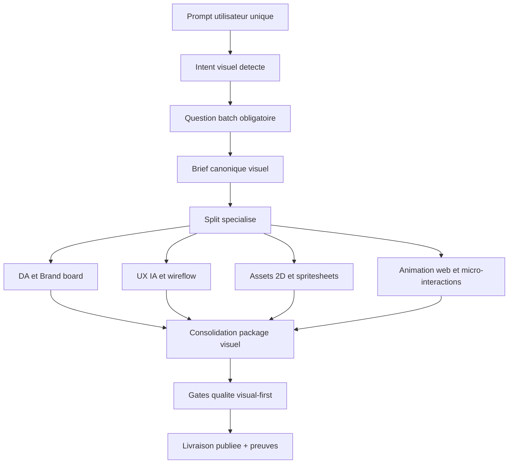

# Plan Flow Agentique Visuel Ultra

## Objectif

Transformer la chaine actuelle en flow unique capable de produire, depuis un seul prompt utilisateur, une direction artistique complete, une UX/UI exploitable, des assets visuels multi-formats et des animations web convaincantes, avec gouvernance, preuves et garde-fous.

## Base existante conservee

1. Garder la logique "cockpit causal avant habillage" deja posee dans le corpus V5.
2. Garder les assets 2D gouvernes (`grimoire-2d-asset-pipeline`, style guide, manifests).
3. Garder la gouvernance hook gateway (promotion, shadow, canary) pour eviter les regressions runtime.
4. Garder la separation `control plane` vs `surfaces visuelles`.

## Ecarts a fermer

1. Pas de flow unifie front + DA + assets + animation.
2. Pas de questionnaire obligatoire unique pour des utilisateurs non designers.
3. Manque de specialisation explicite pour logo/brand, motion web, storyboard animation, spritesheets rigees.
4. Pas de gate qualite visual-first croisant accessibilite, performance et lisibilite narrative.
5. Pas de contrat de sortie unique "one prompt -> visual package".

## Cible: Visual Ops Pipeline

## Questions obligatoires (batch unique)

Ces questions doivent etre posees en un seul lot avant generation lourde.

| Bloc | Questions obligatoires |
| --- | --- |
| Intent produit | Quel usage principal l'utilisateur doit accomplir en premier ? Quel est le contexte d'usage dominant ? |
| Audience | Qui est l'utilisateur principal ? Quel niveau de maturite UX/UI presume ? |
| DA et marque | Quelle ambiance (3 adjectifs) ? Quelles references aimees/rejetees ? Niveau de sobriete vs expressivite ? |
| UX et information | Quelles 3 informations doivent etre visibles en premier ? Quelles actions doivent etre faisables en un clic ? |
| Animation | Quel role de la motion: guider, expliquer, rassurer, celebrer ? Niveau d'intensite accepte ? |
| Assets 2D | Quels types d'assets: personnages, props, FX, icones, logos ? Quelles tailles et etats d'animation requis ? |
| Contraintes techniques | Stack cible, budget perf, plateformes, mode offline, export attendu (png/svg/gif/css/js) ? |
| Gouvernance | Qu'est-ce qui est interdit (style, references, risques legaux, claims non prouves) ? |

## Contrat de sortie unique

Le flow doit produire un package standardise:

1. `visual-brief.md` (vision, audience, style, anti-goals).
2. `brand-board.md` (palette, typo, iconographie, logo direction).
3. `ux-map.md` (parcours, IA, zones prioritaires, patterns d'interaction).
4. `motion-spec.md` (timings, easing, choreography, reduced-motion).
5. `assets-manifest.csv` (asset id, format, dimensions, frames, statut baseline/final).
6. `implementation-pack/` (snippets CSS/JS, templates SVG, spritesheets, previews).
7. `proof-pack.md` (checks passes, risques ouverts, decisions).

## Specialites a expliciter dans le flow

| Specialite | Role | Artefact principal |
| --- | --- | --- |
| Visual Orchestrator | pilote le flow et la coherence globale | brief canonique |
| Brand and Logo Designer | dirige logo, systeme graphique, signatures | brand board + logo specs |
| UX Architect | structure IA, lisibilite, navigation, priorisation | ux map + wireflow |
| Motion Designer | choregraphie les mouvements explicatifs et micro-interactions | motion spec + storyboard |
| 2D Asset Director | supervise sprites, FX, room kits, coherence palette | assets manifest + review |
| Front Animation Engineer | transforme les specs en code performant | implementation pack |

## Stack de reference recommandee

| Besoin | Outils recommandes | Regle de choix |
| --- | --- | --- |
| Animation DOM/SVG sequentielle | GSAP timeline | Choix par defaut pour animations explicatives de schemas |
| Animation interactive vectorielle | Rive state machines | Utiliser quand l'etat applicatif pilote l'animation |
| Sprite/scene 2D riche | PixiJS | Utiliser pour board interactif ou rendu en couches |
| Motion legere declarative | CSS + Web Animations API | Preferer pour micro-interactions simples |
| Assets web statiques | SVG/PNG/WebP | SVG pour icones/logos, PNG/WebP pour textures/pixel |
| Export communication | GIF/MP4 derive | Deriver depuis source maitre, jamais inverse |

## Gouvernance hook a ajouter

1. Hook de pre-brief visuel: detecte les demandes visuelles et force le batch de questions obligatoires.
2. Hook de normalisation de brief: garantit un brief canonique exploitable par les specialites.
3. Hook de gate visuelle: bloque la livraison si pas de preuve acces/perf/coherence.
4. Hook de claims visuels: interdit les promesses non prouvees ("cinematic", "AAA", "accessible") sans evidence.

## Skills et prompts a ajouter

| Type | Nom propose | But |
| --- | --- | --- |
| Skill | `grimoire-visual-orchestration` | one-prompt vers package visuel complet |
| Skill | `grimoire-brand-logo-system` | logos, systeme de marque, variantes et usages |
| Skill | `grimoire-ux-ia-rapid` | UX IA pour utilisateurs non experts |
| Skill | `grimoire-motion-choreography` | storyboard motion + mapping technique |
| Skill | `grimoire-sprite-rigging-2d` | templates personnages prets a animer |
| Prompt | `grimoire-visual-kickoff.prompt.md` | lancement express du flow complet |
| Prompt | `grimoire-web-scene-animation.prompt.md` | generation d'une scene explicative animee |
| Prompt | `grimoire-logo-and-brand-pass.prompt.md` | cycle de conception logo + charte |

## Gates qualite visual-first

| Gate | Critere |
| --- | --- |
| Clarte | L'utilisateur identifie en quelques secondes ou cliquer et quoi lire |
| Coherence | Palette, typo, motifs et motion alignes sur le brief |
| Accessibilite | Contraste, focus visible, navigation clavier, reduced motion |
| Performance | Pas de jank perceptible, budget respecte, interactions fluides |
| Operabilite | Les animations expliquent l'action au lieu de distraire |
| Gouvernance | Sources et droits des assets tracables, claims verifies |

## Pack pret pour demain

### Resultats attendus

1. Demander des assets 2D personnages avec template d'animation prete.
2. Demander une page web avec schema architectural anime par etapes (cables, inertie, branchements lisibles).
3. Obtenir une UX orientee besoin metier, navigation intuitive et hierarchie claire.
4. Ajouter des FX 2D animes dans le scope produit quand ils augmentent la comprehension.

### Preconditions techniques

1. Brief canonique complete par batch unique de questions.
2. Selection explicite du style cible et des anti-goals.
3. Definition du format de sortie attendu par bloc (png/svg/gif/css/js).
4. Validation des gates qualite avant publication.

## Backlog de mise en place

### P0

1. Creer la skill `grimoire-visual-orchestration`.
2. Creer le prompt `grimoire-visual-kickoff.prompt.md`.
3. Ajouter hook pre-brief visuel dans `UserPromptSubmit`.
4. Definir le template `visual-brief.md` canonique.

### P1

1. Creer les skills `grimoire-brand-logo-system`, `grimoire-motion-choreography`, `grimoire-sprite-rigging-2d`.
2. Ajouter prompt `grimoire-web-scene-animation.prompt.md`.
3. Ajouter gate qualite visuelle (accessibilite + performance + coherence).
4. Ajouter examples end-to-end (assets + web animation + UX package).

### P2

1. Etendre les hooks de governance claims visuels.
2. Ajouter bibliotheque de references style par domaine.
3. Ajouter mode "auto-variants" pour iterer plusieurs directions visuelles.
4. Ajouter audit automatique du package visuel final.

## Definition of done

Le flow est considere operationnel quand un seul prompt utilisateur produit un package visuel complet, gouverne, performant et testable, sans demander de connaissances prealables en UI/UX/graphisme a l'utilisateur final.
