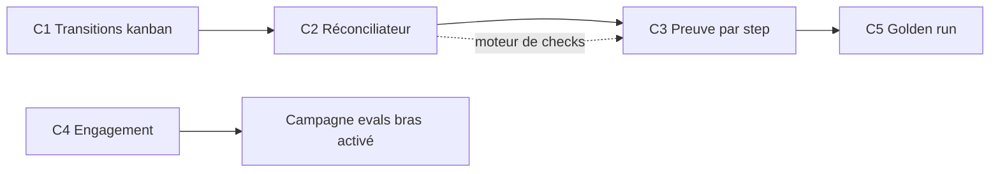

# Plan de travail — Chaîne de preuve des workflows

Date de cadrage : 2026-07-12
Branche de référence : `work/harmonisation-followup-20260703`
Statut : proposé

## Contexte et problème

Le diagnostic (session 2026-07-12) a établi que la Forge dispose de deux couches de
preuve qui ne se parlent pas :

- **Couche déclarative** : kanban gouverné (`_grimoire/standard/task-board.yaml`),
  evidence packs, decision traces. Riche mais rédigée par l'agent lui-même
  (self-report), contrôlée uniquement sur la forme par `grimoire standard verify`
  (`agentic_standard.py:1217-1330`).
- **Couche machine** : `task-flow/events.jsonl` (exitCodes déterministes), git.
  Fiable mais muette sur l'intention, non raccordée à la couche déclarative.

Conséquences : un evidence pack plausible mais faux passe verify ; les transitions
kanban ne sont pas horodatées (ordre non prouvable) ; un step sauté au milieu d'un
gros workflow est indétectable sans audit manuel ; l'engagement réel des workflows
n'est pas mesuré (leçon de la campagne web-app-todo : effet non démontré car
engagement nul).

## Objectif

Rendre vérifiable, sans confiance dans le self-report de l'agent, qu'un workflow :

1. a été exécuté (chaque step laisse une trace machine),
2. a été exécuté dans l'ordre (horodatage append-only),
3. produit des claims réconciliables avec la réalité (digests, events, commits),
4. est réellement engagé quand il devrait l'être.

## Chantiers

### C1 — Transitions kanban horodatées (append-only)

Prérequis : aucun. Point d'entrée du plan.

**Livrables**

- Hook PostToolUse `grimoire-board-transitions` branché via
  `grimoire-hook-gateway.sh`, déclaré dans `hook-safety-registry.json`,
  démarrage en mode `shadow` (convention UDF).
- Journal `_grimoire-runtime-output/task-flow/board-transitions.jsonl`
  (schéma : `task_id`, `from`, `to`, `timestamp`, `session`).
- Protection en écriture du journal par le memory-guard (même mécanique que
  `_grimoire-runtime/_memory/`).

**Tâches**

1. Écrire le script hook : diff des statuts de `task-board.yaml` avant/après
   édition, append des transitions détectées.
2. Déclarer le hook dans le registre de sécurité, mode `shadow`.
3. Étendre la protection memory-guard au journal.
4. Ajouter deux checks côté Forge (script `quality`) :
   statut courant de chaque carte cohérent avec le dernier event du journal ;
   toutes les transitions du journal sont légales selon `evidence-gates.yaml`.
5. Passer le hook en `canary` puis promotion via `grimoire: hooks-promote`
   après période d'observation.

**Critères d'acceptation**

- Une édition de `task-board.yaml` changeant un statut produit exactement un
  event dans le journal, sans intervention de l'agent.
- Une transition illégale (ex. `proposed` vers `review`) est détectée par le
  check et fait échouer `npm run quality`.
- `grimoire-hooks-smoke.sh` couvre le nouveau hook.

### C2 — Réconciliateur evidence contre réalité

Prérequis : C1 (le journal de transitions est une source de réconciliation).

**Livrables**

- Script Forge `tools/evidence-reconcile.py` (upstream vers le Kit différé,
  décision actée : Forge d'abord, upstream après stabilisation, cohérent avec
  la mécanique nested/bridge).
- Intégration dans `npm run quality` et documentation de la gate
  `in_progress` vers `review`.

**Tâches**

1. Parser les evidence packs référencés par `task-board.yaml`
   (`evidence_pack_ref`) et les packs JSONL de `EvidenceService` s'ils existent.
2. Implémenter les checks de réconciliation :
   - `uri` locale : recalcul sha256 et comparaison au `digest` déclaré ;
   - item `TEST` ou `LOG` : event correspondant dans `events.jsonl` avec
     `exitCode: 0` ;
   - référence de commit : `git cat-file -e` ;
   - timestamps des items monotones avec l'ordre déclaré des steps.
3. Classer chaque claim : `VERIFIED`, `UNVERIFIABLE`, `CONTRADICTED`.
   `CONTRADICTED` fait échouer la gate ; `UNVERIFIABLE` est un warning en
   profil `governed`, une erreur en `production`.
4. Brancher dans `npm run quality`.
5. Rétro-valider les packs existants (bootstrap, r8, r9, r10) et corriger ou
   requalifier les claims invérifiables.

**Critères d'acceptation**

- Un digest falsifié dans un pack est détecté (`CONTRADICTED`).
- Un claim de test sans event `exitCode: 0` correspondant est détecté.
- Les packs existants passent la réconciliation ou portent une requalification
  explicite.

### C3 — Preuve par step des gros workflows

Prérequis : C2 (réutilise le moteur de checks du réconciliateur).

**Livrables**

- Extension du schéma `workflow-state-manifest.yaml` : champ
  `expected_artifact` par step.
- Checker post-run `tools/workflow-step-check.py` : existence de chaque
  artefact attendu et ordre chronologique des mtimes/timestamps.
- Pilote sur un gros workflow réel (candidat : un workflow BMM de la phase
  `4-implementation`, à confirmer au démarrage du chantier).

**Tâches**

1. Définir l'extension de schéma et la faire valider par
   `_verify_workflow_state_manifest` (contribution Kit ou surcharge Forge).
2. Annoter le workflow pilote avec ses artefacts attendus par step.
3. Implémenter le checker (existence, ordre, fraîcheur relative).
4. Documenter le mode de défaillance couvert : step sauté silencieusement.

**Critères d'acceptation**

- Sur le workflow pilote, la suppression manuelle de l'artefact d'un step
  intermédiaire fait échouer le checker avec identification du step.
- Un artefact antidaté (ordre incohérent) est détecté.

### C4 — Mesure d'engagement des workflows

Prérequis : aucun (parallélisable avec C1-C3). Calage : prérequis du bras
« activé » de la campagne d'evals web-app-todo.

**Livrables**

- Extension du hook `grimoire-prompt-submit` (ou session-start) : log des
  artefacts workflow/standard effectivement chargés en session, dans
  `_grimoire-runtime-output/task-flow/engagement.jsonl`.
- Rapport de taux d'engagement : sessions où un artefact aurait dû se
  déclencher contre sessions où il a été chargé.

**Tâches**

1. Définir le signal « chargé » observable par hook (lecture du fichier
   workflow, invocation slash command, dispatch SOG).
2. Implémenter le log d'engagement.
3. Script d'agrégation produisant le rapport.
4. Câbler le rapport comme métrique d'entrée de la campagne bras « activé ».

**Critères d'acceptation**

- Chaque session produit zéro ou plusieurs events d'engagement horodatés.
- Le rapport distingue « jamais engagé » de « engagé sans effet », levant
  l'ambiguïté de la campagne précédente.

### C5 — Golden run

Prérequis : C3 (le checker par step définit le format du référentiel).

**Livrables**

- Un run complet du workflow pilote, audité manuellement une fois, dont les
  traces (events, artefacts par step, transitions kanban) sont archivées sous
  `_grimoire-runtime-output/test-artifacts/golden-runs/<workflow>/`.
- Script de diff d'un run courant contre le golden run.

**Tâches**

1. Exécuter le workflow pilote de bout en bout avec C1-C3 actifs.
2. Auditer manuellement chaque step et figer le référentiel.
3. Implémenter le diff (steps présents, ordre, familles d'artefacts).
4. Documenter la procédure de rafraîchissement du référentiel quand le
   workflow évolue.

**Critères d'acceptation**

- Un run dégradé (step sauté, artefact manquant) est signalé par le diff sans
  audit manuel.
- Le référentiel est versionné et sa procédure de mise à jour documentée.

## Séquencement et dépendances



Chemin critique : C1 → C2 → C3 → C5. C4 est indépendant et calé sur la
campagne d'evals.

## Cartes kanban prêtes à intégrer

À coller dans `_grimoire/standard/task-board.yaml` au démarrage de chaque
chantier (statut initial `proposed`, refs à créer selon la convention
`_grimoire-output/{context,decisions,evidence}/<task_id>/`) :

```yaml
- task_id: "c1-board-transitions"
  title: "C1 — Journal append-only des transitions kanban"
  status: "proposed"
  priority: "high"
  owner: "grimoire-maintainers"
  agent_roles:
    - implementation-agent
  acceptance_criteria:
    - "Toute edition de task-board.yaml changeant un statut produit un event journalise par hook."
    - "Une transition illegale fait echouer npm run quality."
    - "grimoire-hooks-smoke.sh couvre le hook grimoire-board-transitions."
  blockers: []
  context_bundle_ref: "_grimoire-output/context/c1-board-transitions/context-bundle.yaml"
  decision_trace_ref: "_grimoire-output/decisions/c1-board-transitions/decision-trace.yaml"
  evidence_pack_ref: "_grimoire-output/evidence/c1-board-transitions/evidence-pack.md"
- task_id: "c2-evidence-reconcile"
  title: "C2 — Reconciliateur evidence contre traces machine"
  status: "proposed"
  priority: "high"
  owner: "grimoire-maintainers"
  agent_roles:
    - implementation-agent
  acceptance_criteria:
    - "Un digest falsifie est classe CONTRADICTED et fait echouer la gate."
    - "Un claim TEST sans event exitCode 0 correspondant est detecte."
    - "Les packs existants passent ou portent une requalification explicite."
  blockers: []
  context_bundle_ref: "_grimoire-output/context/c2-evidence-reconcile/context-bundle.yaml"
  decision_trace_ref: "_grimoire-output/decisions/c2-evidence-reconcile/decision-trace.yaml"
  evidence_pack_ref: "_grimoire-output/evidence/c2-evidence-reconcile/evidence-pack.md"
- task_id: "c3-step-proof"
  title: "C3 — Preuve par step via workflow-state-manifest"
  status: "proposed"
  priority: "medium"
  owner: "grimoire-maintainers"
  agent_roles:
    - implementation-agent
  acceptance_criteria:
    - "La suppression de l'artefact d'un step intermediaire fait echouer le checker."
    - "Un artefact antidate est detecte."
  blockers: []
  context_bundle_ref: "_grimoire-output/context/c3-step-proof/context-bundle.yaml"
  decision_trace_ref: "_grimoire-output/decisions/c3-step-proof/decision-trace.yaml"
  evidence_pack_ref: "_grimoire-output/evidence/c3-step-proof/evidence-pack.md"
- task_id: "c4-engagement-metric"
  title: "C4 — Mesure d'engagement des workflows"
  status: "proposed"
  priority: "medium"
  owner: "grimoire-maintainers"
  agent_roles:
    - implementation-agent
  acceptance_criteria:
    - "Chaque session produit des events d'engagement horodates."
    - "Le rapport distingue jamais engage de engage sans effet."
  blockers: []
  context_bundle_ref: "_grimoire-output/context/c4-engagement-metric/context-bundle.yaml"
  decision_trace_ref: "_grimoire-output/decisions/c4-engagement-metric/decision-trace.yaml"
  evidence_pack_ref: "_grimoire-output/evidence/c4-engagement-metric/evidence-pack.md"
- task_id: "c5-golden-run"
  title: "C5 — Golden run du workflow pilote"
  status: "proposed"
  priority: "low"
  owner: "grimoire-maintainers"
  agent_roles:
    - implementation-agent
  acceptance_criteria:
    - "Un run degrade est signale par le diff sans audit manuel."
    - "Le referentiel est versionne avec procedure de mise a jour documentee."
  blockers: []
  context_bundle_ref: "_grimoire-output/context/c5-golden-run/context-bundle.yaml"
  decision_trace_ref: "_grimoire-output/decisions/c5-golden-run/decision-trace.yaml"
  evidence_pack_ref: "_grimoire-output/evidence/c5-golden-run/evidence-pack.md"
```

## Risques et points de décision

| Risque | Chantier | Mitigation |
| --- | --- | --- |
| Le hook C1 rate des éditions hors outil (édition manuelle du YAML) | C1 | Le check de cohérence statut/journal détecte le drift a posteriori |
| Claims massivement `UNVERIFIABLE` sur les packs existants | C2 | Rétro-validation avec requalification explicite plutôt que réécriture |
| Extension de schéma refusée côté Kit | C3 | Surcharge Forge d'abord, contribution Kit ensuite (même mécanique que C2) |
| Signal « chargé » ambigu selon le client (VS Code, CLI) | C4 | Commencer par le signal le plus fiable (dispatch SOG) puis élargir |
| Golden run périmé après évolution du workflow | C5 | Procédure de rafraîchissement documentée, diff par familles d'artefacts |

## Hors périmètre

- Preuve d'effet (evals comparatives) : couverte par la campagne web-app-todo
  bras « activé », dont C4 est le prérequis, mais qui reste un projet distinct.
- Upstream Kit des outils C2/C3 : différé après stabilisation côté Forge.
- Alimentation complète de `Grimoire_TRACE.md` selon BM-28 : constat fait
  (55 entrées, quasi exclusivement des git-commits), mais la revitalisation
  complète du trace est un chantier séparé, non bloquant pour C1-C5.
