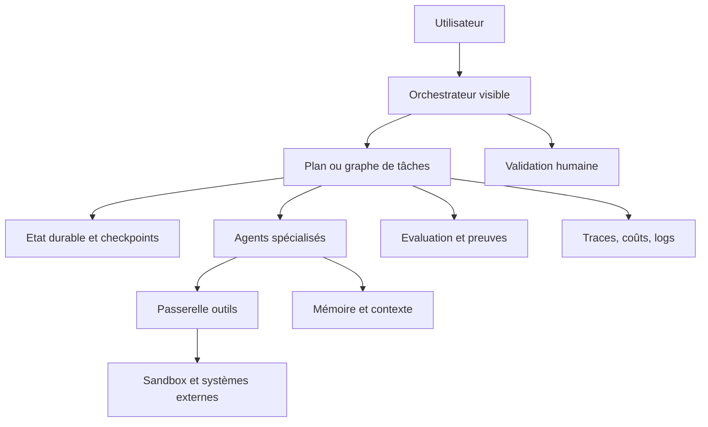

# Document technique - Analyse du pilotage agentique

## Objet

Ce document décrit la méthode utilisée pour produire l'analyse du corpus local `Référence-Agentique`. Il sert aussi de contrat technique pour comprendre ce qui est prouvé par les sources locales, ce qui relève d'une inférence architecturale, et ce qui doit être validé avant adoption dans un projet réel.

## Corpus

Le corpus contient 33 dossiers :

- Frameworks d'orchestration : `langgraph`, `agent-framework`, `openai-agents-python`, `crewAI`, `autogen`, `haystack`.
- Plateformes et builders : `dify`, `langflow`, `OpenHands`, `kagent`, `openclaw`.
- Mémoire, contexte et graphes : `mempalace`, `CodeGraphContext`, `graphify`, `LLMLingua`, `gas town/beads`.
- Méthodes et skills : `BMAD-METHOD`, `claude-skills`, `superpowers`, `andrej-karpathy-skills`, `ai-agents-for-beginners`.
- Sécurité et sandbox : `LLMSecurityGuide`, `agent-sandbox`, `browser-use`, `shannon`.
- Contrôle humain, UI et opérabilité : `switchboard`, `pixel-agents`, `Design/ui`, `vscode-copilot-chat`.
- Références expérimentales ou spécialisées : `ruflo`, `Octogent`, `OpenMythos`, `gas town/community`, `gas town/docs`.

## Méthode d'analyse

L'analyse s'appuie sur :

- Inventaire local des dossiers, fichiers, branches et structures majeures.
- Lecture des `README`, documents d'architecture, guides MCP, documents de sécurité, fichiers de schéma et fichiers runtime ciblés.
- Extraction de preuves avec chemins et lignes dans `ANNEXE-sources-et-preuves.md`.
- Comparaison par familles de pilotage plutôt que par popularité.
- Séparation entre les faits observés dans les sources et les recommandations d'architecture.

## Modèle de preuve

Chaque conclusion est classée selon trois niveaux :

| Niveau | Signification | Exemple |
| --- | --- | --- |
| Source directe | Le dépôt expose explicitement la capacité dans sa documentation ou son code. | LangGraph documente la reprise durable, le HITL, la mémoire et le tracing. |
| Inférence forte | Plusieurs sources convergent vers la même règle de conception. | Un agent outillé doit passer par une passerelle de permissions et de sandbox. |
| Hypothèse à valider | Le dépôt annonce une capacité mais les preuves locales ne suffisent pas à juger sa robustesse. | Les claims de swarms ou de routage intelligent doivent être benchés localement. |

## Carte technique

Cette carte représente la forme recommandée par convergence des meilleurs éléments du corpus. Les agents ne doivent pas piloter seuls le système. Ils doivent agir dans un plan observable et contrôlé.

## Axes d'évaluation

| Axe | Question de décision |
| --- | --- |
| Contrôle | Le système sait-il où il en est et pourquoi il agit ? |
| Reprise | Peut-on interrompre, inspecter, reprendre ou rejouer une exécution ? |
| Spécialisation | Les rôles d'agents sont-ils utiles ou seulement décoratifs ? |
| Contexte | Les agents reçoivent-ils le bon contexte, avec provenance et limites ? |
| Outils | Les actions externes passent-elles par des politiques vérifiables ? |
| Mesure | Les traces et évaluations permettent-elles d'améliorer le système ? |
| Sécurité | L'autonomie est-elle limitée par least agency, sandbox et approbations ? |
| Ergonomie | L'opérateur voit-il les blocages, les preuves et les prochaines actions ? |

## Limites de l'analyse

Cette analyse est une revue statique locale. Elle ne constitue pas un benchmark exécuté de chaque framework. Les mesures de performance numériques annoncées par les dépôts ont été traitées comme des claims de source, pas comme des résultats validés ici.

Le rapport privilégie les choix d'architecture reproductibles :

- contrats de workflow ;
- contrôles de sécurité ;
- visibilité opérateur ;
- preuves de terminaison ;
- réduction du coût contextuel ;
- capacité à évoluer sans perdre le contrôle.

## Critère de recommandation

Un dépôt est considéré comme fortement utile quand il apporte au moins un des éléments suivants :

- Un runtime de graphe ou d'état durable.
- Un modèle clair de handoff, agent-as-tool ou sub-agent.
- Une séparation nette entre contrôle, mémoire, outils et UI.
- Des primitives d'observabilité ou d'évaluation.
- Une sécurité opérationnelle concrète : sandbox, approbation, allowlist, audit.
- Une méthode de travail qui réduit les dérives classiques des agents de code.

## Résultat technique principal

Le choix de pilotage le plus robuste est hybride :

- Graphe ou workflow déterministe pour la structure.
- Agents spécialisés pour les tâches ambiguës ou créatives.
- Outils déclarés et filtrés par une passerelle.
- HITL pour les actions coûteuses, destructrices ou irréversibles.
- Traces et évaluations comme boucle d'amélioration.
- Mémoire avec provenance, expiration et invalidation.

Un projet agentique sérieux doit donc être pensé comme un système distribué contrôlé, pas comme une collection de prompts.

