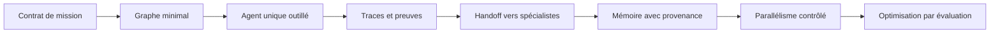

# Guide d'utilisation - Rapports Référence-Agentique

## Pour qui

Ce paquet sert à trois publics :

- Architecte agentique : choisir un modèle de pilotage et ses composants.
- Lead développeur : transformer les concepts en runtime, tests, sécurité et observabilité.
- Formateur : enseigner les familles de pilotage et les erreurs à éviter.

## Parcours de lecture

| Objectif | Lire |
| --- | --- |
| Comprendre les familles du corpus | `RAPPORT-01-cartographie-corpus.md` |
| Choisir un type de pilotage | `RAPPORT-02-modeles-pilotage-agentique.md` |
| Définir les métriques et l'observabilité | `RAPPORT-03-performance-efficacite-observabilite.md` |
| Eviter les pièges de conception | `RAPPORT-04-risques-defauts-antipatterns.md` |
| Créer un nouveau projet de pilotage | `RAPPORT-05-guide-enseignement-projet-pilotage.md` |
| Vérifier les sources locales | `ANNEXE-sources-et-preuves.md` |

## Comment prendre une décision

1. Identifier le niveau d'autonomie attendu.
2. Identifier les actions que l'agent peut exécuter.
3. Classer ces actions par risque : lecture, écriture, exécution, déploiement, communication externe.
4. Choisir un contrôle minimal : checklist, graphe, Kanban, workflow, CRD ou runtime complet.
5. Ajouter seulement les agents nécessaires.
6. Définir les preuves de réussite avant d'implémenter.
7. Brancher traces, coûts, erreurs et évaluations dès le premier workflow réel.

## Matrice de choix rapide

| Besoin | Pilotage recommandé | Références utiles |
| --- | --- | --- |
| Assistant de code discipliné | Skills, checklist, tests, diff strict | `andrej-karpathy-skills`, `superpowers`, `BMAD-METHOD` |
| Workflow métier reproductible | Graphe d'état avec checkpoints | `langgraph`, `agent-framework`, `haystack` |
| Multi-agent spécialisé | Handoffs et agents-as-tools | `openai-agents-python`, `agent-framework`, `crewAI`, `kagent` |
| Plateforme low-code | Builder visuel avec export API/MCP | `dify`, `langflow` |
| Exécution de code risquée | Sandbox, permissions, audit | `OpenHands`, `agent-sandbox`, `openclaw` |
| Agents Kubernetes | CRD, controller, MCP, OTel | `kagent`, `agent-sandbox` |
| Long contexte code | Graphe de code et bundle de contexte | `CodeGraphContext`, `graphify`, `LLMLingua` |
| Mémoire longue | Mémoire avec provenance et recherche | `mempalace`, `gas town/beads` |
| Supervision opérateur | Kanban, statuts, visualisation | `switchboard`, `pixel-agents`, `langflow` |
| Qualité et amélioration | Tracing, evals, datasets | `langfuse`, `ai-agents-for-beginners`, `agent-framework` |

## Ce qu'il faut faire avant de coder

Définir explicitement :

- le rôle de l'orchestrateur visible ;
- les types de tâches acceptées ;
- les agents disponibles et leurs capacités ;
- les outils utilisables et leurs politiques ;
- le format d'un plan ;
- le format d'un résultat ;
- le format d'une preuve ;
- les gates d'approbation humaine ;
- les métriques minimales ;
- la stratégie de reprise après échec.

## Exemple de chemin d'adoption

Ce chemin évite de commencer par un swarm complet sans état fiable. Il met d'abord en place le contrôle, puis l'autonomie.

## Questions de gouvernance

Avant d'adopter un framework, répondre à ces questions :

- Où est stocké l'état de run ?
- Qui peut reprendre une exécution interrompue ?
- Comment une décision d'agent est-elle attribuée ?
- Quelles actions exigent une validation humaine ?
- Quelle donnée peut entrer dans la mémoire ?
- Comment retire-t-on une mémoire fausse ou périmée ?
- Quel rapport prouve qu'une tâche est terminée ?
- Quel test empêche une régression du workflow ?
- Quelle trace permet de comprendre un coût ou un échec ?
- Quel composant limite l'accès aux outils sensibles ?

## Utilisation dans Grimoire

Pour Grimoire, la recommandation est de traiter ce paquet comme un socle de design :

- `grimoire-master` reste la surface orchestratrice visible.
- Les agents internes deviennent des travailleurs spécialisés avec contrats.
- Le Mission Board ou équivalent doit porter l'état causal, les preuves et la reprise.
- Les outils host doivent passer par un pont de capacités et une politique d'invocation.
- Les rapports et preuves doivent être produits comme artefacts gouvernés.

Le point critique est de garder une seule autorité de pilotage visible, puis de rendre les sous-agents observables sans les exposer comme interlocuteurs concurrents.

